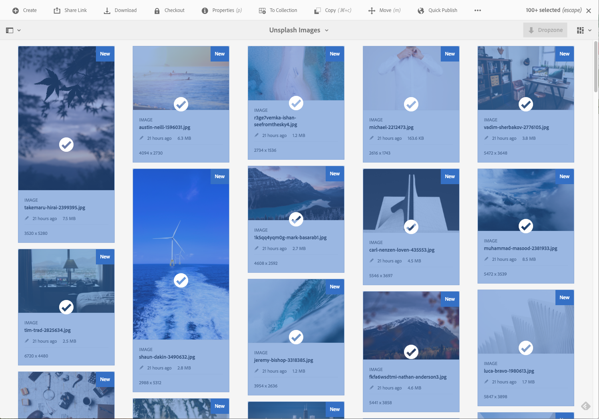

# 一括処理操作{#bulk-processing-operations}

## はじめに {#introduction}

最新バージョンのAEMでは、「すべて選択」ボタンがすべてのビューに拡張されています。リスト表示、列表示、カード表示。 「すべて選択」ボタンをクリックすると、特定のフォルダーまたはコレクション内のすべてのコンテンツが選択され、読み込まれてクライアントブラウザーに表示されるアセットとページだけでなく、選択されるようになりました。

一括操作に対して主要なアクションが有効になっています。**移動**、**削除**&#x200B;および&#x200B;**コピー**。 新しいダイアログで、一括処理が使用できないアクションがわかります。

## {#how-to-use}の使用方法

**Select All**&#x200B;という新しいボタンがカード、リスト、列の表示に追加されました。 このボタンは、任意のビューで使用して、データセット内のすべての要素を選択できます。

以前のバージョンのAEMでは、クライアントブラウザーで読み込まれる内容が制限されていました。 この新しい変更は、一括操作が実行される要素の数に関する混乱を避けるために導入されました。

現時点では、一括処理に次の3つの操作が追加されています。

* 移動
* コピー
* 削除

今後、さらに多くの操作がサポートされる予定です。
この機能を使用するには、ページまたはアセットで一括操作を実行するフォルダーまたはコレクションに移動する必要があります。

次に、次に示すように、ビューの1つを選択します。

### カード表示 {#card-view}

### カード表示での一括選択{#bulk-selection-in-card-view}

右上の「**すべて選択**」ボタンを使用して、アセットまたはページを一括で選択できます。

 

### リスト表示 {#list-view}

リスト表示についても同様です。

### リスト表示での一括選択{#bulk-selection-in-list-view}

リスト表示で、「**すべてを選択**」ボタンを使用するか、左側のチェックボックスを使用して一括選択します。

 

### 列表示 {#column-view}

### 列表示での一括選択{#bulk-selection-in-column-view}

## 一括有効化操作{#bulk-enabled-operations}

選択後、次の3つの一括有効化アクションのいずれかを実行できます。**移動**、**コピー**&#x200B;または&#x200B;**削除**。

ここでは、上で選択したアセットに対して「**移動**」操作が実行されます。 どのビューでも、これにより、画面に読み込まれるアセットだけでなく、すべてのアセットが選択された場所に移動されます。

**ダウンロードなど、一括有効になっていない操作の場合は、ブラウザーに読み込まれた要素のみが操作に含まれることを示す警告が表示されます。**

