# Adobe Campaign Classic との統合{#integrating-with-adobe-campaign-classic}

>[!NOTE]
>
>このドキュメントでは、AEM をオンプレミスソリューションの Adobe Campaign Classic と統合する方法について説明します。Adobe Campaign Standard を使用している場合の指示については、[Adobe Campaign Standard との統合](/help/sites-administering/campaignstandard.md)を参照してください。

Adobe Campaign を使用すると、電子メール配信コンテンツおよびフォームを Adobe Experience Manager で直接管理できます。

両方のソリューションを同時に使用するには、最初に互いに接続するように設定する必要があります。これには、Adobe Campaign と Adobe Experience Manager の両方での設定手順が含まれます。これらの手順は、このドキュメントで詳しく説明します。

AEM での Adobe Campaign の操作には、Adobe Campaign を使用して電子メールを送信する機能が含まれています。これについては [Adobe Campaign の操作](/help/sites-authoring/campaign.md)で説明します。また、AEM ページのフォームを使用したデータの操作も含まれます。

さらに、AEM を [Adobe Campaign](https://helpx.adobe.com/jp/support/campaign/classic.html) と統合する際に参考となるトピックを次に示します。

* [電子メールテンプレートのベストプラクティス](/help/sites-administering/best-practices-for-email-templates.md)
* [Adobe Campaign 統合に関するトラブルシューティング](/help/sites-administering/troubleshooting-campaignintegration.md)

Adobe Campaign との統合を拡張する場合は、次のページが参考になります。

* [カスタム拡張の作成](/help/sites-developing/extending-campaign-extensions.md)
* [カスタムフォームマッピングの作成](/help/sites-developing/extending-campaign-form-mapping.md)

## AEM と Adobe Campaign の統合ワークフロー {#aem-and-adobe-campaign-integration-workflow}

ここでは、キャンペーンを作成し、コンテンツを配信する際の AEM と Adobe Campaign の間の一般的なワークフローについて説明します。

一般的なワークフローには、次が含まれます。詳細について説明します。

1. （Adobe Campaign と AEM で）キャンペーンの構築を開始します。
1. コンテンツをリンクして配信する前に、AEM でコンテンツをパーソナライズして、Adobe Campaign で配信を作成します。
1. Adobe Campaign で、コンテンツをリンクして配信します。

### キャンペーンの作成の開始 {#start-building-your-campaign}

キャンペーンの作成は、いつでも開始できます。コンテンツをリンクする前は、AEM と AC は独立しています。つまり、マーケティング担当者は、キャンペーンの作成およびターゲティングを Adobe Campaign で開始でき、同時にコンテンツ作成者は、AEM でデザインに取り組むことができます。

### コンテンツのリンクおよび配信の前に {#before-linking-content-and-delivery}

コンテンツをリンクして配信メカニズムを作成する前に、次の手順を実行する必要があります。

**AEM で**

* **テキストおよびパーソナライゼーション**&#x200B;コンポーネントのパーソナライゼーションフィールドを使用してパーソナライズする

**Adobe Campaign で**

* **aemContent** タイプの配信を作成する

### コンテンツのリンクと配信の設定 {#linking-content-and-setting-delivery}

リンクおよび配信用のコンテンツを用意したら、コンテンツのリンク方法とリンク先を決めます。

これらのすべての手順は、Adobe Campaign で完了します。

1. どの AEM インスタンスを使用するかを指定します。
1. 「同期」ボタンをクリックして、コンテンツを同期します。
1. コンテンツピッカーを開いて、コンテンツを選択します。

### AEM を初めて使用する場合 {#if-you-are-new-to-aem}

AEM を初めて使用する場合は、AEM を理解するのに次のリンクが参考になります。

* [AEM の開始](/help/sites-deploying/deploy.md)
* [レプリケーションエージェントの概要](/help/sites-deploying/replication.md)
* [ログファイルの検索と使用](/help/sites-deploying/monitoring-and-maintaining.md#working-with-audit-records-and-log-files)
* [AEM プラットフォームの概要](/help/sites-deploying/platform.md)

## Adobe Campaign の設定 {#configuring-adobe-campaign}

Adobe Campaign の設定には、次が含まれます。

1. AEM 統合パッケージの Adobe Campaign へのインストール。
1. 外部アカウントの設定。
1. AEMResourceTypeFilter が正しく設定されていることの検証。

さらに、ユーザーが設定可能な次のような高度な設定があります。

* コンテンツブロックの管理
* パーソナライゼーションフィールドの管理

[高度な設定](#advanced-configurations)を参照してください。

>[!NOTE]
>
>To perform these operations, you must have the **administration** role in Adobe Campaign.

### 前提条件 {#prerequisites}

事前に、次の要素があることを確認してください。

* [AEM オーサーインスタンス](/help/sites-deploying/deploy.md#getting-started)
* [AEM パブリッシュインスタンス](/help/sites-deploying/deploy.md#author-and-publish-installs)
* [Adobe Campaign Classicインスタンス](https://helpx.adobe.com/jp/support/campaign/classic.html) （クライアントとサーバーを含む）
* Internet Explorer 11

>[!NOTE]
>
>If you are running a version earlier than Adobe Campaign Classic build 8640, see the [upgrade documentation](https://docs.campaign.adobe.com/doc/AC6.1/en/PRO_Updating_Adobe_Campaign_Upgrading.html) for more information. クライアントとデータベースの両方を同じビルドにアップグレードする必要があります。

>[!CAUTION]
>
>Operations detailed in the [Configuring Adobe Campaign](#configuring-adobe-campaign) and [Configuring Adobe Experience Manager](#configuring-adobe-experience-manager) sections are necessary for the integration functionalities between AEM and Adobe Campaign to work correctly.

### AEM 統合パッケージのインストール {#installing-the-aem-integration-package}

You must install the **AEM Integration** package in Adobe Campaign. 次の手順を実行します。

1. AEM とリンクしたい Adobe Campaign インスタンスに移動します。
1. *ツール* / *アドバンス* /パッケージの *読み込みを選択します。*.

   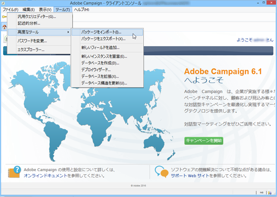

1. Click **Install a standard package**, then select the **AEM Integration** package.

   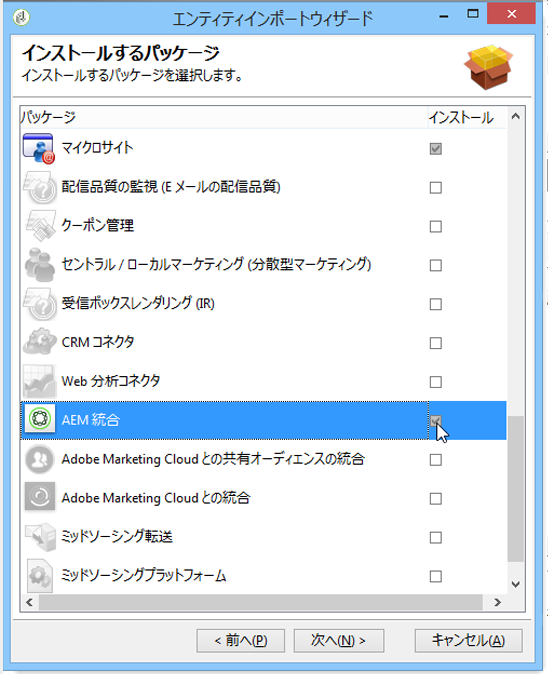

1. Click **Next**, and then **Start**.

   This package contains the **aemserver** operator that will be used to connect the AEM server to Adobe Campaign.

   >[!CAUTION]
   >
   >デフォルトでは、この演算子には、セキュリティゾーンは設定されていません。AEM を使用して Adobe Campaign に接続するには、これを選択する必要があります。
   >
   >In the **serverConf.xml** file, the **allowUserPassword** attribute of the selected security zone must be set to **true** to authorize AEM to connect Adobe Campaign via login/password.
   >
   >セキュリティの問題を回避するために、AEM 専用のセキュリティゾーンを作成することを強くお勧めします。For more on this, refer to the [Installation guide](https://docs.campaign.adobe.com/doc/AC/en/INS_Additional_configurations_Configuring_Campaign_server.html).

   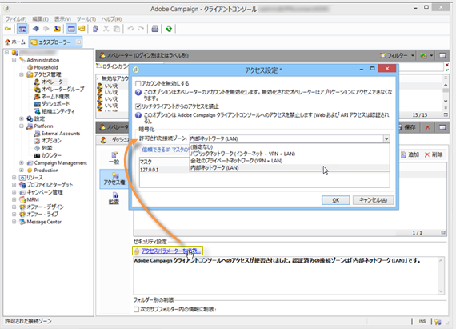

### AEM 外部アカウントの設定 {#configuring-an-aem-external-account}

Adobe Campaign を AEM インスタンスに接続可能な外部アカウントを設定する必要があります。

>[!NOTE]
>
>* When installing the **AEM Integration** package, an external AEM account is created. そこから AEM インスタンスへの接続を設定するか、新しいものを作成できます。
>* AEM で、campaign-remote ユーザーのパスワードを設定してください。AEM で Adobe Campaign に接続するにはこのパスワードを設定する必要があります。管理者としてログインし、ユーザー管理コンソールで campaign-remote ユーザーを探して「**パスワードを設定**」をクリックします。

>


外部 AEM アカウントを設定するには：

1. Go to the **Administration** > **Platform** > **External Accounts** node.
1. Create a new external account and select the **AEM** type.
1. AEM オーサーインスタンスのアクセスパラメーター（サーバーアドレスと、このインスタンスに接続するために使用される ID およびパスワード）を入力します。campaign-api ユーザーアカウントのパスワードは、AEM で campaign-remote user に設定したパスワードと同じです。

   >[!NOTE]
   >
   >サーバーアドレスは、末尾がスラッシュで&#x200B;**終わらない**&#x200B;ようにします。For example, enter `https://yourserver:4502` instead of `https://yourserver:4502/`

   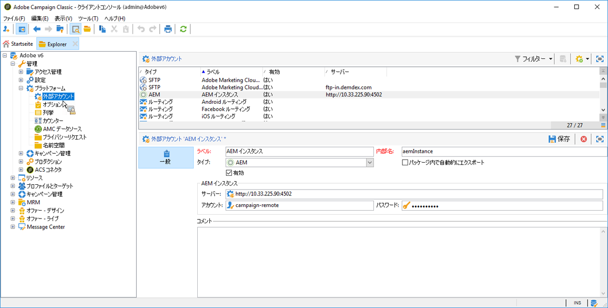 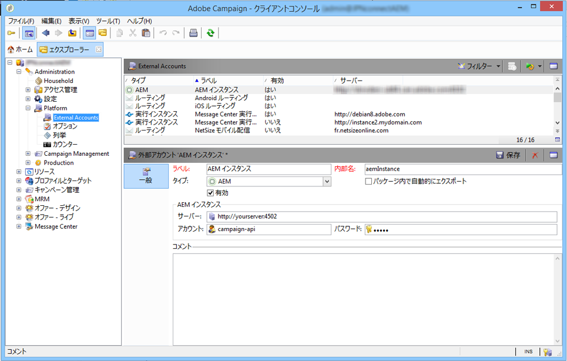

1. Make sure that the **Enabled** checkbox is selected.

### AEMResourceTypeFilter オプションの検証 {#verifying-the-aemresourcetypefilter-option}

The **AEMResourceTypeFilter** option is used to filter types of AEM resources that can be used in Adobe Campaign. これにより、Adobe Campaign でのみ使用されるように特別に設計された AEM コンテンツを Adobe Campaign で取得できます。

このオプションは、事前設定されている必要があります。ただし、このオプションを変更すると、統合が機能しなくなる可能性があります。

**AEMResourceTypeFilter** オプションが設定されていることを検証するには：

1. **プラットフォーム**／**オプション**&#x200B;に移動します。
1. In the **AEMResourceTypeFilter** option, check that the paths are correct. このフィールドには、次の値が含まれている必要があります。

   **mcm/campaign/components/newsletter,mcm/campaign/components/campaign_newsletterpage,mcm/neolane/components/newsletter**

   また、場合によっては、この値は次のようになります。

   **mcm/campaign/components/newsletter**

   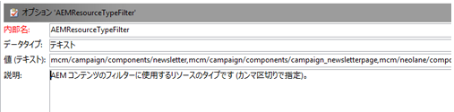

## Configuring Adobe Experience Manager {#configuring-adobe-experience-manager}

AEM を設定するには、次の手順を実行する必要があります。

* インスタンス間のレプリケーションを設定します。
* クラウドサービスを使用して、AEM を Adobe Campaign に接続します。
* Externalizer を設定します。

### AEM インスタンス間のレプリケーションの設定 {#configuring-replication-between-aem-instances}

AEM オーサーインスタンスから作成されたコンテンツは、最初にパブリッシュインスタンスに送信されます。ニュースレターの画像をパブリッシュインスタンスで利用でき、ニュースレター受信者が入手できるように、公開する必要があります。レプリケーションエージェントは、その結果として、AEM オーサーインスタンスから AEM パブリッシュインスタンスにレプリケートするように設定される必要があります。

>[!NOTE]
>
>If you do not want to use the replication URL but instead use the public-facing URL, you can set the **Public URL** in the following configuration setting in the OSGi (**AEM logo** >  **Tools** icon >  **Operations** > **Web Console** > **OSGi Configuration** > **AEM Campaign Integration - Configuration**):
**パブリックURL:** com.day.cq.mcm.キャンペーン.impl.IntegrationConfigImpl#aem.mcm.キャンペーン.publicUrl

また、この手順は、あるオーサーインスタンス設定をパブリッシュインスタンスにレプリケートするためにも必要です。

AEM インスタンス間のレプリケーションを設定するには：

1. From the authoring instance, select **AEM logo**> **Tools** icon > **Deployment** > **Replication** > **Agents on author**, then click **Default Agent**.

   

   >[!NOTE]
   パブリッシュおよびオーサーインスタンスが両方とも同じコンピューターにある場合を除いて、Adobe Campaign との統合を設定する際に、localhost（これは、AEM のローカルコピーです）を使用するのを回避します。

1. Tap or click **Edit** then select the **Transport** tab.
1. **localhost** を IP アドレスまたは AEM パブリッシュインスタンスのアドレスに置き換えることで、URI を設定します。

   

### AEM から Adobe Campaign への接続 {#connecting-aem-to-adobe-campaign}

AEM と Adobe Campaign を一緒に使用する前に、両方のソリューション間のリンクを確立して、通信できるようにする必要があります。

1. AEM オーサーインスタンスに接続します。
1. Select **AEM logo** > **Tools** icon > **Deployment** > **Cloud Services**, then **Configure now** in the Adobe Campaign section.

   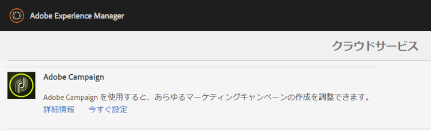

1. Create a new configuration by entering a **Title** and click **Create**, or choose the existing configuration that you want to link with your Adobe Campaign instance.
1. 設定を編集して、Adobe Campaign インスタンスのパラメーターと一致するようにします。

   * **ユーザー名**: **aemserver**。2つのソリューション間のリンクを確立するために使用されるAdobe CampaignAEM統合パッケージ演算子です。
   * **パスワード**：Adobe Campaign aemserver 演算子のパスワード。この演算子のパスワードを Adobe Campaign で直接再指定する必要があることがあります。
   * **API エンドポイント**：Adobe Campaign インスタンス URL。

1. Select **Connect to Adobe Campaign** and click **OK**.

   

   >[!NOTE]
   [電子メールを作成して公開](/help/sites-authoring/campaign.md)したら、パブリッシュインスタンスに設定を再公開する必要があります。

   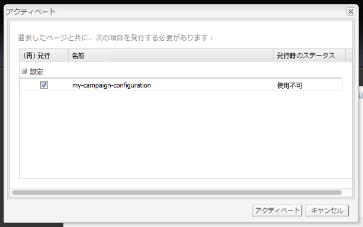

>[!NOTE]
接続に失敗する場合は、次を確認してください。
* Adobe Campaign インスタンスへのセキュリティで保護された接続（https）を使用する際、証明書の問題が発生する可能性があります。You will have to add the Adobe Campaign instance certificate to the **cacerts** file of your AEM instance&#39;s JDK.
* セキュリティゾーンは、Adobe Campaign の [aemserver 演算子](#connecting-aem-to-adobe-campaign)用に設定される必要があります。Furthermore, in the **serverConf.xml** file, the **allowUserPassword** attribute of the security zone must be set to **true** to authorize AEM connection to Adobe Campaign using the login/password mode.

また、[AEM／Adobe Campaign 統合のトラブルシューティング](/help/sites-administering/troubleshooting-campaignintegration.md)も参照してください。

### Externalizer の設定 {#configuring-the-externalizer}

オーサーインスタンスの AEM に [Externalizer を設定](/help/sites-developing/externalizer.md)する必要があります。Externalizer は、リソースパスを外部 URL および絶対 URL に変換できる OSGi サービスです。このサービスは、これらの外部 URL を設定および構築するための一元化された場所を提供します。

一般的な指示については、[Externalizer の設定](/help/sites-developing/externalizer.md)を参照してください。For the Adobe Campaign integration, make sure you configure the publish server at `https://<host>:<port>/system/console/configMgr/com.day.cq.commons.impl.ExternalizerImpl`not point to `localhost:4503` but to a server that is reachable by the Adobe Campaign console.

`localhost:4503` または Adobe Campaign が到達できない別のサーバーを指している場合、Adobe Campaign コンソールに画像が表示されません。


## Advanced Configurations {#advanced-configurations}

また、次のような高度な設定を実行できます。

* パーソナライゼーションフィールドおよびブロックの管理。
* パーソナライゼーションブロックのアクティベート解除。
* ターゲット拡張データの管理。

### パーソナライゼーションフィールドおよびブロックの管理 {#managing-personalization-fields-and-blocks}

パーソナライゼーションを AEM の電子メールコンテンツに追加可能なフィールドおよびブロックは、Adobe Campaign で管理されます。

デフォルトのリストは提供されますが、変更できます。また、パーソナライゼーションフィールドおよびブロックを追加または非表示にすることができます。

#### パーソナライゼーションフィールドの追加 {#adding-a-personalization-field}

To add a new personalization field to those that are already available, you have to extend the Adobe Campaign **nms:seedMember** schema as follows:

>[!CAUTION]
追加する必要があるフィールドは、受信者スキーマ拡張（**nms:受信者**）で既に追加されている必要があります。For more information, see the [Configuration](https://docs.campaign.adobe.com/doc/AC6.1/en/CFG_Editing_schemas_Editing_schemas.html) guide.

1. Go to the **Administration** > **Configuration** > **Data schemas** node in the Adobe Campaign navigation.
1. Select **New**.

   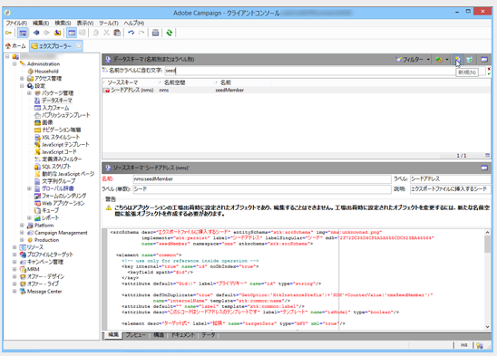

1. In the pop-up window, select **Extend the data in the table using an extension schema** and click **Next**.

   

1. 拡張されたスキーマの別のパラメーターを入力します。

   * **スキーマ**:「 **nms:seedMember** 」スキーマを選択します。 ウィンドウのその他のフィールドは、自動的に入力されます。
   * **名前空間**：拡張されたスキーマの名前空間をパーソナライズします。

1. スキーマの XML コードを編集して、そこに追加したいフィールドを指定します。For more information on extending schemas in Adobe Campaign, refer to the [Configuration guide](https://docs.campaign.adobe.com/doc/AC6.1/en/CFG_Editing_schemas_Extending_a_schema.html).
1. Save your schema then update the Adobe Campaign database structure via the **Tools** > **Advanced** > **Update database structure** menu in the console.
1. 変更を保存するために、Adobe Campaign コンソールを切断してから再接続します。AEM で利用可能なパーソナライゼーションフィールドのリストに新しいフィールドが表示されます。

#### 例 {#example}

To add a **Registration Number** field, you must have the following elements:

* The **nms:recipient** schema extension named **cus:recipient** contains:

```xml
<element desc="Recipient table (profiles)" img="nms:recipient.png" label="Recipients" labelSingular="Recipient" name="recipient">

  <attribute dataPolicy="smartCase" desc="Recipient registration number"
  label="Registration Number"
  length="50" name="registrationNumber" type="string"/>

</element>
```

**cus:seedMemberという名前の** nms:seedMember **スキーマ拡張子には、次の値が含まれます** 。

```xml
<element desc="Seed to insert in the export files" img="nms:unknownad.png" label="Seed addresses" labelSingular="Seed" name="seedMember">

  <element name="custom_nms_recipient">
    <attribute name="registrationNumber"
    template="cus:recipient:recipient/@registrationNumber"/>
  </element>

</element>
```

The **Registration Number** field is now part of the available personalization fields:

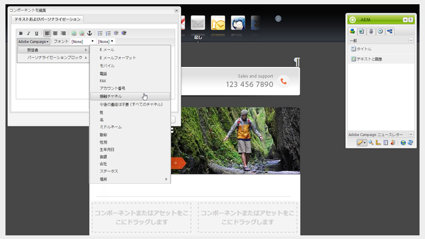

#### パーソナライゼーションフィールドを非表示にする {#hiding-a-personalization-field}

To hide a personalization field among those that are already available, you must extend the Adobe Campaign **nms:seedMember** schema as detailed in the [Adding a personalization field](#adding-a-personalization-field) section. 次の手順を適用します。

1. 拡張されたスキーマの **nms:seedMember** スキーマから取得したいフィールドをコピーします（例：**cus:seedMember**）。
1. Add the **advanced=&quot;true&quot;** XML attribute to the field. AEM で利用可能なパーソナライゼーションフィールドのリストに表示されなくなります。

   For example, to hide the **Middle Name** field, the **cud:seedMember** schema must contain the following element:

   ```xml
   <element desc="Seed to insert in the export files" img="nms:unknownad.png" label="Seed addresses" labelSingular="Seed" name="seedMember">
   
     <element name="custom_nms_recipient">
       <attribute advanced="true" name="middleName"/>
     </element>
   
   </element>
   ```

### パーソナライゼーションブロックのアクティベート解除 {#deactivating-a-personalization-block}

利用可能なもののパーソナライゼーションブロックのアクティベートを解除するには：

1. Go to the **Resources** > **Campaign Management** > **Personalization blocks** node in the Adobe Campaign navigation.
1. AEM でアクティベートを解除したいパーソナライゼーションブロックを選択します。
1. Clear the **Visible in the customization menus** checkbox and save your changes. ブロックが、Adobe Campaign で利用可能なパーソナライゼーションブロックのリストに表示されなくなります。

   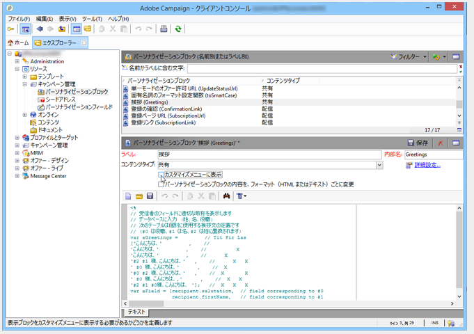

### ターゲット拡張データの管理 {#managing-target-extension-data}

パーソナライゼーション用にターゲット拡張データを挿入することもできます。ターゲット拡張データ（「Target データ」とも呼ばれる）は、例えば、キャンペーンワークフローのクエリのデータを機能強化または追加することに由来します。For more information, refer to the [Creating queries](https://docs.campaign.adobe.com/doc/AC/en/PTF_Creating_queries_About_queries_in_Campaign.html) and [Enriching data](https://docs.campaign.adobe.com/doc/AC/en/WKF_Use_cases_Enriching_data.html) sections.

>[!NOTE]
ターゲットにあるデータは、AEM コンテンツが Adobe Campaign 配信と同期されている場合にのみ利用できます。See [Synchronizing content created in AEM with a delivery from Adobe Campaign](/help/sites-authoring/campaign.md#synchronizing-content-created-in-aem-with-a-delivery-from-adobe-campaign-classic).

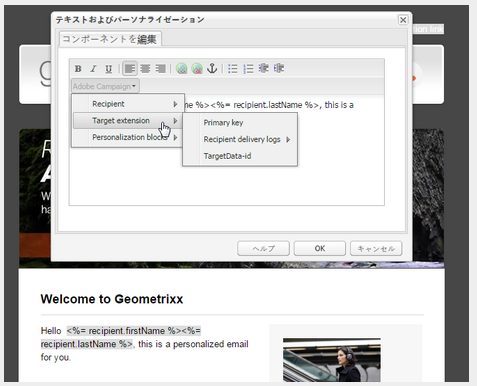

