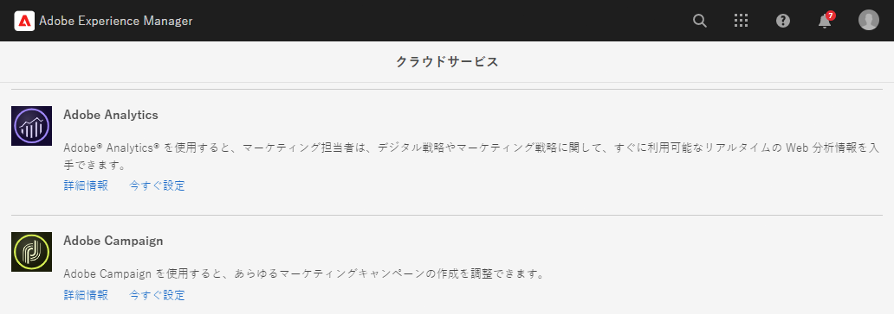
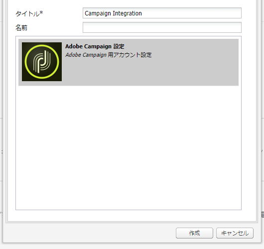
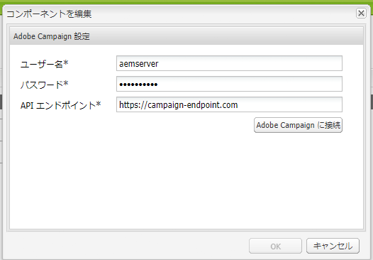
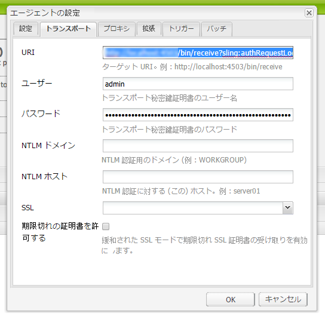

# Adobe Campaign Classic との統合 {#integrating-campaign-classic}

AEMとAdobe Campaignを統合すると、電子メール配信、コンテンツ、フォームをAEMで直接管理できます。 ソリューション間の双方向通信を有効にするには、Adobe Campaign Classic と AEM の両方で設定手順が必要です。

この統合により、AEMとAdobe Campaign Classicを独立して使用できます。 マーケターはAdobe Campaignでキャンペーンを作成し、ターゲティングを使用できますが、コンテンツ作成者は同時にAEMのコンテンツデザインを操作できます。 統合を使用すると、Adobe Campaignで作成されたキャンペーンのコンテンツとデザインを、AEMがターゲット設定して配信できます。

## 統合手順 {#integration-steps}

AEM と Campaign の統合には、両方のソリューションで多くの手順が必要です。

1. [AEM 統合パッケージの Campaign へのインストール](#install-package)
1. [Campaign での AEM のオペレーターの作成](#create-operator)
1. [AEM での Campaign 統合の設定](#campaign-integration)
1. [AEM Externalizer の設定](#externalizer)
1. [AEM での campaign-remote ユーザーの設定](#configure-user)
1. [Campaign での AEM 外部アカウントの設定](#acc-setup)

このドキュメントでは、これらの各手順を詳しく説明します。

## 前提条件 {#prerequisites}

* Adobe Campaign Classic への管理者アクセス
   * 統合を実行するには、設定済みのデータベースを含む、動作中の Adobe Campaign Classic インスタンスが必要です。
   * Adobe Campaign Classic のセットアップおよび設定方法に関する詳細が必要な場合は、[Adobe Campaign Classic ドキュメント](https://experienceleague.adobe.com/docs/campaign-classic/using/campaign-classic-home.html?lang=ja)、特にインストールおよび設定ガイドを参照してください。
* AEMへの管理者アクセス

## Campaign でのAEM統合パッケージのインストール {#install-package}

Adobe Campaign の **AEM 統合**&#x200B;パッケージには、AEM への接続に必要な標準設定が多数含まれています。

1. 管理者は、クライアントコンソールを使用して Adobe Campaign インスタンスにログインします。

1. **ツール**／**詳細**／**パッケージをインポート...**&#x200B;を選択します。

   

1. 「**標準パッケージをインストール**」をクリックして、「**次へ**」をクリックします。

1. **AEM 統合**&#x200B;パッケージを確認します。

   

1. 「**次へ**」をクリックして「**開始**」をクリックし、インストールを開始します。

   

1. インストールが完了したら「**閉じる**」をクリックします。

これで、統合パッケージがインストールされました。

## Campaign でのAEM用のオペレーターの作成 {#create-operator}

統合パッケージによって、AEM が Adobe Campaign への接続に使用する `aemserver` オペレーターが自動的に作成されます。このオペレーターのセキュリティゾーンを定義し、パスワードを設定する必要があります。

1. クライアントコンソールを使用して、Adobe Campaign に管理者としてログインします。

1. メニューバーから&#x200B;**ツール**／**エクスプローラー**&#x200B;を選択します。

1. エクスプローラーで、**管理**／**アクセス管理**／**オペレーター**&#x200B;ノードに移動します。

1. `aemserver` オペレーターを選択します。

1. オペレーターの「**編集**」タブで「**アクセス権**」サブタブを選択し、「**アクセスパラメーターを編集...**」リンクをクリックします。

   

1. 適切なセキュリティゾーンを選択し、必要に応じて信頼済み IP マスクを定義します。

1. 「**保存**」をクリックします。

1. Adobe Campaign クライアントからログアウトします。

1. Adobe Campaign サーバーのファイルシステムで、Campaign のインストール場所に移動し、`serverConf.xml` ファイルを管理者として編集します。このファイルは、通常、次の場所にあります。
   * `C:\Program Files\Adobe\Adobe Campaign Classic v7\conf`（Windows の場合）。
   * `/usr/local/neolane/nl6/conf/eng` （Linux の場合）。

1. `securityZone` を検索し、AEM オペレーターのセキュリティゾーンに次のパラメーターが設定されていることを確認してください。

   * `allowHTTP="true"`
   * `sessionTokenOnly="true"`
   * `allowUserPassword="true"`

1. ファイルを保存します。

1. セキュリティゾーンが `config-<server name>.xml` ファイルの各設定によって上書きされないようにしてください。

   * 設定ファイルに別のセキュリティゾーン設定が含まれている場合は、`allowUserPassword` 属性を `true` に変更します。

1. Adobe Campaign Classic のサーバーポートを変更する場合は、`8080` を目的のポートに置き換えます。

   >[!CAUTION]
   >
   >デフォルトでは、オペレーターのセキュリティゾーンは設定されていません。AEM を Adobe Campaign に接続するには、前の手順で説明したようにゾーンを選択する必要があります。
   >
   >セキュリティの問題を回避するために、AEM 専用のセキュリティゾーンを作成することを強くお勧めします。このトピックについて詳しくは、[Adobe Campaign Classicドキュメント](https://experienceleague.adobe.com/docs/campaign-classic/using/installing-campaign-classic/additional-configurations/security-zones.html?lang=ja)を参照してください。

1. Campaign クライアントで、`aemserver` オペレーターに戻り、「**一般**」タブを選択します。

1. 「**パスワードをリセット...**」リンクをクリックします。

1. パスワードを指定し、今後使用するために安全な場所に保存します。

1. 「**OK**」をクリックし、`aemserver` オペレーターのパスワードを保存します。

## AEMでの Campaign 統合の設定 {#campaign-integration}

AEM は、Campaign と通信するために「[Campaign で設定済みのオペレーター](#create-operator)」を使用します

1. AEM オーサリングインスタンスに管理者としてログインします。

1. グローバルナビゲーションサイドレールから、**ツール**／**クラウドサービス**／**従来のクラウドサービス**／**Adobe Campaign** を選択し、「**今すぐ設定**」をクリックします。

   

1. ダイアログで、**タイトル**&#x200B;を入力して Campaign サービス設定を作成し、「**作成**」をクリックします。

   

1. 設定を編集するための新しいウィンドウとダイアログが開きます。必要な情報を入力します。

   * **ユーザー名** - これは、[前の手順で作成した Adobe Campaign AEM 統合パッケージのオペレーターです。](#create-operator)デフォルトでは `aemserver` です。
   * **パスワード** - これは、[前の手順で作成した Adobe Campaign AEM 統合パッケージのオペレーター](#create-operator)のパスワードです。
   * **API エンドポイント** - これは、Adobe Campaign インスタンス URL です。

   

1. 「**Adobe Campaign に接続**」を選択して接続を確認し、「**OK**」をクリックします。

AEM が Adobe Campaign と通信できるようになりました。

>[!NOTE]
>
>Adobe Campaign サーバーがインターネット経由で到達可能であることを確認してください。AEMは、プライベートネットワークにアクセスできません。

## AEM パブリッシュインスタンスへのレプリケーションの設定 {#replication}

Campaign コンテンツは、AEMオーサリングインスタンス上でコンテンツ作成者が作成します。 このインスタンスは、通常、組織内でのみ使用できます。 画像やアセットなどのコンテンツをキャンペーンの受信者がアクセスできるようにするには、そのコンテンツを公開する必要があります。

レプリケーションエージェントは、AEMオーサーインスタンスからパブリッシュインスタンスにコンテンツを公開する役割を持ち、統合が正しく機能するには設定されている必要があります。 また、この手順は、あるオーサーインスタンス設定をパブリッシュインスタンスにレプリケートするためにも必要です。

AEMオーサーインスタンスからパブリッシュインスタンスへのレプリケーションを設定するには、次の手順を実行します。

1. AEM オーサリングインスタンスに管理者としてログインします。

1. グローバルナビゲーションサイドレールで、「 」を選択します。 **ツール** > **導入** > **レプリケーション** > **作成者のエージェント**&#x200B;をタップし、次に、をタップまたはクリックします。 **デフォルトエージェント（パブリッシュ）**.

   

1. 「**編集**」をタップまたはクリックして、「**トランスポート**」タブを選択します。

1. の設定 **URI** デフォルトの `localhost` 値にAEMパブリッシュインスタンスの IP アドレスを含める。

   

1. タップまたはクリック **OK** をクリックして、エージェント設定の変更を保存します。

キャンペーン受信者がコンテンツにアクセスできるように、AEMパブリッシュインスタンスへのレプリケーションを設定しました。

>[!NOTE]
>
>レプリケーション URL を使用せずに、公開 URL を使用する場合は、OSGi を使用して次の設定で公開 URL を設定できます。
>
>グローバルナビゲーションサイドレールで、「 」を選択します。 **ツール** > **運用** > **Web コンソール** > **OSGi 設定** およびを検索します。 **AEM Campaign の統合 — 設定**. 設定を編集し、フィールドを変更します **パブリック URL** (`com.day.cq.mcm.campaign.impl.IntegrationConfigImpl#aem.mcm.campaign.publicUrl`) をクリックします。

## AEM Externalizer の設定 {#externalizer}

[Externalizer は リソースパスを外部および絶対 URL に変換する AEMの OSGi サービスです。この URL は、AEM が Campaign で使用できるコンテンツを提供するために必要です。](/help/sites-developing/externalizer.md)Campaign の統合を機能させるには、この設定をおこなう必要があります。

1. AEM オーサリングインスタンスに管理者としてログインします。
1. グローバルナビゲーションサイドレールで、「 」を選択します。 **ツール** > **運用** > **Web コンソール** > **OSGi 設定** およびを検索します。 **Day CQ link Externalizer**.
1. デフォルトでは、 **ドメイン** フィールドは、パブリッシュインスタンスを対象としています。 URL をデフォルトから変更 `http://localhost:4503` 公開されているパブリッシュインスタンスに追加します。

   

1. 「**保存**」して閉じるをタップまたはクリックします。

Externalizer が設定され、Adobe Campaignがコンテンツにアクセスできるようになりました。

>[!NOTE]
パブリッシュインスタンスは、Adobe Campaign サーバーから到達可能である必要があります。が `localhost:4503` Adobe Campaignがアクセスできない別のサーバーの場合、AEMからの画像はAdobe Campaignコンソールに表示されません。

## AEMでの campaign-remote ユーザーの設定 {#configure-user}

Campaign が AEM と通信するには、AEM で `campaign-remote` ユーザーのパスワードを設定する必要があります。

1. AEM に管理者としてログインします。
1. メインナビゲーションコンソールで、左側のパネルにある「**ツール**」をクリックします。
1. 次に、**セキュリティ**／**ユーザー**&#x200B;をクリックして、ユーザー管理コンソールを開きます。
1. `campaign-remote` ユーザーを見つけます。
1. `campaign-remote` ユーザーを選択し、「**プロパティ**」をクリックしてユーザーを編集します。
1. **ユーザー設定を編集**&#x200B;ウィンドウで、「**パスワードを変更**」をクリックします。
1. ユーザーの新しいパスワードを入力し、今後の使用のために安全な場所にパスワードをメモします。
1. 「**保存**」をクリックして、パスワードの変更を保存します。
1. 「**保存して閉じる**」をクリックして、変更を `campaign-remote` ユーザーに保存します。

## Campaign でのAEM外部アカウントの設定 {#acc-setup}

[Campaign に **AEM 統合**&#x200B;パッケージをインストール](#install-package)する際に、AEM 用の外部アカウントが作成されます。 この外部アカウントを設定すると、Adobe CampaignはAEMに接続し、ソリューション間で双方向の通信を可能にします。

1. クライアントコンソールを使用して、Adobe Campaign に管理者としてログインします。

1. メニューバーから&#x200B;**ツール**／**エクスプローラー**&#x200B;を選択します。

1. エクスプローラーで、**管理**／**プラットフォーム**／**外部アカウント**&#x200B;ノードに移動します。

   

1. 外部 AEM アカウントを見つけます。 デフォルトでは、次の値が設定されています。

   * **Type** - `AEM`
   * **ラベル** - `AEM Instance`
   * **内部名** - `aemInstance`

1. このアカウントの「**一般**」タブで、[campaign-remote ユーザーパスワードの設定](#set-campaign-remote-password)手順で定義したユーザー情報を入力します。

   * **サーバー** - AEM オーサーサーバーのアドレス
      * AEM オーサーサーバーは、Adobe Campaign Classic サーバーインスタンスからアクセスできる必要があります。
      * サーバーアドレスは、末尾がスラッシュで&#x200B;**終わらない**&#x200B;ようにします。
   * **アカウント** - デフォルトでは、これは[campaign-remote ユーザーのパスワード設定](#set-campaign-remote-password)手順で AEM に設定した `campaign-remote` ユーザーです。
   * **パスワード** - このパスワードは、[campaign-remote ユーザーのパスワード設定](#set-campaign-remote-password)手順で AEM に設定した `campaign-remote` ユーザーと同じです。

1. 「**有効**」チェックボックスを選択します。

1. 「**保存**」をクリックします。

Adobe Campaign は AEM と通信できるようになりました。

## 次のステップ {#next-steps}

Adobe Campaign ClassicとAEMの両方が設定された状態で、統合が完了しました。

Adobe Experience Manager でニュースレターを作成する方法については、[このドキュメント](/help/sites-authoring/campaign.md)の続きで説明します。
