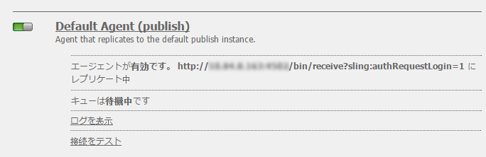
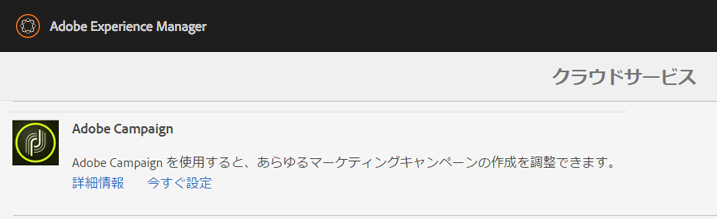
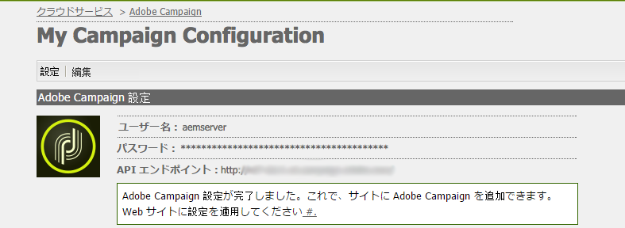
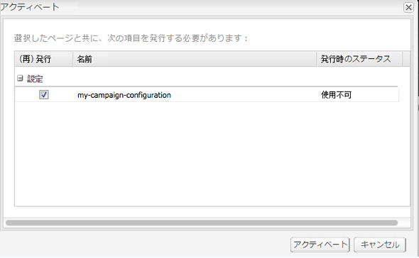

# Adobe Campaign Standard との統合{#integrating-with-adobe-campaign-standard}

>[!NOTE]
>
>このドキュメントでは、AEM をサブスクリプションベースのソリューション、Adobe Campaign Standard と統合する方法について説明します。Adobe Campaign 6.1 を使用している場合、手順については [Adobe Campaign 6.1 との統合](/help/sites-administering/campaignonpremise.md)を参照してください。

Adobe Campaign を使用すると、電子メール配信コンテンツおよびフォームを Adobe Experience Manager で直接管理できます。

両方のソリューションを同時に使用するには、最初に互いの接続を設定する必要があります。これには、Adobe Campaign と Adobe Experience Manager の両方での設定手順が含まれます。これらの手順は、このドキュメントで詳しく説明します。

AEM での Adobe Campaign の操作には、Adobe Campaign を使用してメールおよびフォームを送信する機能が含まれています。これについては、[Adobe Campaign の操作](/help/sites-authoring/campaign.md)で説明します。

さらに、AEM を [Adobe Campaign](https://docs.campaign.adobe.com/doc/standard/en/home.html) と統合する際に参考となるトピックを以下に示します。

* [メールテンプレートのベストプラクティス](/help/sites-administering/best-practices-for-email-templates.md)
* [Adobe Campaign 統合に関するトラブルシューティング](/help/sites-administering/troubleshooting-campaignintegration.md)

Adobe Campaign との統合を拡張する場合は、以下のページが参考になります。

* [カスタム拡張の作成](/help/sites-developing/extending-campaign-extensions.md)
* [カスタムフォームマッピングの作成](/help/sites-developing/extending-campaign-form-mapping.md)

## Adobe Campaign の設定 {#configuring-adobe-campaign}

Adobe Campaign の設定には、次が含まれます。

1. **aemserver** ユーザーの設定。
1. 専用の外部アカウントの作成。
1. AEMResourceTypeFilter オプションの検証。
1. 専用の配信テンプレートの作成。

>[!NOTE]
>
>これらの操作を実行するには、Adobe Campaign の&#x200B;**管理**&#x200B;の役割を有している必要があります。

### 前提条件 {#prerequisites}

事前に、次の要素があることを確認してください。

* [AEM オーサリングインスタンス](/help/sites-deploying/deploy.md#getting-started)
* [AEM パブリッシングインスタンス](/help/sites-deploying/deploy.md#author-and-publish-installs)
* [Adobe Campaign インスタンス](https://docs.adobe.com/content/docs/en/campaign/ACS.html)

>[!CAUTION]
>
>[Adobe Campaign の設定](#configuring-adobe-campaign)および [Adobe Experience Manager の設定](#configuring-adobe-experience-manager)で詳述した操作は、AEM と Adobe Campaign の間の統合機能が正しく動作するために必要です。

### aemserver ユーザーの設定 {#configuring-the-aemserver-user}

Adobe Campaign では、**aemserver** ユーザーを設定する必要があります。**aemserver** は、AEM サーバーを Adobe Campaign に接続するために使用されるテクニカルユーザーです。

**管理**／**ユーザーとセキュリティ**／**ユーザー**&#x200B;に移動し、**aemserver** ユーザーを選択します。クリックしてユーザー設定を開きます。

* このユーザーにパスワードを設定する必要があります。これは UI では実行できません。技術管理者が REST で設定する必要があります。
* **deliveryPrepare** など、特定の役割をこのユーザーに割り当てることができます。これにより、ユーザーは配信を作成および編集できます。

### Adobe Experience Manager 外部アカウントの設定 {#configuring-an-adobe-experience-manager-external-account}

Adobe Campaign を AEM インスタンスに接続可能な外部アカウントを設定する必要があります。

>[!NOTE]
>
>AEM で、campaign-remote ユーザーのパスワードを設定してください。AEM で Adobe Campaign に接続するにはこのパスワードを設定する必要があります。管理者としてログインし、ユーザー管理コンソールで campaign-remote ユーザーを探して「**パスワードを設定**」をクリックします。

AEM 外部アカウントを設定するには：

1. **管理**／**アプリケーション設定**／**外部アカウント**&#x200B;に移動します。

   

1. デフォルトの **aemInstance** 外部アカウントを選択するか、「**作成**」ボタンをクリックして新しく作成します。
1. 「**タイプ**」フィールドで「**Adobe Experience Manager**」を選択し、AEM オーサリングインスタンスで使用するアクセスパラメーター（サーバーアドレス、アカウント名およびパスワード）を入力します。

   >[!NOTE]
   >
   >URL の末尾への **/** スラッシュの追加は必ず避けてください。追加した場合、接続が機能しなくなります。

1. 「**有効**」チェックボックスが選択されていることを確認したら、「**保存**」をクリックして変更を保存します。

### AEMResourceTypeFilter オプションの検証 {#verifying-the-aemresourcetypefilter-option}

「**AEMResourceTypeFilter**」オプションは、Adobe Campaign で使用できる AEM リソースのタイプをフィルタリングするために使用されます。これにより、Adobe Campaign でのみ使用されるように特別に設計された AEM コンテンツを Adobe Campaign で取得できます。

このオプションは事前設定済みです。ただし、このオプションを変更すると、統合が機能しなくなる可能性があります。

**AEMResourceTypeFilter** オプションが設定されていることを検証するには、以下の手順に従います。

1. **管理**／**アプリケーション設定**／**オプション** に移動します。
1. リストで、「**AEMResourceTypeFilter**」オプションがあり、パスが正しいことを確認します。

### AEM 専用の電子メール配信テンプレートの作成 {#creating-an-aem-specific-email-delivery-template}

デフォルトでは、AEM 機能は、Adobe Campaign の電子メールテンプレートでは有効になっていません。AEM コンテンツで電子メールを作成するために使用される新しい電子メール配信テンプレートを設定できます。

AEM 専用の電子メール配信テンプレートを作成するには：

1. **リソース**／**テンプレート**／**配信テンプレート**&#x200B;に移動します。
1. **選択を有効**&#x200B;にするには、アクションバーでチェックマークをクリックして既存の「**標準メール**」デフォルトテンプレートを選択し、「**コピー**」アイコンをクリックしてテンプレートを複製し、「**確認**」をクリックします。
1. **x** をクリックして選択モードを無効化し、新規作成した「**標準メールのコピー**」テンプレートを開いて、テンプレートダッシュボードのアクションバーから「**プロパティを編集**」を選択します。

   テンプレートの **ラベル** を変更できます。

1. プロパティの「**コンテンツ**」セクションで、「**コンテンツソース**」を「**Adobe Experience Manager**」に変更します。次に、以前作成した外部アカウントを選択して、「**Confirm（確認）**」をクリックします。

   **確認** をクリックし、**保存**&#x200B;クリックして、変更を保存します。

   このテンプレートから作成した電子メール配信は、AEM コンテンツ機能が有効になっています。

   

## Adobe Experience Manager の設定 {#configuring-adobe-experience-manager}

AEM を設定するには、次の手順を実行する必要があります。

* インスタンス間のレプリケーションを設定します。
* AEM から Adobe Campaign に接続します。
* Externalizer を設定します。

### AEM インスタンス間のレプリケーションの設定 {#configuring-replication-between-aem-instances}

AEM オーサーインスタンスから作成されたコンテンツは、最初にパブリッシュインスタンスに送信されます。このパブリッシュインスタンスは、次にコンテンツを Adobe Campaign に転送します。レプリケーションエージェントは、その結果として、AEM オーサーインスタンスから AEM パブリッシュインスタンスにレプリケートするように設定される必要があります。

>[!NOTE]
>
>レプリケーション URL を使用しない代わりに公開 URL を使用したい場合は、OSGi（**ツール**／**Web コンソール**／**OSGi Configuration／AEM Campaign Integration - Configuration**）で次の設定をおこなうことで&#x200B;**パブリック URL** を設定できます。
>**公開 URL：** com.day.cq.mcm.campaign.impl.IntegrationConfigImpl#aem.mcm.campaign.publicUrl

また、この手順は、あるオーサーインスタンス設定をパブリッシュインスタンスにレプリケートするためにも必要です。

AEM インスタンス間のレプリケーションを設定するには：

1. オーサリングインスタンスで、**AEM のロゴ**／**ツール**／**デプロイメント**／**レプリケーション**／**作成者のエージェント**&#x200B;を選択し、「**デフォルトエージェント**」をクリックします。

   

   >[!NOTE]
   >パブリッシュおよびオーサーインスタンスが両方とも同じコンピューターにない場合は、Adobe Campaign との統合を設定する際に、localhost（すなわち AEM のローカルコピー）を使用しないでください。

1. 「**編集**」をクリックして、「**トランスポート**」タブを選択します。
1. **localhost** を IP アドレスまたは AEM パブリッシュインスタンスのアドレスに置き換えることで、URI を設定します。

   

### AEM から Adobe Campaign への接続 {#connecting-aem-to-adobe-campaign}

AEM と Adobe Campaign を一緒に使用する前に、両方のソリューション間のリンクを確立して、通信できるようにする必要があります。

1. AEM オーサーインスタンスに接続します。
1. **ツール**／**操作**／**クラウド**／**クラウドサービス**&#x200B;を選択して、Adobe Campaign セクションの「**今すぐ設定**」を選択します。

   

1. 「**タイトル**」にタイトルを入力して「**作成**」をクリックするか、Adobe Campaign インスタンスとリンクしたい既存の設定を選択することで、新しい設定を作成します。
1. 設定を編集して、Adobe Campaign インスタンスのパラメーターと一致するようにします。

   * **ユーザー名**：**aemserver**（2 つのソリューション間のリンクを確立するために使用される Adobe Campaign AEM 統合パッケージ演算子）。
   * **パスワード**：Adobe Campaign aemserver 演算子のパスワード。この演算子のパスワードを Adobe Campaign で直接再指定する必要があることがあります。
   * **API エンドポイント**：Adobe Campaign インスタンス URL。

1. 「**Adobe Campaign に接続**」を選択し、「**OK**」をクリックします。

   

   >[!NOTE]
   >[メールを作成して公開](/help/sites-authoring/campaign.md)したら、パブリッシュインスタンスに設定を再公開する必要があります。

   

>[!NOTE]
>接続に失敗する場合は、次を確認してください。
>* Adobe Campaign インスタンスへのセキュリティで保護された接続（https）を使用する際、証明書の問題が発生する可能性があります。Adobe Campaign インスタンス証明書を JDK の cacerts ファイルに追加する必要があります。
>* また、[AEM／Adobe Campaign 統合のトラブルシューティング](/help/sites-administering/troubleshooting-campaignintegration.md)も参照してください。

### Externalizer の設定 {#configuring-the-externalizer}

オーサーインスタンスの AEM に [Externalizer を設定](/help/sites-developing/externalizer.md)する必要があります。Externalizer は、リソースパスを外部 URL および絶対 URL に変換できる OSGi サービスです。このサービスは、これらの外部 URL を設定および構築するための一元化された場所を提供します。

一般的な説明については、[Externalizer の設定](/help/sites-developing/externalizer.md)を参照してください。Adobe Campaignとの統合では、`https://<host>:<port>/system/console/configMgr/com.day.cq.commons.impl.ExternalizerImpl` のパブリッシュサーバーが `localhost:4503` を指すのではなく、Adobe Campaign コンソールから到達可能なサーバーに必ず設定してください。

`localhost:4503` または Adobe Campaign が到達できない別のサーバーを指している場合、Adobe Campaign コンソールに画像が表示されません。

