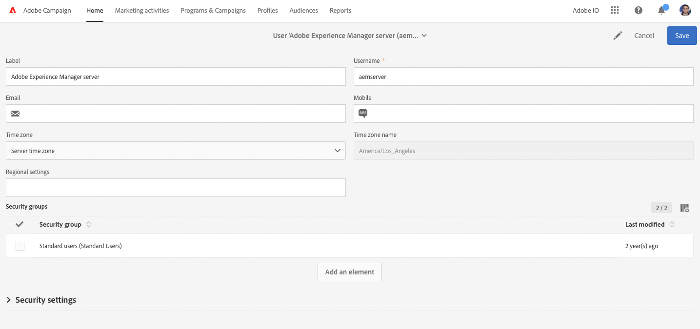
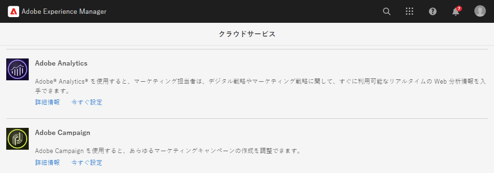
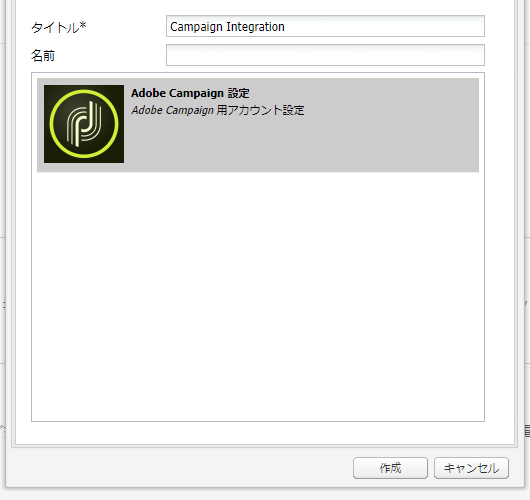

# Adobe Campaign Standard との統合 {#integrating-with-adobe-campaign-standard}

AEMとAdobe Campaignを統合すると、電子メール配信、コンテンツ、フォームをAEMで直接管理できます。 ソリューション間の双方向通信を可能にするには、Adobe Campaign StandardとAEMの両方での設定手順が必要です。

この統合により、AEMとAdobe Campaign Standardを独立して使用できます。 マーケターはAdobe Campaignでキャンペーンを作成し、ターゲティングを使用できますが、コンテンツ作成者は同時にAEMのコンテンツデザインを操作できます。 統合を使用すると、Adobe Campaignで作成されたキャンペーンのコンテンツとデザインを、AEMがターゲット設定して配信できます。

## 統合手順 {#integration-steps}

AEMとAdobe Campaign Standard間の統合を設定するには、両方のソリューションでいくつかの手順が必要です。

1. [の設定 ](#aemserver-user)
1. [を確認します。 ](#resource-type-filter)
1. [Campaign でのAEM固有の E メール配信テンプレートの作成](#aem-email-delivery-template)
1. [AEMでの Campaign 統合の設定](#campaign-integration)
1. [AEM パブリッシュインスタンスへのレプリケーションの設定](#replication)
1. [AEM Externalizer の設定](#externalizer)
1. [の設定 ](#campaign-remote-user)
1. [Campaign でのAEM外部アカウントの設定](#acc-external-user)

このドキュメントでは、これらの各手順を詳しく説明します.

## 前提条件 {#prerequisites}

* Adobe Campaign Standardへの管理者アクセス
   * Adobe Campaign Standardのセットアップおよび設定方法について詳しくは、 [Adobe Campaign Standardドキュメント。](https://experienceleague.adobe.com/docs/campaign-standard/using/campaign-standard-home.html)
* AEMへの管理者アクセス

## Campaign での aemserver ユーザーの設定 {#aemserver-user}

Adobe Campaign Standardにはデフォルトでが付属しています `aemserver` AEMがAdobe Campaignに接続する際に使用するユーザー。 このユーザーに適切なセキュリティグループを割り当て、そのパスワードを設定する必要があります。

1. 管理者としてAdobe Campaignにログインします。

1. メニューバーの左上にあるAdobe Campaignロゴをタップまたはクリックしてグローバルナビゲーションを開き、「 」を選択します。 **管理** > **ユーザーとセキュリティ** > **ユーザー** をクリックします。

1. をタップまたはクリックします。 `aemserver` ユーザーコンソールの

1. 次を確認します。 `aemserver` 少なくとも、役割を持つセキュリティグループにユーザーが割り当てられている `deliveryPrepare` に割り当てられました。 デフォルトでは、グループは `Standard Users` には、この役割があります。

   

1. タップまたはクリック **保存** 変更を保存します。

お使いの `aemserver` ユーザーには、AEMがAdobe Campaignと通信するために必要な権限が付与されました。

ただし、AEMが `aemserver` ユーザー、そのパスワードを設定する必要があります。 これは、Adobe Campaignでは実行できません。 この作業は、Adobe・サポート・エンジニアが行う必要があります。 [チケットを発券し、カスタマーケアにAdobeしてください](https://experienceleague.adobe.com/?lang=ja&amp;support-tab=home#support) リセットをリクエストする `aemserver` パスワード。 パスワードをAdobeカスタマーケアから取得したら、安全な場所に保管してください。

## キャンペーンの AEMResourceTypeFilter を確認する {#resource-type-filter}

この `AEMResourceTypeFilter` は、Adobe Campaignで使用できるAEMリソースのフィルタリングに使用する、Adobe Campaignのオプションです。 AEMには多数のコンテンツが含まれているので、このオプションは、Adobe CampaignでAdobe Campaignで使用するように特別に設計されたタイプのAEMコンテンツのみを取得できるフィルターとして機能します。

このオプションは事前設定済みです。 ただし、AEMの Campaign コンポーネントをカスタマイズしている場合は、更新が必要になる場合があります。 次の手順で `AEMResourceTypeFilter` オプションが設定されている場合は、次の手順に従います。

1. 管理者としてAdobe Campaignにログインします。

1. メニューバーの左上にあるAdobe Campaignロゴをタップまたはクリックしてグローバルナビゲーションを開き、「 」を選択します。 **管理** > **アプリケーション設定** > **オプション** をクリックします。

1. をタップまたはクリックします。 `AEMResourceTypeFilter` をクリックします。

1. の設定を確認します。 `AEMResourceTypeFilter`. パスはコンマで区切られ、デフォルトでは次の値が含まれます。

   * `mcm/campaign/components/newsletter`
   * `mcm/campaign/components/campaign_newsletterpage`
   * `mcm/neolane/components/newsletter`

   

1. タップまたはクリック **保存** 変更を保存します。

お使いの `AEMResourceTypeFilter` これで、AEMから正しいコンテンツを取得するようにが設定されました。

## Campaign でのAEM固有の E メール配信テンプレートの作成 {#aem-email-delivery-template}

デフォルトでは、AEMはAdobe Campaignの電子メールテンプレートでは有効になっていません。 AEMコンテンツを使用した E メールの作成に使用できる新しい E メール配信テンプレートを設定する必要があります。 AEM固有の E メール配信テンプレートを作成するには、次の手順に従います。

1. 管理者としてAdobe Campaignにログインします。

1. メニューバーの左上にあるAdobe Campaignロゴをタップまたはクリックしてグローバルナビゲーションを開き、「 」を選択します。 **リソース** > **テンプレート** > **配信テンプレート** をクリックします。

1. 配信テンプレートコンソールで、デフォルトの E メールテンプレートを探します **E メール（メール）で送信** をクリックし、カード（または行）にマウスを移動すると、そのカードを表すオプションが表示されます。 クリック **要素を複製**.

   

1. 内 **確認** ダイアログ、クリック **確認** をクリックして、テンプレートを複製します。

   

1. テンプレートエディターが開き、 **E メール（メール）で送信** テンプレート。 次をクリック： **プロパティを編集** アイコンをクリックします。

   

1. プロパティウィンドウで、 **ラベル** 新しいAEMテンプレートを説明するフィールド。

1. 次をクリック： **コンテンツ** 見出しを展開して選択します。 **Adobe Experience Manager** 内 **コンテンツソース** 」ドロップダウンリストから選択できます。

1. これにより、 **Adobe Experience Managerアカウント** フィールドに入力します。 ドロップダウンを使用して、 **Adobe Experience Managerインスタンス (aemInstance)** ユーザー。 これは、AEM統合のデフォルトの外部ユーザーです。

1. クリック **確認** をクリックして、プロパティの変更を保存します。

1. テンプレートエディターで、 **保存** をクリックして、AEMで使用する電子メールテンプレートの変更済みコピーを保存します。

これで、AEMコンテンツを使用できる E メールテンプレートが作成されました。

## AEMでの Campaign 統合の設定 {#campaign-integration}

AEMは、組み込みの統合と `aemserver` Adobe Campaignで設定したユーザー。 この統合を設定するには、次の手順に従います。

1. AEM オーサリングインスタンスに管理者としてログインします。

1. グローバルナビゲーションサイドレールから、**ツール**／**クラウドサービス**／**従来のクラウドサービス**／**Adobe Campaign** を選択し、「**今すぐ設定**」をクリックします。

   

1. ダイアログで、**タイトル**&#x200B;を入力して Campaign サービス設定を作成し、「**作成**」をクリックします。

   

1. 設定を編集するための新しいウィンドウとダイアログが開きます。必要な情報を入力します。

   * **ユーザー名**  — これは [の `aemserver` 前の手順で設定したAdobe Campaignのユーザー。](#aemserver-user)デフォルトでは `aemserver` です。
   * **パスワード**  — これは、 [の `aemserver` 前の手順でAdobeカスタマーケアにリクエストしたAdobe Campaignのユーザー。](#aemserver-user)
   * **API エンドポイント** - これは、Adobe Campaign インスタンス URL です。

   

1. 「**Adobe Campaign に接続**」を選択して接続を確認し、「**OK**」をクリックします。

AEM が Adobe Campaign と通信できるようになりました。

>[!NOTE]
>
>Adobe Campaign サーバーがインターネット経由で到達可能であることを確認してください。AEMは、プライベートネットワークにアクセスできません。

## AEM パブリッシュインスタンスへのレプリケーションの設定 {#replication}

Campaign コンテンツは、AEMオーサリングインスタンス上でコンテンツ作成者が作成します。 このインスタンスは、通常、組織内でのみ使用できます。 画像やアセットなどのコンテンツをキャンペーンの受信者がアクセスできるようにするには、そのコンテンツを公開する必要があります。

レプリケーションエージェントは、AEMオーサーインスタンスからパブリッシュインスタンスにコンテンツを公開する役割を持ち、統合が正しく機能するには設定されている必要があります。 また、この手順は、あるオーサーインスタンス設定をパブリッシュインスタンスにレプリケートするためにも必要です。

AEMオーサーインスタンスからパブリッシュインスタンスへのレプリケーションを設定するには、次の手順を実行します。

1. AEM オーサリングインスタンスに管理者としてログインします。

1. グローバルナビゲーションサイドレールで、「 」を選択します。 **ツール** > **導入** > **レプリケーション** > **作成者のエージェント**&#x200B;をタップし、次に、をタップまたはクリックします。 **デフォルトエージェント（パブリッシュ）**.

   

1. 「**編集**」をタップまたはクリックして、「**トランスポート**」タブを選択します。

1. の設定 **URI** デフォルトの `localhost` 値にAEMパブリッシュインスタンスの IP アドレスを含める。

   

1. タップまたはクリック **OK** をクリックして、エージェント設定の変更を保存します。

キャンペーン受信者がコンテンツにアクセスできるように、AEMパブリッシュインスタンスへのレプリケーションを設定しました。

>[!NOTE]
>
>レプリケーション URL を使用せずに、公開 URL を使用する場合は、OSGi を使用して次の設定で公開 URL を設定できます。
>
>グローバルナビゲーションサイドレールで、「 」を選択します。 **ツール** > **運用** > **Web コンソール** > **OSGi 設定** およびを検索します。 **AEM Campaign の統合 — 設定**. 設定を編集し、フィールドを変更します **パブリック URL** (`com.day.cq.mcm.campaign.impl.IntegrationConfigImpl#aem.mcm.campaign.publicUrl`) をクリックします。

## AEM Externalizer の設定 {#externalizer}

[Externalizer は リソースパスを外部および絶対 URL に変換する AEMの OSGi サービスです。この URL は、AEM が Campaign で使用できるコンテンツを提供するために必要です。](/help/sites-developing/externalizer.md)Campaign の統合が機能するように設定する必要があります。

1. AEM オーサリングインスタンスに管理者としてログインします。
1. グローバルナビゲーションサイドレールで、「 」を選択します。 **ツール** > **運用** > **Web コンソール** > **OSGi 設定** およびを検索します。 **Day CQ link Externalizer**.
1. デフォルトでは、 **ドメイン** フィールドは、パブリッシュインスタンスを対象としています。 URL をデフォルトから変更 `http://localhost:4503` 公開されているパブリッシュインスタンスに追加します。

   

1. 「**保存**」して閉じるをタップまたはクリックします。

Externalizer が設定され、Adobe Campaignがコンテンツにアクセスできるようになりました。

>[!NOTE]
パブリッシュインスタンスは、Adobe Campaign サーバーから到達可能である必要があります。が `localhost:4503` Adobe Campaignがアクセスできない別のサーバーの場合、AEMからの画像はAdobe Campaignコンソールに表示されません。

## AEMでの campaign-remote ユーザーの設定 {#campaign-remote-user}

AEMがAdobe Campaignと通信する際に使用できるAdobe Campaignのユーザーが必要な場合と同様に、Adobe CampaignとAEMを通信するには、AEMのユーザーも必要です。 デフォルトでは、Campaign 統合によって `campaign-remote` AEMのユーザー。 このユーザーを設定するには、次の手順に従います。

1. AEM に管理者としてログインします。
1. メインナビゲーションコンソールで、左側のパネルにある「**ツール**」をクリックします。
1. 次に、 **セキュリティ** > **ユーザー** をクリックして、ユーザー管理コンソールを開きます。
1. `campaign-remote` ユーザーを見つけます。
1. `campaign-remote` ユーザーを選択し、「**プロパティ**」をクリックしてユーザーを編集します。
1. **ユーザー設定を編集**&#x200B;ウィンドウで、「**パスワードを変更**」をクリックします。
1. ユーザーの新しいパスワードを入力し、今後の使用のために安全な場所にパスワードをメモします。
1. 「**保存**」をクリックして、パスワードの変更を保存します。
1. 「**保存して閉じる**」をクリックして、変更を `campaign-remote` ユーザーに保存します。

## Campaign でのAEM外部アカウントの設定 {#acc-external-user}

次の場合： [AEM固有の e メール配信テンプレートの作成](#aem-email-delivery-template) テンプレートで `aemInstance` AEMと通信する外部アカウント 両方のソリューション間で双方向通信を有効にするには、Adobe Campaignでこのアカウントを設定する必要があります。

1. 管理者としてAdobe Campaignにログインします。

1. メニューバーの左上にあるAdobe Campaignロゴをタップまたはクリックしてグローバルナビゲーションを開き、「 」を選択します。 **管理** > **アプリケーション設定** > **外部アカウント** をクリックします。

1. をタップまたはクリックします。 **Adobe Experience Managerインスタンス (aemInstance)** ユーザーコンソールの

1. ユーザーが **Adobe Experience Manager** を **タイプ**.

1. 内 **接続** 「 」セクションで、次のフィールドを定義します。

   1. サーバー：これはAEMオーサリングサーバーの URL です。 スラッシュで終わることはできません。
   1. アカウント：これは `campaign-remote` ユーザー [AEMで事前に設定されている](#campaign-remote-user)
   1. パスワード：これは、 `campaign-remote`ユーザー [AEMで事前に設定されている](#campaign-remote-user)

   

1. 次を確認します。 **有効** チェックボックスがオンの状態で、 **保存** 変更を保存します。

おめでとうございます。AEMとAdobe Campaign Standardの統合が完了しました。

## 次のステップ {#next-steps}

Adobe Campaign ClassicとAEMの両方が設定された状態で、統合が完了しました。

Adobe Experience Manager でニュースレターを作成する方法については、[このドキュメント](/help/sites-authoring/campaign.md)の続きで説明します。
