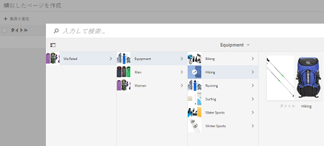
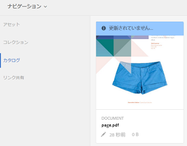
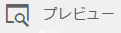

# カタログ作成機能{#catalog-producer}

AEM Assets のカタログ作成機能で、デジタルアセットを使用して製品カタログを生成する方法を学びます。

Adobe Experience Manager（AEM）Assets のカタログ作成機能を使用すると、InDesign アプリケーションから読み込んだ InDesign テンプレートを使用して、ブランドの製品のカタログを作成できます。InDesignテンプレートを読み込むには、まずAEM AssetsをInDesignサーバと統合します。

## InDesign サーバーとの統合 {#integrating-with-indesign-server}

As part of the integration process, configure the **DAM Update Asset** workflow, which is suited for integration with InDesign. さらに、InDesign サーバーのプロキシワーカーを設定します。For details, see [Integrating AEM Assets with InDesign Server](/help/assets/indesign.md).

>[!NOTE]
>
>AEM Assets に読み込む前に、InDesign ファイルから InDesign テンプレートを生成できます。詳しくは、[ファイルとテンプレートを使用した作業](https://helpx.adobe.com/jp/indesign/using/files-templates.html)を参照してください。
>
>InDesign テンプレートの要素を XML タグにマッピングできます。マップされたタグは、カタログ作成機能で商品のプロパティをテンプレートのプロパティにマップした際に、プロパティとして表示されます。To learn about XML tagging in InDesign files, see [Tagging content for XML](https://helpx.adobe.com/jp/indesign/using/tagging-content-xml.html).

>[!NOTE]
>
>InDesign ファイル（.indd）のみがテンプレートとして使用されます。拡張子が .indt のファイルはサポートされていません。

## カタログの作成 {#creating-a-catalog}

カタログ作成機能は、商品情報管理（PIM）データを使用して、テンプレートに表示される XML プロパティで製品プロパティをマッピングします。カタログを作成するには、次の手順を実行します。

1. From the Assets user interface, tap/click the **AEM logo**, and go to **Assets > Catalogs**.
1. In the **Catalogs** page, tap/click **Create** from the toolbar, and then select **Catalog** from the list.
1. In the **Create Catalog** page, enter a name and description (optional) for the catalog and specify tags, if any. また、カタログのサムネール画像を追加できます。

   

1. 「**保存**」をタップまたはクリックします。カタログが作成されたことを示す確認ダイアログが表示されます。Tap/click **Done** to close the dialog.
1. To open the catalog you created, tap/click it from the **Catalogs** page.

   >[!NOTE]
   >
   >To open the catalog, you can also tap/click **Open** in the confirmation dialog mentioned in the previous step.

1. To add pages to the catalog, tap/click **Create** from the toolbar, and then choose the **New Page** option.
1. ウィザードで、ページに使用する InDesign テンプレートを選択します。Then, tap/click **Next**.
1. ページの名前とオプションの説明を指定します。タグを指定します（ある場合）。
1. Tap/click the **Create** from the toolbar. Then, tap/click **Open** from the dialog. 製品のプロパティが左側のウィンドウに表示されます。InDesign テンプレートの定義済みプロパティが右側のウィンドウに表示されます。
1. 左側のウィンドウから製品プロパティを InDesign テンプレートプロパティにドラッグして、それらの間のマッピングを作成します。

   To view how the page appears in real time, tap/click the **Preview** tab on the right pane.

1. さらにページを作成するには、手順 6～9 を繰り返します。To create similar pages for other products, select the page and tap/click the **Create similar pages** icon from the toolbar.

   

   >[!NOTE]
   >
   >類似の構造を持つ製品に対してのみ類似したページを作成できます。

   追加アイコンをタップまたはクリックし、製品ピッカーから商品を選択して、ツールバーの「**選択**」をタップまたはクリックします。

   

1. From the toolbar, click/tap **Create**. Tap/click **Done** to close the dialog. 類似したページがカタログに含まれます。
1. To add any existing InDesign file to your catalog, tap/click **Create** from the toolbar, and choose the **Add to existing page** option.
1. Select the InDesign file, and tap/click **Add** from the toolbar. Then, tap/click **OK** to close the dialog.

   カタログページで参照している製品のメタデータが変更されても、その変更はカタログページに自動的に反映されません。 A banner labeled **Stale** appears on the product images in the referencing catalog pages, indicating that the metadata for the referenced products is not up-to-date.

   

   To ensure that the product images reflect the latest metadata changes, select the page in the Catalog console and click/tap the **Update page** icon from the toolbar.

   

   >[!NOTE]
   >
   >To change the metadata for a referenced product, navigate to the Products console (**AEM Logo** > **Commerce** > **Products**), and select the product. Then, click/tap the **View Properties** icon from the toolbar and edit the metadata in the Properties page of the asset.

1. To rearrange the pages in catalog, tap/click the **Create** icon from the toolbar and then choose **Merge** from the menu. ウィザードの上部のカルーセルで、ページをドラッグして、ページの順序を並べ替えることができます。また、ページを削除することもできます。

1. 「**次へ**」をタップまたはクリックします。To add an existing InDesign file as a cover page, tap/click **Browse** beside the **Choose Cover Page** box, and specify the path for the cover page template.
1. Tap/click **Save**, and then tap/click **Done** to close the confirmation dialog.
「 **完了** 」オプションを選択すると、.pdfレンディションを使用するかどうかを選択するダイアログボックスが開きます。
   Acrobat(PDF)オプションが選択されている場合、 **indesignのレンディションに加えて、** /jcr:content/renditionsにpdfレンディションが作成されます。 すべてのレンディションをダウンロードするには、ダウンロードダイアログの「レンディション」チェックボックスを選択します。

1. To generate a preview for the catalog you created, select it in the **Catalogs** console, and then click the **Preview** icon from the toolbar.

   

   プレビューでカタログのページを確認します。「**完了**」をタップまたはクリックしてプレビューを閉じます。

