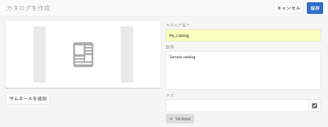

# カタログ作成機能{#catalog-producer}

AEM Assets のカタログ作成機能で、デジタルアセットを使用して製品カタログを生成する方法を学びます。

Adobe Experience Manager（AEM）Assets のカタログ作成機能を使用すると、InDesign アプリケーションから読み込んだ InDesign テンプレートを使用して、ブランドの製品のカタログを作成できます。InDesignテンプレートを読み込むには、まずAEM AssetsをInDesignサーバと統合します。

## InDesign サーバーとの統合 {#integrating-with-indesign-server}

統合プロセスの一環として、InDesignとの統合に適した&#x200B;**DAM Update Asset**&#x200B;ワークフローを設定します。 さらに、InDesign サーバーのプロキシワーカーを設定します。詳しくは、[AEM AssetsとInDesign Serverの統合](/help/assets/indesign.md)を参照してください。

>[!NOTE]
>
>AEM Assets に読み込む前に、InDesign ファイルから InDesign テンプレートを生成できます。詳しくは、[ファイルとテンプレートを使用した作業](https://helpx.adobe.com/jp/indesign/using/files-templates.html)を参照してください。
>
>InDesign テンプレートの要素を XML タグにマッピングできます。マップされたタグは、カタログ作成機能で商品のプロパティをテンプレートのプロパティにマップした際に、プロパティとして表示されます。InDesignファイルでのXMLタグ付けについて詳しくは、[XMLのコンテンツのタグ付け](https://helpx.adobe.com/jp/indesign/using/tagging-content-xml.html)を参照してください。

>[!NOTE]
>
>InDesign ファイル（.indd）のみがテンプレートとして使用されます。拡張子が .indt のファイルはサポートされていません。

## カタログの作成  {#creating-a-catalog}

カタログ作成機能は、商品情報管理（PIM）データを使用して、テンプレートに表示される XML プロパティで製品プロパティをマッピングします。カタログを作成するには、次の手順を実行します。

1. アセットユーザーインターフェイスで、**AEM logo**&#x200B;をタップまたはクリックし、**アセット/カタログ**&#x200B;に移動します。
1. **カタログ**&#x200B;ページで、ツールバーの「**作成**」をタップまたはクリックし、リストから「**カタログ**」を選択します。
1. **カタログを作成**&#x200B;ページで、カタログの名前と説明（オプション）を入力し、タグがある場合は指定します。 また、カタログのサムネール画像を追加できます。

   

1. 「**保存**」をタップまたはクリックします。カタログが作成されたことを示す確認ダイアログが表示されます。「**完了**」をタップまたはクリックして、ダイアログを閉じます。
1. 作成したカタログを開くには、**カタログ**&#x200B;ページでカタログをタップまたはクリックします。

   >[!NOTE]
   >
   >カタログを開くには、前の手順で説明した確認ダイアログで「**開く**」をタップまたはクリックすることもできます。

1. カタログにページを追加するには、ツールバーの「**作成**」をタップまたはクリックし、「**新しいページ**」オプションを選択します。
1. ウィザードで、ページに使用する InDesign テンプレートを選択します。次に、「**次へ**」をタップまたはクリックします。
1. ページの名前とオプションの説明を指定します。タグを指定します（ある場合）。
1. ツールバーの&#x200B;**「作成」**&#x200B;をタップまたはクリックします。 次に、ダイアログから「**開く**」をタップまたはクリックします。 製品のプロパティが左側のウィンドウに表示されます。InDesign テンプレートの定義済みプロパティが右側のウィンドウに表示されます。
1. 左側のウィンドウから製品プロパティを InDesign テンプレートプロパティにドラッグして、それらの間のマッピングを作成します。

   ページがリアルタイムでどのように表示されるかを表示するには、右側のパネルの「**プレビュー**」タブをタップまたはクリックします。

1. さらにページを作成するには、手順 6～9 を繰り返します。他の製品に類似したページを作成するには、ページを選択し、ツールバーの「**類似したページを作成**」アイコンをタップまたはクリックします。

   

   >[!NOTE]
   >
   >類似の構造を持つ製品に対してのみ類似したページを作成できます。

   追加アイコンをタップまたはクリックし、製品ピッカーから商品を選択して、ツールバーの「**選択**」をタップまたはクリックします。

   

1. ツールバーで、「**作成**」をクリックまたはタップします。 「**完了**」をタップまたはクリックして、ダイアログを閉じます。 類似したページがカタログに含まれます。
1. 既存のInDesignファイルをカタログに追加するには、ツールバーの「**作成**」をタップまたはクリックし、「**既存のページ追加へ**」オプションを選択します。
1. InDesignファイルを選択し、ツールバーの&#x200B;**追加**&#x200B;をタップまたはクリックします。 次に、「**OK**」をタップまたはクリックして、ダイアログを閉じます。

   カタログページで参照している製品のメタデータが変更されても、その変更はカタログページに自動的に反映されません。 **Stale**&#x200B;というラベルの付いたバナーが、参照カタログページ内の製品画像に表示されます。これは、参照先の製品のメタデータが最新でないことを示します。

   

   製品の画像に最新のメタデータの変更が反映されるようにするには、カタログコンソールでページを選択し、ツールバーの&#x200B;**ページ**&#x200B;を更新アイコンをクリックまたはタップします。

   

   >[!NOTE]
   >
   >参照先の製品のメタデータを変更するには、製品コンソール(**AEMロゴ** > **コマース** > **製品**)に移動し、製品を選択します。 次に、ツールバーの&#x200B;**表示のプロパティ**&#x200B;アイコンをクリックまたはタップし、アセットのプロパティページでメタデータを編集します。

1. カタログ内のページを並べ替えるには、ツールバーの&#x200B;**作成**&#x200B;アイコンをタップまたはクリックし、メニューから&#x200B;**結合**&#x200B;を選択します。 ウィザードの上部のカルーセルで、ページをドラッグして、ページの順序を並べ替えることができます。また、ページを削除することもできます。

1. 「**次へ**」をタップまたはクリックします。既存のInDesignファイルをカバーページとして追加するには、「**カバーページを選択**」ボックスの横の「&lt;a0/>参照&#x200B;**」をタップまたはクリックし、カバーページテンプレートのパスを指定します。**
1. 「**保存**」をタップまたはクリックし、「**完了**」をタップまたはクリックして確認ダイアログを閉じます。
「**完了**」オプションを選択すると、.pdfレンディションを使用するかどうかを選択するダイアログボックスが開きます。
   
pdfに書き出し」「Acrobat(PDF)」オプションが選択されている場合、  **indesignのレンディションに加えて、** /jcr:content/renditionsにpdfレンディションが作成されます。すべてのレンディションをダウンロードするには、ダウンロードダイアログの「レンディション」チェックボックスを選択します。

1. 作成したカタログのプレビューを生成するには、**カタログ**&#x200B;コンソールでカタログを選択し、ツールバーの&#x200B;**プレビュー**&#x200B;アイコンをクリックします。

   

   プレビューでカタログのページを確認します。「**完了**」をタップまたはクリックしてプレビューを閉じます。

