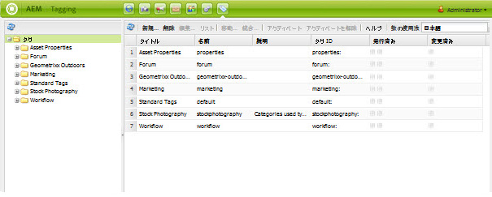
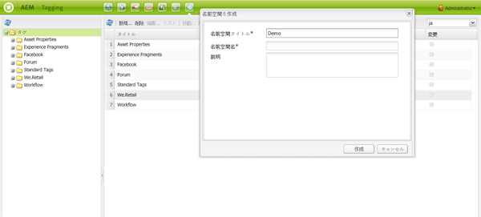
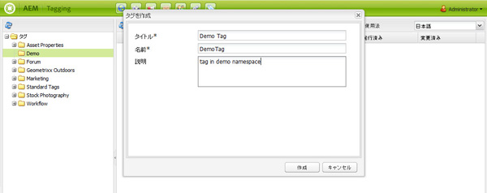
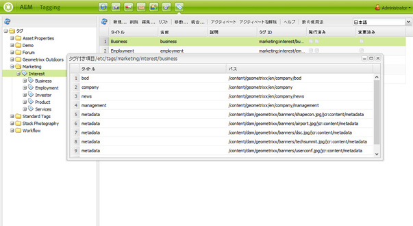
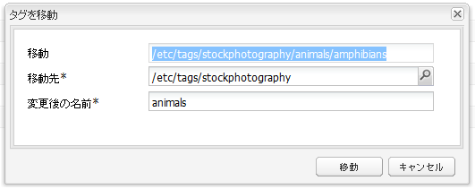
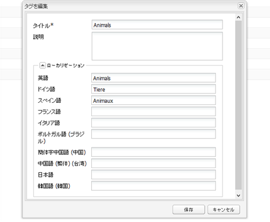
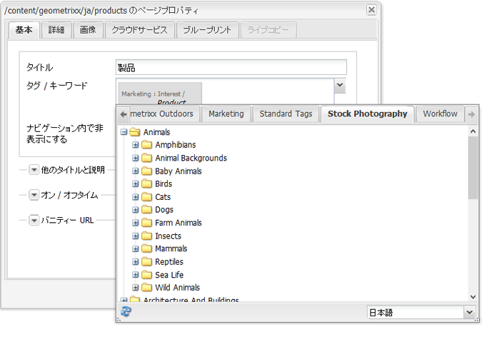

# クラシック UI のタグ付けコンソール{#classic-ui-tagging-console}

この節では、クラシック UI のタグ付けコンソールについて説明します。

タッチ操作向け UI のタグ付けコンソールは[こちら](/help/sites-administering/tags.md#tagging-console)です。

クラシック UI のタグ付けコンソールにアクセスするには：

* オーサー環境で
* 管理者権限でサインインします。
* browse to the console
for example, [https://localhost:4502/tagging](https://localhost:4502/tagging)

## タグおよび名前空間の作成 {#creating-tags-and-namespaces}

1. 開始するレベルに応じて、「**新規**」を使用してタグまたは名前空間を作成できます。

   「**タグ**」を選択すると、名前空間を作成できます。

   

   名前空間（例えば「**Demo**」）を選択すると、その名前空間内にタグを作成できます。

   

1. どちらの場合も、次のように入力します。

   * **タイトル**
(
*必須*)タグの表示タイトル。 どのような文字でも入力できますが、次の特殊文字は使用しないことが推奨されます。

      * `colon (:)` -名前空間区切り
      * `forward slash (/)`  — サブタグ区切り文字

      これらの文字は入力しても表示されません。

   * **名前**
(
*必須*)タグのノード名。

   * **説明**
(
*(オプション*)タグの説明。

   * 「**作成**」を選択します

## タグの編集 {#editing-tags}

1. 右側のウィンドウで、編集するタグを選択します。
1. 「**編集**」をクリックします。
1. 「**タイトル**」および「**説明**」を変更できます。
1. 「**保存**」をクリックしてダイアログを閉じます。

## タグの削除 {#deleting-tags}

1. 右側のウィンドウで、削除するタグを選択します。
1. 「**削除**」をクリックします。
1. 「**はい**」をクリックしてダイアログを閉じます。

   タグはリストに表示されなくなります。

## タグのアクティベートおよびアクティベート解除 {#activating-and-deactivating-tags}

1. 右側のウィンドウで、アクティベート（公開）またはアクティベート解除（非公開に）する名前空間またはタグを選択します。
1. 必要に応じて、「**アクティベート**」または「**アクティベートの解除**」をクリックします。

## リスト - タグが参照されている場所の表示 {#list-showing-where-tags-are-referenced}

「**リスト**」を選択すると、新しいウィンドウが開き、ハイライト表示されたタグを使用しているすべてのページのパスが表示されます。

## タグの移動 {#moving-tags}

タグの管理者および開発者が分類の整理やタグ ID の名前の変更ができるように、タグを新しい場所に移動することができます。

1. **Tagging** コンソールを開きます。
1. タグを選択して、最上部のツールバー（またはコンテキストメニュー）で「**Move...**」をクリックします。
1. **Move Tag** ダイアログで次の項目を指定します。

   * **to**：移動先のノード。
   * **Rename to**：新しいノード名。

1. 「**Move**」をクリックします。

**Move Tag** ダイアログは次のようになります。

>[!NOTE]
>
>Authors should not move tags or rename a tag ID. When necessary, Authors should only [change the tag titles](#editing-tags).

## タグの統合 {#merging-tags}

タグの統合は、分類が重複する場合に使用できます。タグ A がタグ B にマージされると、タグ A が付けられたすべてのページにタグ B が付けられ、作成者はタグ A を使用できなくなります。

タグを別のタグにマージするには：

1. **Tagging** コンソールを開きます。
1. タグを選択して、最上部のツールバー（またはコンテキストメニュー）で「**Merge...**」をクリックします。
1. **Merge Tag** ダイアログで次の項目を定義します。

   * **into**：マージ先のノード。

1. 「**Merge**」をクリックします。

The **Merge Tag** dialog looks as follows:

## タグの使用回数のカウント {#counting-usage-of-tags}

タグの使用回数を確認するには：

1. **Tagging** コンソールを開きます。
1. 最上部のツールバーで「**数の使用法**」をクリックします。「数」列に結果が表示されます。

## 他の言語でのタグの管理 {#managing-tags-in-different-languages}

The optional `title`property of a tag may be translated into multiple languages. Tag `titles` can then be displayed according to the user language or to the page language.

### 複数言語でのタグタイトルの定義 {#defining-tag-titles-in-multiple-languages}

The following procedure shows how to translate the `title`of the tag **Animals** into English, German and French:

1. Go to the **Tagging** console.
1. Edit the tag **Animals** below **Tags** > **Stock Photography**.
1. 次の言語での翻訳を追加します。

   * **英語**：Animals
   * **ドイツ語**：Tiere
   * **フランス語**：Animaux

1. 変更内容を保存します。

ダイアログは次のようになります。

Tagging コンソールではユーザーの言語設定が使用されます。したがって Animal タグは、ユーザープロパティで言語をフランス語に設定しているユーザーには「Animaux」と表示されます。

ダイアログに新しい言語を追加する方法については、[開発者のためのタグ付け](/help/sites-developing/building.md#adding-a-new-language-to-the-edit-tag-dialog)の&#x200B;**タグを編集ダイアログへの新しい言語の追加**&#x200B;を参照してください。

### 指定した言語でページのプロパティにタグタイトルを表示 {#displaying-tag-titles-in-page-properties-in-a-specified-language}

By default the tag `titles`in the page properties are displayed in the page language. The tag dialog in the page properties has a language field that enables the display of tag `titles`in a different language. The following procedure describes how to display the tag `titles`in French:

1. Refer to the previous section to add the French translation to the **Animals** below **Tags** > **Stock Photography**.
1. **Geometrixx** サイトの英語ブランチで、**Products** ページのページプロパティを開きます。
1. Open the **Tags/Keywords** dialog (by selecting the pull-down menu to the right of the Tags/Keywords display area) and select the **French** language from the pull-down menu in the bottom right corner.
1. Scroll using the left-right arrows until able to select the **Stock Photography** tab

   Select the **Animals** (**Animaux**) tag and select outside the dialog to close it and add the tag to the page properties.

   

By default, the Page Properties dialog displays the tag `titles`according to the page language.

一般に、ページ言語が使用可能な場合は、タグの言語はページ言語から取得されます。 [`tag` ウィジェットが他のケース（フォームやダイアログなど）で使用されている場合、タグの言語はコンテキストによって変わります。](/help/sites-developing/building.md#tagging-on-the-client-side)

>[!NOTE]
>
>The tag cloud and the meta keywords in the standard page component use the localized tag `titles`based on the page language, if available.