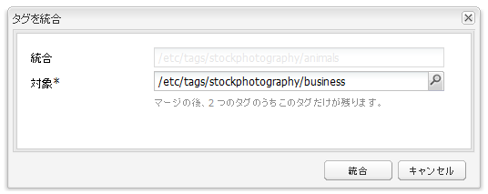

# クラシック UI のタグ付けコンソール{#classic-ui-tagging-console}

この節では、クラシック UI のタグ付けコンソールについて説明します。

>[!NOTE]
>
>タッチ操作向け UI のタグ付けコンソールについて詳しくは、[タグの管理](/help/sites-administering/tags.md#tagging-console)を参照してください。

クラシック UI のタグ付けコンソールにアクセスするには：

* オーサー環境で
* 管理者権限でログインします
* コンソールに移動します。
例： [https://localhost:4502/tagging](https://localhost:4502/tagging)

## タグおよび名前空間の作成 {#creating-tags-and-namespaces}

1. 開始するレベルに応じて、「**新規**」を使用してタグまたは名前空間を作成できます。

   「**タグ**」を選択すると、名前空間を作成できます。

   

   名前空間（例えば「**Demo**」）を選択すると、その名前空間内にタグを作成できます。

   

1. どちらの場合も、次のように入力します。

   * **タイトル**
（*必須*）タグの表示タイトル。どのような文字でも入力できますが、以下の特殊文字は使用しないことが推奨されます。

      * `colon (:)` - 名前空間区切り文字
      * `forward slash (/)` - サブタグ区切り文字

     これらの文字は入力しても表示されません。

   * **名前**
（*必須*）タグのノード名。

   * **説明**
（*オプション*）タグの説明。

   * 「**作成**」を選択します

## タグの編集 {#editing-tags}

1. 右側のパネルで、編集するタグを選択します。
1. 「**編集**」をクリックします。
1. 「**タイトル**」および「**説明**」を変更できます。
1. 「**保存**」をクリックしてダイアログを閉じます。

## タグの削除 {#deleting-tags}

1. 右側のパネルで、削除するタグを選択します。
1. 「**削除**」をクリックします。
1. 「**はい**」をクリックしてダイアログを閉じます。

   これでタグはリストから削除されます。

## タグのアクティベートおよびアクティベート解除 {#activating-and-deactivating-tags}

1. 右側のパネルで、アクティベート（公開）またはアクティベート解除（非公開に）する名前空間またはタグを選択します。
1. 必要に応じて、「**アクティベート**」または「**アクティベートの解除**」をクリックします。

## リスト - タグが参照されている場所の表示 {#list-showing-where-tags-are-referenced}

「**リスト**」を選択すると、新しいウィンドウが開き、ハイライト表示されたタグを使用しているすべてのページのパスが表示されます。

## タグの移動 {#moving-tags}

タグの管理者および開発者が分類の整理やタグ ID の名前の変更ができるように、タグを新しい場所に移動することができます。

1. **タグ付け**&#x200B;コンソールを開きます。
1. タグを選択して、最上部のツールバー（またはコンテキストメニュー）で「**移動**」をクリックします。
1. **タグを移動**&#x200B;ダイアログで次の項目を指定します。

   * **移動先**：移動先のノード。
   * **変更後の名前**：新しいノード名。

1. 「**移動**」をクリックします。

**タグを移動**&#x200B;ダイアログは次のようになります。

>[!NOTE]
>
>作成者はタグの移動やタグ ID の名前の変更は行わないでください。必要に応じて、[タグのタイトルの変更](#editing-tags)のみを行ってください。

## タグの統合 {#merging-tags}

タグのマージは、分類が重複する場合に使用できます。タグ A がタグ B にマージされると、タグ A が付けられたすべてのページにタグ B が付けられ、作成者はタグ A を使用できなくなります。

タグを別のタグにマージするには：

1. **タグ付け**&#x200B;コンソールを開きます。
1. タグを選択して、最上部のツールバー（またはコンテキストメニュー）で「**統合**」をクリックします。
1. **タグを統合**&#x200B;ダイアログで次の項目を定義します。

   * **対象**：統合先のノード。

1. 「**統合**」をクリックします。

**タグを統合**&#x200B;ダイアログは次のようになります。

## タグの使用回数のカウント {#counting-usage-of-tags}

タグの使用回数を確認するには：

1. **Tagging** コンソールを開きます。
1. 最上部のツールバーで「**数の使用法**」をクリックします。「数」列に結果が表示されます。

## 他の言語でのタグの管理 {#managing-tags-in-different-languages}

タグのオプションの `title` プロパティは複数の言語に翻訳できます。したがって、タグの `titles` はユーザー言語またはページ言語にもとづいて表示できます。

### 複数言語でのタグタイトルの定義 {#defining-tag-titles-in-multiple-languages}

**Animals** というタグの `title` を、英語、ドイツ語、フランス語に翻訳する手順を次に示します。

1. **タグ付け** コンソールに移動します。
1. **タグ**／**フォトグラフィー**&#x200B;で、**Animals** というタグを編集します。
1. 次の言語での翻訳を追加します。

   * **英語**：Animals
   * **ドイツ語**：Tiere
   * **フランス語**：Animaux

1. 変更を保存します。

ダイアログは次のようになります。

タグ付けコンソールでは、ユーザーの言語設定が使用されます。したがって Animal タグは、ユーザープロパティで言語をフランス語に設定しているユーザーには「Animaux」と表示されます。

ダイアログに新しい言語を追加する方法については、**デベロッパー向けタグ付け**&#x200B;節の[タグを編集ダイアログへの新しい言語の追加](/help/sites-developing/building.md#adding-a-new-language-to-the-edit-tag-dialog)を参照してください。

### 指定した言語でのページプロパティにおけるタグタイトルの表示 {#displaying-tag-titles-in-page-properties-in-a-specified-language}

デフォルトでは、ページプロパティで設定したタグの `titles` はページ言語に基づいて表示されます。ページプロパティ内のタグダイアログには、タグの `titles` を異なる言語で表示するための言語フィールドがあります。フランス語でタグの `titles` を表示する方法を次に示します。

1. 前の節を参照して、**タグ**／**フォトグラフィー**&#x200B;の **Animals** にフランス語の翻訳を追加します。
1. **Geometrixx** サイトの英語分岐で、**Products** ページのページプロパティを開きます。
1. 「タグ／キーワード」表示領域の右のプルダウンメニューを選択して、**タグ／キーワード**&#x200B;ダイアログを開き、右下隅のプルダウンメニューで「**フランス語**」を選択します。
1. 左右の矢印を使用してスクロールし、「**フォトグラフィー**」タブを選択します。

   **Animals**（**Animaux**）タグを選択したら、ダイアログ以外の場所を選択してダイアログを閉じ、ページプロパティにタグを追加します。

   

デフォルトでは、ページのプロパティダイアログにはページ言語にもとづいたタグの `titles` が表示されます。

ページ言語が有効な場合、タグの言語はページ言語から取得されます。[`tag`Widget](/help/sites-developing/building.md#tagging-on-the-client-side) が他のケース（フォームやダイアログボックス内など）で使われる場合、タグの言語はコンテキストに依存します。

>[!NOTE]
>
>標準ページコンポーネント内のタグクラウドおよびメタキーワードでは、ページ言語が有効な場合はそれに基づいてローカライズされたタグの `titles` が使用されます。
