# ClientContext{#client-context}

>[!NOTE]
>
>ClientContext は、ContextHub に変更されました。For more details, see the related [configuration]ch-configuring.md) and [developer](/help/sites-developing/contexthub.md) documenatation.

Client Contextは、現在のページと訪問者に関する特定の情報を提供するメカニズムです。 It can be opened using **Ctrl-Alt-c** (windows) or **control-option-c** (Mac):

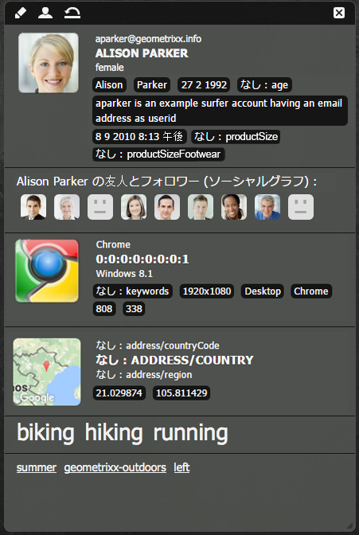

[パブリッシュ環境とオーサー環境の両方で、次の情報が表示されます。](#propertiesavailableintheclientcontext)

* 訪問者。インスタンス固有の情報がリクエストされたものであるか、派生されたものであるかによって異なります。
* ページタグおよび現在の訪問者がそれらのタグにアクセスした回数（この情報はマウスを特定のタグの上に置くと表示されます）。
* ページ情報。
* 技術的な環境に関する情報（IP アドレス、ブラウザー、画面解像度など）。
* 現在解決されているセグメント。

アイコン（オーサー環境でのみ使用可能）を使用すると、次の ClientContext の詳細を設定できます。

* **編集** 新しいページが開き、[プロファイルのプロパティを編集、追加または削除](#editingprofiledetails)できます。

* **読み込み** テストを実行する[プロファイルをリストから選択してプロファイルを読み込む](#loading-a-new-user-profile)ことができます。

* **リセット** プロファイルを現在のユーザーの[プロファイルにリセット](#resetting-the-profile-to-the-current-user)できます。

## 使用できる ClientContext のコンポーネント {#available-client-context-components}

ClientContext には、（[「編集」を使用して選択した内容に応じて](#adding-a-property-component)）次のプロパティが表示されます。

**サーファー情報** ：次のクライアント側情報を示します。

* IPア **ドレス**
* **検索エンジンの参照に使用されるキーワード** 。
* 使用 **中のブラウザ**
* 使用されている **OS** （オペレーティングシステム）
* 画面の **解像度**
* マウス **のX** 位置
* マウス **のY** 位置

**アクティビティストリーム** ：様々なプラットフォームにおけるユーザーのソーシャルアクティビティに関する情報を提供します。例えば、AEMフォーラム、ブログ、レーティングなど。

**キャンペーン** ：作成者がキャンペーンの特定のエクスペリエンスをシミュレートできます。 このコンポーネントは通常のキャンペーンの結果とエクスペリエンスの選択をオーバーライドし、各種配列のテストを有効にします。

キャンペーンの解決は、通常、キャンペーンのpriorityプロパティに基づきます。 エクスペリエンスは通常、分類に基づいて選択されます。

**買い物かご** ：商品エントリ（タイトル、数量、priceFormattedなど）、解決されたプロモーション（タイトル、メッセージなど）を含む買い物かご情報を バウチャー（コード、説明など）などの買い物かごの情報を示します。

買い物かごセッションストアは、ClientContextCartServlet を使用して（分類の変更に基づく）解決済みのプロモーションの変更をサーバーに通知します。

**汎用ストア** ：ストアのコンテンツを表示する汎用コンポーネントです。 汎用ストアのプロパティコンポーネントの下位レベルのバージョンです。

カスタマイズされた方法でデータを表示する JS レンダラーで汎用ストアを設定する必要があります。

**汎用ストアプロパティ** ：ストアのコンテンツを表示する汎用コンポーネントです。 汎用ストアのプロパティコンポーネントの上位レベルのバージョンです。

汎用ストアのプロパティコンポーネントには、設定されたプロパティを（サムネールと共に）リストするデフォルトのレンダラーが含まれます。

**位置情報** ：クライアントの緯度と経度を表示します。 HTML5 Geolocation API を使用して現在の位置についてブラウザーでクエリを実行します。その結果、ポップアップが訪問者に表示されます。ブラウザは、場所の共有に同意するかどうかを尋ねます。

コンテキストクラウドで表示されると、コンポーネントは Google API を使用してマップをサムネールとして表示します。コンポーネントは Google API の[使用制限](https://developers.google.com/maps/documentation/staticmaps/intro#Limits)に従います。

>[!NOTE]
>
>AEM 6.1 では、位置情報ストアはリバースジオコーディング機能を提供していません。このため、位置情報ストアは町名や国コードなどの現在の位置に関する情報を取得しません。このストアデータを使用するセグメントは正しく機能しません。位置情報ストアには位置の緯度と経度のみが含まれます。

**JSONP Store** ：インストールに依存するコンテンツを表示するコンポーネントです。

JSONP 標準は JSON を補完し、同一生成元ポリシーを回避します（Web アプリケーションが別のドメインにあるサーバーと通信できないようにします）。It consists in wrapping the JSON object in a function call in order to be able load it as a `<script>` from the other domain (which is an allowed exception to the same origin policy).

  JSONP ストアは他のストアと同じですが、別のドメインからの情報を読み込むのに現在のドメインにその情報のプロキシを必要としない点が異なります。[JSONP を介して ClientContext にデータを保存](/help/sites-administering/client-context.md#storing-data-in-client-context-via-jsonp)する例を参照してください。

>[!NOTE]
>
>JSONP ストアは cookie に情報をキャッシュしませんが、ページが読み込まれるたびにそのデータを取得します。

**プロファイルデータ** ：ユーザープロファイルで収集された情報を表示します。 例えば、性別、年齢、電子メールアドレスなどです。

**解決済みセグメント** ：現在解決されているセグメントを表示します（多くの場合、クライアントコンテキストに表示される他の情報に依存しています）。 これは、キャンペーンを設定するときに参考となります。

例えば、マウスが現在ウィンドウの左または右の部分の上にあるかどうかなどです。このセグメントは主にテストに使用されます。変更はすぐに確認できます。

**ソーシャルグラフ** ：ユーザーの友達とフォロワーのソーシャルグラフを表示します。

>[!NOTE]
>
>現時点ではこれはデモ機能で、デモユーザーのプロファイルノードに事前設定されたデータに依存します。例えば、次を参照してください。
>
>`/home/users/geometrixx/aparker@geometrixx.info/profile` => friendsプロパティ

**Tag Cloud** ：現在のページに設定されたタグと、サイトの閲覧中に収集されたタグを表示します。 タグの上にマウスを移動すると、現在のユーザーがその特定のタグを保持しているページにアクセスした回数が表示されます。

>[!NOTE]
訪問したページに表示される DAM アセットに設定されているタグはカウントされません。

**Technographics Store** このコンポーネントは、インストール環境に応じて異なります。

**ViewedProducts** ：買い物客が閲覧した商品を追跡します。 最近閲覧した商品や、最近閲覧した商品のうち買い物かごに入っていない商品でクエリを実行できます。

このセッションストアにデフォルトの ClientContext コンポーネントはありません。

詳しくは、[ClientContext の詳細](/help/sites-developing/client-context.md)を参照してください。

>[!NOTE]
ページデータは、ClientContext のデフォルトのコンポーネントではなくなりました。必要に応じて、ClientContext を編集し、**汎用ストアのプロパティ**&#x200B;コンポーネントを追加して、**ストア**&#x200B;を `pagedata` として定義するように設定することにより、ページデータを追加できます。

## ClientContext プロファイルの変更 {#changing-the-client-context-profile}

ClientContext では、次の詳細をインタラクティブに変更できます。

* ClientContext で使用されるプロファイルを変更すると、現在のページで様々なユーザーに対して表示されるものとは異なるエクスペリエンスが表示されます。
* ユーザープロファイルのほか、プロファイルの詳細を変更して様々な状況下でページエクスペリエンスがどのように異なるかを確認できます。

### 新しいユーザープロファイルの読み込み {#loading-a-new-user-profile}

次のいずれかの方法でプロファイルを変更できます。

* [読み込みアイコンを使用](#loading-a-new-visitor-profile-with-the-load-profile-icon)
* [選択スライダーを使用](#loadinganewvisitorprofilewiththeselectionslider)

完了したら、[プロファイルをリセット](#resetting-the-profile-to-the-current-user)できます。

#### プロファイルの読み込みアイコンを使用した新しいユーザープロファイルの読み込み {#loading-a-new-visitor-profile-with-the-load-profile-icon}

1. 次のプロファイルの読み込みアイコンをクリックします。

   

1. ダイアログが開きます。ここで読み込むプロファイルを選択できます。

   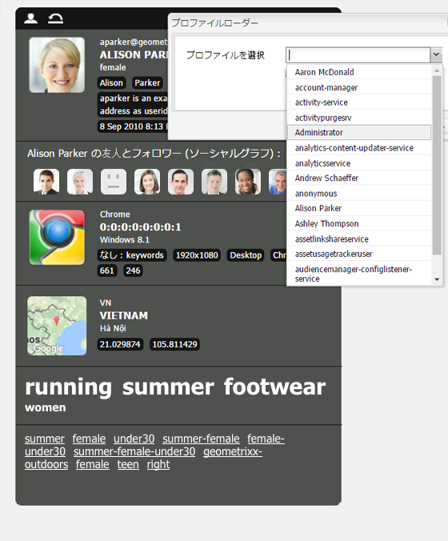

1. 「**OK**」をクリックして読み込みます。

#### 選択スライダーを使用した新しいユーザープロファイルの読み込み {#loading-a-new-user-profile-with-the-selection-slider}

次の選択スライダーを使用してプロファイルを選択することもできます。

1. 現在のユーザーを表すアイコンをダブルクリックします。セレクターが開きます。矢印で移動し、使用可能なプロファイルを確認します。

   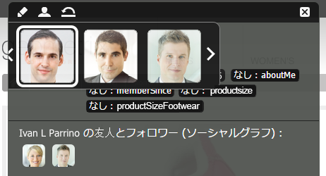

1. 読み込むプロファイルをクリックします。詳細が読み込まれたら、セレクター以外の場所をクリックしてセレクターを閉じます。

#### プロファイルの現在のユーザーへのリセット {#resetting-the-profile-to-the-current-user}

1. 次のリセットアイコンを使用して ClientContext のプロファイルを現在のユーザーのものに戻します。

   

### ブラウザープラットフォームの変更 {#changing-the-browser-platform}

1. ブラウザープラットフォームを表すアイコンをダブルクリックします。セレクターが開きます。矢印で移動し、使用可能なプラットフォームやブラウザーを確認します。

   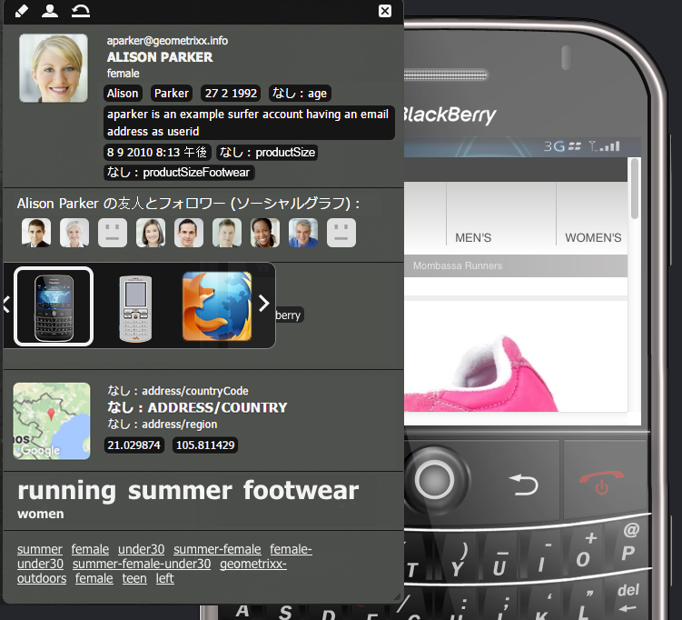

1. 読み込むブラウザープラットフォームをクリックします。詳細が読み込まれたら、セレクター以外の場所をクリックしてセレクターを閉じます。

### 位置情報の変更 {#changing-the-geolocation}

1. 位置情報アイコンをダブルクリックします。展開されたマップが開きます。ここでマーカーを新しい位置にドラッグできます。

   

1. マップ以外の場所をクリックしてマップを閉じます。

### タグ選択の変更 {#changing-the-tag-selection}

1. ClientContext のタグクラウドセクションをダブルクリックします。ダイアログが開きます。ここでタグを選択できます。

   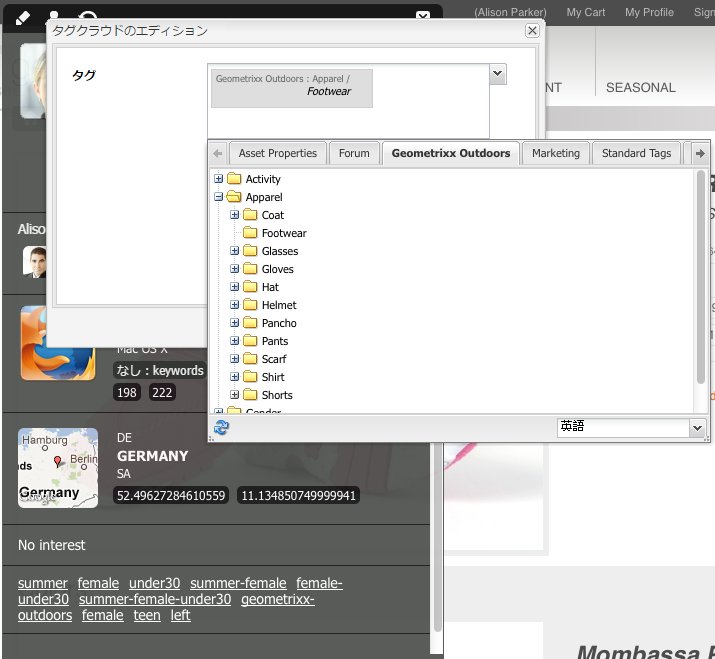

1. 「OK」をクリックして ClientContext に読み込みます。

## ClientContext の編集 {#editing-the-client-context}

ClientContext の編集を使用して、特定のプロパティの値を設定（またはリセット）したり、新しいプロパティの追加や不要になったプロパティの削除をおこなえます。

### プロパティの詳細の編集 {#editing-property-details}

ClientContext を編集して、特定のプロパティの値を設定（またはリセット）できます。This allows you to test specific scenarios (particularly useful for [segmentation](/help/sites-administering/campaign-segmentation.md) and [campaigns](/help/sites-classic-ui-authoring/classic-personalization-campaigns.md)).

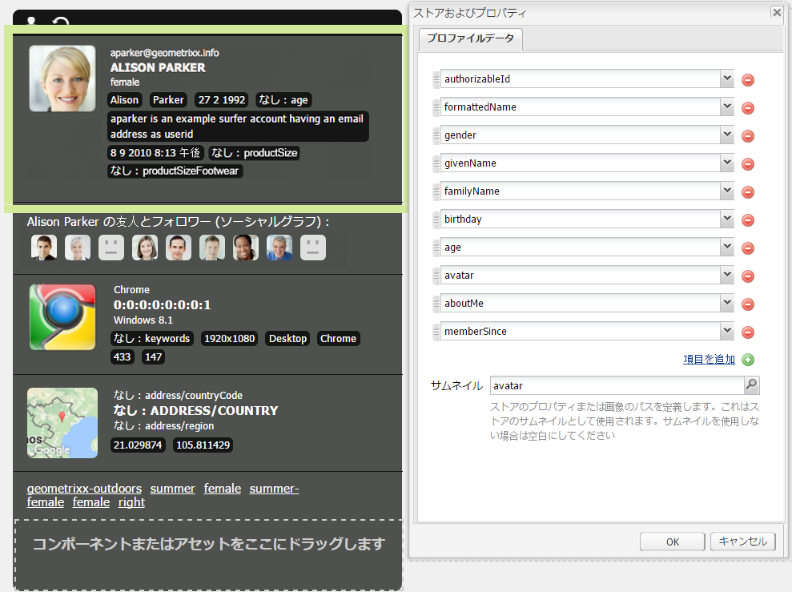

### プロパティコンポーネントの追加 {#adding-a-property-component}

**ClientContextデザインページを開いた後に、使用可能なコンポーネントを使用して完全に新しいプロパティを作成することもできます**(コンポーネントは、サイドキックと **Insert New Component** (新しいコンポーネントを **挿入****** )ダイアログの両方で重複がクリックした後に開きます)。

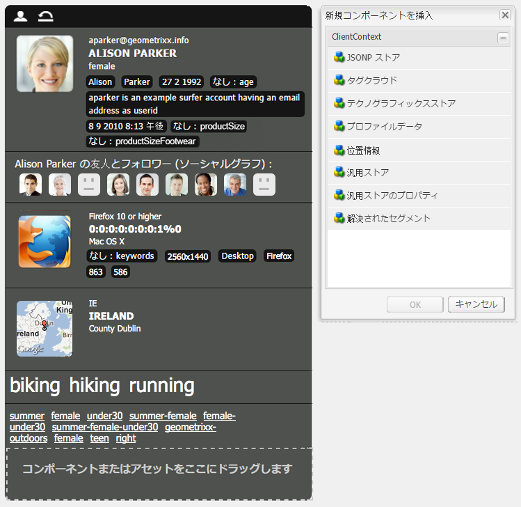

### プロパティコンポーネントの削除 {#removing-a-property-component}

**ClientContext デザインページ**&#x200B;を開いたら、不要になったプロパティを&#x200B;**削除**&#x200B;できます。このようなプロパティには、初期設定のまますぐに使用できるプロパティがあります。「**リセット**」を使用すると、プロパティが削除された場合に元に戻すことができます。

## JSONP を介した ClientContext へのデータの保存 {#storing-data-in-client-context-via-jsonp}

この例に従って JSONP ストアコンテキストストアコンポーネントを使用して、外部データを ClientContext に追加します。次に、そのデータからの情報に基づいてセグメントを作成します。この例では、WIPmania.com が提供する JSONP サービスを使用します。このサービスは、Web クライアントの IP アドレスに基づいて位置情報を返します。

この例は、Geometrixx Outdoors のサンプル Web サイトを使用して ClientContext にアクセスし、作成したセグメントをテストします。ClientContext が有効になっているページであれば、別の Web サイトを使用できます（[ページへの ClientContext の追加](/help/sites-developing/client-context.md#adding-client-context-to-a-page)を参照）。

### JSONP ストアコンポーネントの追加 {#add-the-jsonp-store-component}

JSONP ストアコンポーネントを ClientContext に追加して、Web クライアントの位置情報の取得と保存に使用できます。

1. AEM オーサーインスタンスの Geometrixx Outdoors サイトの英語のホームページを開きます([https://localhost:4502/content/geometrixx-outdoors/en.html](https://localhost:4502/content/geometrixx-outdoors/en.html)).
1. クライアントコンテキストを開くには、Ctrl-Alt-c(Windows)またはControl-Option-c(Mac)を押します。
1. ClientContext の上部の編集アイコンをクリックして ClientContext デザイナーを開きます。

   

1. JSONP ストアコンポーネントを ClientContext にドラッグします。

   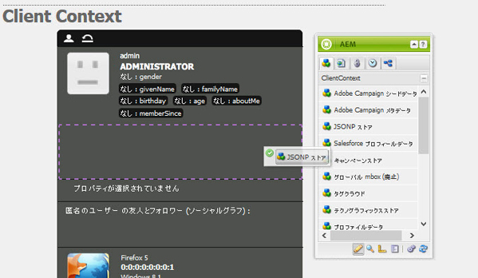

1. コンポーネントをダブルクリックして編集ダイアログを開きます。
1. 「JSONP サービスの URL」ボックスに次の URL を入力し、「ストアを取得」をクリックします。

   `https://api.wipmania.com/jsonp?callback=${callback}`

   コンポーネントが JSONP サービスを呼び出し、返されたデータに含まれるすべてのプロパティがリストされます。リスト内のプロパティは、ClientContext で使用できるプロパティです。

   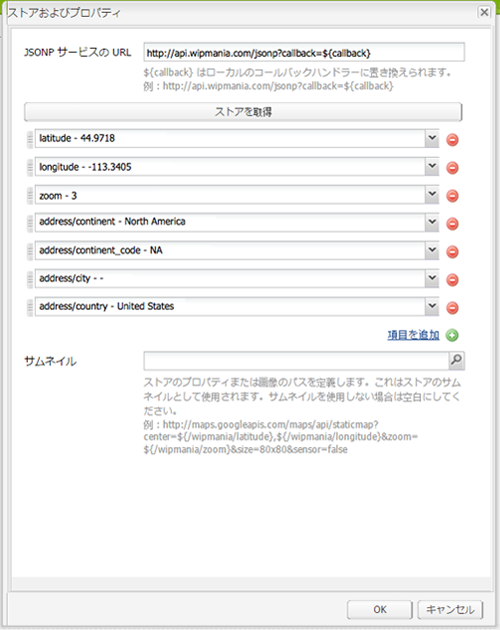

1. 「OK」をクリックします。
1. Geometrixx Outdoors のホームページに戻り、ページを更新します。これで、ClientContext に JSONP ストアコンポーネントからの情報が取り込まれます。

   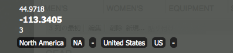

### セグメントの作成 {#create-the-segment}

JSONP ストアコンポーネントを使用して作成したセッションストアからのデータを使用します。セグメントはセッションストアの緯度と現在の日付から、クライアントの場所が冬時間であるかどうかを判断します。

1. Open the Tools console in your web browser (`https://localhost:4502/miscadmin#/etc`).
1. フォルダーツリーで、Tools/Segmentation フォルダーを選択して、新規／新しいフォルダーをクリックします。次のプロパティ値を指定して「作成」をクリックします。

   * 名前：mysegments
   * タイトル：My Segments

1. My Segments フォルダーを選択して、新規／新しいページをクリックします。

   1. 「タイトル」には「Winter」と入力します。
   1. 「セグメント」テンプレートを選択します。
   1. 「作成」をクリックします。

1. Winter セグメントを右クリックして「開く」をクリックします。
1. 汎用ストアのプロパティをデフォルトの AND コンテナにドラッグします。

   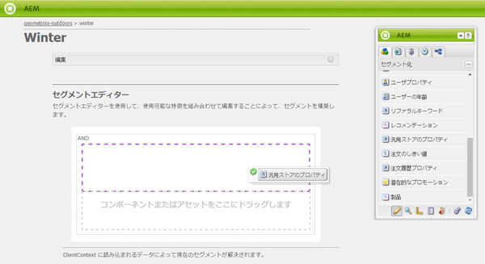

1. コンポーネントをダブルクリックして編集ダイアログを開き、次のプロパティ値を指定して「OK」をクリックします。

   * ストア：wipmania
   * プロパティ名：latitude
   * 演算子：is greater than
   * プロパティ値：30

1. スクリプトコンポーネントを同じ AND コンテナにドラッグし、その編集ダイアログを開きます。次のスクリプトを追加して「OK」をクリックします。

   `3 < new Date().getMonth() < 12`

