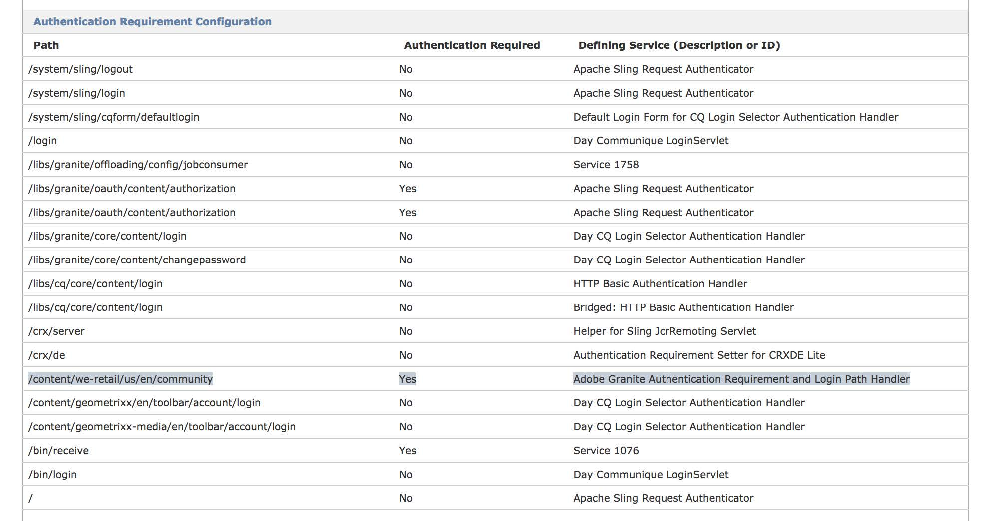

# AEM の閉じられたユーザーグループ{#closed-user-groups-in-aem}

## はじめに {#introduction}

AEM 6.3 より、閉じられたユーザーグループという新しい実装が組み込まれています。これは、既存の実装が抱えていたパフォーマンス、スケーラビリティおよびセキュリティ上の問題を解決するためのものです。

>[!NOTE]
>
>このドキュメントでは、説明を簡略にするために、CUG 略語で表記します。

この新しい実装の目的は、必要に応じて既存の機能をカバーすると同時に、旧バージョンからの問題や設計上の制限に対応することです。その結果として、次の特性を持つ新しい CUG デザインが生まれました。

* 認証要素と承認要素の明確に分離し、これらの要素を、個別に使用することも、一緒に使用することもできます。
* 他のアクセス制御設定や権限要件と競合することauthorization なく、設定済みの CUG ツリーで制限付き読み取りアクセスを反映する専用の承認モデル。
* （オーサリングインスタンスで必要となる）制限付き読み取りアクセスのアクセス制御設定と（公開時にのみ必要になる）権限評価の分離。
* 権限を昇格せずに、制限付き読み取りアクセスを編集。
* 認証要件をマークするための、専用のノードタイプ拡張。
* 認証要件に関連付けられる、オプションのログインパス。

### 新しいカスタムユーザーグループの実装 {#the-new-custom-user-group-implementation}

CUG は、AEM のコンテキストで知られるように、次の手順で構成されます。

* 保護する必要があるツリーに対する読み取りアクセスを制限して、特定の CUG インスタンスと一緒にリストされるプリンシパルか、CUG 評価全体から除外されるプリンシパルにのみ読み取りを許可します。これは、**承認**&#x200B;要素と呼ばれます。
* 特定のツリーに認証を強制的に適用します。オプションで、そのツリー専用のログインページも指定できます（後で除外されます）。これは、**認証**&#x200B;要素と呼ばれます。

この新しい実装では、認証要素と承認要素を分離するように設計されています。AEM 6.3 の時点では、認証要件を明示的に追加しなくても、読み取りアクセスを制限できます。例えば、特定のインスタンス全体で認証が必要な場合や、既に認証を必要としているサブツリー内に特定のツリーが既に存在している場合です。

同様に、有効な権限設定を変更しなくても、特定のツリーに認証要件をマークできます。これらの組み合わせと結果については、[CUG ポリシーと認証要件の組み合わせ](/help/sites-administering/closed-user-groups.md#combining-cug-policies-and-the-authentication-requirement)の節に示します。

## 概要 {#overview}

### 承認：読み取りアクセスの制限 {#authorization-restricting-read-access}

CUG の重要な機能は、コンテンツリポジトリ内の特定のツリーに対する読み取りアクセスを制限することです（選択されたプリンシパルを除く）。新しい実装では、実行中にデフォルトのアクセス制御コンテンツをその場で操作するかわりに、これまでとは異なるアプローチとして、CUG を表す専用のアクセス制御ポリシータイプを定義します。

#### CUG 用のアクセス制御ポリシー {#access-control-policy-for-cug}

この新しいタイプのポリシーは、次の特性を持ちます。

* （Apache Jackrabbit API によって定義される）タイプ org.apache.jackrabbit.api.security.authorization.PrincipalSetPolicy のアクセス制御ポリシー。
* PrincipalSetPolicy は、プリンシパルの変更可能なセットに権限を付与します。
* 付与される権限とポリシーの有効範囲は、実装上の詳細です。

CUG の表現に使用される PrincipalSetPolicy の実装は、さらに次も定義します。

* CUG ポリシーは、通常の JCR アイテムへの読み取りアクセスのみを付与します（例えば、アクセス制御コンテンツは除外されます）。
* 有効範囲は、CUG ポリシーを保持する、アクセス制御されたノードによって定義されます。
* CUG ポリシーはネストできます。ネストされた CUG は、「親」CUG のプリンシパルセットを継承しなくても、新しい CUG を開始できます。
* ポリシーの効果は、評価が有効になっている場合は、次にネストされる CUG に至るまで、サブツリー全体に継承されます。

これらの CUG ポリシーは、oak-authorization-cug と呼ばれる別の認証モジュールを介して、AEM インスタンスに導入されます。このモジュールは、独自のアクセス制御管理および権限評価に付属しています。つまり、デフォルトの AEM の設定には、複数の承認メカニズムを組み合わせた Oak コンテンツリポジトリ設定が付属しています。詳しくは、[この Apache Oak ドキュメントページ](https://jackrabbit.apache.org/oak/docs/security/authorization/composite.html)を参照してください。

この複合設定では、新しい CUG は、ターゲットノードにアタッチされている既存のアクセス制御コンテンツには置き換わりません。それどころかこれは補足であり、元のアクセス制御に影響を与えずに後で削除することもできます。AEM のデフォルトでは、アクセス制御リストになります。

前の実装とは対照的に、新しい CUG ポリシーは常にアクセス制御コンテンツとして認識および処理されます。つまり、新しい CUG ポリシーは、JCR アクセス制御管理 API を使用して作成、編集されるということです。詳しくは、[CUG ポリシーの管理](#managing-cug-policies)の節を参照してください。

#### CUG ポリシーの権限評価 {#permission-evaluation-of-cug-policies}

CUG の専用アクセス制御管理とは別に、新しい承認モデルでは、CUG ポリシーの権限評価を条件付きで有効にできます。このモデルでは、CUG ポリシーをステージング環境に設定して、実稼動環境にレプリケーションされた後でのみ、有効な権限の評価を有効にすることができます。

CUG ポリシーの権限評価と、デフォルトまたは追加の承認モデルとのやり取りは、Apache Jackrabbit Oak の複数の承認メカニズム用に設計されたパターンに従います。つまり、すべてのモデルがアクセス権を付与する場合にのみ、特定の権限セットが付与されます。詳しくは、[Jackrabbit Oak ドキュメント ](https://jackrabbit.apache.org/oak/docs/security/authorization/composite.html) を参照してください。

CUG ポリシーを処理および評価するために設計された承認モデルに関連付けられる権限評価には、次の特性が適用されます。

* 通常のノードとプロパティの読み取り権限のみを処理し、アクセス制御コンテンツの読み取りは処理しません。
* 書き込み権限も、保護された JCR コンテンツの変更に必要なあらゆる種類の権限（アクセス制御、ノードタイプ情報、バージョン管理、ロック、ユーザー管理など）も処理されません。これらの権限は CUG ポリシーの影響を受けず、関連する承認モデルでは評価されません。これらの権限が付与されるかどうかは、セキュリティ設定に設定された他のモデルによって決まります。

1 つの CUG ポリシーが権限評価に与える影響は、次のように要約できます。

* 読み取りアクセスは拒否されます（除外されたプリンシパルやポリシーにリストされたプリンシパルを含むサブジェクトを除く）。
* このポリシーは、ポリシーとプロパティを保持する、アクセス制御されたノードで有効になります。
* この影響は、階層の下まで、つまり、アクセス制御されたノードによって定義されるアイテムツリーまでも継承されます。
* ただし、このポリシーは、アクセス制御されたノードの兄弟や祖先には影響しません。
* 特定の CUG の継承は、ネストされた CUG で止まります。

#### ベストプラクティス {#best-practices}

CUG を介した、制限付き読み取りアクセスを定義する際は、次のベストプラクティスを考慮する必要があります。

* CUG は、読み取りアクセスの制限に対して必要なのか、認証要件に対して必要なのかを判断します。認証要件に対して必要な場合、またはどちらの場合にも必要な場合は、ベストプラクティスに関する節で、認証要件の詳細を確認してください。
* 保護する必要があるデータやコンテンツの脅威モデルを作成して、脅威の範囲を識別し、データの感度と、承認されたアクセスに関連付けられている役割を明確にします。
* リポジトリコンテンツと CUG をモデル化して、承認に関する一般事項とベストプラクティスを覚えておきます。

   * 特定の CUG と、設定に導入されている他のモジュールの評価によって、特定のサブジェクトが特定のリポジトリアイテムを読み取ることが許可される場合にのみ、読み取り権限が付与されます。
   * 読み取りアクセスが既に他の承認モジュールによって制限されている場合は、冗長 CUG の作成を回避します。
   * ネストされた CUG が大量に必要になる場合は、コンテンツデザインに問題がある可能性があります。
   * CUG が大量に必要な場合（例えば、ページごとに CUG が必要な場合）は、そのアプリケーションやコンテンツのセキュリティニーズに見合ったカスタム承認モデルを導入することが必要な可能性があります。

* CUG ポリシーのためにサポートされるパスを、リポジトリ内のいくつかのツリーに制限して、最適なパフォーマンスを維持します。例えば、AEM 6.3 よりデフォルト値として付属している /content ノード下にのみ CUG を許可します。
* CUG ポリシーは、少数のプリンシパルに読み取りアクセスを付与するように設計されています。大量のプリンシパルが必要な場合は、コンテンツやアプリケーションのデザインに関する問題が発生する可能性があるので、再検討する必要があります。

### 認証：認証要件の定義 {#authentication-defining-the-auth-requirement}

CUG 機能の認証関連のパーツにより、認証を必要とするツリーをマークできます。オプションで、専用のログインページも指定できます。以前のバージョンに従って、新しい実装では、コンテンツリポジトリで認証が必要なツリーをマークできます。また、要件の最終的な適用とログインリソースへのリダイレクトを担当する `Sling org.apache.sling.api.auth.Authenticator` との同期も条件付きで有効にします。

これらの要件は、`sling.auth.requirements` 登録プロパティを提供する OSGi サービスによって Authenticator に登録されます。その後、これらのプロパティは、認証要件の動的な拡張に使用されます。詳しくは、[Sling に関するドキュメント](https://sling.apache.org/apidocs/sling7/org/apache/sling/auth/core/AuthConstants.html#AUTH_REQUIREMENTS)を参照してください。

#### 専用の Mixin タイプによる認証要件の定義 {#defining-the-authentication-requirement-with-a-dedicated-mixin-type}

セキュリティ上の理由から、新しい実装では、残存している JCR プロパティを、`granite:AuthenticationRequired` という名前の専用の mixin タイプで置き換えます。この mixin タイプは、ログインパス `granite:loginPath` に、STRING タイプの単一のオプションプロパティを定義します。この mixin タイプに関連するコンテンツが変更された場合にのみ、Apache Sling Authenticator に登録されている要件が更新されます。この変更は、一時的な変更を永続化する際に追跡されるので、有効にするには `javax.jcr.Session.save()` を呼び出す必要があります。

同じことが `granite:loginPath` プロパティにも当てはまります。このプロパティは、認証要件に関連する mixin タイプで定義される場合にのみ考慮されます。残余プロパティをこの名前で非構造化 JCR ノードに追加しても、期待した効果は得られず、OSGi 登録を更新するハンドラーはこのプロパティを無視します。

>[!NOTE]
>
>ログインパスプロパティの設定はオプションです。ログインパスプロパティは、認証を必要とするツリーがデフォルトまたは継承されたログインページにフォールバックできない場合にのみ設定する必要があります。詳しくは、後述の[ログインパスの評価](/help/sites-administering/closed-user-groups.md#evaluation-of-login-path)を参照してください。

#### Sling Authenticator への認証要件とログインパスの登録 {#registering-the-authentication-requirement-and-login-path-with-the-sling-authenticator}

このタイプの認証要件は、特定の実行モードと、コンテンツリポジトリにあるツリーの小さいサブセットに限定されることが想定されるので、認証要件の mixin タイプとログインパスのプロパティを追跡すると、結果は条件次第となります。また、サポート対象パスを定義する対応する設定に関連付けられます（詳しくは、「設定オプション」を参照）。したがって、これらのサポート対象パスの有効範囲内で変更があった場合にのみ、OSGi 登録が更新され、それ以外の場所では、mixin タイプもログインパスプロパティも無視されます。

デフォルトの AEM セットアップでは、この設定を利用できるようにするために、mixin を author 実行モードで設定し、その設定をパブリッシュインスタンスへのレプリケーション時にのみ有効にできるようになりました。Sling での認証要件の強制方法について詳しくは、[Sling 認証 – フレームワーク ](https://sling.apache.org/documentation/the-sling-engine/authentication/authentication-framework.html) ドキュメントを参照してください。

`granite:AuthenticationRequired` mixin タイプを設定済みのサポート対象パス内に追加すると、関係するハンドラーの OSGi 登録が更新され、`sling.auth.requirements` プロパティを含む新しいエントリが追加されます。特定の認証要件にオプションの `granite:loginPath` プロパティが指定されている場合、その値は「-」プレフィックスを付けて Authenticator にも登録され、認証要件から除外されます。

#### 認証要件の評価と継承 {#evaluation-and-inheritance-of-the-authentication-requirement}

Apache Sling 認証要件は、ページまたはノード階層を通じて継承されます。認証要件の継承と評価の詳細（順序や優先順位など）は、実装の詳細になるので、このドキュメントでは説明しません。

#### ログインパスの評価 {#evaluation-of-login-path}

認証時の対応リソースへのログインパスとリダイレクトの評価は、Adobe Granite Login Selector Authentication Handler（`com.day.cq.auth.impl.LoginSelectorHandler`）の実装上の詳細です。このハンドラーは、AEM にデフォルトで設定されている Apache Sling AuthenticationHandler です。

`AuthenticationHandler.requestCredentials` を呼び出すと、このハンドラーは、ユーザーのリダイレクト先となるマッピングログインページを特定しようとします。この決定は、次の手順に従います。

* リダイレクトの理由として、パスワードの失効と、通常のログインに必要な処理を区別します。
* 通常のログインに必要な処理である場合は、ログインパスを取得できるかどうかを、以下の順序で確認します。

   * 新しい `com.adobe.granite.auth.requirement.impl.RequirementService` で実装される LoginPathProvider から
   * 廃止された古い CUG 実装から
   * `LoginSelectorHandler` で定義したログインページマッピングから
   * 最後に、`LoginSelectorHandler` で定義したデフォルトログインページへのフォールバック

* 前述の呼び出しから有効なログインパスが取得されると、ユーザーのリクエストは、そのページにリダイレクトされます。

このドキュメントの目的は、内部の `LoginPathProvider` インターフェイスによって公開されるログインパスの評価です。AEM 6.3 以降に付属する実装は、次のように動作します。

* ログインパスの登録は、リダイレクトの理由が、パスワードの失効であるか、通常のログインに必要な処理であるかによって異なります。
* 通常のログインに必要な処理である場合は、ログインパスを取得できるかどうかを、以下の順序で確認します。

   * 新しい `com.adobe.granite.auth.requirement.impl.RequirementService` で実装される `LoginPathProvider` から
   * 廃止された古い CUG 実装から
   * `LoginSelectorHandler` で定義したログインページマッピングから
   * 最後に、`LoginSelectorHandler` で定義したデフォルトログインページへのフォールバック

* 前述の呼び出しから有効なログインパスが取得されると、ユーザーのリクエストは、そのページにリダイレクトされます。

Granite の新しい認証要件のサポートで実装される `LoginPathProvider` は、`granite:loginPath` プロパティで定義したログインパスを公開します。また、これらのプロパティは、前述の mixin タイプによって定義されます。ログインパスとプロパティ値自体を保持するリソースパスのマッピングはメモリ内に保存され、階層内にある他のノードの適切なログインパスを検出するために評価されます。

>[!NOTE]
>
>この評価は、設定済みのサポートパス内に存在するリソースに関連付けられているリクエストに対してのみ実行されます。それ以外のリクエストについては、ログインパスを判定する別の方法が評価されます。

#### ベストプラクティス {#best-practices-1}

認証要件を定義する際は、次のベストプラクティスを考慮する必要があります。

* 認証要件のネストを避けます。ツリーの先頭部に認証要件マーカーを 1 つ配置するだけで十分です。そのマーカーは、ターゲットノードで定義されるサブツリー全体に継承されます。そのツリー内に他の認証要件があると、Apache Sling 内で認証要件を評価する際にパフォーマンス上の問題が発生する可能性があります。承認と認証に関連する CUG 領域を切り離すことで、CUG やその他のポリシーによって読み取りアクセスを制限しながら、ツリー全体に認証を適用できます。
* リポジトリコンテンツをモデル化して、ネストされたサブツリーを認証要件から再度除外しなくてもツリー全体に認証要件が適用されるようにします。
* 冗長なログインパスの指定とその後の登録を避けるには、次のようにします。

   * 継承を利用するようにし、ネストされたログインパスを定義することは避けます。
   * オプションのログインパスを、デフォルト値または継承値に対応する値に設定しないでください。
   * アプリケーション開発者は、`LoginSelectorHandler` に関連付けられるグローバルなログインパス設定（デフォルトとマッピングの両方）に設定する必要があるログインパスを識別してください。

## リポジトリでの表現 {#representation-in-the-repository}

### リポジトリでの CUG ポリシーの表現 {#cug-policy-representation-in-the-repository}

新しい CUG ポリシーがリポジトリコンテンツにどのように反映されるかについては、Oak のドキュメントに記載されています。詳しくは、[CUG によるアクセスの管理に関するJackrabbit Oak ドキュメント ](https://jackrabbit.apache.org/oak/docs/security/authorization/cug.html#Representation_in_the_Repository) を参照してください。

### リポジトリでの認証要件 {#authentication-requirement-in-the-repository}

個別の認証要件の必要性は、ターゲットノードに配置された専用の mixin ノードタイプでリポジトリコンテンツに反映されます。この mixin タイプは、オプションのプロパティを定義して、ターゲットノードによって定義されるツリーの専用ログインページを指定します。

ログインパスに関連付けられるページは、ツリーの内部または外部のいずれにでも配置できます。このページは、認証要件から除外されます。

```java
[granite:AuthenticationRequired]
      mixin
      - granite:loginPath (STRING)
```

## CUG ポリシーと認証要件の管理 {#managing-cug-policies-and-authentication-requirement}

### CUG ポリシーの管理 {#managing-cug-policies}

CUG の読み取りアクセスを制限する新しいタイプのアクセス制御ポリシーは、JCR アクセス制御管理 API を使用して管理され、[JCR 2.0 仕様](https://developer.adobe.com/experience-manager/reference-materials/spec/jcr/2.0/16_Access_Control_Management.html) に記載されるメカニズムに従います。

#### 新しい CUG ポリシーを設定 {#set-a-new-cug-policy}

CUG がまだ設定されていないノードに新しい CUG ポリシーを適用するコードです。`getApplicablePolicies` は、まだ一度も設定されていない新しいポリシーのみを返すことに注意が必要です。最後に、このポリシーを書き戻して、変更を保存する必要があります。

```java
String path = [...] // needs to be a supported, absolute path

Principal toAdd1 = [...]
Principal toAdd2 = [...]
Principal toRemove = [...]

AccessControlManager acMgr = session.getAccessControlManager();
PrincipalSetPolicy cugPolicy = null;

AccessControlPolicyIterator it = acMgr.getApplicablePolicies(path);
while (it.hasNext()) {
        AccessControlPolicy policy = it.nextAccessControlPolicy();
        if (policy instanceof PrincipalSetPolicy) {
           cugPolicy = (PrincipalSetPolicy) policy;
           break;
        }
}

if (cugPolicy == null) {
   log.debug("no applicable policy"); // path not supported or no applicable policy (for example,
                                                   // the policy was set before)
   return;
}

cugPolicy.addPrincipals(toAdd1, toAdd2);
cugPolicy.removePrincipals(toRemove));

acMgr.setPolicy(path, cugPolicy); // as of this step the policy can be edited/removed
session.save();
```

#### 既存の CUG ポリシーを編集 {#edit-an-existing-cug-policy}

既存の CUG ポリシーを編集するには、次の手順が必要です。変更されたポリシーを書き戻し、`javax.jcr.Session.save()` を使用して変更を保存する必要があります。

```java
String path = [...] // needs to be a supported, absolute path

Principal toAdd1 = [...]
Principal toAdd2 = [...]
Principal toRemove = [...]

AccessControlManager acMgr = session.getAccessControlManager();
PrincipalSetPolicy cugPolicy = null;

for (AccessControlPolicy policy : acMgr.getPolicies(path)) {
     if (policy instanceof PrincipalSetPolicy) {
        cugPolicy = (PrincipalSetPolicy) policy;
        break;
     }
}

if (cugPolicy == null) {
   log.debug("no policy to edit"); // path not supported or policy not set before
   return;
}

if (cugPolicy.addPrincipals(toAdd1, toAdd2) || cugPolicy.removePrincipals(toRemove)) {
   acMgr.setPolicy(path, cugPolicy);
   session.save();
} else {
     log.debug("cug policy not modified");
}
```

### 有効な CUG ポリシーを取得 {#retrieve-effective-cug-policies}

JCR アクセス制御管理では、特定のパスで有効なポリシーを取得する最善努力（ベストエフォート）型の方法を定義します。CUG ポリシーの評価は、対応する設定が有効になっているかどうかが条件となるので、特定の CUG ポリシーが特定のインストールで有効になっているかどうかを調べるには、`getEffectivePolicies` を呼び出すと簡単です。

>[!NOTE]
>
>`getEffectivePolicies` と、特定のパスが既存の CUG の一部であるかどうかを階層内で調べる後続のコード例には違いがあります。

```java
String path = [...] // needs to be a supported, absolute path

AccessControlManager acMgr = session.getAccessControlManager();
PrincipalSetPolicy cugPolicy = null;

// log an debug message of all CUG policies that take effect at the given path
// there could be zero, one or many (creating nested CUGs is possible)
for (AccessControlPolicy policy : acMgr.getEffectivePolicies(path) {
     if (policy instanceof PrincipalSetPolicy) {
        String policyPath = "-";
        if (policy instanceof JackrabbitAccessControlPolicy) {
           policyPath = ((JackrabbitAccessControlPolicy) policy).getPath();
        }
        log.debug("Found effective CUG for path '{}' at '{}', path, policyPath);
     }
}
```

#### 継承された CUG ポリシーを取得 {#retrieve-inherited-cug-policies}

有効かどうかに関係なく、特定のパスで定義されているネストされた CUG をすべて検索します。詳しくは、[設定オプション](/help/sites-administering/closed-user-groups.md#configuration-options)の節を参照してください。

```java
String path = [...]

List<AccessControlPolicy> cugPolicies = new ArrayList<AccessControlPolicy>();
while (isSupportedPath(path)) {
     for (AccessControlPolicy policy : acMgr.getPolicies(path)) {
         if (policy instanceof PrincipalSetPolicy) {
            cugPolicies.add(policy);
         }
      }
      path = (PathUtils.denotesRoot(path)) ? null : PathUtils.getAncestorPath(path, 1);
}
```

#### プリンシパルによる CUG ポリシーの管理 {#managing-cug-policies-by-pincipal}

`JackrabbitAccessControlManager` で定義される拡張機能を使用すると、プリンシパルによるアクセス制御ポリシーを編集できますが、定義上 CUG ポリシーはすべてのプリンシパルに影響するので、この拡張機能は CUG アクセス制御管理と一緒には実装されません。`PrincipalSetPolicy` でリストされるこれらすべてのプリンシパルには、読み取りアクセス権が付与されますが、それ以外のプリンシパルは、ターゲットノードで定義されるツリー内のコンテンツを読み取ることができません。

これらに対応するメソッドは常に空のポリシー配列を返しますが、例外はスローしません。

### 認証要件の管理 {#managing-the-authentication-requirement}

新しい認証要件の作成、変更または削除は、ターゲットノードの有効なノードタイプを変更することで達成されます。その後、オプションのログインパスプロパティへの書き込みには、通常の JCR API を使用できます。

>[!NOTE]
>
>前述の特定のターゲットノードへの変更は、`RequirementHandler` が設定済みで、かつサポートパスによって定義されるツリーにターゲットが含まれている場合にのみ、Apache Sling Authenticator に反映されます（「設定オプション」の節を参照してください）。
>
>詳しくは、「[Mixin ノードタイプの割り当て]」（https://docs.adobe.com/docs/en/spec/jcr/2.0/10_Writing.html#10.10.3 Mixin ノードタイプの割り当て）および 「[ノードの追加とプロパティの設定]」（https://docs.adobe.com/docs/en/spec/jcr/2.0/10_Writing.html#10.4 ノードの追加とプロパティの設定）を参照してください。

#### 新しい認証要件の追加 {#adding-a-new-auth-requirement}

次に、認証要件の作成手順を示します。認証要件は、ターゲットノードを含むツリーに `RequirementHandler` が設定済みの場合にのみ、Apache Sling Authenticator に登録されます。

```java
Node targetNode = [...]

targetNode.addMixin("granite:AuthenticationRequired");
session.save();
```

#### ログインパスを含む新しい認証要件を追加 {#add-a-new-auth-requirement-with-login-path}

次に、ログインパスを含む認証要件の作成手順を示します。ログインパスの要件と除外は、ターゲットノードを含んだツリーに `RequirementHandler` が設定済みの場合にのみ、Apache Sling Authenticator に登録されます。

```java
Node targetNode = [...]
String loginPath = [...] // STRING property

Node targetNode = session.getNode(path);
targetNode.addMixin("granite:AuthenticationRequired");

targetNode.setProperty("granite:loginPath", loginPath);
session.save();
```

#### 既存のログインパスを変更 {#modify-an-existing-login-path}

次に、既存のログインパスの変更手順を示します。変更内容は、ターゲットノードを含んだツリーに `RequirementHandler` が設定済みの場合にのみ、Apache Sling Authenticator に登録されます。以前のログインパス値は登録から削除されます。ターゲットノードに関連付けられている認証要件は、この変更の影響を受けません。

```java
Node targetNode = [...]
String newLoginPath = [...] // STRING property

if (targetNode.isNodeType("granite:AuthenticationRequired")) {
   targetNode.setProperty("granite:loginPath", newLoginPath);
   session.save();
} else {
     log.debug("cannot modify login path property; mixin type missing");
}
```

#### 既存のログインパスを削除 {#remove-an-existing-login-path}

次に、既存のログインパスの削除手順を示します。ログインパスのエントリは、ターゲットノードを含むツリーに `RequirementHandler` が設定済みの場合にのみ、Apache Sling Authenticator から登録が解除されます。ターゲットノードに関連付けられている認証要件は、影響を受けません。

```java
Node targetNode = [...]

if (targetNode.hasProperty("granite:loginPath") &&
   targetNode.isNodeType("granite:AuthenticationRequired")) {
   targetNode.setProperty("granite:loginPath", null);
   session.save();
} else {
     log.debug("cannot remove login path property; mixin type missing");
}
```

また、次の方法でも、既存のログインパスを削除できます。

```java
String path = [...] // absolute path to target node

String propertyPath = PathUtils.concat(path, "granite:loginPath");
if (session.propertyExists(propertyPath)) {
    session.getProperty(propertyPath).remove();
    // or: session.removeItem(propertyPath);
    session.save();
}
```

#### 認証要件を削除 {#remove-an-auth-requirement}

次に、既存の認証要件の削除手順を示します。既存の認証要件は、ターゲットノードを含むツリーに `RequirementHandler` が設定済みの場合にのみ、Apache Sling Authenticator から登録が解除されます。

```java
Node targetNode = [...]
targetNode.removeMixin("granite:AuthenticationRequired");

session.save();
```

#### 有効な認証要件の取得 {#retrieve-effective-auth-requirements}

Apache Sling Authenticator に登録されている有効なすべての認証要件を読み取る専用のパブリック API はありません。ただし、リストは、`https://<serveraddress>:<serverport>/system/console/slingauth` のシステムコンソール、「**認証要件の設定**」セクションで公開されています。

以下に、デモコンテンツを含む AEM パブリッシュインスタンスの認証要件を示します。ハイライト表示されているコミュニティページのパスは、このドキュメントに記載された実装によって追加される要件が Apache Sling Authenticator にどのように反映されるかを示しています。

>[!NOTE]
>
>この例では、オプションのログインパスプロパティは設定されていません。したがって、認証に登録される 2 番目のエントリはありません。



#### 有効なログインパスの取得 {#retrieve-the-effective-login-path}

現時点では、認証が必要なリソースに匿名アクセスするときに有効なログインパスを取得できるパブリック API はありません。ログインパスの取得方法について詳しくは、ログインパスの評価の節を参照してください。

ただし、この機能に定義されるログインパスとは別に、ログインへのリダイレクトを指定する他の方法があります。これについては、コンテンツモデルと、特定の AEM インストールの認証要件を設計する際に検討する必要があります。

#### 継承された認証要件を取得 {#retrieve-the-inherited-auth-requirement}

ログインパスの場合と同様に、コンテンツで定義されている継承された認証要件を取得するためのパブリック API はありません。以下のサンプルに、特定の階層に定義されるすべての認証要件を（有効になっているかどうかに関係なく）リストする方法を示します。詳しくは、[設定オプション](/help/sites-administering/closed-user-groups.md#configuration-options)を参照してください。

>[!NOTE]
>
>認証要件とログインパスのどちらについても継承メカニズムを利用するようにし、ネストされた認証要件を作成しないことが推奨されます。
>
>詳しくは、[認証要件の評価と継承](#evaluation-and-inheritance-of-the-authentication-requirement)、[ログインパスの評価](#evaluation-of-login-path)、および[ベストプラクティス](#best-practices)を参照してください。

```java
String path = [...]
Node node = session.getNode(path);

Map<String, String> authRequirements = new ArrayList<String, String>();
while (isSupported(node)) {
     if (node.isNodeType("granite:AuthenticationRequired")) {
         String loginPath = (node.hasProperty("granite:loginPath") ?
                                     node.getProperty("granite:loginPath").getString() :
                                     "";
        authRequirements.put(node.getPath(), loginPath);
        node = node.getParent();
     }
}
```

### CUG ポリシーと認証要件の組み合わせ {#combining-cug-policies-and-the-authentication-requirement}

次の表に、両方のモジュールが設定を介して有効になっている AEM インスタンスでの、CUG ポリシーと認証要件の有効な組み合わせを示します。

| **認証が必要** | **ログインパス** | **制限付き読み取りアクセス** | **期待されるエフェクト** |
|---|---|---|---|
| はい | はい | はい | 有効な権限評価によってアクセス権が付与されている場合、ユーザーによっては CUG ポリシーのマークが付いたサブツリー以外、表示できなくなる場合があります。認証されていないユーザーは、指定のログインページにリダイレクトされます。 |
| はい | いいえ | はい | 有効な権限評価によってアクセス権が付与されている場合、ユーザーによっては CUG ポリシーのマークが付いたサブツリー以外、表示できなくなる場合があります。認証されていないユーザーは、継承されたデフォルトのログインページにリダイレクトされます。 |
| はい | はい | いいえ | 認証されていないユーザーは、指定のログインページにリダイレクトされます。認証要件でマークされているツリーを表示できるかどうかは、そのサブツリーに含まれている個々のアイテムの有効な権限によって決まります。読み取りアクセスを制限する専用の CUG はありません。 |
| はい | いいえ | 不可 | 認証されていないユーザーは、継承されたデフォルトのログインページにリダイレクトされます。認証要件でマークされているツリーを表示できるかどうかは、そのサブツリーに含まれている個々のアイテムの有効な権限によって決まります。読み取りアクセスを制限する専用の CUG はありません。 |
| いいえ | いいえ | はい | 有効な権限評価によってアクセス権が付与されている場合、認証されたユーザーにも、認証されていないユーザーにも、CUG ポリシーのマークが付いたサブツリーのみ表示されます。認証されていないユーザーも同じように処理され、ログインにリダイレクトされません。 |

>[!NOTE]
>
>「ログインパス」は、認証要件に関連するオプションの属性なので、「認証要件」 = なし、「ログインパス」 = ありの組み合わせは存在しません。mixin タイプの定義を追加せずに JCR プロパティを名前で指定するだけでは、そのプロパティは有効にならず、対応するハンドラーによって無視されます。

## OSGi コンポーネントと設定 {#osgi-components-and-configuration}

この節では、新しい CUG 実装によって導入された OSGi コンポーネントと個々の設定オプションの概要を示します。

また、CUG マッピングに関するドキュメントを参照して、新旧の実装間での設定オプションの全体的なマッピングを確認してください。

### 認証：セットアップと設定 {#authorization-setup-and-configuration}

新しい認証関連のパーツは、AEM のデフォルトインストールの一部である **Oak CUG Authorization** バンドル（`org.apache.jackrabbit.oak-authorization-cug`）に含まれています。このバンドルは、読み取りアクセスを管理する追加の方法として導入される、別の認証モデルを定義します。

#### CUG 認証の設定 {#setting-up-cug-authorization}

CUG 承認のセットアップについては、[関連する Apache ドキュメント](https://jackrabbit.apache.org/oak/docs/security/authorization/cug.html#pluggability)に詳しく記載されています。AEM ではデフォルトで、CUG 認証がすべての実行モードに導入されています。別の認証設定を必要とするインストールでは、CUG 認証を無効にすることもできます。

#### リファラーフィルターの設定 {#configuring-the-referrer-filter}

また、CDN やロードバランサーなどを介した AEM へのアクセスに使用できるすべてのホスト名を含んだ [Sling Referrer Filter](/help/sites-administering/security-checklist.md#the-sling-referrer-filter) を設定する必要もあります。

リファラーフィルターが設定されていないと、ユーザーが CUG サイトへのログインを試みたときに、次のようなエラーが表示されます。

```shell
31.01.2017 13:49:42.321 *INFO* [qtp1263731568-346] org.apache.sling.security.impl.ReferrerFilter Rejected referrer header for POST request to /libs/granite/core/content/login.html/j_security_check : https://hostname/libs/granite/core/content/login.html?resource=%2Fcontent%2Fgeometrixx%2Fen%2Ftest-site%2Ftest-page.html&$$login$$=%24%24login%24%24&j_reason=unknown&j_reason_code=unknown
```

#### OSGi コンポーネントの特性 {#characteristics-of-osgi-components}

認証要件を定義して、専用のログインパスを指定するために、次の 2 つの OSGi コンポーネントが導入されています。

* `org.apache.jackrabbit.oak.spi.security.authorization.cug.impl.CugConfiguration`
* `org.apache.jackrabbit.oak.spi.security.authorization.cug.impl.CugExcludeImpl`

**org.apache.jackrabbit.oak.spi.security.authorization.cug.impl.CugConfiguration**

<table>
 <tbody>
  <tr>
   <td>ラベル</td>
   <td>Apache Jackrabbit Oak CUG 設定</td>
  </tr>
  <tr>
   <td>説明</td>
   <td>CUG 権限の設定と評価に関する認証設定。</td>
  </tr>
  <tr>
   <td>設定プロパティ</td>
   <td>
    <ul>
     <li><code>cugSupportedPaths</code></li>
     <li><code>cugEnabled</code></li>
     <li><code>configurationRanking</code></li>
    </ul> <p>また、以下の<a href="#configuration-options">設定オプション</a>を参照してください。</p> </td>
  </tr>
  <tr>
   <td>設定ポリシー</td>
   <td><code>ConfigurationPolicy.REQUIRE</code></td>
  </tr>
  <tr>
   <td>参照</td>
   <td><code>CugExclude (ReferenceCardinality.OPTIONAL_UNARY)</code></td>
  </tr>
 </tbody>
</table>

**org.apache.jackrabbit.oak.spi.security.authorization.cug.impl.CugExcludeImpl**

<table>
 <tbody>
  <tr>
   <td>ラベル</td>
   <td>Apache Jackrabbit Oak CUG 除外リスト</td>
  </tr>
  <tr>
   <td>説明</td>
   <td>設定された名前を持つプリンシパルを CUG 評価から除外できます。</td>
  </tr>
  <tr>
   <td>設定プロパティ</td>
   <td>
    <ul>
     <li><code>principalNames</code></li>
    </ul> <p>後述の「設定オプション」の節も参照してください。</p> </td>
  </tr>
  <tr>
   <td>設定ポリシー</td>
   <td><code>ConfigurationPolicy.REQUIRE</code></td>
  </tr>
  <tr>
   <td>参照</td>
   <td>該当なし</td>
  </tr>
 </tbody>
</table>

#### 設定オプション {#configuration-options}

重要な設定オプションは次の通りです。

* `cugSupportedPaths`：CUG を含むことができるサブツリーを指定します。デフォルト値は設定されません。
* `cugEnabled`：現在の CUG ポリシーに対して権限評価を有効にする設定オプション。

CUG 認証モジュールに関連する設定オプションのリストとその詳細については、[Apache Oak ドキュメント](https://jackrabbit.apache.org/oak/docs/security/authorization/cug.html#configuration)を参照してください。

#### CUG 評価からのプリンシパルの除外 {#excluding-principals-from-cug-evaluation}

CUG 評価からの個々のプリンシパルの除外は、以前の実装から採用されています。新しい CUG 認承では、CugExclude という名前の専用インターフェイスを使用してこれを説明します。Apache Jackrabbit Oak 1.4 には、プリンシパルの固定セットを除外するデフォルト実装と、個々のプリンシパル名を設定できる拡張実装が付属しています。拡張実装は AEM パブリッシュインスタンスで設定されます。

AEM 6.3 以降のデフォルトでは、次のプリンシパルは、CUG ポリシーの影響を受けません。

* 管理プリンシパル（管理者ユーザー、管理者グループ）
* サービスユーザープリンシパル
* リポジトリ内部システムプリンシパル

詳しくは、後述の [AEM 6.3 以降のデフォルト設定](#default-configuration-since-aem)の節の表を参照してください。

除外する「管理者」グループは、システムコンソールの **Apache Jackrabbit Oak CUG Exclude List**&#x200B;の設定セクションで変更または拡張できます。

また、特殊なニーズがある場合は、CugExclude インターフェイスのカスタム実装を提供および導入して、除外するプリンシパルのセットを調整することもできます。詳しい説明と実装例については、[プラグの可／不可](https://jackrabbit.apache.org/oak/docs/security/authorization/cug.html#pluggability)に関するドキュメントを参照してください。

### 認証：セットアップと設定 {#authentication-setup-and-configuration}

新しい認証関連のパーツは、**Adobe Granite Authentication Handler** バンドル（`com.adobe.granite.auth.authhandler` バージョン 5.6.48）に含まれています。このバンドルは AEM のデフォルトインストールの一部です。

廃止された CUG サポートの代わりとなる認証要件を設定するには、特定の AEM インストールにいくつかの OSGi コンポーネントが存在し、アクティブになっている必要があります。詳しくは、後述の **OSGi コンポーネントの特性**&#x200B;を参照してください。

>[!NOTE]
>
>RequirementHandler には必須の設定オプションがあるため、認証関連のパーツは、サポートパスのセットを指定してこの機能が有効になっている場合にのみアクティブになります。AEM の標準インストールの場合、この機能は作成者実行モードでは無効で、パブリッシュ実行モードでは /content に対して有効になります。

**OSGi コンポーネントの特性**

認証要件を定義して、専用のログインパスを指定するために、次の 2 つの OSGi コンポーネントが導入されています。

* `com.adobe.granite.auth.requirement.impl.RequirementService`
* `com.adobe.granite.auth.requirement.impl.DefaultRequirementHandler`

**com.adobe.granite.auth.requirement.impl.RequirementService**

<table>
 <tbody>
  <tr>
   <td>ラベル</td>
   <td>-</td>
  </tr>
  <tr>
   <td>説明</td>
   <td><code>LoginSelectorHandler</code>に公開される、認証要件（<code>granite:AuthenticationRequirement</code>Mixin タイプを通して）に影響を与えるコンテンツの変更の監視者、およびログインパスを登録する認証要件専用の OSGi サービス。 </td>
  </tr>
  <tr>
   <td>設定プロパティ</td>
   <td>-</td>
  </tr>
  <tr>
   <td>設定ポリシー</td>
   <td><code>ConfigurationPolicy.OPTIONAL</code></td>
  </tr>
  <tr>
   <td>参照</td>
   <td>
    <ul>
     <li><code>RequirementHandler (ReferenceCardinality.MANDATORY_UNARY)</code></li>
     <li><code>Executor (ReferenceCardinality.MANDATORY_UNARY)</code></li>
    </ul> </td>
  </tr>
 </tbody>
</table>

**com.adobe.granite.auth.requirement.impl.DefaultRequirementHandler**

| ラベル | Adobe Granite 認証要件とログインパスハンドラー |
|---|---|
| 説明 | Apache Sling 認証の要件と、関連するログインパスに対応する除外を更新する`RequirementHandler`実装。 |
| 設定プロパティ | `supportedPaths` |
| 設定ポリシー | `ConfigurationPolicy.REQUIRE` |
| 参照 | 該当なし |

#### 設定オプション {#configuration-options-1}

CUG の書き換えの認証関連のパーツは、Adobe Granite 認証要件とログインパスハンドラーに関連する単一の設定オプションにのみ付属しています。

**「認証要件とログインパスハンドラー」**

<table>
 <tbody>
  <tr>
   <td>Property</td>
   <td>タイプ</td>
   <td>デフォルト値</td>
   <td>説明</td>
  </tr>
  <tr>
   <td><p>ラベル = サポートされているパス</p> <p>名前 = 「supportedPaths」</p> </td>
   <td>Set&lt;String&gt;</td>
   <td>-</td>
   <td>このハンドラーにより認証要件が適用されるパス。<code>granite:AuthenticationRequirement</code>Mixin タイプをノードに適用せずに追加する場合は（例えばオーサーインスタンスで）、この設定を未設定のままにしてください。未設定にしておくと、この機能は無効になります。 </td>
  </tr>
 </tbody>
</table>

## AEM 6.3 以降のデフォルト設定 {#default-configuration-since-aem}

AEM の新規インストールでは、デフォルトで、CUG 機能の承認関連と認証関連のパーツの両方で新しい実装を使用します。旧実装「Adobe Granite Closed User Group (CUG) Support」は廃止されており、すべての AEM インストールでデフォルトで無効になります。代わりに、新しい実装は、次のように有効になります。

### オーサーインスタンス {#author-instances}

| **「Apache Jackrabbit Oak CUG 設定」** | **説明** |
|---|---|
| サポートされているパス `/content` | CUGpolicies のアクセス制御管理が有効になっています。 |
| CUG 評価が有効の FALSE | 権限の評価は無効になっています。CUG ポリシーは無効です。 |
| ランキング | 200 | Oak のドキュメントを参照してください。 |

>[!NOTE]
>
>デフォルトのオーサーインスタンスに、**Apache Jackrabbit Oak CUG 除外リスト**&#x200B;と **Adobe Granite 認証要件とログインパスハンドラー**&#x200B;の設定は提供されません。

### パブリッシュインスタンス {#publish-instances}

| **「Apache Jackrabbit Oak CUG 設定」** | **説明** |
|---|---|
| サポートされているパス `/content` | CUG ポリシーのアクセス制御管理は、設定されたパスの下で有効になります。 |
| CUG 評価が有効の TRUE | 権限の評価は、設定されたパスの下で有効になります。CUG ポリシーは `Session.save()` で有効になります。 |
| ランキング | 200 | Oak のドキュメントを参照してください。 |

| **「Apache Jackrabbit Oak CUG 除外リスト」** | **説明** |
|---|---|
| プリンシパル名の管理者 | CUG 評価から管理者プリンシパルを除外します。 |

| **「Adobe Granite 認証要件とログインパスハンドラー」** | **説明** |
|---|---|
| サポートされているパス `/content` | `granite:AuthenticationRequired` mixin タイプでリポジトリに定義された認証要件は、`Session.save()` で `/content` の下で有効になります。Sling Authenticator が更新されます。mixin タイプをサポート対象のパス外に追加しても無視されます。 |

## CUG 認証および認証要件の無効化 {#disabling-cug-authorization-and-authentication-requirement}

特定のインストールで CUG を使用しない場合、または認証と承認に別の方法を使用する場合は、新しい実装を全体で無効にできます。

### CUG 認証の無効化 {#disable-cug-authorization}

複合認証設定から CUG 認証モデルを削除する方法について詳しくは、[CUG プラグの可／不可](https://jackrabbit.apache.org/oak/docs/security/authorization/cug.html#pluggability)のドキュメントを参照してください。

### 認証要件の無効化 {#disable-the-authentication-requirement}

`granite.auth.authhandler` モジュールから提供される認証要件のサポートを無効にするには、**Adobe Granite 認証要件とログインパスハンドラー**&#x200B;に関連する設定を削除するだけで十分です。

>[!NOTE]
>
>設定を削除しても mixin タイプの登録は解除されません。mixin タイプは、有効化せずにノードに適用されていた可能性があります。

## 他のモジュールの操作 {#interaction-with-other-modules}

### Apache Jackrabbit API {#apache-jackrabbit-api}

CUG 認証モデルで使用する新しいタイプのアクセス制御ポリシーを反映するために、Apache Jackrabbit で定義される API が拡張されました。`jackrabbit-api` モジュールのバージョン 2.11.0 では、`javax.jcr.security.AccessControlPolicy` から拡張される、`org.apache.jackrabbit.api.security.authorization.PrincipalSetPolicy` という名前の新しいインターフェイスが定義されています。

### Apache Jackrabbit FileVault {#apache-jackrabbit-filevault}

Apache Jackrabbit FileVault の読み込みメカニズムは、タイプ `PrincipalSetPolicy` のアクセス制御ポリシーに対応するように調整されています。

### Apache Sling コンテンツ配布 {#apache-sling-content-distribution}

詳しくは、前述の [Apache Jackrabbit FileVault](/help/sites-administering/closed-user-groups.md#apache-jackrabbit-filevault) の節を参照してください。

### Adobe Granite Replication {#adobe-granite-replication}

このレプリケーションモジュールは、異なる AEM インスタンス間で CUG ポリシーをレプリケーションできるように少し調整されています。

* `DurboImportConfiguration.isImportAcl()` は、文字どおりに解釈され、`javax.jcr.security.AccessControlList` を実装するアクセス制御ポリシーにのみ影響します。

* `DurboImportTransformer` は、真の ACL に対してのみこの設定を考慮します。
* CUG 承認モデルによって作成される `org.apache.jackrabbit.api.security.authorization.PrincipalSetPolicy` インスタンスなどの他のポリシーは常にレプリケーションされ、設定オプション `DurboImportConfiguration.isImportAcl` () は無視されます。

CUG ポリシーのレプリケーションには 1 つ制約があります。対応する Mixin ノードタイプ `rep:CugMixin,` を削除せずに、特定の CUG ポリシーを削除した場合、レプリケーション時に CUG ポリシーの削除が反映されません。この問題は、ポリシーを削除する際に mixin も必ず削除することで解消されました。ただし、mixin タイプを手動で追加した場合には、この制限が発生する可能性があります。

### Adobe Granite 認証ハンドラー {#adobe-granite-authentication-handler}

**バンドルに付属する認証ハンドラー** Adobe Granite HTTP Header Authentication Handler`com.adobe.granite.auth.authhandler` は、同じモジュールによって定義される `CugSupport` インターフェイスへの参照を保持します。これは、特定の環境内での「領域」の計算に使用され、このハンドラーによって設定される領域にフォールバックします。

このモジュールは、`CugSupport` への参照をオプションとして使用できるように調整されました。この調整により、既に廃止されている実装を特定の設定で再度有効にする際に、最大限の後方互換性を確保できます。その実装を使用するインストールでは、CUG 実装から領域が抽出されることはありませんが、**Adobe Granite HTTP ヘッダー認証ハンドラー**&#x200B;で定義された領域が常に表示されます。

>[!NOTE]
>
>デフォルトでは、**Adobe Granite HTTP Header Authentication Handler** は、「Disable Login Page」（`auth.http.nologin`）オプションが有効になっているパブリッシュ実行モードでのみ設定されます。

### AEM ライブコピー {#aem-livecopy}

ライブコピーへの CUG の設定は、次のようにノードとプロパティを 1 つずつ追加することでリポジトリに表現されます。

* `/content/we-retail/us/en/blueprint/rep:cugPolicy`
* `/content/we-retail/us/en/LiveCopy@granite:loginPath`

これらの要素は両方とも、`cq:Page` に作成されます。現在の設計では、MSM は `cq:PageContent`（`jcr:content`）ノードの下にあるノードとプロパティのみを処理します。

そのため、CUG グループをブループリントからライブコピーにロールアウトすることはできません。ライブコピーを設定する際には、この点を考慮してください。

## 新しい CUG 実装による変更 {#changes-with-the-new-cug-implementation}

この節では、CUG 機能に加えられた変更点の概要を示し、新旧の実装を比較します。CUG サポートの設定方法に影響する変更点をリストで示し、リポジトリコンテンツにおける CUG の管理方法とその管理者についても説明します。

### CUG のセットアップと設定の違い {#differences-in-cug-setup-and-configuration}

廃止された OSGi コンポーネント **Adobe Granite の閉じられたユーザーグループ（CUG）のサポート**（`com.day.cq.auth.impl.cug.CugSupportImpl`）は、新しいコンポーネントに置き換えられ、以前の CUG 機能の承認関連のパーツと認証関連のパーツを個別に扱えるようになりました。

## リポジトリコンテンツにおける CUG の管理の違い {#differences-in-managing-cugs-in-the-repository-content}

以下の節では、新旧の実装の違いについて、実装面とセキュリティ面から説明します。新しい実装でも、同じ機能を提供することを目的としていますが、新しい CUG を使用する際に知っておくべき変更点があります。

### 認証に関する違い {#differences-with-regards-to-authorization}

承認の観点からの主な違いを以下にまとめます。

**CUG 専用のアクセス制御コンテンツ**

古い実装では、デフォルトの認証モデルは、公開時にアクセス制御リストポリシーを操作するために使用され、既存の ACE は、CUG が要求する設定に置き換えられました。この認証モデルは、公開時に解釈される通常の残余 JCR プロパティを記述することで呼び出されました。

新しい実装では、デフォルトの認証モデルのアクセス制御設定は、CUG の作成、変更または削除の影響を受けません。代わりに、`PrincipalSetPolicy` という名前の新しいタイプのポリシーが、追加のアクセス制御コンテンツとして、ターゲットノードに適用されます。この追加ポリシーは、ターゲットノードの子として配置され、デフォルトのポリシーノードがある場合は、その兄弟になります。

**アクセス制御管理における CUG ポリシーの編集**

残余 JCR プロパティから専用アクセス制御ポリシーに移行したことで、CUG 機能の承認パーツの作成や変更に必要な権限に影響が出ています。この移行はアクセス制御コンテンツに対する変更と見なされるので、リポジトリに書き込むためには `jcr:readAccessControl` 権限と `jcr:modifyAccessControl` 権限が必要です。したがって、ページのアクセス制御コンテンツを変更する権限を持つコンテンツ作成者のみが、このコンテンツを設定または変更できます。これは、通常の JCR プロパティを書き込む機能が十分で、それによって権限が昇格していた古い実装とは対照的です。

**ポリシーで定義されるターゲットノード**

制限付き読み取りアクセスの対象となるサブツリーを定義する CUG ポリシーを JCR ノードで作成します。CUG がツリー全体に影響することが見込まれる場合、これは AEM ページになる可能性があります。

CUG ポリシーを指定のページの下にある jcr:content ノードにのみ適用すると、指定のページのコンテンツ s.str へのアクセスのみが制限され、兄弟ページや子ページには影響しません。これは有効なユースケースであり、きめ細かなアクセスコンテンツを適用可能なリポジトリエディターによって実現できます。ただし、これは、cq:cugEnabled プロパティを jcr:content ノードに配置すると内部でページノードに再マッピングが実行された以前の実装とは対照的です。こうしたマッピングは今後は行われません。

**CUG ポリシーによる権限評価**

古い CUG サポートから追加の承認モデルに移行したことで、有効な読み取り権限の評価方法が変更されています。[Jackrabbit のドキュメント](https://jackrabbit.apache.org/oak/docs/security/authorization/composite.html)に記載されているように、Oak リポジトリに設定されるすべてのモデルの権限評価から読み取りアクセス権が付与される場合にのみ、`CUGcontent` の表示が許可された特定のプリンシパルに読み取りアクセス権が付与されます。

つまり、有効な権限の評価では、`CUGPolicy` とデフォルトのアクセス制御エントリの両方が考慮され、CUG コンテンツに対する読み取りアクセス権は、両方のタイプのポリシーで付与される場合にのみ付与されます。`/content` ツリー全体への読み取りアクセス権が全員に付与されるデフォルトの AEM パブリッシュインストールでは、CUG ポリシーの効果は、古い実装のものと同じです。

**オンデマンド評価**

CUG 承認モデルでは、アクセス制御管理と権限評価を個別に有効にすることができます。

* アクセス制御管理は、CUG を作成できるサポートパスがモジュールに 1 つ以上ある場合に有効になります。
* 権限評価は、「**CUG 評価の有効化**」オプションもオンになっている場合にのみ有効になります。

CUG ポリシーの新しい AEM デフォルト設定の評価では、「パブリッシュ」実行モードでのみ有効になります。詳しくは、[AEM 6.3 以降のデフォルト設定](#default-configuration-since-aem)を参照してください。これは、コンテンツに保存されるポリシーへの特定のパスに対する有効なポリシーを比較することで検証できます。有効なポリシーは、CUG の権限評価が有効になっている場合にのみ表示されます。

前述のように、CUG アクセス制御ポリシーは現在、コンテンツに保存されるようになりましたが、これらのポリシーの結果である有効な権限の評価は、「**CUG Evaluation Enabled**」が、システムコンソールの Apache Jackrabbit Oak **CUG Configuration のシステムコンソールでオンになっている場合のみ適用されます。** デフォルトでは、「パブリッシュ」実行モードでのみ有効になります。

### 認証の違い {#differences-with-regards-to-authentication}

認証の違いについて以下で説明します。

#### 認証要件に専用の Mixin タイプ {#dedicated-mixin-type-for-authentication-requirement}

前の実装では、CUG の承認と認証に関連するパーツは、単一の JCR プロパティ（`cq:cugEnabled`）によって呼び出されました。認証に関する限り、これによって、Apache Sling Authenticator 実装で保存される認証要件の更新リストが得られました。新しい実装では、専用の mixin タイプ（`granite:AuthenticationRequired`）でターゲットノードをマークすることで、これと同じことが達成されます。

#### ログインパスを除外するためのプロパティ {#property-for-excluding-login-path}

Mixin タイプは、基本的に `cq:cugLoginPage` プロパティに対応する、`granite:loginPath` という名前の単一のオプションプロパティを定義します。前の実装とは対照的に、ログインパスプロパティは、その宣言ノードタイプが前述の mixin の場合にのみ考慮されます。mixin タイプを設定せずに、その名前でプロパティを追加しても有効にならず、新しい要件もログインパスの除外も認証システムに報告されません。

#### 認証要件の権限 {#privilege-for-authentication-requirement}

mixin タイプを追加または削除するには、`jcr:nodeTypeManagement` 権限が付与されている必要があります。前の実装では、残余プロパティの編集には `jcr:modifyProperties` 権限が使用されました。

`granite:loginPath` に関する限り、プロパティを追加、変更または削除するには同じ権限が必要です。

#### Mixin タイプによって定義されるターゲットノード {#target-node-defined-by-mixin-type}

認証要件は、強制的なログインの対象となるサブツリーを定義する JCR ノードで作成します。CUG がツリー全体に影響すると見込まれる場合は、これが AEM ページになる可能性が高いので、新しい実装の UI では、そのページノードに認証要件 mixin タイプを追加します。

CUG ポリシーを特定のページの下にある jcr:content ノードにのみ配置すると、そのコンテンツへのアクセスのみが制限されます。ただし、そのページノード自体や子ページには影響しません。

場合によっては、こうしたケースも有効なシナリオであり、任意のノードに mixin を配置できるリポジトリエディターを使用して実現できます。ただし、この動作は、cq:cugEnabled プロパティや cq:cugLoginPage プロパティを jcr:content ノードに配置することが、内部でページノードに再マッピングされた前の実装とは対照的です。こうしたマッピングは今後は行われません。

#### 設定済みのサポートパス {#configured-supported-paths}

`granite:AuthenticationRequired` mixin タイプと granite:loginPath プロパティは、**Adobe Granite Authentication Requirement and Login Path Handler** で提供される「**サポートされているパス**」設定オプションによって定義される適用範囲内でのみ考慮されます。これらのパスが指定されていないと、認証要件機能は完全に無効になります。その場合、mixin タイプやプロパティを追加しても、特定の JCR ノードに設定しても、どちらも有効になりません。

### JCR コンテンツ、OSGi サービスおよび設定のマッピング {#mapping-of-jcr-content-osgi-services-and-configurations}

次のドキュメントでは、新旧の実装間での OSGi サービス、設定およびリポジトリコンテンツの包括的なマッピングについて説明します。

AEM 6.3 以降の CUG の対応関係

[ファイルを入手](assets/cug-mapping.pdf)

## CUG のアップグレード {#upgrade-cug}

### 廃止された CUG を使用した既存のインストール {#existing-installations-using-the-deprecated-cug}

古い CUG サポートの実装は廃止され、将来のバージョンでは削除される予定です。AEM 6.3 以前のバージョンからのアップグレード時に新しい実装に移行することが推奨されます。

アップグレードされた AEM のインストールには、1 つの CUG 実装のみが有効であることを確認してください。新しい CUG サポートと廃止された CUG サポートの組み合わせはテストされていないので、次のような問題が発生する場合があります。

* Sling Authenticator で認証要件が競合する
* 古い CUG に関連する ACL セットアップと新しい CUG ポリシーが相反して、読み取りアクセスが拒否される

### 既存の CUG コンテンツの移行 {#migrating-existing-cug-content}

アドビは、新しい CUG 実装に移行するためのツールを提供します。使用するには、次の手順に従います。

1. `https://<serveraddress>:<serverport>/system/console/cug-migration` に移動して、ツールにアクセスします。
1. CUG を調べるルートパスを入力し、「**ドライランを実行**」ボタンを押します。この結果、選択した場所でコンバージョンの対象になる CUG がスキャンされます。
1. 結果を確認した後、「**Perform migration**」ボタンを押して、新しい実装に移行します。

>[!NOTE]
>
>問題が発生した場合は、移行ツールの出力を取得するために`com.day.cq.auth.impl.cug`にある特定のロガーを&#x200B;**デバッグ**&#x200B;レベルに設定することが可能です。詳細については、[ロギング](/help/sites-deploying/configure-logging.md)を参照してください。
