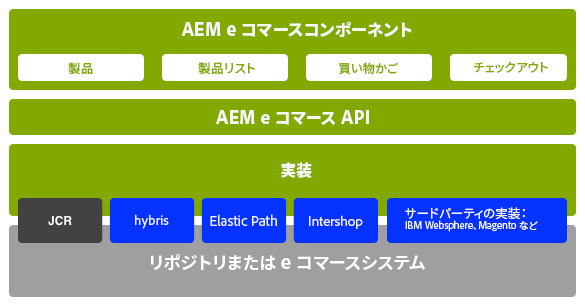
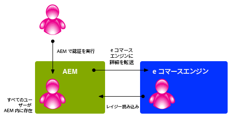

# 概念 {#concepts}

この統合フレームワークは、次のことを実行するメカニズムとコンポーネントを提供します。

* e コマースエンジンへの接続
* AEM へのデータの取り込み
* 取り込んだデータの表示と買い物客の反応の収集
* トランザクションの詳細の返送
* 両方のシステムのデータの検索

つまり、

* 買い物客は待たずに登録と買い物ができます。
* 価格の変更が遅延なく顧客に表示されます。
* 必要に応じて商品を追加できます。

>[!NOTE]
>
>e コマースフレームワークは、以下のものと併用できます。
>
>* [Magento](https://www.adobe.io/apis/experiencecloud/commerce-integration-framework/integrations.html#!AdobeDocs/commerce-cif-documentation/master/integrations/02-AEM-Magento.md)
>* [SAP Commerce Cloud](/help/sites-administering/sap-commerce-cloud.md)
>* [Salesforce Commerce Cloud](https://github.com/adobe/commerce-salesforce)

>

>[!CAUTION]
>
>[e コマース統合フレームワーク](https://www.adobe.com/solutions/web-experience-management/commerce.html)は AEM アドオンです。
>
>ご利用のエンジンに応じて、営業担当者が詳しくご説明します。

>[!CAUTION]
>
>このフレームワークは、独自プロジェクトの基本要件となります。
>
>フレームワークを実際の仕様に適合させるには、ある程度の開発作業が必要です。

>[!CAUTION]
>
>標準の AEM インストールには、汎用 AEM（JCR）e コマース実装が含まれています。
>
>現時点では、デモンストレーション目的またはユーザーの要件に応じたカスタム実装の基盤として使用されています。

操作を最適化するために、AEM と e コマースエンジンはそれぞれの専門分野に専念します。情報は、両者の間でリアルタイムに転送されます。次に例を示します。

* AEM がすること：

   * リクエスト:

      * e コマースエンジンからの商品情報。
   * 以下を指定します。

      * 商品情報、買い物かごおよびチェックアウトのユーザービュー。
      * e コマースエンジンへの買い物かごおよびチェックアウト情報。
      * 検索エンジンの最適化（SEO）。
      * コミュニティ機能。
      * 構造化されていないマーケティングインタラクション。

* e コマースエンジンがすること：

   * 以下を指定します。

      * データベースからの商品情報。
      * 製品バリアント管理。
      * 注文管理。
      * ERP（Enterprise Resource Planning）。
      * 商品情報内の検索。
   * 以下を処理します。

      * 買い物かご。
      * チェックアウト。
      * 注文の受け渡し。

>[!NOTE]
>
>詳細は、e コマースエンジンとプロジェクトの実装によって異なります。

統合レイヤーを使用するために、標準搭載のAEMコンポーネントが多数用意されています。 現在は次のものを使用できます。

* 商品情報
* 買い物かご
* チェックアウト
* マイアカウント

様々な検索オプションも使用できます。

## アーキテクチャ {#architecture}

統合フレームワークは、API、機能を説明する幅広いコンポーネント、接続方法の例を示すいくつかの拡張を提供します。

フレームワークを使用して、以下のような機能にアクセスできます。

### 実装 {#implementations}

AEM e コマースは、e コマースエンジンとともに実装されます。

* e コマース統合フレームワークは、e コマースエンジンを AEM と簡単に統合できるように構築されています。専用の e コマースエンジンが商品データ、買い物かご、チェックアウトおよび注文の受け渡しを制御し、AEM がデータの表示とマーケティングキャンペーンを制御します。

>[!NOTE]
>
>標準の AEM インストールには、汎用 AEM（JCR）e コマース実装が含まれています。
>
>現時点では、デモンストレーション目的またはユーザーの要件に応じたカスタム実装の基盤として使用されています。
>
>JCR をベースとする汎用的な開発によって AEM 内に実装される AEM e コマースは、
>
>* API の使用方法を説明するための、スタンドアロンの AEM ネイティブな e コマースのサンプルです。これにより、商品データ、ショッピングカート、チェックアウトと共に、既存のデータ表示とマーケティングキャンペーンを制御することができます。この場合、商品データは AEM にネイティブなリポジトリ（アドビの [JCR](https://docs.adobe.com/content/docs/en/spec/jcr/2.0/index.html) 実装）に保存されます。
>
>  
The standard AEM installation contains the basics of the [generic eCommerce implemention](/help/sites-administering/generic.md).

### コマースプロバイダー {#commerce-providers}

コマースエンジンから AEM e コマースサイトにデータを読み込む場合、コマースプロバイダーを利用してインポーターにデータを供給します。1 つのコマースプロバイダーが複数のインポーターをサポートできます。

コマースプロバイダーは、次のどちらかの目的でカスタマイズされた AEM コードです。

* バックエンドコマースエンジンとやり取りする
* JCR リポジトリ上にコマースシステムを実装する

現在、AEM では次の 2 つのサンプルコマースプロバイダーを利用できます。

* geometrixx-hybris 用
* geometrixx-generic（JCR）用

ただし、通常は、プロジェクトがその PIM と商品データスキーマに固有のカスタマイズされた独自コマースプロバイダーを作成する必要があります。

>[!NOTE]
>
>geometrixx インポーターは、CSV ファイルを使用します。実装の上のコメントに、受け入れられているスキーマ（と許可されているカスタムプロパティ）の説明があります。

[ProductServicesManager](https://helpx.adobe.com/experience-manager/6-5/sites/developing/using/reference-materials/javadoc/com/adobe/cq/commerce/pim/api/ProductServicesManager.html) は、（[OSGi](/help/sites-deploying/configuring.md#osgi-configuration-settings) を通じて）[ProductImporter](https://helpx.adobe.com/experience-manager/6-5/sites/developing/using/reference-materials/javadoc/com/adobe/cq/commerce/pim/api/ProductImporter.html) インターフェイスと [CatalogBlueprintImporter](https://helpx.adobe.com/experience-manager/6-5/sites/developing/using/reference-materials/javadoc/com/adobe/cq/commerce/pim/api/CatalogBlueprintImporter.html) インターフェイスの実装のリストを保守します。These are listed in the **Importer/Commerce Provider** dropdown field of the importer wizard (using the `commerceProvider` property as a name).

ドロップダウンの特定のインポーター／コマースプロバイダーを利用できる場合は、必要な追加データがあれば（インポータータイプに応じて）次のどちらかに定義する必要があります。

* `/apps/commerce/gui/content/catalogs/importblueprintswizard/importers`
* `/apps/commerce/gui/content/products/importproductswizard/importers`

該当する `importers` フォルダーの下のフォルダーは、インポーター名と一致している必要があります。次に例を示します。

* `.../importproductswizard/importers/geometrixx/.content.xml`

読み込み元ファイルの形式は、インポーターによって定義されます。または、インポーターが、WebDAVやhttpなどのコマースエンジンへの接続を確立します。

## 役割 {#roles}

統合されたシステムには、データを保守する以下の役割が用意されています。

* 次のものを保守する商品情報管理（PIM）ユーザー

   * 商品情報
   * 分類、カテゴリ化、承認。
   * デジタルアセット管理とのやり取り。
   * 価格 - 多くの場合は ERP システムから取得され、コマースシステムでは明示的に保持しません。

* 次のものを保守するオーサー／マーケティングマネージャー

   * すべてのチャネルのマーケティングコンテンツ。
   * プロモーション
   * 割引券
   * キャンペーン

* 次のことを実行するサーファー／買い物客

   * 商品情報を表示する。
   * アイテムを買い物かごに入れる。
   * 注文をチェックアウトする。
   * 注文の受け渡しを待つ。

実際の場所は実装によって異なりますが、汎用実装または e コマースエンジンを使用する場合の例を以下に示します。

## 製品 {#products}

### 製品 Data versus Marketing Data {#product-data-versus-marketing-data}

#### 構造的カテゴリとマーケティングカテゴリ {#structural-versus-marketing-categories}

次の 2 つのカテゴリを区別できる場合、意味のある構造（`cq:Page` ノードのツリー）を使用して URL を明確にできるので、従来の AEM コンテンツ管理に非常に近くなります。

* *構造*カテゴリ

   商品 *とは何かを定義するカテゴリツリー*; 例：

   `/products/mens/shoes/sneakers`

* *マーケティング* カテゴリ

   ある *製品が属する他のすべてのカテゴリ*; 例：

   `/special-offers/christmas/shoes`)

### 商品データ {#product-data}

商品を表し、管理するには、商品に関する幅広い情報を保持する必要があります。

商品データは、

* AEM（汎用）に直接保持できます。
* e コマースエンジンに保持して、AEM で利用できます。

   Depending on the data type it is [synchronized](#catalog-maintenance-data-synchronization) as necessary, or accessed directly; for example, highly volatile and critial data such as product prices are retrieved from the ecommerce engine on every page request to ensure they are always up-to-date.

どちらの場合でも、商品データが AEM に入力されるか読み込まれると、**製品**&#x200B;コンソールで表示できます。商品のカードビューとリストビューには、次のような情報が表示されます。

* 画像
* SKU コード
* 最終変更日時

### 製品バリアント {#product-variants}

商品によっては、バリアントに関する情報も保持できます。例えば、衣料品の場合は、販売されている様々なカラーをバリアントとして保持します。

### 商品属性 {#product-attributes}

各商品に関して保持される個々の属性は、使用する e コマースエンジンと AEM 実装によって異なる場合があります。属性は、商品ページを表示したり、商品情報を編集したりするときに（必要に応じて）利用でき、次のものを含めることができます。

* **画像**

   製品の画像。

* **タイトル**

   製品名。

* **説明**

   製品の説明。

* **タグ**

   関連製品をグループ化するために使用するタグ。

* **デフォルトのアセットカテゴリ**

   アセットの初期設定のカテゴリ。

* **ERP データ**

   エンタープライズ・リソース・プランニング(ERP)情報

   * **SKU**

      在庫管理ユニット(SKU)情報。

   * **カラー**
   * **サイズ**
   * **価格**

      製品の単価。

* **概要**

   製品の機能の概要です。

* **特長**

   製品の機能の詳細を説明します。

### 商品アセット {#product-assets}

個々の商品について、選択されたアセットを保持できます。一般的には、画像とビデオが含まれます。

## カタログ {#catalogs}

カタログは、管理および買い物客に対する表示を容易にするために、商品データをグループ化したものです。多くの場合、カタログは言語、地理的領域、ブランド、季節、趣味、スポーツなど多くの属性に従って構造化されています。

### カタログの構造 {#catalog-structure}

#### 複数言語のカタログ {#catalogs-in-multiple-languages}

AEM は、商品コンテンツを複数言語でサポートします。When requesting data, the integration framework retrieves the language from the current tree (for example, `en_US` for pages under `/content/geometrixx-outdoors/en_US`).

多言語ストアの場合、各言語ツリー用のカタログを個別に読み込む（または [MSM](/help/sites-administering/msm.md) を使用してコピーする）ことができます。

#### 複数ブランドのカタログ {#catalogs-for-multiple-brands}

言語と同様に、大規模な多国籍企業は、複数のブランドを提供しなければならないことがあります。

#### タグによるカタログ {#catalogs-by-tags}

複数の商品をカタログにまとめるために、タグも使用できます。タグは、季節的なオファーなど、より動的なカタログに使用できます。

### Catalog Setup (Initial Import) {#catalog-setup-initial-import}

実装に応じて、基本カタログに必要な商品データを次のものから AEM に読み込むことができます。

* CSV ファイル（汎用実装用）
* e コマースエンジン

### カタログのメンテナンス（データ同期） {#catalog-maintenance-data-synchronization}

商品データの変更は必ず発生します。

* 汎用実装の場合は、[製品エディター](/help/sites-administering/generic.md#editing-product-information)で商品データの変更を管理できます。
* [e コマースエンジンを使用している場合は、変更を同期する必要があります。](#data-synchronization-with-an-ecommerce-engine-ongoing)

#### Data Synchronization with an eCommerce Engine (Ongoing) {#data-synchronization-with-an-ecommerce-engine-ongoing}

初期読み込み後、商品データの変更は必ず発生します。

e コマースエンジンを使用している場合、商品データはその e コマースエンジンに保持され、AEM で使用できなければなりません。このような商品データは、更新されたときに同期が必要です。

同期は、データのタイプによって異なります。

* [変更内容のデータフィードとともに、定期的同期を使用します](/help/sites-developing/sap-commerce-cloud.md#product-synchronization-and-publishing)。

   これに加え、特定の更新を選択して高速更新をおこなうことができます。

* 価格情報などの非常に変動しやすいデータは、ページ要求のたびにコマースエンジンから取得して、常に最新であることを保証します。

### カタログ - パフォーマンスと拡張 {#catalogs-performance-and-scaling}

商品数が多い（通常は 100,000 以上）大規模なカタログを e コマースエンジン（PIM）から読み込むと、多数のノードによってシステムに影響を与えることがあります。商品にアセット（商品画像など）が関連付けられている場合は、オーサリングインスタンスが低速化する可能性もあります。これは、このようなアセットの後処理に CPU とメモリが集中することによるものです。

この問題を回避するために、様々な方法を選択できます。

* [バケッティング](#bucketing) - 多数のノードに対応する
* [アセットの後処理を専用インスタンスにオフロードする](#offload-asset-post-processing-to-a-dedicated-instance)
* [商品データのみを読み込む](#only-import-product-data)
* [読み込みのスロットリングとバッチ保存](#import-throttling-and-batch-saves)
* [パフォーマンステスト](#performance-testing)
* [パフォーマンス - その他](#performance-miscellaneous)

#### バケッティング {#bucketing}

JCR ノードの直下に多数の子ノード（1000 以上）がある場合は、パフォーマンスが影響を受けないようにするために、バケット（疑似フォルダー）が必要です。バケットは、読み込み時にアルゴリズムに従って生成されます。

これらのバケットは、カタログ構造に取り込まれた疑似フォルダーの形を取りますが、公開 URL に表示されないように設定できます。

#### アセットの後処理を専用インスタンスにオフロードする {#offload-asset-post-processing-to-a-dedicated-instance}

このシナリオでは、次の 2 つのオーサーインスタンスを設定します。

1. マスター作成者インスタンス

   PIMから製品データを読み込みます。このPIMでは、アセットパスの後処理が無効になります。

1. 専用のDAM作成者インスタンス

   PIMから製品アセットを読み込んで後処理し、それらをマスターオーサーインスタンスに複製して使用します。

#### 商品データのみを読み込む {#only-import-product-data}

商品に読み込むアセット（画像）が含まれない場合は、アセットの後処理に影響を受けることなく、商品データを読み込むことができます。

<!--delete
#### Import Throttling and Batch Saves {#import-throttling-and-batch-saves}

[Import throttling](/help/sites-deploying/scaling.md#import-throttling) and [batch saves](/help/sites-deploying/scaling.md#batch-saves) are two general [scaling](/help/sites-deploying/scaling.md) mechanisms that can help when importing large volumes of data.-->

#### パフォーマンステスト {#performance-testing}

AEM e コマース実装では、パフォーマンステストを考慮に入れる必要があります。

* 作成者環境:

   背景（例：読み込み）のアクティビティは、通常のユーザーアクティビティ（例：ページ編集）と同時に発生し、フロントエンドのパフォーマンスが高い優先度を与えられた場合でも、オンライン作成者が見た悪いパフォーマンスは、実行中の判断を妨げる不満を招きます。

* パブリケーション環境:

   レプリケーションは、コンテンツを迅速かつ確実に公開するための重要なプロセスです。 レプリケーションは、公開するコンテンツをオーサーがどのようにグループ化するかによって影響を受ける場合があります。

* フロントエンド:

   フロントエンドとキャッシュの無効化が混在している場合、パフォーマンスが異常になる可能性があります。 この問題はテストによって回避できます。

このようなパフォーマンステストには、ターゲットに関する次のような知識と分析が必要です。

* コンテンツのボリューム

   * Assets
   * ローカライズされ、インターナショナライズされた商品と SKU

* ユーザーアクティビティ：

   * 一括編集
   * 一括公開
   * 集中的な検索要求

* バックグラウンドプロセス

   * 読み込み
   * 同期の更新（価格など）

* メンテナンス要件（バックアップ、Tar PM の最適化、データストアのガベージコレクションなど）

#### パフォーマンス - その他 {#performance-miscellaneous}

すべての実装で、以下の点に留意してください。

* 商品、在庫管理単位およびカテゴリは膨大な数になることがあるので、できる限り少ないノード数でコンテンツをモデリングしてください。

   ノードが多くなればなるほど、コンテンツ（parsys など）は柔軟になります。しかし、何事もバランスです。（例えば）3 万もの商品を操作する場合に（デフォルトで）個々の柔軟性が必要でしょうか。

* できる限り重複を避ける（ローカライズを参照）か、ローカライズ時に重複によっていくつのノードが作成されるかを考えてください。
* クエリの最適化に備えて、コンテンツにはできる限りタグ付けしてください。

   次に例を示します。

   `/content/products/france/fr/shoe/reebok/pump/46 SKU`

   には、コンテンツレベルごとに1つのタグ(国、言語、カテゴリ、ブランド、製品など)が必要です。 検索

   `//element(*,my:Sku)[@country=’france’ and @language=’fr’`

   および

   `@category=’shoe’ and @brand=’reebok’ and @product=’pump’]`

   ～を探すよりも大幅に速くなる

   `/jcr:root/content/france/fr/shoe/reebok/pump/element(*,my:Sku)`

* ユーザーが蓄積している技術を利用し、コンテンツアクセスモデルおよびサービスを非常に細かく分解して計画します。これは一般的なベストプラクティスですが、最適化フェーズではより不可欠になります。頻繁に読み取られる（そしてバンドルのキャッシュをいっぱいにしたくない）データ用に、アプリケーションキャッシュを追加してください。

   例えば、属性管理は商品の読み込みによって更新されるデータに関係するので、しばしばキャッシュに適した候補となります。
* [プロキシページ](/help/sites-administering/concepts.md#proxy-pages)の使用を検討します。

### カタログセクションページ {#catalog-section-pages}

カタログセクションには、次のものが表示されます。

* カテゴリの紹介（画像やテキスト）。特別オファーを宣伝するバナーやティーザーにも使用できます。
* そのカテゴリの個々の商品へのリンク
* 他のカテゴリへのリンク

### 商品ページ {#product-pages}

商品ページには、個々の商品に関する包括的な情報が表示されます。e コマースエンジンに登録された価格の変更など、動的な更新も反映されます。

商品ページは、**コマース製品**&#x200B;テンプレート内などで&#x200B;**製品**&#x200B;コンポーネントを使用する AEM ページです。

製品コンポーネントには、次のものが表示されます。

* テキストや画像を含む、一般的な商品情報。
* 価格。通常は、ページが表示／更新されるたびに e コマースエンジンから取得されます。
* カラーやサイズなどの製品バリアント情報。

買い物客は、アイテムを買い物かごに追加する際に、この情報を使用して以下を選択できます。

* カラーとサイズのバリアント
* 数量

#### 商品のランディングページ {#product-landing-pages}

基盤となる商品ページへのリンクを含む紹介や概要など、主に静的な情報を表示する AEM ページです。

### 製品コンポーネント {#product-component}

**製品**&#x200B;コンポーネントは、必要なメタデータ（すなわち `cartPage` と `cartObject` へのパス）を提供する親ページを持つすべてのページに追加できます。これは、デモサイト Geometrixx Outdoors では `UserInfo.jsp` によって提供されています。

**製品**&#x200B;コンポーネントは、個々の要件に応じてカスタマイズすることもできます。

### プロキシページ {#proxy-pages}

プロキシページを使用してリポジトリの構造を単純化し、大規模カタログのストレージを最適化できます。

カタログの作成では、商品あたり 10 ノードを使用します。AEM 内で更新およびカスタマイズできる商品ごとに、個別のコンポーネントを提供するからです。このようにノード数が多いと、カタログに何百、何千もの商品が含まれる場合、問題が生じる場合があります。問題を回避するために、プロキシページを使用してカタログを作成できます。

Proxy pages use a two-node structure ( `cq:Page` and `jcr:content`) that does not contain any of the actual product content. リクエスト時に、製品データとテンプレートページを参照することで、コンテンツが生成されます。

ただし、デメリットもあります。AEM 内の商品情報をカスタマイズすることはできません。（サイト用に定義された）標準テンプレートが使用されます。

>[!NOTE]
>
>プロキシページを持たない大規模カタログを読み込んだ場合、問題は発生しません。
>
>いつでももう一方の手段に変更できます。カタログのサブセクションを変更することもできます。

## プロモーションと割引券 {#promotions-and-vouchers}

### 割引券 {#vouchers}

割引券は、買い物客に買い物をしてもらうためや顧客の忠誠度に見返りを与えるために割引を提供する、十分に試行された手法です。

* 割引券は、次のものを提供します。

   * 割引券コード（買い物客が買い物かごに入力する）。
   * 割引券ラベル（買い物客が買い物かごに入力した後に表示される）。
   * プロモーションパス（割引券によって適用されるアクションを定義する）。

* 外部コマースエンジンも割引券を提供できます。

AEM では、

* 割引券は、Web サイトコンソールを使用して作成／編集するページベースのコンポーネントです。
* **割引券**&#x200B;コンポーネントは、次のものを提供します。

   * 割引券管理用のレンダラー。買い物かごに現在入っている割引券があれば表示します。
   * 割引券を管理（追加／削除）するための編集ダイアログ（フォーム）。
   * 割引券を買い物かごに追加／買い物かごから削除するために必要なアクション。

* 割引券には独自の有効／無効日付／回数はありませんが、親キャンペーンのものを使用します。

>[!NOTE]
>
>AEM では&#x200B;**割引券**&#x200B;という用語を使用します。これは、**クーポン**&#x200B;という用語と同義です。

### プロモーション {#promotions}

プロモーションと割引券を併用すると、次のようなシナリオを実現できます。

* 企業がユーザーリストを手作業で作成して従業員にカスタム価格を提供する。
* 長期にわたる顧客がすべての注文に対する割引を受け取る。
* 明確に定義された期間、提供される販売価格。
* 前回の注文が一定の金額を上回っていた場合に顧客が割引券を受け取る。
* 商品 X ** を購入した顧客が商品 Y **（ペア商品）に対する割引をオファーされる。

プロモーションは、通常は商品情報マネージャーではなくマーケティングマネージャーが保守します。

* プロモーションは、Web サイトコンソールを使用して作成／編集されるページベースのコンポーネントです。``
* プロモーションは、次のものを提供します。

   * 優先度
   * プロモーションハンドラーパス

* プロモーションをキャンペーンに関連付けて、有効／無効日付／回数を定義できます。
* プロモーションをエクスペリエンスに関連付けて、セグメントを定義できます。
* エクスペリエンスに関連付けられていないプロモーションは、単独では呼び出されませんが、割引券によって呼び出せます。
* プロモーションコンポーネントには、次のものが含まれます。

   * プロモーション管理用のレンダラーとダイアログ
   * プロモーションハンドラー固有の設定パラメーターをレンダリングおよび編集するためのサブコンポーネント

AEM では、プロモーションは[キャンペーン管理](/help/sites-authoring/personalization.md)にも組み込まれます。

* [キャンペーン](/help/sites-authoring/personalization.md)によって有効／無効回数が指定されます。
* キャンペーン内の[エクスペリエンス](/help/sites-authoring/personalization.md)**&#x200B;を使用して、対応するオーディエンスセグメントに従ってアセット（ティーザーページ、プロモーションなど）をグループ化します。

プロモーションは、エクスペリエンス内またはキャンペーン内に直接保持できます。

* プロモーションをエクスペリエンス内に保持する場合は、プロモーションをオーディエンスセグメントに自動的に適用できます。

   例えば、geometrixx-outdoorsサンプルサイトでは、プロモーションは次のようになります。

   `/content/campaigns/geometrixx-outdoors/big-spender/ordervalueover100/free-shipping`

   がエクスペリエンス内にある場合、セグメント( `ordervalueover100`)が解決されるたびに自動的に実行されます。

* エクスペリエンス内に存在しない（キャンペーン内にのみ存在する）プロモーションの場合は、自動的にはオーディエンスに適用されません。ただし、買い物かごに伝票を入力し、その伝票がプロモーションを参照している場合は、これをクリックできます。

   例えば、次のようなプロモーションがあります。

   `/content/campaigns/geometrixx-outdoors/article/10-bucks-off`

   がエクスペリエンスの外にあるため、自動的には発生しません(例： セグメントに基づいて)。 ただし、これは受講券によって参照され、記事キャンペーン内の複数のエクスペリエンスで見つけることができます。 これらのバウチャーコードを買い物かごに入力すると、プロモーションが実行されます。

>[!NOTE]
>
>[hybris プロモーション](https://www.hybris.com/modules/promotion)と [hybris 割引券](https://www.hybris.com/en/modules/voucher)は、買い物かごに影響を及ぼし、価格に関連するすべてのものを対象とします。プロモーション固有のマーケティングコンテンツ（バナーなど）は、hybris プロモーションに含まれません。

## パーソナライゼーション {#personalization}

### 顧客の登録とアカウント {#customer-registration-and-accounts}

買い物客が登録したら、アカウントの詳細を AEM と e コマースエンジン間で同期する必要があります。機密データは個別に保持されますが、プロファイルは共有されます。

正確なメカニズムは、シナリオによって異なることがあります。

1. ユーザーアカウントがどちらのシステムにも存在する場合：

   1. アクションは必要ありません。

1. ユーザーアカウントが AEM にのみ存在する場合：

   1. ユーザーは、AEM に保存されているのと同じアカウント ID とランダムパスワードを使用して e コマースエンジンに作成されます。
   1. AEM は、最初の呼び出し（商品ページが要求され、価格を取得するために e コマースエンジンが参照される場合など）で e コマースエンジンにログインしようとするので、ランダムパスワードが必要です。これは AEM へのログイン後に発生するので、パスワードは使用できません。

1. ユーザーアカウントが e コマースエンジンにのみ存在する場合：

   1. アカウントは、同じアカウント ID とパスワードを使用して AEM に作成されます。

e コマースエンジンを使用している場合、AEM はアカウント ID とパスワード（オプションでユーザーグループ）だけを保存します。その他すべての情報は、e コマースエンジンに保存されます。

>[!NOTE]
>
>e コマースエンジンを使用している場合、AEM インスタンスにログインするユーザー用に作成されたアカウントが、そのエンジンとやり取りするその他すべての AEM インスタンスに（ワークフローを使用するなどして）レプリケートされていることを確認する必要があります。
>
>そうでない場合は、このような他の AEM インスタンスも、エンジン内に同じユーザーのアカウントを作成しようとします。このようなアクションは、エンジンから `DuplicateUidException` を受信して失敗します。

### 顧客のサインアップ {#customer-sign-up}

多くの場合、買い物客が買い物かごにアクセスするにはサインアップする必要があります。サインアップするには、顧客固有のアカウントを作成できるよう、登録（アカウントの作成）が必要です。

>[!NOTE]
>
>匿名の買い物かごとチェックアウトもサポートされています。

### 顧客のログイン {#customer-sign-in}

サインアップ後、買い物客はアクションを追跡したり、注文を受け渡したりできるように、アカウントを使用してログインできます。

### シングルサインオン {#single-sign-on}

シングルサインオン（SSO）の機能が導入されているので、作成者は AEM と e コマースシステムの両方で 2 回ログインせずに済みます。

### マイアカウント {#myaccount}

e コマースエンジンからのトランザクションデータは、買い物客に関する個人情報と結合されます。AEM は、このデータの一部をプロファイルデータとして使用します。AEM のフォームのアクションによって、情報が e コマースエンジンに書き戻されます。

アカウント情報を簡単に管理できるページがあります。 You can access it by clicking **My Account** at the top of a geometrixx page, or by navigating to `/content/geometrixx-outdoors/en/user/account.html`.

### アドレス帳 {#address-book}

サイトには、配達先、請求先および代替住所を含む、選択対象のアドレスを保存する必要があります。デフォルトのアドレス形式に基づくフォームを使用して実装することも、AEM が提供するアドレス帳コンポーネントを使用することもできます。

このアドレス帳コンポーネントでは、次のことが可能です。

* アドレス帳のアドレスを編集する
* 発送先住所としてアドレス帳からアドレスを選択する
* 請求先住所としてアドレス帳からアドレスを選択する

デフォルトとするアドレスを選択できます。

The address book component is reachable from the **My Account** page by clicking **Address Book** or by navigating to `/content/geometrixx-outdoors/en/user/account/address-book.html`.

「**新しいアドレスを追加...**」をクリックして、アドレス帳に新しいアドレスを追加できます。フォームが表示されたら、入力して「**アドレスを追加**」をクリックします。

>[!NOTE]
>
>アドレス帳には複数のアドレスを入力できます。

アドレス帳は、買い物かごのチェックアウト時に使用されます。

Addresses are persisted below `user_home/profile/addresses`.
例えば、Alison Parkerの場合、この名前は/home/users/geometrixx/aparker@geometrixx.info/プロファイル/addressesの下にあります。

デフォルトとするアドレスを選択できます。この情報は、アドレスと一緒にではなく、買い物客のプロファイルに保持されます。The profile property `address.default` is set with the path of the selected address for value.

### 顧客固有の価格 {#customer-specific-pricing}

e コマースエンジンは、コンテキスト（基本的には買い物客の情報）を使用して保持している価格を判断してから、正しい情報を AEM に返します。

## 買い物かごと注文 {#shopping-cart-and-orders}

買い物をするとき、買い物客は商品ページを参照して、アイテムを選択し、買い物かごに入れます。チェックアウトに進むと、注文できます。

### 匿名の買い物客 {#anonymous-shoppers}

匿名の顧客は、次のことが可能です。

* 商品を表示する
* 商品を買い物かごに追加する
* チェックアウトを実行して注文する

>[!NOTE]
>
>インスタンスの設定によっては、チェックアウト前にアドレス情報すなわち顧客の登録が必要な場合があります。

### 登録済みの買い物客 {#registered-shoppers}

登録済みの顧客は、次のことが可能です。

* アカウントにログインする
* 商品を表示する
* 商品を買い物かごに追加する
* チェックアウトを実行して注文する
* 以前の注文を表示および追跡する

### 買い物かごの中身の概要 {#shopping-cart-content-overview}

買い物かごには次のものがあります。

* 選択されたアイテムの概要
* 選択されたアイテムの商品ページへのリンク
* 次のことを実行する機能

   * 個々のアイテムの数／数量を更新する
   * 個々のアイテムを削除する

買い物かごは、使用しているエンジンに応じて次のように保存されます。

* AEM の汎用エンジンは、買い物かごを cookie に保存します。
* 特定の e コマースエンジンは、買い物かごをセッションに保存できます。

どちらの場合も、アイテムはログイン／ログアウトをまたがって（ただし同じコンピューター／ブラウザー上でのみ）買い物かごに残ります（そして復元できます）。次に例を示します。

* `anonymous` として閲覧し、商品を買い物かごに追加する
* sign in as `Allison Parker` - her cart is empty
* 商品を買い物かごに追加する
* ログアウト - 買い物かごには `anonymous` の商品が表示される

* sign in again as `Allison Parker` - her products are restored

>[!NOTE]
>
>anonymous の買い物かごは、同じコンピューター／ブラウザー上でのみ復元できます。

>[!NOTE]
>
>`admin` アカウントを使用して買い物かごの中身の復元をテストすることはお勧めしません。e コマースエンジン（hybris など）の `admin` アカウントと競合する可能性があるからです。

>[!NOTE]
>
>定義済みの時間が経過したら保留中の買い物かごを削除するように hybris を設定できます。

価格の変更が発生すると、チェックアウト前に（両方のシステムに）反映されます。

### 注文情報 {#order-information}

使用する実装に応じて、注文に関する情報は e コマースエンジンまたは AEM のどちらかに保持されます。この情報は、AEM によってレンダリングされます。

以下を含む、様々な情報が保存されます。

* **注文 ID**

   注文の参照番号。

* **注文日時**

   注文が行われた日付。

* **ステータス**

   注文のステータス 例えば、Shipped.

* **通貨**

   注文の通貨。

* **コンテンツ項目**

   注文された品目のリスト。

* **小計**

   注文された品目の総原価。

* **税**

   注文に対する納税額。

* **送料**

   送料。

* **合計**

   注文の合計値。 発注済品目、税金、および支払い

* **請求先住所**

   請求書の送信先住所。

* **支払いトークン**

   支払方法。

* **支払いステータス**

   支払のステータス。

* **発送先住所**

   商品の発送先の住所。

* **発送方法**

   発送方法 たとえば、陸、海、空など。

* **追跡番号**

   出荷会社が使用する任意の追跡番号。

* **追跡リンク**

   出荷時の注文の追跡に使用するリンク。

>[!NOTE]
>
>注文を作成ウィザードで使用されるフィールドは、タッチ操作向けの基礎モードがその場所に対して定義されているかどうかで決まります。一般的な例では、次の場所にあります。
>`/etc/scaffolding/geometrixx-outdoors/order/jcr:content/cq:dialog`

注文が AEM 内に保持されている場合、注文コンソールには注文ごとに次の内容が表示されます。

* 買い物かごの中のアイテム数
* 注文の合計金額
* 注文日時
* ステータス

### Order Tracking {#order-tracking}

注文後、多くの場合、買い物客は戻って以下を実行します。

* 注文のステータスを確認する
* 注文から商品を削除する
* 注文に商品を追加する

注文の配達を受け取った後、買い物客は一定期間におこなわれた注文の履歴を表示することもできます。

注文の受け渡しと追跡は、通常は e コマースエンジンによって管理されます。AEMでは注文履歴コンポーネントを使用して情報を表示できます。このコンポーネントには、適用された伝票やプロモーションなど、関連するすべての詳細が表示されます。 次に例を示します。

## チェックアウト {#checkout}

チェックアウトは、標準の AEM フォームを使用して実装されます。マーケティングマネージャーは、チェックアウトを使用して、マーケティングコンテンツでエクスペリエンスをカスタマイズできます。

その後、e コマースエンジンが AEM フォームからの入力を使用して、チェックアウトプロセスを管理します。

### 支払いのセキュリティ {#payment-security}

クレジットカード情報を含む支払いの詳細は、多くの場合、e コマースエンジンが管理します。AEM は、そのようなトランザクション情報をエンジンに転送します（情報はエンジンから支払い処理サービスに転送されます）。

PCI (Payment Card Industry)への準拠を達成できます。

### 注文の確認 {#confirmation-of-order}

注文は画面上で確認され、[注文の追跡](#order-tracking)によって追跡できます。

## 検索 {#search-features}

AEM は商品に標準のページを使用しているので、標準の検索コンポーネントを使用して検索ページを作成できます。

より完全な実装が必要な場合は、次のどちらかを実行できます。

* 必要な機能で、デフォルトの検索コンポーネントを拡張する。
* `CommerceService` に検索メソッドを実装し、検索ページで e コマース検索コンポーネントを使用する。

eコマースエンジンを使用する場合、eCommerce検索APIはeコマースエンジンソリューションに完全に実装できるので、すぐに使用できるeCommerce検索コンポーネントを使用できます。 ファセット検索を利用して、JCR やエンジンを検索できます。

