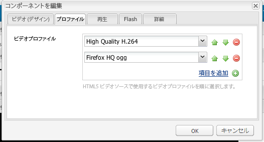

# ビデオコンポーネントの設定 {#configure-the-video-component}

[ビデオコンポーネント](/help/sites-authoring/default-components-foundation.md#video) を使用すると、あらかじめ定義されたOOTB(Out Of The Box)ビデオアセットをページに配置できます。

トランスコードを適切に行うために、管理者はFFmpegを個別にインストールします。 詳しくは、Fmpegの [インストールとAEMの設定を参照してください](#install-ffmpeg)。 Administrators also [Configure Video Profiles](#configure-video-profiles) for use with HTML5 elements.

## ビデオプロファイルの設定 {#configure-video-profiles}

HTML5要素を使用するには、ビデオプロファイルを定義します。 ここで選ばれたものは順番に使われる。 アクセスするには、 [デザインモード](/help/sites-authoring/default-components-designmode.md) （クラシックUIのみ）を使用し、「 **[!UICONTROL プロファイル]** 」タブを選択します。

From this dialog, you can also configure the design of the Video component and parameters for [!UICONTROL Playback], [!UICONTROL Flash], and [!UICONTROL Advanced].

## FFmpegのインストールとAEMの設定 {#install-ffmpeg}

ビデオコンポーネントは、ビデオのトランスコードにサードパーティのオープンソース製品Fmpegを使用します。 https://ffmpeg.org/ [からダウンロード](https://ffmpeg.org/)。 FFmpegのインストール後、特定のオーディオコーデックと特定のランタイムオプションを使用するようにAEMを設定します。

WindowsにFFmpegをインストールするに **は**、次の手順に従います。

1. Download the compiled binary as `ffmpeg.zip`.
1. フォルダーにアーカイブ解除します。
1. システム環境変数 `PATH` を&lt;*your-ffmpeg-location*>に設定します`\bin`。
1. AEM を再起動します。

Mac OS X **にFFmpegをインストールするには、次の手順に従います**。

1. Xcodeをインストールするには、developer.apple.com/xcode [を参照してください](https://developer.apple.com/xcode/)。
1. XQuartzにインストールし [て](https://www.xquartz.org) 、 [X11を取得します](https://support.apple.com/ja-jp/HT201341)。
1. www.macports.orgで入手可能なMacPortsをインストール [します](https://www.macports.org/)。
1. コンソールで「execute」 `sudo port install ffmpeg` コマンドを実行し、画面の指示に従います。 実行可能ファイルのパスがシステム変数に追加されているこ `FFmpeg` とを確認し `PATH` ます。

Mac OS X 10.6にFFmpegをインストールするには、 **プリコンパイル版を使用して**、次の手順に従います。

1. コンパイル済みバージョンをダウンロードします。
1. ディレクトリにアーカイブ解除し `/usr/local` ます。
1. コンソールでを実行し `sudo ln -s /usr/local/Cellar/ffmpeg/0.6/bin/ffmpeg /usr/bin/ffmpeg`ます。 必要に応じてパスを変更します。

To **configure AEM**, follow these steps:

>[!NOTE]
>
>これらの手順は、コーデックをさらにカスタマイズする必要がある場合にのみ必要です。

1. Web ブラウザーで [!UICONTROL CRXDE Lite] を開きます。http://localhost:4502/crx/deにアクセス [します](http://localhost:4502/crx/de)。
2. Select the `/libs/settings/dam/video/format_aac/jcr:content` node and ensure that the node properties are as follows:

   * `audioCodec` マウントされる `aac`.
   * `customArgs` マウントされる `-flags +loop -me_method umh -g 250 -qcomp 0.6 -qmin 10 -qmax 51 -qdiff 4 -bf 16 -b_strategy 1 -i_qfactor 0.71 -cmp chroma -subq 8 -me_range 16 -coder 1 -sc_threshold 40 -b-pyramid normal -wpredp 2 -mixed-refs 1 -8x8dct 1 -fast-pskip 1 -keyint_min 25 -refs 4 -trellis 1 -direct-pred 3 -partitions i8x8,i4x4,p8x8,b8x8`.

3. To customize the configuration, create an overlay in `/apps/settings/` node and move the same structure under `/conf/global/settings/` node. It cannot be edited in `/libs` node. 例えば、パスをオーバーレイするに `/libs/settings/dam/video/fullhd-bp`は、で作成し `/conf/global/settings/dam/video/fullhd-bp`ます。

   >[!NOTE]
   >
   >変更が必要なプロパティだけでなく、プロファイルノード全体をオーバーレイ／編集してください。そのようなリソースは SlingResourceMerger 経由で解決されません。

4. If you changed either of the properties, click **[!UICONTROL Save All.]**

>[!NOTE]
>
>デフォルトのOOTB(Out Of The Box)ワークフローモデルに対する変更は、AEMインスタンスをアップグレードする際に保持されません。 Adobeでは、変更したワークフローモデルを編集する前に、変更したワークフローモデルをコピーすることをお勧めします。 For example, copy the OOTB [!UICONTROL DAM Update Asset] model before editing the FFmpeg Transcoding step in the [!UICONTROL DAM Update Asset] model to pick video-profile names that existed before the upgrade. Then, you can overlay the `/apps` node to let AEM retrieve the custom changes to the OOTB model.
