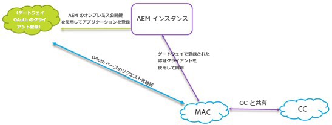
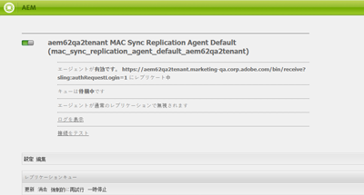

# Experience Cloud および Creative Cloud との AEM Assets 統合の設定 {#configure-aem-assets-integration-with-experience-cloud-and-creative-cloud}

Adobe Experience Cloud のお客様は、Adobe Experience Manager（AEM）Assets 内のアセットを Adobe Creative Cloud と同期できます。また、その逆も可能です。また、アセットを Experience Cloud に（またはその逆に）同期することもできます。Adobe I/O 経由でこの同期をセットアップできます。

この統合をセットアップするためのワークフローを以下に示します。

1. Adobe I/O で公開ゲートウェイを使用して認証を作成し、アプリケーション ID を取得します。
1. アプリケーション IDを使用して、AEM Assetsインスタンスにプロファイルを作成します。
1. この設定を使用して、AEM Assets 内のアセットを Creative Cloud と同期します。

バックエンドでは、AEM サーバーがゲートウェイを使用してプロファイルを認証し、AEM Assets と Experience Cloud 間でデータを同期します。

>[!CAUTION]
>
>AEM Assets で AEM／Creative Cloud フォルダー共有機能が廃止されました。Learn more and find replacements in [AEM and Creative Cloud Integration Best Practices](/help/assets/aem-cc-integration-best-practices.md).

AEM Assets と Creative Cloud の統合時のデータフロー

>[!NOTE]
>
>Adobe Experience Cloud と Adobe Creative Cloud でアセットを共有するには、AEM インスタンス上で管理者権限が必要です。

>[!CAUTION]
>
>Adobe Marketing CloudのブランドがAdobe Experience Cloudに変更されました。 以下の手順では、現在のインターフェイスを反映するため、Marketing Cloud がまだ使用されています。これらの使用は後日変更される予定です。

## アプリケーションの作成 {#create-an-application}

1. [https://legacy-oauth.cloud.adobe.io](https://legacy-oauth.cloud.adobe.io/) でログインして Adobe Developer ゲートウェイインターフェイスにアクセスします。

   >[!NOTE]
   >
   >アプリケーション ID を作成するには管理者権限が必要です。

1. From the left pane, navigate to **[!UICONTROL Developer Tools]** > **[!UICONTROL Applications]** to view a list of applications.
1. 「 **[!UICONTROL aem_assets_addcircle_icon]** 追加」をクリックしてアプリケーションを作成します  。
1. 「**[!UICONTROL クライアント資格情報]**」リストから「**[!UICONTROL サービスアカウント（JWT アサーション）]**」を選択します。これは、サーバー認証用のサーバー間通信サービスです。

   

1. アプリケーションの名前とオプションの説明を指定します。
1. 「**[!UICONTROL 組織]**」リストからアセットを同期する組織を選択します。
1. From the **[!UICONTROL Scope]** list, select **[!UICONTROL dam-read]**, **[!UICONTROL dam-sync]**, **[!UICONTROL dam-write]**, and **[!UICONTROL cc-share]**.
1. 「**[!UICONTROL 作成]**」をクリックします。アプリケーションが作成されたことを示すメッセージが表示されます。

   

1. 新規アプリケーションに対して生成された&#x200B;**[!UICONTROL アプリケーション ID]** をコピーします。

   >[!CAUTION]
   >
   >**[!UICONTROL アプリケーション ID]** ではなく&#x200B;**[!UICONTROL アプリケーションの秘密鍵]**&#x200B;を誤ってコピーしないようにしてください。

## Marketing Cloud への新しい設定の追加 {#add-a-new-configuration-to-marketing-cloud}

1. AEM Assets のローカルインスタンスの UI で AEM のロゴをクリックし、**[!UICONTROL ツール]**／**[!UICONTROL クラウドサービス]**／**[!UICONTROL 従来のクラウドサービス]**&#x200B;の順に移動します。

1. **[!UICONTROL Adobe Marketing Cloud]** サービスを見つけます。 If no configurations exist, click **[!UICONTROL Configure Now]**. If configurations exist, click **[!UICONTROL Show Configurations]** and click `+` to add a new configuration.

   >[!NOTE]
   >
   >組織の管理者権限を持つ Adobe ID アカウントを使用してください。

1. **[!UICONTROL 設定を作成]**&#x200B;ダイアログで、新しい設定のタイトルと名前を指定し、「**[!UICONTROL 作成]**」をクリックします。

   

1. 「**[!UICONTROL テナント URL]**」フィールドに、AEM Assets の URL を指定します。

   >[!CAUTION]
   >
   >リブランディングが原因で、テナントURLを入力した場合は、そ `https://<tenant_id>.marketing.adobe.com` のURLを「テナントURL」に変更する必要があ `https://<tenant_id>.experiencecloud.adobe.com.` るので、次の手順に従います。
   >
   >1. **ツール／クラウドサービス／従来のクラウドサービス**&#x200B;に移動します。
   1. Adobe Marketing Cloud の下にある「**設定を表示**」をクリックします。
   1. AEM-MAC-CC 同期のセットアップ中に作成された設定を選択します。
   1. Edit the cloudservice configuration and replace **marketing.adobe.com** in Tenant URL field to **experiencecloud.adobe.com**.
   1. 設定を保存します。
   1. MAC 同期レプリケーションエージェントをテストします。

1. 「**[!UICONTROL クライアント ID]**」フィールドに、[アプリケーションを作成する](/help/sites-administering/configure-assets-cc-integration.md#create-an-application)手順の最後でコピーしたアプリケーション ID を貼り付けます。

   

1. 「 **[!UICONTROL 同期]**」で「**[!UICONTROL 有効]**」を選択して同期を有効にし、「**[!UICONTROL OK]**」をクリックします。

   >[!NOTE]
   「**無効**」を選択した場合、同期は単一方向に機能します。

1. 設定ページから「**[!UICONTROL 公開鍵を表示]**」をクリックして、インスタンスに対して生成された公開鍵を表示します。Alternatively, click **[!UICONTROL Download Public Key for OAuth Gateway]** to download the file containing the public key. 次に、ファイルを開いて公開鍵を表示します。

## 同期の有効化 {#enable-synchronization}

1. Display the public key using one of the following methods mentioned in the last step of the procedure [Add a new configuration to Marketing Cloud](/help/sites-administering/configure-assets-cc-integration.md#add-a-new-configuration-to-marketing-cloud). 「**[!UICONTROL 公開鍵を表示]**」をクリックします。

   

1. 公開鍵をコピーして、[アプリケーションを作成する](/help/sites-administering/configure-assets-cc-integration.md#create-an-application)手順で作成したアプリケーションの設定インターフェイスの「**[!UICONTROL 公開鍵]**」フィールドに貼り付けます。

   

1. 「**[!UICONTROL 更新]**」をクリックします。アセットをAEM Assetsインスタンスと今すぐ同期します。

## 同期のテスト {#test-the-synchronization}

1. Click the AEM logo on the user interface of your local AEM Assets instance and navigate to **[!UICONTROL Tools]**> **[!UICONTROL Deployment]**> **[!UICONTROL Replication]**to locate the replication profiles created for synchronization.
1. On the **[!UICONTROL Replication]** page, click **[!UICONTROL Agents on author]**.
1. プロファイルのリストから、組織のデフォルトのレプリケーションプロファイルをクリックし、それを開きます。
1. ダイアログで、「**[!UICONTROL 接続をテスト]**」をクリックします。

   

1. レプリケーションのテストが完了したら、テスト結果の末尾の成功メッセージを確認します。

## Marketing Cloud へのユーザーの追加 {#add-users-to-marketing-cloud}

1. 管理者の資格情報を使用して Marketing Cloud にログインします。
1. From the rails, go to **[!UICONTROL Administration]** and then click/tap **[!UICONTROL Launch Enterprise Dashboard]**.
1. レールの「**[!UICONTROL ユーザー]**」をクリックして、**[!UICONTROL ユーザー管理]**&#x200B;ページを開きます。
1. ツールバーで、 **aem_assets_add_icon**をクリックまたはタップします。
1. Creative Cloud とアセットを共有できるようにするユーザーを 1 人以上追加します。

   >[!NOTE]
   Marketing Cloud に追加されたユーザーのみが、AEM Assets から Creative Cloud にアセットを共有できます。

## AEM Assets と Marketing Cloud 間でのアセットの交換 {#exchange-assets-between-aem-assets-and-marketing-cloud}

1. AEM Assets にログインします。
1. Assets コンソールで、フォルダーを作成し、いくつかのアセットをアップロードします。例えば、**mc-demo** というフォルダーを作成して、アセットをアップロードします。
1. Select the folder and click **Share** .
1. メニューから「**[!UICONTROL Adobe Marketing Cloud]**」を選択し、「**[!UICONTROL 共有]**」をクリックします。フォルダーが Marketing Cloud と共有されたことを示すメッセージが表示されます。

   

   >[!NOTE]
   `sling:OrderedFolder` タイプの Assets フォルダーの共有は、Adobe Marketing Cloud での共有の文脈ではサポートされません。フォルダーを共有したい場合は、AEM Assets でフォルダーを作成するときに「**[!UICONTROL 並べ替え]**」オプションを選択しないでください。

1. AEM Assetsユーザーインターフェイスを更新します。 ローカルフォルダーインスタンスのアセットコンソールで作成したAEM AssetsーがMarketing CloudUIにコピーされます。 AEM Assetsー内のフォルダーにアップロードしたアセットは、AEMMarketing Cloudーで処理された後、フォルダー内のフォルダーのコピーに表示されます。
1. Marketing Cloud 内にレプリケートされたフォルダーのコピーにアセットをアップロードすることもできます。処理された後、アセットは AEM Assets 内の共有フォルダーに表示されます。

## AEM Assets と Creative Cloud 間でのアセットの交換 {#exchange-assets-between-aem-assets-and-creative-cloud}

>[!CAUTION]
AEM／Creative Cloud フォルダー共有機能は廃止されました。Customers are strongly advised to use newer capabilities, like [Adobe Asset Link](https://helpx.adobe.com/jp/enterprise/using/adobe-asset-link.html) or [AEM desktop app](https://helpx.adobe.com/jp/experience-manager/desktop-app/aem-desktop-app.html). 詳しくは、[AEM と Creative Cloud の統合のベストプラクティス](/help/assets/aem-cc-integration-best-practices.md)を参照してください。

AEM Assets では、アセットを含むフォルダーを Adobe Creative Cloud のユーザーと共有できます。

1. アセットコンソールで、Creative Cloud と共有するフォルダーを選択します。
1. ツールバーで、「 **[!UICONTROL Share]** 」をクリックします。
1. From the list, select the **[!UICONTROL Adobe Creative Cloud]** option.

   >[!NOTE]
   これらのオプションは、ルートに対する読み取り権限を持つユーザーが使用できます。ユーザーは、Adobe Marketing Cloud のレプリケーションエージェント情報にアクセスするための権限を持っている必要があります。

1. In the **[!UICONTROL Creative Cloud Sharing]** page, add the user to share the folder with and choose a role for the user. Click **[!UICONTROL Save]** and click **[!UICONTROL OK]**.

1. フォルダーを共有したユーザーの資格情報を使用して Creative Cloud にログオンします。Creative Cloud で共有フォルダーを利用できます。

AEM Assets と Marketing Cloud 間の同期は、アセットのアップロード元のユーザーのマシンのインスタンスがアセットを変更する権限を保持するように設計されています。これらの変更のみが他のインスタンスに反映されます。

例えば、アセットが AEM Assets の（オンプレミス）インスタンスからアップロードされている場合、このインスタンスのアセットに対する変更は Marketing Cloud のインスタンスに反映されます。ただし、Marketing Cloudインスタンスから同じアセットに対して行われた変更はAEMインスタンスに反映されず、Marketing Cloudからアップロードされたアセットの場合はインスタンスに反映されません。

>[!MORELIKETHIS]
* [AEM と Creative Cloud の統合のベストプラクティス](/help/assets/aem-cc-integration-best-practices.md)
* [AEM／CC フォルダー共有のベストプラクティス](/help/assets/aem-cc-folder-sharing-best-practices.md)

