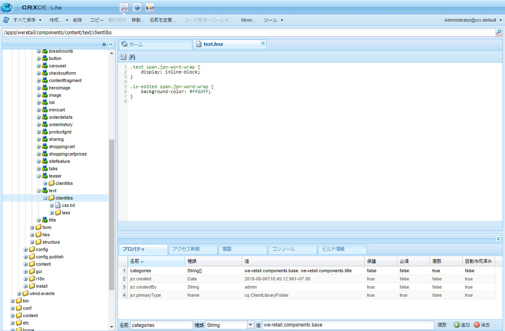
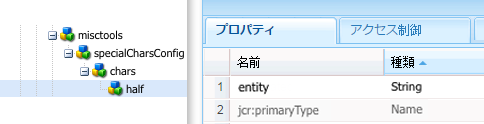
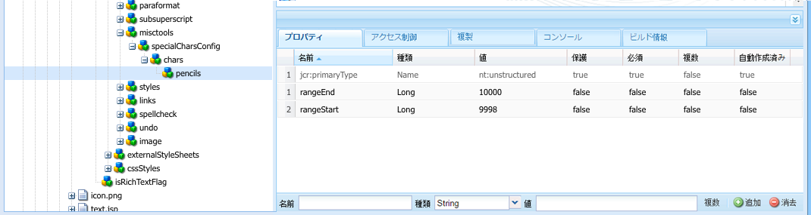
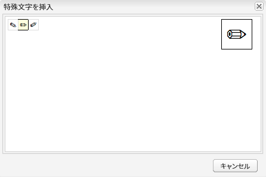

# リッチテキストエディタープラグインの設定 {#configure-the-rich-text-editor-plug-ins}

リッチテキストエディター（RTE）の各機能は一連のプラグインから使用でき、それぞれに features プロパティがあります。features プロパティを設定して、1 つ以上の RTE 機能を有効または無効にできます。 この記事では、RTE プラグインの特殊な設定方法について説明します。

他の RTE 設定について詳しくは、[リッチテキストエディターの設定](/help/sites-administering/rich-text-editor.md)を参照してください。

>[!NOTE]
>
>CRXDE Lite を使用する場合は、「[!UICONTROL すべて保存]」オプションを使用して、変更を定期的に保存することをお勧めします。

## プラグインのアクティベートと features プロパティの設定 {#activateplugin}

プラグインをアクティブにするには、次の手順に従います。 対応するノードは存在しないので、一部の手順は、プラグインを初めて設定する場合にのみ必要です。

デフォルトでは、`format`、`link`、`list`、`justify`、`control` プラグインとそのすべての機能が RTE で有効になっています。

>[!NOTE]
>
>この記事では、重複を避けるために、それぞれの `rtePlugins` ノードを `<rtePlugins-node>` と表記しています。

1. CRXDE Lite を使用して、プロジェクトのテキストコンポーネントを見つけます。
1. RTE プラグインを設定する前に、`<rtePlugins-node>` の親ノードを作成します（親ノードがない場合）。

   * 親ノード（コンポーネントに応じる）：

      * `config: .../text/cq:editConfig/cq:inplaceEditing/config`
      * 代替の設定ノード：`.../text/cq:editConfig/cq:inplaceEditing/inplaceEditingTextConfig`
      * `text: .../text/dialog/items/tab1/items/text`

   * 型：**jcr:primaryType** `cq:Widget`
   * どちらも次のプロパティを持ちます。

      * **名前** `name`
      * **型** `String`
      * **値** `./text`

1. 設定するインターフェイスに応じて、ノードを作成します。 `<rtePlugins-node>`（存在しない場合）

   * **名前** `rtePlugins`
   * **型** `nt:unstructured`

1. この下に、アクティベートする各プラグインのノードを作成します。

   * **型** `nt:unstructured`
   * **名前** 必要なプラグインのプラグイン ID

プラグインをアクティベートしたら、次のガイドラインに従って `features` プロパティを設定します。

| | すべての機能を有効化 | 一部の特定の機能を有効化 | すべての機能を無効化 |
|---|---|---|---|
| 名前 | features | features | features |
| 型 | String | String（複数文字列。CRXDE Lite で型を String に設定し、「複数」をクリック）[] | String |
| 値 | `*`（アスタリスク） | 1 つまたは複数の機能値を設定 | - |

## findreplace プラグインの理解 {#findreplace}

`findreplace` プラグインには設定は必要ありません。すぐに使用できます。

置換機能を使用する場合は、検索文字列と同時に置換後の文字列も入力する必要があります。ただし、置換する前に「検索」をクリックして文字列を検索することはできます。「検索」をクリックした後に置換後の文字列を入力すると、検索がリセットされ、テキストの先頭から再開されます。

検索と置換ダイアログは、「検索」をクリックすると透明になり、「置換」をクリックすると不透明になります。これにより、作成者は、置き換えられたテキストを確認できます。 「すべてを置換」をクリックすると、ダイアログボックスが閉じ、実行された置換の回数が表示されます。

## 貼り付けモードの設定 {#paste-modes}

RTE を使用している場合、作成者は次の 3 つのモードのいずれかにコンテンツを貼り付けることができます。

* **ブラウザーモード**：ブラウザーのデフォルトの貼り付け実装を使用して、テキストを貼り付けます。 この方法は推奨されません。不要なマークアップが追加されることがあります。

* **プレーンテキストモード**：クリップボードの内容をプレーンテキストとして貼り付けます。この方法では、クリップボードの内容を [!DNL Experience Manager] コンポーネントに挿入する前に、そのスタイル要素と書式設定要素がすべて削除されます。

* **MS® Word モード**:MS® Word からテキスト（テーブルを含む）を書式付きでコピーして貼り付けます。 Web ページや MS® Excel など、別のソースからのテキストのコピー&amp;ペーストはサポートされておらず、一部の書式のみが保持されます。

### RTE ツールバーで使用可能な貼り付けオプションの設定  {#configure-paste-options-available-on-the-rte-toolbar}

これらの 3 つのアイコンのいくつか、またはすべてを RTE ツールバーに表示できます（どのアイコンも表示しないという選択も可能です）。

* **[!UICONTROL 貼り付け（Ctrl + V）]**：事前設定によって、3 つの貼り付けモードのいずれかに対応付けることができます。

* **[!UICONTROL テキストとして貼り付け]**：プレーンテキストモード機能を提供します。

* **[!UICONTROL Word から貼り付け]**:MS® Word モード機能を提供します。

必須アイコンを表示するように RTE を設定するには、以下の手順に従います。

1. 例えば、`/apps/<myProject>/components/text` コンポーネントに移動します。
1. `rtePlugins/edit` ノードに移動します。このノードが存在しない場合は、[プラグインのアクティベート](#activateplugin)を参照してください。
1. `features` ノードの `edit` プロパティを作成し、1 つ以上の機能を追加します。すべての変更を保存します。

### 貼り付け（Ctrl + V）アイコンとショートカットの動作の設定 {#configure-the-behavior-of-the-paste-ctrl-v-icon-and-shortcut}

次の項目の動作を事前に設定できます。 **[!UICONTROL 貼り付け (Ctrl+V)]** アイコンを使用します。 この設定では、作成者がコンテンツの貼り付けに使用するキーボードショートカット Ctrl + V の動作も定義します。

この設定では、次の 3 種類のユースケースを使用できます。

* ブラウザーのデフォルトの貼り付け実装を使用して、テキストを貼り付けます。 この方法は推奨されません。不要なマークアップが追加されることがあります。下の `browser` を使用して設定します。

* クリップボードの内容をプレーンテキスト形式で貼り付けます。この方法では、クリップボードの内容を AEM コンポーネントに挿入する前に、そのスタイル要素と書式設定要素がすべて削除されます。下の `plaintext` を使用して設定します。

* MS® Word からテキスト（テーブルを含む）を書式付きでコピーして貼り付けます。 Web ページや MS® Excel など、別のソースからのテキストのコピー&amp;ペーストはサポートされておらず、一部の書式のみが保持されます。 下の `wordhtml` を使用して設定します。

1. コンポーネント内で、`<rtePlugins-node>/edit` ノードに移動します。ノードが存在しない場合は作成します。 詳しくは、[プラグインのアクティベート](#activateplugin)を参照してください。
1. Adobe Analytics の `edit` ノードで、次の詳細情報を使用してプロパティを作成します。

   * **名前** `defaultPasteMode`
   * **型** `String`
   * **値** `browser`、`plaintext`、`wordhtml` のいずれかの必須の貼り付けモード。

### コンテンツの貼り付け時に使用可能な書式の設定 {#pasteformats}

Microsoftとして貼り付け (`paste-wordhtml`) モードをさらに詳細に設定し、Microsoft® Word など別のプログラムからAEMに貼り付けるときに使用可能なスタイルを明示的に定義することができます。

例えば、AEM に貼り付ける際に太字書式とリストのみを許可する場合は、他の書式を除外できます。これは、設定可能な貼り付けフィルタリングと呼ばれ、次の両方に対して実行できます。

* [テキスト](#paste-modes)
* [リンク](#linkstyles)

リンクに関しては、自動的に承認されるプロトコルも定義できます。

別のプログラムから AEM にテキストを貼り付けるときに使用可能な書式を設定するには、次のようにします。

1. コンポーネント内で、ノード `<rtePlugins-node>/edit` に移動します。ノードが存在しない場合は作成します。 詳しくは、[プラグインのアクティベート](#activateplugin)を参照してください。
1. の下にノードを作成します。 `edit` ノードに貼り付けるルールを保持できるようにするHTML:

   * **名前** `htmlPasteRules`
   * **型** `nt:unstructured`

1. の下にノードを作成します。 `htmlPasteRules`を使用して、使用可能な基本書式の詳細を保持できます。

   * **名前** `allowBasics`
   * **型** `nt:unstructured`

1. 受け入れられる個々の書式を制御するには、以下のうち 1 つまたは複数のプロパティを `allowBasics` ノードで作成します。

   * **名前** `bold`
   * **名前** `italic`
   * **名前** `underline`
   * **名前** `anchor`（リンクと名前付きアンカーの両方に対応）
   * **名前** `image`

   プロパティの&#x200B;**型**&#x200B;はすべて `Boolean` なので、該当する&#x200B;**値**&#x200B;では、チェックマークを付けるか外すことで、機能を有効または無効にできます。

   >[!NOTE]
   >
   >明示的に定義されていない場合は、デフォルト値である true が使用され、書式が承認されます。

1. その他の書式も、他の一連のプロパティやノードを使用して定義でき、`htmlPasteRules` ノードに適用できます。すべての変更を保存します。

`htmlPasteRules` には次のプロパティを使用できます。

| プロパティ | 型 | 説明 |
|---|---|---|
| `allowBlockTags` | String | 使用可能なブロックタグのリストを定義します。ブロックタグの例を次に示します。 <ul> <li>ヘッドライン (h1、h2、h3)</li> <li>段落 (p)</li> <li>リスト (ol、ul)</li> <li>テーブル（表）</li> </ul> |
| `fallbackBlockTag` | 文字列 | `allowBlockTags` に含まれていないブロックタグを含むブロックに使用されるブロックタグを定義します。`p` 通常はで十分です。 |
| table | nt:unstructured | テーブルを貼り付けるときの動作を定義します。このノードには、テーブルの貼り付けを許可するかどうかを定義するプロパティ `allow`（型は Boolean）が必要です。allow を `false` に設定した場合、 プロパティ `ignoreMode`（文字列型）を指定して、貼り付けたテーブルコンテンツの処理方法を定義する必要があります。`ignoreMode` の有効な値は次のとおりです。 <ul> <li>`remove`：テーブルコンテンツを削除します。</li> <li>`paragraph`：テーブルのセルを段落に変換します。</li> </ul> |
| list | nt:unstructured | リストを貼り付けるときの動作を定義します。リストの貼り付けを許可するかどうかを定義するプロパティ `allow`（Boolean 型）が必要です。`allow` を `false` に設定した場合、`ignoreMode` プロパティ（文字列型）を指定して、貼り付けたリストコンテンツの処理方法を定義する必要があります。`ignoreMode` の有効な値は次の通りです。 <ul><li> `remove`：リストコンテンツを削除します。</li> <li>`paragraph`：リストの項目を段落に変換します。</li> </ul> |

有効な `htmlPasteRules` 構造の例を以下に示します。

```xml
"htmlPasteRules": {
    "allowBasics": {
        "italic": true,
        "link": true
    },
    "allowBlockTags": [
        "p", "h1", "h2", "h3"
    ],
    "list": {
        "allow": false,
        "ignoreMode": "paragraph"
    },
    "table": {
        "allow": true,
        "ignoreMode": "paragraph"
    }
}
```

## テキストスタイルの設定 {#textstyles}

作成者は、スタイルを適用して、テキストの一部の外観を変更できます。 スタイルは、CSS スタイルシートで事前に定義した CSS クラスに基づいています。 スタイル設定したコンテンツは、CSS クラスを参照する `span` 属性を使用して `class` タグで囲まれます。例：`<span class=monospaced>Monospaced Text Here</span>`。

スタイルプラグインが初めて有効になった場合、デフォルトのスタイルは使用できません。 ポップアップリストが空です。 作成者にスタイルを指定するには、以下の手順を実行します。

* 「スタイル」ドロップダウンセレクターを有効にします。
* スタイルシートの場所を指定します。
* 「スタイル」ドロップダウンリストから選択可能な個々のスタイルを指定します。

スタイルを追加するなど、後で設定する場合は、新しいスタイルシートの参照と追加するスタイルの指定だけを行ってください。

>[!NOTE]
>
>スタイルは、[テーブルまたはテーブルのセル](/help/sites-administering/configure-rich-text-editor-plug-ins.md#tablestyles)に対して定義できます。これらの設定には別の手順が必要です。

### 「スタイル」ドロップダウンセレクターリストの有効化 {#styleselectorlist}

これは、スタイルプラグインを有効にすることでおこなわれます。

1. コンポーネント内で、ノード `<rtePlugins-node>/styles` に移動します。ノードが存在しない場合は作成します。 詳しくは、[プラグインのアクティベート](#activateplugin)を参照してください。
1. `features` ノードで `styles` プロパティを作成します。

   * **名前** `features`
   * **型** `String`
   * **値** `*`（アスタリスク）

1. すべての変更を保存します。

>[!NOTE]
>
>スタイルプラグインが有効になると、編集ダイアログに「スタイル」ドロップダウンリストが表示されます。ただし、スタイルが設定されていないので、リストは空です。

### スタイルシートの場所の指定 {#locationofstylesheet}

次に、参照するスタイルシートの場所を指定します。

1. テキストコンポーネントのルートノードに移動します（例：`/apps/<myProject>/components/text`）。
1. `externalStyleSheets` の親ノードに、`<rtePlugins-node>` プロパティを追加します。

   * **名前** `externalStyleSheets`
   * **型** `String[]`（複数文字列。CRXDE で「**複数**」をクリック）
   * **値** 含めるすべてのスタイルシートのパスとファイル名。 リポジトリーパスを使用します。

   >[!NOTE]
   >
   >参照先のスタイルシートは後から追加できます。

1. すべての変更を保存します。

>[!NOTE]
>
>ダイアログ（クラシック UI）で RTE を使用する場合、リッチテキスト編集用に最適化されたスタイルシートを指定する必要が生じる場合があります。 技術的な制限により、CSS コンテキストはエディターに失われるので、このコンテキストをエミュレートして WYSIWYG 環境を改善する必要が生じる場合があります。
>
>リッチテキストエディターでは、`CQrte` という ID を持つコンテナ DOM 要素を使用します。これを使用して、表示や編集用に様々なスタイルを提供できます。
>
>`#CQ td {`
>` // defines the style for viewing }`
>
>`#CQrte td {`
>` // defines the style for editing }`

### ポップアップリストで使用可能なスタイルの指定 {#stylesindropdown}

1. コンポーネント定義内で、「[スタイル](#styleselectorlist)」ドロップダウンセレクターの有効化で作成したように、ノード `<rtePlugins-node>/styles` に移動します。
1. `styles` ノードの下に、選択可能にするリストを格納するノード（同じく `styles` という名前）を作成します。

   * **名前** `styles`
   * **型** `cq:WidgetCollection`

1. の下にノードを作成します。 `styles` ノードを使用して、個々のスタイルを表すことができます。

   * **名前** 実際のスタイルに適した名前を指定可能
   * **型** `nt:unstructured`

1. プロパティを追加します。 `cssName` をこのノードに追加して、CSS クラスを参照できるようにします。

   * **名前** `cssName`
   * **型** `String`
   * **値** CSS クラスの名前（先頭に「.」を付けない。例、`.cssClass` ではなく `cssClass`）

1. `text` プロパティを同じノードに追加します。これは、選択ボックスに表示されるテキストを定義します。

   * **名前** `text`
   * **型** `String`
   * **値** スタイルの説明。「スタイル」ドロップダウン選択ボックスに表示されます。

1. 変更内容を保存します。

   必要なスタイルごとに、上記の手順を繰り返します。

### 日本語での最適な単語分割のための RTE の設定 {#jpwordwrap}

AEMを使用して日本語コンテンツを作成する作成者は、改行が不要な場合に改行を避けるスタイルを文字に適用できます。 これにより、作成者は文を目的の位置で区切ることができます。 この機能のスタイルは、CSS スタイルシートで事前に定義されている CSS クラスに基づいています。

>[!NOTE]
>
>この機能には、少なくともAEM 6.5 Service Pack 1 が必要です。

作成者が日本語のテキストに適用できるスタイルを作成するには、次の手順に従います。

1. スタイルノードの下にノードを作成します。詳しくは、 [新しいスタイルを指定する](#stylesindropdown).
   * 名前：`jpn-word-wrap`
   * 型：`nt:unstructure`

1. プロパティを追加します。 `cssName` をノードに追加して、CSS クラスを参照できるようにします。 このクラス名は日本語のワードラップ機能のための予約名です。
   * 名前：`cssName`
   * 型：`String`
   * 値：`jpn-word-wrap`（先行の `.` なし）

1. プロパティテキストを同じノードに追加します。 値は、作成者がスタイルを選択する際に表示されるスタイルの名前です。
   * 名前： `text`
*タイプ： `String`
   * 値：`Japanese word-wrap`

1. スタイルシートを作成してそのパスを指定します。詳しくは、 [スタイルシートの場所を指定](#locationofstylesheet). 次の内容をスタイルシートに追加します。 必要に応じて背景色を変更してください。

   ```css
   .text span.jpn-word-wrap {
       display:inline-block;
   }
   .is-edited span.jpn-word-wrap {
       background-color: #ffddff;
   }
   ```

   

## 段落書式の設定 {#paraformats}

RTE で作成したテキストは、ブロックタグ（デフォルトでは `<p>` タグ）内に配置されます。`paraformat` プラグインを有効にすることで、ドロップダウン選択リストを使用して、段落に割り当てることができる追加のブロックタグを指定します。段落書式は、正しいブロックタグを割り当てることで、段落タイプを決定します。 作成者は、形式セレクターを使用して、選択したり割り当てたりできます。 ブロックタグの例としては、標準の段落があります &lt;p> および見出し &lt;h1>, &lt;h2>など。

>[!CAUTION]
>
>このプラグインは、リストやテーブルなどの複雑な構造を持つコンテンツには適していません。

>[!NOTE]
>
>ブロックタグの場合 ( 例： &lt;hr> タグを段落に割り当てることはできません。paraformat プラグインの有効なユースケースではありません。

段落書式プラグインを初めて有効にした場合、デフォルトの段落書式は使用できません。 ポップアップリストが空です。 段落書式を作成者に提供するには、次の手順を実行します。

* 「フォーマット」ドロップダウンセレクターリストを有効化します。
* ドロップダウンから段落書式として選択できるブロックタグを指定します。

形式を追加するなど、後で設定または再設定する場合は、関連する手順にのみ従います。

### 形式ドロップダウンセレクターの有効化 {#formatselectorlist}

まず、paraformat プラグインを有効にします。

1. コンポーネント内で、ノード `<rtePlugins-node>/paraformat` に移動します。ノードが存在しない場合は作成します。 詳しくは、[プラグインのアクティベート](#activateplugin)を参照してください。
1. `features` ノードで `paraformat` プロパティを作成します。

   * **名前** `features`
   * **型** `String`
   * **値**`*`（アスタリスク）

>[!NOTE]
>
プラグインをこれ以上設定しない場合は、次のデフォルトの書式が有効になります。
>
* 段落（`<p>`）
* 見出し 1（`<h1>`）
* 見出し 2（`<h2>`）
* 見出し 3（`<h3>`）
>

>[!CAUTION]
>
RTE の段落書式を設定する際に、段落タグを削除しないでください。 &lt;p> を書式設定オプションとして使用します。 次の場合、 `<p>` タグが削除された場合、コンテンツ作成者は **段落書式** オプションを使用できます。

### 使用可能な段落書式の指定 {#paraformatsindropdown}

段落書式を選択可能にするには、次の手順を実行します。

1. コンポーネント定義内で、[「フォーマット」ドロップダウンセレクターの有効化](#styleselectorlist)で作成したように、`<rtePlugins-node>/paraformat` ノードに移動します。
1. の下 `paraformat` ノードで、書式のリストを格納するノードを作成します。

   * **名前** `formats`
   * **型** `cq:WidgetCollection`

1. `formats` ノードの下に、個別の書式の詳細を格納するノードを作成します。

   * **名前** 実際の書式に適した名前（myparagraph、myheading1 など）を指定可能です。
   * **型** `nt:unstructured`

1. このノードに、使用するブロックタグを定義するプロパティを追加します。

   * **名前** `tag`
   * **型** `String`
   * **値** 形式のブロックタグ。例：p、h1、h2。

     区切りの山括弧を入力する必要はありません。

1. 同じノードに、説明テキストをドロップダウンリストに表示するための別のプロパティを追加します。

   * **名前** `description`
   * **型** `String`
   * **値** この書式の説明テキスト（「段落」、「見出し 1」、「見出し 2」など）。 このテキストは「形式」選択リストに表示されます。

1. 変更内容を保存します。

   必要な各形式に対して、手順を繰り返します。

>[!CAUTION]
>
カスタム書式を定義すると、デフォルトの書式（`<p>`、`<h1>`、`<h2>`、`<h3>`）は削除されます。`<p>` 書式はデフォルトの書式なので再作成してください。

## 特殊文字の設定 {#spchar}

標準的な AEM インストール環境では、`misctools` プラグインで特殊文字（`specialchars`）を有効にすると、デフォルトの選択肢が直ちに使用可能になります。例えば、著作権や商標の記号などです。

個別の文字またはシーケンス全体を定義することにより、独自で選択した文字が使用可能になるように RTE を設定できます。

>[!CAUTION]
>
独自の特殊文字を追加すると、デフォルトの選択が上書きされます。 必要に応じて、選択した文字を定義または再定義します。

### 単一文字の定義 {#definesinglechar}

1. コンポーネント内で、ノード `<rtePlugins-node>/misctools` に移動します。ノードが存在しない場合は作成します。 詳しくは、[プラグインのアクティベート](#activateplugin)を参照してください。
1. `features` ノードで `misctools` プロパティを作成します。

   * **名前** `features`
   * **型** `String[]`
   * **値** `specialchars`

         （このプラグインに関してすべての機能を適用する場合は `String / *`）

1. の下 `misctools`に設定し、特殊文字の設定を格納するノードを作成します。

   * **名前** `specialCharsConfig`
   * **型** `nt:unstructured`

1. の下 `specialCharsConfig`を作成し、文字のリストを格納する別のノードを作成します。

   * **名前** `chars`
   * **型** `nt:unstructured`

1. の下 `chars`をクリックし、個々の文字定義を格納するノードを追加します。

   * **名前** 文字を反映する名前（half など）を指定可能
   * **型** `nt:unstructured`

1. このノードに、次のプロパティを追加します。

   * **名前** `entity`
   * **型** `String`
   * **値** 必要な文字の HTML 表現。分数 2 分の 1 を表す場合は `&189;` など。

1. 変更内容を保存します。

CRXDE でプロパティを保存すると、HTML 表現された文字が表示されます。半分の例を以下に示します。 上記の手順を繰り返して、作成者がより多くの特殊文字を使用できるようにします。



### 文字範囲の定義 {#definerangechar}

1. から手順 1 ～ 3 を使用します。 [単一文字の定義](#definesinglechar).
1. の下 `chars`に、文字範囲の定義を格納するノードを追加します。

   * **名前** 文字範囲を反映する名前（pencils など）を指定可能
   * **型** `nt:unstructured`

1. このノード（特殊文字の範囲に従って命名）の下に、次の 2 つのプロパティを追加します。

   * **名前** `rangeStart`
     **型** `Long`
     **値** 範囲内の最初の文字の [Unicode](https://unicode.org/) 表現（10 進数）

   * **名前** `rangeEnd`
     **型** `Long`
     **値** 範囲内の最後の文字の [Unicode](https://unicode.org/) 表現（10 進数）

1. 変更内容を保存します。

   例えば、9998～10000の範囲を定義すると、次の文字が表示されます。

   

   *図：CRXDE で、RTE で使用可能な文字の範囲を定義します。*

   

## テーブルスタイルの設定 {#tablestyles}

スタイルは通常、テキストに適用されますが、別のスタイルセットも、テーブルまたはテーブルのセルに適用できます。 このようなスタイルは、セルのプロパティダイアログまたはテーブルのプロパティダイアログの「スタイルセレクター」ボックスから作成者が使用できます。 スタイルは、標準のテーブルコンポーネントではなく、テキストコンポーネント（または派生コンポーネント）内のテーブルを編集するときに使用できます。

>[!NOTE]
>
クラシック UI のテーブルおよびセルのスタイルを定義できるのは、クラシック UI のみです。

>[!NOTE]
>
RTE コンポーネント内または RTE コンポーネントからのテーブルのコピー&amp;ペーストは、ブラウザーによって異なります。 すべてのブラウザーで、標準ではサポートされていません。 テーブルの構造とブラウザーに応じて、様々な結果が得られる場合があります。 例えば、クラシック UI とタッチ UI の Mozilla Firefox で、RTE コンポーネント内でテーブルをコピーして貼り付けた場合、テーブルのレイアウトは保持されません。

1. コンポーネント内で、以下のノードに移動します。 `<rtePlugins-node>/table`. ノードが存在しない場合は作成します。 詳しくは、[プラグインのアクティベート](#activateplugin)を参照してください。
1. `features` ノードで `table` プロパティを作成します。

   * **名前** `features`
   * **型** `String`
   * **値** `*`（アスタリスク）

   >[!NOTE]
   >
   テーブルの機能をすべて有効にしない場合は、 `features` プロパティの形式：
   >
   * **型** `String[]`
   >
   * **値** 必要に応じて、次のいずれかまたは両方：
   * `table`：スタイルを含むテーブルのプロパティの編集を許可する場合。
   * `cellprops`：スタイルを含むセルのプロパティの編集を許可する場合。

1. CSS スタイルシートの場所を定義して、参照できるようにします。 詳しくは、 [スタイルシートの場所の指定](#locationofstylesheet) これは、 [テキストのスタイル](#textstyles). 他のスタイルを定義した場合は、場所を定義できます。
1. の下 `table` ノードに追加し、次の新しいノードを作成します（必要に応じて）。

   * テーブル全体のスタイルを定義するには（**テーブルのプロパティ**&#x200B;の下）：

      * **名前** `tableStyles`
      * **型** `cq:WidgetCollection`

   * 個々のセルのスタイルを定義するには（**セルのプロパティ**&#x200B;の下）：

      * **名前** `cellStyles`
      * **型** `cq:WidgetCollection`

1. ノード ( `tableStyles` または `cellStyles` ノードに設定します )。次の個別のスタイルを表すことができます。

   * **名前** 名前を指定できますが、スタイルが反映されている必要があります。
   * **型** `nt:unstructured`

1. このノードで、次のプロパティを作成します。

   * 参照する CSS スタイルを定義するには

      * **名前** `cssName`
      * **型** `String`
      * **値** CSS クラスの名前（先頭の `.` を除く。例、`.cssClass` ではなく `cssClass`）

   * ドロップダウンセレクターに表示する説明テキストを定義するには

      * **名前** `text`
      * **型** `String`
      * **値** 選択リストに表示するテキスト

1. すべての変更を保存します。

必要なスタイルごとに、上記の手順を繰り返します。

### テーブルの非表示のヘッダーをアクセシビリティ用に設定する {#hiddenheader}

ヘッダーの目的が、列と他の列との視覚的な関係によって暗黙的に示されていると仮定して、列ヘッダーに視覚的なテキストを含まないデータテーブルを作成する場合があります。 この場合、ヘッダーセル内のセル内に隠し内部テキストを指定する必要があります。 これにより、スクリーンリーダーやその他の支援テクノロジーを使用して、様々なニーズを持つ読者が列の目的を理解できるようになります。

このような状況でのアクセシビリティを高めるために、RTE では非表示のヘッダーセルをサポートしています。 また、テーブル内の非表示のヘッダーに関する設定も提供します。 これらの設定を使用すると、編集モードやプレビューモードで非表示のヘッダーに CSS スタイルを適用できます。作成者が編集モードで非表示のヘッダーを特定できるように、コードに次のパラメーターを追加してください。

* `hiddenHeaderEditingCSS`：RTE が編集されたときに、非表示のヘッダーセルに適用されている CSS クラスの名前を指定します。
* `hiddenHeaderEditingStyle`：RTE が編集されたときに、非表示のヘッダーセルに適用されているスタイル文字列を指定します。

コードに CSS とスタイル文字列の両方を指定すると、CSS がスタイル文字列に優先され、スタイル文字列によって加えられたすべての設定の変更が上書きされることがあります。

作成者がプレビューモードで非表示のヘッダーに CSS を適用できるように、コードに次のパラメーターを追加してください。

* `hiddenHeaderClassName`：プレビューモードで非表示のヘッダーセルに適用される CSS クラスの名前を指定します。
* `hiddenHeaderStyle`：プレビューモードで非表示のヘッダーセルに適用されているスタイル文字列を指定します。

コードに CSS とスタイル文字列の両方を指定すると、CSS がスタイル文字列に優先され、スタイル文字列によって加えられたすべての設定の変更が上書きされることがあります。

## スペルチェッカーの辞書を追加します {#adddict}

スペルチェックプラグインが有効になると、RTE は適切な言語ごとに辞書を使用します。次に、サブツリーの language プロパティを取得するか、URL から言語を抽出することで、Web サイトの言語に従って選択します。 例えば、 `/en/` ブランチは英語としてチェックされ、 `/de/` ドイツ語で分岐します。

>[!NOTE]
>
インストールされていない言語に関してチェックを試みると、「`Spell checking failed`」というメッセージが表示されます。標準辞書はにあります。 `/libs/cq/spellchecker/dictionaries`を、適切な readme ファイルと共に使用します。 これらのファイルを修正しないでください。

標準の AEM インストール環境には、アメリカ英語（`en_us`）とイギリス英語 （`en_gb`）の辞書があります。辞書を追加するには、次の手順に従います。

1. ページ [https://extensions.openoffice.org/](https://extensions.openoffice.org/) に移動します。

1. 次のいずれかの操作を行って、使用する言語の辞書を見つけます。

   * 使用する言語の辞書を探します。辞書ページで、元のソースまたは作成者の web ページへのリンクを探します。そのページで v2.x の辞書ファイルを見つけます。
   * [https://wiki.openoffice.org/wiki/User:Khirano/Dictionaries](https://wiki.openoffice.org/wiki/User:Khirano/Dictionaries) で v2.x 辞書ファイルを探します。

1. スペル定義を含むアーカイブをダウンロードします。アーカイブの内容をファイルシステム上に抽出します。

   >[!CAUTION]
   >
   OpenOffice.org v2.0.1 以前の `MySpell` 形式の辞書のみがサポートされています。辞書はアーカイブファイルになったので、ダウンロード後にアーカイブを確認することをお勧めします。

1. 次を見つけます。 `.aff` および `.dic` ファイル。 ファイル名は小文字にします。 例えば、`de_de.aff` と `de_de.dic` です。
1. を読み込む `.aff` および `.dic` リポジトリ内のファイル ( ) `/apps/cq/spellchecker/dictionaries`.

>[!NOTE]
>
RTE スペルチェッカーは、オンデマンドで使用できます。テキストの入力を開始しても自動的に実行されません。スペルチェッカーを実行するには、ツールバーの「[!UICONTROL スペルチェッカー]」をクリックします。RTE は、単語のスペルをチェックし、スペルミスした単語をハイライト表示します。
>
スペルチェッカーが提案した変更を組み込むと、テキストの状態が変更され、スペルミスした単語はハイライト表示されなくなります。スペルチェッカーを実行するには、「スペルチェッカー」ボタンをもう一度タップまたはクリックします。

## 取り消しおよびやり直し操作の履歴サイズの設定 {#undohistory}

RTE を使用すると、作成者は最後におこなったいくつかの編集作業を取り消しまたはやり直すことができます。 デフォルトでは、50 件の編集内容が履歴に保存されます。 この値は必要に応じて設定できます。

1. コンポーネント内で、以下のノードに移動します。 `<rtePlugins-node>/undo`. これらのノードが存在しない場合は作成します。詳しくは、[プラグインのアクティベート](#activateplugin)を参照してください。
1. 次の日： `undo` ノードで、次のプロパティを作成します。

   * **名前** `maxUndoSteps`
   * **型** `Long`
   * **値** 履歴に保存する取り消しステップ数。デフォルトは 50 です。元に戻す／やり直しを完全に無効にする場合、`0` を使用します。

1. 変更内容を保存します。

## タブサイズの設定 {#tabsize}

任意のテキスト内でタブ文字を押すと、事前に定義された数のスペースが挿入されます。デフォルトでは、3 つの改行なしスペースと 1 つのスペースです。

タブのサイズを定義するには：

1. コンポーネント内で、ノード `<rtePlugins-node>/keys` に移動します。ノードが存在しない場合は作成します。 詳しくは、[プラグインのアクティベート](#activateplugin)を参照してください。
1. 次の日： `keys` ノードで、次のプロパティを作成します。

   * **名前** `tabSize`
   * **型** `String`
   * **値** タブに使用するスペース文字の数

1. 変更内容を保存します。

## インデントの余白を設定 {#indentmargin}

インデントが有効な場合（デフォルト）、インデントのサイズを定義できます。

>[!NOTE]
>
このインデントサイズは、テキストの段落（ブロック）のみに適用されます。実際のリストのインデントには影響しません。

1. コンポーネント内で、以下のノードに移動します。 `<rtePlugins-node>/lists`. これらのノードが存在しない場合は作成します。詳しくは、[プラグインのアクティベート](#activateplugin)を参照してください。
1. 次の日： `lists` ノード、 `indentSize` パラメーター：

   * **名前**：`indentSize`
   * **型**：`Long`
   * **値**：インデントの余白に必要なピクセル数

## 編集可能な領域の高さの設定 {#editablespace}

>[!NOTE]
>
これは、RTE をダイアログで（クラシック UI のインプレース編集ではなく）使用している場合にのみ該当します。

コンポーネントダイアログ内に表示される編集可能な領域の高さを定義できます。

1. 次の日： `../items/text` コンポーネントのダイアログ定義のノードで、次のプロパティを作成します。

   * **名前** `height`
   * **型** `Long`
   * **値** 編集キャンバスの高さ（ピクセル単位）.

   >[!NOTE]
   >
   これによってダイアログウィンドウの高さが変わることはありません。

1. 変更内容を保存します。

## リンクのスタイルとプロトコルの設定 {#linkstyles}

AEMでリンクを追加する際に、次の項目を定義できます。

* 使用する CSS スタイル
* 自動的に受け入れられるプロトコル

別のプログラムから AEM にリンクを追加する方法を設定するには、HTML ルールを定義します。

1. CRXDE Lite を使用して、プロジェクトのテキストコンポーネントを見つけます。
1. `<rtePlugins-node>` と同じレベル（`<rtePlugins-node>` の親ノードの下）にノードを作成します。

   * **名前** `htmlRules`
   * **型** `nt:unstructured`

   >[!NOTE]
   >
   `../items/text` ノードは次のプロパティを持ちます。
   >
   * **名前** `xtype`
   * **型** `String`
   * **値** `richtext`
   >
   `../items/text` ノードの場所は、ダイアログの構造に応じて異なる場合があります。例えば、`/apps/myProject>/components/text/dialog/items/text` と `/apps/<myProject>/components/text/dialog/items/panel/items/text` という 2 つの場所が挙げられます。

1. `htmlRules` の下にノードを作成します。

   * **名前** `links`
   * **型** `nt:unstructured`

1. の下 `links` ノードで、必要に応じてプロパティを定義します。

   * 内部リンクの CSS スタイル：

      * **名前** `cssInternal`
      * **型** `String`
      * **値** CSS クラスの名前（先頭に「.」を付けない。例、`.cssClass` ではなく `cssClass`）

   * 外部リンクの CSS スタイル：

      * **名前** `cssExternal`
      * **型** `String`
      * **値** CSS クラスの名前（先頭に「.」を付けない。例、`.cssClass` ではなく `cssClass`）

   * 有効な&#x200B;**プロトコル**&#x200B;の配列。サポートされているプロトコルは `http://`、`https://`、`file://` および `mailto:` です。

      * **名前** `protocols`
      * **型** `String[]`
      * **値** 1 つ以上のプロトコル

   * **defaultProtocol**（型が **String** のプロパティ）：ユーザーが明示的に指定しなかった場合に使用されるプロトコル。

      * **名前** `defaultProtocol`
      * **型** `String`
      * **値** 1 つ以上のデフォルトプロトコル

   * リンクのターゲット属性の処理方法の定義。ノードの作成：

      * **名前** `targetConfig`
      * **型** `nt:unstructured`

     ノード上 `targetConfig`、必要なプロパティを定義します。

      * ターゲットモードを指定：

         * **名前** `mode`
         * **型** `String`
         * **値**

            * `auto`：自動ターゲットが選択されたことを意味する

              （外部リンクの `targetExternal` プロパティまたは内部リンクの `targetInternal` プロパティで指定）。

            * `manual`：このコンテキストでは使用不可
            * `blank`：このコンテキストでは使用不可

      * 内部リンクのターゲット：

         * **名前** `targetInternal`
         * **型** `String`
         * **値** 内部リンクのターゲット（モードが `auto` の場合にのみ使用）

      * 外部リンクのターゲット：

         * **名前** `targetExternal`
         * **型** `String`
         * **値** 外部リンクのターゲット（モードが `auto` の場合にのみ使用）

1. すべての変更を保存します。
