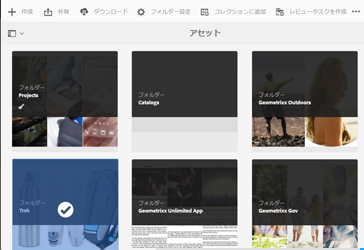
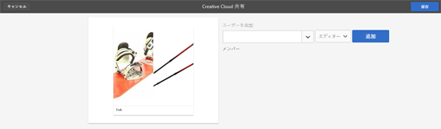

# Adobe Creative Cloud とのフォルダーの共有 {#folder-sharing-with-adobe-creative-cloud}

>[!CAUTION]
>
>AEM／Creative Cloud フォルダー共有機能は廃止されました。Customers are strongly advised to use newer capabilities, like [Adobe Asset Link](https://helpx.adobe.com/jp/enterprise/using/adobe-asset-link.html) or [AEM desktop app](https://helpx.adobe.com/jp/experience-manager/desktop-app/aem-desktop-app.html). 詳しくは、[AEM と Creative Cloud の統合のベストプラクティス](/help/assets/aem-cc-integration-best-practices.md)を参照してください。

Adobe Experience Manager（AEM）Assets では、アセットを含むフォルダーを Adobe Creative Cloud ユーザーと共有できます。For details on how to configure Adobe Marketing Cloud to let you share assets with Adobe Creative Cloud, see [Configuring Assets-Creative Cloud integration](/help/sites-administering/configure-assets-cc-integration.md).

1. アセットコンソールで、Creative Cloud と共有するフォルダーを選択します。

   

1. ツールバーで、**共有**  をクリックします。

   

1. From the list, select the **Adobe Creative Cloud** option.

   

1. In the **Creative Cloud Sharing** page, add the user to share the folder with and then click **Save**.

   

1. 「**OK**」をクリックして、確認メッセージを閉じます。
1. フォルダーを共有したユーザーの資格情報を使用して Creative Cloud にログオンします。Creative Cloud で共有フォルダーを利用できます。