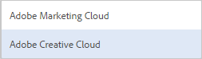

# Adobe Creative Cloud とのフォルダーの共有  {#folder-sharing-with-adobe-creative-cloud}

>[!CAUTION]
>
>AEM／Creative Cloud フォルダー共有機能は廃止されました。お客様には、[Adobeアセットリンク](https://helpx.adobe.com/jp/enterprise/using/adobe-asset-link.html)や[AEMデスクトップアプリ](https://helpx.adobe.com/jp/experience-manager/desktop-app/aem-desktop-app.html)など、新しい機能を使用することを強くお勧めします。 詳しくは、[AEM と Creative Cloud の統合のベストプラクティス](/help/assets/aem-cc-integration-best-practices.md)を参照してください。

Adobe Experience Manager（AEM）Assets では、アセットを含むフォルダーを Adobe Creative Cloud ユーザーと共有できます。Adobe Creative Cloudとアセットを共有できるようにAdobe Marketing Cloudを設定する方法について詳しくは、[アセットCreative Cloud統合の設定](/help/sites-administering/configure-assets-cc-integration.md)を参照してください。

1. アセットコンソールで、Creative Cloud と共有するフォルダーを選択します。

   

1. ツールバーで、**共有**  をクリックします。

   

1. リストから&#x200B;**Adobe Creative Cloud**&#x200B;オプションを選択します。

   

1. **Creative Cloud共有**&#x200B;ページで、フォルダーを共有するユーザーを追加し、**保存**&#x200B;をクリックします。

   

1. 「**OK**」をクリックして、確認メッセージを閉じます。
1. フォルダーを共有したユーザーの資格情報を使用して Creative Cloud にログオンします。Creative Cloud で共有フォルダーを利用できます。