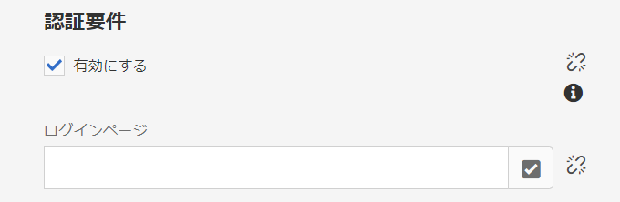
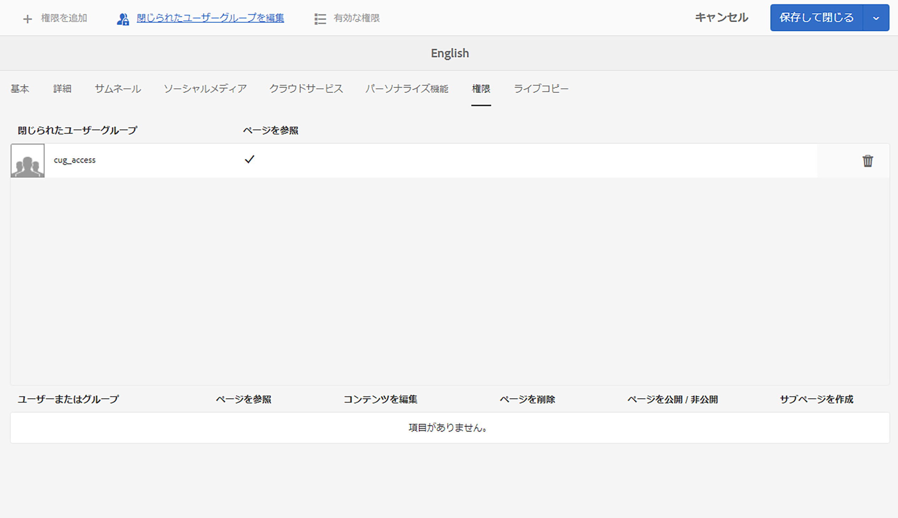

# 閉じられたユーザーグループの作成{#creating-a-closed-user-group}

閉じられたユーザーグループ（CUG）は、公開済みのインターネットサイト内にある特定のページへのアクセスを制限するために使用します。このようなページでは、割り当て済みのメンバーがログインしてセキュリティ資格情報を指定する必要があります。

Web サイト内にこのような領域を設定するには、次の操作を行います。

* [クローズドユーザーグループを実際に作成して、メンバーを割り当てます](#creating-the-user-group-to-be-used)。

* [このグループを必要なページに適用](#applying-your-closed-user-group-to-content-pages)し、CUG のメンバーが使用するログインページを選択（または作成）します。CUG をコンテンツページに適用する場合にも指定します。

* [保護された領域内にある少なくとも 1 つのページへのリンクを作成](#linking-to-the-cug-pages)します。リンクを作成しないとページが表示されません。

* [Dispatcher を設定](#configure-dispatcher-for-cugs)します（使用する場合）。

>[!CAUTION]
>
>閉じられたユーザーグループ（CUG）を作成する場合は、パフォーマンスに留意してください。
>
>CUG 内のユーザーとグループの数に制限はありませんが、ページ上の CUG の数が増えると、レンダリングパフォーマンスが低下する可能性があります。
>
>パフォーマンステストをおこなうときは、CUG の影響を常に考慮してください。

## 使用するユーザーグループの作成 {#creating-the-user-group-to-be-used}

閉じられたユーザーグループを作成するには：

1. AEM ホーム画面から&#x200B;**ツール - セキュリティ** に移動します。

   >[!NOTE]
   >
   >ユーザーとグループの作成および設定について詳しくは、[ユーザーとグループの管理](/help/sites-administering/security.md#managing-users-and-groups)を参照してください。

1. 次の画面から&#x200B;**グループ**&#x200B;カードを選択します。

   

1. 新しいグループを作成するには、右上隅にある「**作成**」ボタンをクリックします。
1. 新しいグループに名前を付けます（例：`cug_access`）。

   

1. 「**メンバー**」タブに移動して、このグループに必要なユーザーを割り当てます。

   

1. CUG に割り当てたユーザーを有効化します。この場合は、`cug_access` のすべてのメンバーです。
1. クローズドユーザーグループをアクティベートして、パブリッシュ環境で使用できるようにします。この場合は、`cug_access` です。

## コンテンツページへの閉じられたユーザーグループの適用 {#applying-your-closed-user-group-to-content-pages}

CUG を単一ページまたは複数ページに適用するには：

1. CUG に割り当てる制限付きセクションのルートページに移動します。
1. サムネールをクリックしてページを選択し、上部のツールバーで「**プロパティ**」を選択します。

   

1. 次のウィンドウで、「**詳細**」タブを開きます。

1. 「**認証要件**」セクションまでスクロールします。

   1. 「**有効にする**」チェックボックスをアクティブ化します。

   1. **ログインページ**へのパスを追加します。
このページは省略可能です。空白のままにすると、標準のログインページが使用されます。

   

1. 次に、「**権限**」タブへ移動し、「**閉じられたユーザーグループを編集**」を選択します。

   

   >[!NOTE]
   >
   >「権限」タブの CUG をブループリントからライブコピーにロールアウトすることはできません。ライブコピーを設定する際には、この点を考慮してください。
   >
   >詳しくは、[このページ](closed-user-groups.md#aem-livecopy)を参照してください。

1. **閉じられたユーザーグループを編集**&#x200B;ダイアログが開きます。 ここで、CUG を検索して選択し、「**保存**」でグループの選択を確認できます。 

   グループがリストに追加されます（例：グループ **cug_access**）。

   

1. 「**保存して閉じる**」で変更を確定します。 

>[!NOTE]
>
>パブリッシュ環境におけるプロファイルおよびログイン／ログアウト用のフォームの指定については、[ID 管理](/help/sites-administering/identity-management.md)を参照してください。

## CUG ページへのリンク {#linking-to-the-cug-pages}

CUG ページへのリンクのターゲットは匿名ユーザーには表示されないので、そのようなリンクはリンクチェックによって削除されます。

この問題を回避するには、CUG 領域内のページを指す、保護されていないリダイレクトページを作成することをお勧めします。これで、ナビゲーションエントリがレンダリングされます。リンクチェックが問題の原因になることはありません。ユーザーがログイン資格情報を正しく指定した後、実際にリダイレクトページにアクセスした場合にのみ、CUG 領域内にリダイレクトされます。

## CUG 用の Dispatcher の設定 {#configure-dispatcher-for-cugs}

Dispatcher を使用する場合は、次のプロパティを使用して Dispatcher ファームを定義する必要があります。

* [virtualhosts](https://experienceleague.adobe.com/docs/experience-manager-dispatcher/using/configuring/dispatcher-configuration.html?lang=ja#identifying-virtual-hosts-virtualhosts)：CUG が適用されたページのパスに一致します。
* \sessionmanagement：以下を参照してください。
* [cache](https://experienceleague.adobe.com/docs/experience-manager-dispatcher/using/configuring/dispatcher-configuration.html?lang=ja#configuring-the-dispatcher-cache-cache)：CUG が適用されたファイル専用のキャッシュディレクトリです。

### CUG 用の Dispatcher セッション管理の設定 {#configuring-dispatcher-session-management-for-cugs}

[dispatcher.any ファイルのセッション管理](https://experienceleague.adobe.com/docs/experience-manager-dispatcher/using/configuring/dispatcher-configuration.html?lang=ja#enabling-secure-sessions-sessionmanagement)を CUG 用に設定します。CUG ページへのアクセスがリクエストされる際に使用される認証ハンドラーで、セッション管理の設定方法を指定します。

```xml
/sessionmanagement
    ...
    /header "Cookie:login-token"
    ...
```

>[!NOTE]
>
>Dispatcher ファームでセッション管理が有効になっている場合、ファームが処理するすべてのページはキャッシュされません。CUG の外にあるページをキャッシュするには、CUG 以外のページを処理する 2 つ目のファームを dispatcher.any に
>作成します。

1. `/directory` を定義して [/sessionmanagement](https://experienceleague.adobe.com/docs/experience-manager-dispatcher/using/configuring/dispatcher-configuration.html?lang=ja#enabling-secure-sessions-sessionmanagement) を設定します。次に例を示します。

   ```xml
   /sessionmanagement
     {
     /directory "/usr/local/apache/.sessions"
     ...
     }
   ```

1. [/allowAuthorized](https://experienceleague.adobe.com/docs/experience-manager-dispatcher/using/configuring/dispatcher-configuration.html?lang=ja#caching-when-authentication-is-used) を `0` に設定します。
