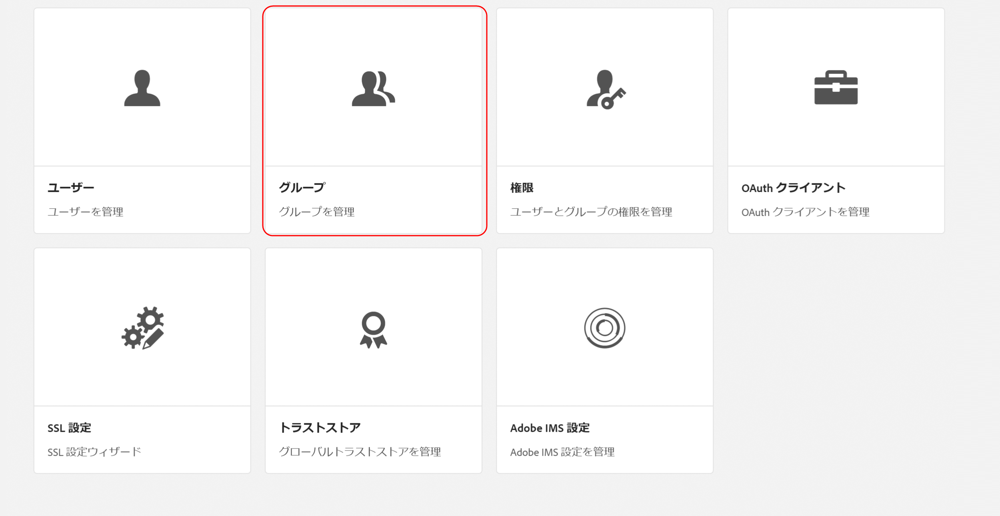
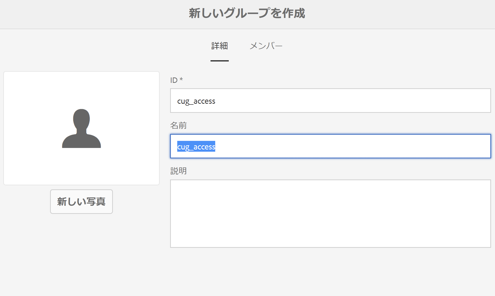
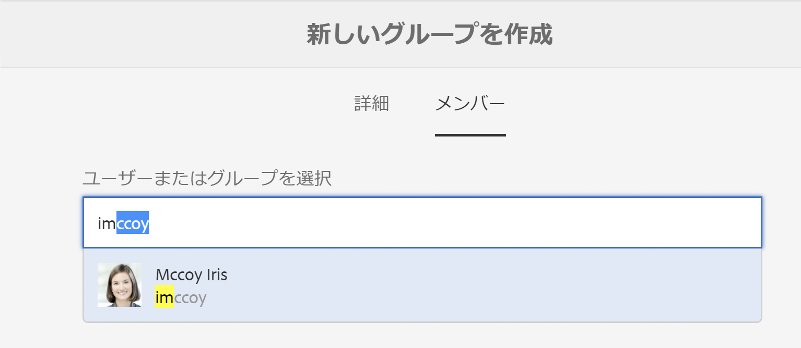
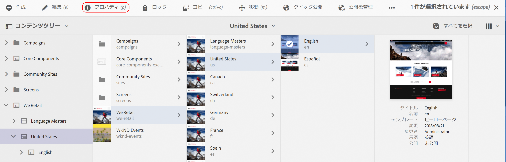
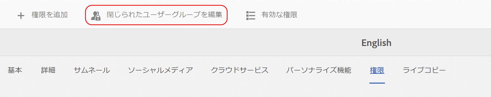

# 閉じられたユーザーグループの作成{#creating-a-closed-user-group}

閉じられたユーザーグループ（CUG）は、公開済みのインターネットサイト内にある特定のページへのアクセスを制限するために使用します。このようなページでは、割り当て済みのメンバーがログインしてセキュリティ資格情報を指定する必要があります。

Web サイト内にこのような領域を設定するには、次の操作をおこないます。

* [実際の閉じられたユーザーグループを作成してメンバーを割り当て](#creating-the-user-group-to-be-used)ます。

* [このグループを必要なページに適用](#applying-your-closed-user-group-to-content-pages)し、CUG のメンバーが使用するログインページを選択（または作成）します。ログインページは、CUG をコンテンツページに適用する場合にも指定されます。

* [保護された領域内にある少なくとも 1 つのページへのリンクを作成](#linking-to-the-realm)します。リンクを作成しないとページが表示されません。
* [Dispatcher を設定](#configure-dispatcher-for-cugs)します（使用する場合）。

>[!CAUTION]
>
>閉じられたユーザーグループ（CUG）を作成する場合は、パフォーマンスに留意してください。
>
>CUG 内のユーザーとグループの数に制限はありませんが、ページ上の CUG の数が増えると、レンダリングパフォーマンスが低下する可能性があります。
>
>パフォーマンステストをおこなうときは、CUG の影響を常に考慮してください。

## Creating The User Group To Be Used {#creating-the-user-group-to-be-used}

閉じられたユーザーグループを作成するには：

1. AEM ホーム画面から&#x200B;**ツール - セキュリティ** に移動します。

   >[!NOTE]
   >
   >ユーザーとグループの作成および設定について詳しくは、[ユーザーとグループの管理](/help/sites-administering/security.md#managing-users-and-groups)を参照してください。

1. 次の画面から&#x200B;**グループ**&#x200B;カードを選択します。

   

1. 新しいグループを作成するには、右上隅にある「**作成**」ボタンをクリックします。
1. Name your new group; for example, `cug_access`.

   

1. 「**メンバー**」タブをクリックして、このグループに必要なユーザーを割り当てます。

   

1. CUG に割り当てたユーザーをアクティベートします。この場合は、`cug_access` のすべてのメンバーです。
1. 閉じられたユーザーグループをアクティベートして、パブリッシュ環境で使用できるようにします。この場合は、`cug_access` です。

## Applying Your Closed User Group To Content Pages {#applying-your-closed-user-group-to-content-pages}

CUG をページに適用するには：

1. CUG に割り当てる制限付きセクションのルートページに移動します。
1. サムネイルをクリックしてページを選択し、上部パネルの「**プロパティ**」をクリックします。

   

1. 次のウィンドウで、「**詳細**」タブに移動します。
1. 下にスクロールして、**認証要件**&#x200B;セクションのチェックボックスをオンにします。

1. 下追加の設定パスを指定し、「保存」を押します。
1. 次に、「**権限**」タブへ移動し、「**閉じられたユーザーグループを編集**」ボタンを押します。

   

   >[注意!]
   >
   > 「権限」タブの CUG をブループリントからライブコピーにロールバックすることはできません。ライブコピーを設定する際には、この点を考慮してください。
   >
   > 詳しくは、[このページ](closed-user-groups.md#aem-livecopy)を参照してください。

1. 次のウィンドウで CUG を探して追加します。この場合は、**cug_access** という名前のグループを追加します。最後に、「**保存**」を押します。
1. 「**有効**」をクリックして、このページ（およびすべての子ページ）が CUG に属していることを定義します。
1. Specify the **Login Page** that members of the group will use; for example:

   `/content/geometrixx/en/toolbar/login.html`

   このページは省略可能です。空白のままにすると、標準のログインページが使用されます。

1. 「**許可されたグループ**」を追加します。+ を使用してグループを追加し、- を使用して削除します。ページにログインおよびアクセスできるのは、これらのグループのメンバーのみです。
1. 必要に応じて、「**領域**」（ページのグループの名前）を割り当てます。ページタイトルを使用する場合は空のままにします。
1. 「**OK**」をクリックして、指定した内容を保存します。

パブリッシュ環境におけるプロファイルおよびログイン／ログアウト用のフォームの指定については、[ID 管理](/help/sites-administering/identity-management.md)を参照してください。

## 領域へのリンク {#linking-to-the-realm}

CUG 領域へのリンクのターゲットは匿名ユーザーには表示されないので、そのようなリンクはリンクチェックによって削除されます。

この問題を回避するには、CUG 領域内のページを指す、保護されていないリダイレクトページを作成することをお勧めします。これで、ナビゲーションエントリがレンダリングされます。リンクチェックが問題の原因になることはありません。ユーザーがログイン資格情報を正しく指定した後、実際にリダイレクトページにアクセスした場合にのみ、CUG 領域内にリダイレクトされます。

## CUG 用の Dispatcher の設定 {#configure-dispatcher-for-cugs}

Dispatcher を使用する場合は、次のプロパティを使用して Dispatcher ファームを定義する必要があります。

* [virtualhosts](https://helpx.adobe.com/experience-manager/dispatcher/using/dispatcher-configuration.html#identifying-virtual-hosts-virtualhosts)：CUG が適用されたページのパスに一致します。
* \sessionmanagement：以下を参照してください。
* [cache](https://helpx.adobe.com/experience-manager/dispatcher/using/dispatcher-configuration.html#configuring-the-dispatcher-cache-cache)：CUG が適用されたファイル専用のキャッシュディレクトリです。

### CUG 用の Dispatcher セッション管理の設定 {#configuring-dispatcher-session-management-for-cugs}

Configure [session management in the dispatcher.any file](https://helpx.adobe.com/experience-manager/dispatcher/using/dispatcher-configuration.html#enabling-secure-sessions-sessionmanagement) for the CUG. The authentication handler that is used when access is requested for CUG pages determines how you configure session management.

```xml
/sessionmanagement
    ...
    /header "Cookie:login-token"
    ...
```

>[!NOTE]
>
>ディスパッチャーファームでセッション管理が有効になっている場合、ファームハンドルを持つすべてのページはキャッシュされません。CUG以外のページをキャッシュするには、dispatcher.anyに2つ目のファームを作成します。
>がCUG以外のページを処理します。

1. Configure [/sessionmanagement](https://helpx.adobe.com/experience-manager/dispatcher/using/dispatcher-configuration.html#enabling-secure-sessions-sessionmanagement) by defining `/directory`; for example:

   ```xml
   /sessionmanagement
     {
     /directory "/usr/local/apache/.sessions"
     ...
     }
   ```

1. [/allowAuthorized](https://helpx.adobe.com/experience-manager/dispatcher/using/dispatcher-configuration.html#caching-when-authentication-is-used) を `0` に設定します。

