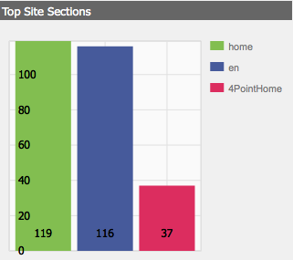

# ダッシュボード{#dashboards}

AEM の使用時、ページやアセットなど様々なタイプの多数のコンテンツを管理できます。AEM ダッシュボードの簡単でカスタマイズ可能な方法を使用して、統合されたデータを表示するページを定義できます。

>[!NOTE]
>
>AEM ダッシュボードはユーザーごとに作成されるので、ユーザーは自分のダッシュボードのみにアクセスできます。
>
>ただし、[ダッシュボードテンプレート](#creating-a-dashboard-template)を使用して、共通の設定およびダッシュボードレイアウトを共有することができます。


## ダッシュボードの管理 {#administering-dashboards}

### ダッシュボードの作成 {#creating-a-dashboard}

新しいダッシュボードを作成するには、次の手順を実行します。

1. 「**ツール**」セクションで、「**設定コンソール**」をクリックします。
1. ツリー内で、「**ダッシュボード**」をダブルクリックします。
1. 「**ダッシュボード**」をダブルクリックします。
1. **タイトル**（「My Dashboard」など）と&#x200B;**名前**&#x200B;を入力します。
1. 「**作成**」をクリックします。

### ダッシュボードのクローン作成  {#cloning-a-dashboard}

複数のダッシュボードを作成して、コンテンツについての情報を様々な表示からすばやく確認することができます。新しいダッシュボードを作成しやすくするために、AEM ではクローン機能が提供されています。この機能を使用して既存のダッシュボードを複製できます。ダッシュボードのクローンを作成するには、次の手順を実行します。

1. 「**ツール**」セクションで、「**設定コンソール**」をクリックします。

1. ツリー内で、「**ダッシュボード**」をクリックします。
1. クローンを作成するダッシュボードをクリックします。

1. 「**クローン**」をクリックします。

1. 新しいダッシュボードの&#x200B;**名前**&#x200B;を入力します。

### ダッシュボードの削除  {#removing-a-dashboard}

1. 「**ツール**」セクションで、「**設定コンソール**」をクリックします。

1. ツリー内で、「**ダッシュボード**」をクリックします。
1. 削除するダッシュボードをクリックします。

1. 「**削除**」をクリックします。

1. 「**はい**」をクリックして実行を確認します。

## ダッシュボードコンポーネント  {#dashboard-components}

### 概要 {#overview}

ダッシュボードコンポーネントは、通常の [AEM コンポーネント](/help/sites-developing/developing-components-samples.md)にすぎません。ここでは、AEM に付属しているレポート用コンポーネントについて説明します。

### Web 分析レポート用コンポーネント {#web-analytics-reporting-components}

AEM には、[SiteCatalyst](/help/sites-administering/adobeanalytics.md) データの複数の指標をレンダリングする一連のコンポーネントが付属しています。これらのコンポーネントは、サイドキックの「**ダッシュボード**」セクションに一覧表示されます。

レポート用コンポーネントにはそれぞれ少なくとも次の 3 つのタブがあります。

* **基本**：主要な設定が含まれています。

* **レポート**：各レポートに固有の設定が含まれています。
* **スタイル**：グラフのサイズや余白などのスタイル設定が含まれています。

レポート用コンポーネントはデフォルト設定で初期化されており、このデフォルト設定を使用してダッシュボードをすばやく設定できます。

#### 基本設定  {#basic-configuration}

「**基本**」タブから次の設定エントリにアクセスできます。

**** タイトル：ダッシュボードに表示されるタイトル。

**要求** タイプデータの要求方法。

**SiteCatalyst設定（オプション）** SiteCatalystへの接続に使用する設定。指定がない場合、ダッシュボードページで（ページプロパティによって）設定されると見なされます。

**レポートスイートID（オプション）** グラフの生成に使用するSiteCatalystレポートスイート。

#### レポート設定 {#report-configuration}

Web 統計を表示するために、取得するデータの日付範囲を定義する必要があります。「**レポート**」タブにある 2 つのフィールドを使用して、日付範囲を定義できます。

>[!NOTE]
>
>日付範囲を広く設定すると、ダッシュボードの応答性が低下する場合があります。

**Date Fromデータの取得元** の絶対日付または相対日付。

**日付** を絶対日付またはデータを取得する相対日付。

各コンポーネントで、固有の設定も定義されます。

#### オーバータイムレポート  {#overtime-report}


**日付** 精度X軸の時間単位（日、時間など）。

**** 指標表示するイベントのリスト。

**** 要素：グラフ内の指標データを分類する要素のリスト。

#### ランクリストレポート {#ranked-list-report}


**** 要素：グラフ内の指標データを分類する要素。

**** 指標表示するイベント。

**不可. /**&#x200B;レポートに表示される項目数。

#### ランクレポート {#ranked-report}


**** 指標表示するイベント。

**** 要素：グラフ内の指標データを分類する要素。

#### トップサイトセクションレポート {#top-site-section-report}

このコンポーネントは、以下の設定に従い、訪問回数の多い Web サイトのセクションを示すグラフを表示します。



**不可. /**&#x200B;レポートに表示されるセクションの数。

#### トレンドレポート {#trended-report}


**日付** 精度X軸の時間単位（日、時間など）。

**** 指標表示するイベント。

**** 要素：グラフ内の指標データを分類する要素。

## ダッシュボードの拡張 {#extending-dashboard}

### 概要 {#overview-1}

ダッシュボードは通常のページ（`cq:Page`）なので、あらゆるコンポーネントを使用してダッシュボードを構成できます。

デフォルトでテンプレートで有効にされているAnalyticsレポートコンポーネントを含むデフォルトのコンポーネントグループ`Dashboard`があります。

### Creating A Dashboard Template {#creating-a-dashboard-template}

テンプレートは、新しいダッシュボードのデフォルトのコンテンツを定義するものです。様々なタイプのダッシュボードを作成するために、複数のテンプレートを使用できます。

ダッシュボードテンプレートは、他のページテンプレートと同様に作成されますが、`/libs/cq/dashboards/templates/`に保存されます。「[コンテンツページテンプレートの作成](/help/sites-developing/website.md#creating-the-contentpage-template)」の節を参照してください。

>[!NOTE]
>
>ダッシュボードテンプレートはユーザー間で共有されます。

### ダッシュボードコンポーネントの開発  {#developing-a-dashboard-component}

ダッシュボードコンポーネントの開発は、通常の AEM コンポーネントの作成から成り立っています。ここでは、作成者の上位 10 人を表示するコンポーネントを例に説明します。


最上位の作成者コンポーネントは、`/apps/geometrixx-outdoors/components/reporting`のリポジトリに保存され、以下で構成されます。

1. jcr データを読み取り、`jsp` プレースホルダーを定義する `html` ファイル。

1. データを取得して整理し、`js` プレースホルダーに入力する `html` ファイルを 1 つ含むクライアント側ライブラリ。


次の JavaScript ファイルは、`geout.reporting.topauthors`[ のクライアントライブラリ](/help/sites-developing/clientlibs.md)でコンポーネントの子として定義されます。

[QueryBuilder](/help/sites-developing/querybuilder-api.md)は、`cq:AuditEvent`ノードを読み取るリポジトリのクエリに使用されます。 クエリの結果として JSON オブジェクトが返され、このオブジェクトから作成者の貢献度が抽出されます。

#### top_authors.js {#top-authors-js}

```
$.ajax({
  url: "/bin/querybuilder.json",
  cache: false,
  data: {
       "orderby": "cq:time",
       "orderby.sort": "desc",
       "p.hits": "full",
       "p.limit": 100,
       "path": "/var/audit/com.day.cq.wcm.core.page/",
       "type": "cq:AuditEvent"
   },
  dataType: "json"
}).done(function( res ) {
    var authors = {};
    // from JSON to Object
    for(var r in res.hits) {
        var userId = res.hits[r].userId;
        if(userId == undefined) {
            continue;
        }
        var auth = authors[userId] || {userId : userId};
        auth.contrib = (auth.contrib || 0) +1;

        authors[userId] = auth;
    }

    // order by contribution
    var orderedByContrib = [];
    for(var a in authors) {
        orderedByContrib.push(authors[a]);
    }
    orderedByContrib.sort(function(a,b){return b.contrib - a.contrib});

    // produce the list
    for (var i=0, tot=orderedByContrib.length; i < tot; i++) {
        var current = orderedByContrib[i];
        $("<div> #" + (i + 1) +" "+ current.userId + " (" + current.contrib +" contrib.)</div>").appendTo("#authors-list");

    }
});
```

`JSP`には`global.jsp`と`clientlib`の両方が含まれます。

#### top_authors.jsp {#top-authors-jsp}

```java
<%@page session="false" contentType="text/html; charset=utf-8" %><%
%><%
%><%@include file="/libs/foundation/global.jsp" %><%
%>
<ui:includeClientLib categories="geout.reporting.topauthors" />
<%
String reportletTitle = properties.get("title", "Top Authors");
%>
<html>
     <h3><%=xssAPI.encodeForHTML(reportletTitle) %></h3>
     <div id="authors-list"></div>
</html>
```

