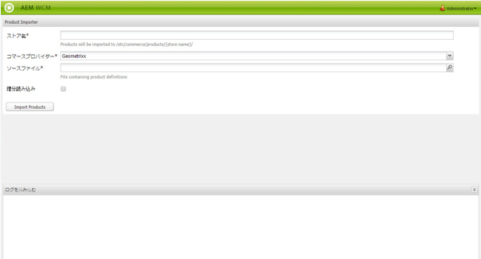

# ダッシュボード{#dashboards}

AEMを使用すると、様々なタイプ（ページ、アセットなど）の多くのコンテンツを管理できます。 AEMダッシュボードは、統合されたデータを表示するページを定義する、使いやすくカスタマイズ可能な方法を提供します。

>[!NOTE]
>
>AEMダッシュボードはユーザーごとに作成されるので、ユーザーは自分のダッシュボードにしかアクセスできません。
>
>ただし、[ダッシュボードテンプレート](#creating-a-dashboard-template)を使用して、共通の設定およびダッシュボードレイアウトを共有することができます。



## ダッシュボードの管理 {#administering-dashboards}

### ダッシュボードの作成 {#creating-a-dashboard}

新しいダッシュボードを作成するには、次の手順に従います。

1. 内 **ツール** セクションで、 **設定コンソール**.
1. ツリー内で、「**ダッシュボード**」をダブルクリックします。
1. クリック **新しいダッシュボード**.
1. 次を入力します。 **タイトル** （例：マイダッシュボード）と **名前**.
1. 「**作成**」をクリックします。

### ダッシュボードの複製 {#cloning-a-dashboard}

複数のダッシュボードを使用して、様々なビューからコンテンツに関する情報をすばやく確認する場合があります。 新しいダッシュボードを作成するのに役立つように、AEMには既存のダッシュボードを複製するためのクローン機能が用意されています。 ダッシュボードのクローンを作成するには、次の手順に従います。

1. 内 **ツール** セクションで、 **設定コンソール**.

1. ツリーで、 **ダッシュボード**.
1. 複製するダッシュボードをクリックします。

1. クリック **複製**.

1. 次を入力します。 **名前** 」をクリックします。

### ダッシュボードの削除 {#removing-a-dashboard}

1. 内 **ツール** セクションで、 **設定コンソール**.

1. ツリーで、 **ダッシュボード**.
1. 削除するダッシュボードをクリックします。

1. 「**削除**」をクリックします。

1. 「**はい**」をクリックして実行を確認します。

## ダッシュボードコンポーネント {#dashboard-components}

### 概要 {#overview}

ダッシュボードコンポーネントは、通常の [AEM コンポーネント](/help/sites-developing/developing-components-samples.md)にすぎません。ここでは、AEM に付属しているレポート用コンポーネントについて説明します。

### Web 分析レポート用コンポーネント {#web-analytics-reporting-components}

AEM には、[SiteCatalyst](/help/sites-administering/adobeanalytics.md) データの複数の指標をレンダリングする一連のコンポーネントが付属しています。これらのコンポーネントは、サイドキックの「**ダッシュボード**」セクションに一覧表示されます。

各レポートコンポーネントには、少なくとも 3 つのタブがあります。

* **基本**:にはメイン設定が含まれます。

* **レポート：** には、各レポートに固有の設定が含まれます。
* **スタイル**:には、グラフのサイズや余白などのスタイル設定が含まれています。

レポートコンポーネントはデフォルト設定で初期化され、ダッシュボードをすばやく設定するのに役立ちます。

#### 基本設定 {#basic-configuration}

この **基本** 「 」タブから次の設定エントリにアクセスできます。

**タイトル**：ダッシュボードに表示するタイトル。

**リクエストタイプ**：データをリクエストする方法。

**SiteCatalyst 設定（オプション）**：SiteCatalyst との接続に使用する設定。指定がない場合、ダッシュボードページで（ページプロパティによって）設定されると見なされます。

**レポートスイート ID （オプション）**：グラフの生成に使用する SiteCatalyst レポートスイート。

#### レポート設定 {#report-configuration}

Web 統計を表示するには、取得するデータの日付範囲を定義する必要があります。 この **レポート** 「 」タブには、その範囲を定義する 2 つのフィールドが表示されます。

>[!NOTE]
>
>日付範囲を広く設定すると、ダッシュボードの応答性が低下する場合があります。

**開始日**：データの取得を開始する絶対日付または相対日付。

**終了日**：データの取得を終了する絶対日付または相対日付。

各コンポーネントは、特定の設定も定義します。

#### オーバータイムレポート {#overtime-report}


**日付精度** X 軸の時間単位（日、時間など）。

**メトリクス**：表示するイベントのリスト。

**要素**：グラフ内のメトリクスデータを細分化する要素のリスト。

#### ランクリストレポート {#ranked-list-report}


**要素**：グラフ内のメトリクスデータを細分化する要素。

**メトリクス**：表示するイベント。

**不可. 上位項目の数**：レポートで表示する項目の数。

#### ランクレポート {#ranked-report}


**メトリクス**：表示するイベント。

**要素**：グラフ内のメトリクスデータを細分化する要素。

#### トップサイトセクションレポート {#top-site-section-report}

このコンポーネントは、次の設定に従って、Web サイトの訪問回数の多いセクションを示すグラフを表示します。


**不可. 上位項目の数**：レポートで一度に表示するセクションの数。

#### トレンドレポート {#trended-report}


**日付精度** X 軸の時間単位（日、時間など）。

**メトリクス**：表示するイベント。

**要素**：グラフ内のメトリクスデータを細分化する要素。

## ダッシュボードの拡張 {#extending-dashboard}

### 概要 {#overview-1}

ダッシュボードは通常のページ（`cq:Page`）なので、あらゆるコンポーネントを使用してダッシュボードを構成できます。

デフォルトのコンポーネントグループ `Dashboard` には分析レポート用コンポーネントが含まれていて、これらのコンポーネントはテンプレート上でデフォルトで有効になっています。

### ダッシュボードテンプレートの作成 {#creating-a-dashboard-template}

テンプレートは、新しいダッシュボードのデフォルトコンテンツを定義します。 複数のテンプレートを使用して、異なるタイプのダッシュボードを作成できます。

ダッシュボードテンプレートはその他のページテンプレートと同様に作成されますが、`/libs/cq/dashboards/templates/` に保存される点が異なります。[contentpage テンプレートの作成](/help/sites-developing/website.md#creating-the-contentpage-template)の節を参照してください。

>[!NOTE]
>
>ダッシュボードテンプレートは、ユーザー間で共有されます。

### ダッシュボードコンポーネントの開発 {#developing-a-dashboard-component}

ダッシュボードコンポーネントの開発は、通常のAEMコンポーネントの作成で構成されます。 この節では、コントリビューターの上位 10 人を表示するコンポーネントの例を説明します。


上位作成者コンポーネントは、`/apps/geometrixx-outdoors/components/reporting` のリポジトリに格納され、構成内容は次のとおりです。

1. jcr データを読み取り、`jsp` プレースホルダーを定義する `html` ファイル。

1. データを取得して整理し、`js` プレースホルダーに入力する `html` ファイルを 1 つ含むクライアント側ライブラリ。


次の JavaScript ファイルは、 `geout.reporting.topauthors` [クライアントライブラリ](/help/sites-developing/clientlibs.md) コンポーネント自体の子として。

[QueryBuilder](/help/sites-developing/querybuilder-api.md) を使用してリポジトリに対してクエリを実行し、`cq:AuditEvent` ノードを読み取ります。クエリの結果として JSON オブジェクトが返され、このオブジェクトから作成者の貢献度が抽出されます。

#### top_authors.js {#top-authors-js}

```
$.ajax({
  url: "/bin/querybuilder.json",
  cache: false,
  data: {
       "orderby": "cq:time",
       "orderby.sort": "desc",
       "p.hits": "full",
       "p.limit": 100,
       "path": "/var/audit/com.day.cq.wcm.core.page/",
       "type": "cq:AuditEvent"
   },
  dataType: "json"
}).done(function( res ) {
    var authors = {};
    // from JSON to Object
    for(var r in res.hits) {
        var userId = res.hits[r].userId;
        if(userId == undefined) {
            continue;
        }
        var auth = authors[userId] || {userId : userId};
        auth.contrib = (auth.contrib || 0) +1;

        authors[userId] = auth;
    }

    // order by contribution
    var orderedByContrib = [];
    for(var a in authors) {
        orderedByContrib.push(authors[a]);
    }
    orderedByContrib.sort(function(a,b){return b.contrib - a.contrib});

    // produce the list
    for (var i=0, tot=orderedByContrib.length; i < tot; i++) {
        var current = orderedByContrib[i];
        $("<div> #" + (i + 1) +" "+ current.userId + " (" + current.contrib +" contrib.)</div>").appendTo("#authors-list");

    }
});
```

`JSP` には、`global.jsp` と `clientlib` の両方が含まれます。

#### top_authors.jsp {#top-authors-jsp}

```java
<%@page session="false" contentType="text/html; charset=utf-8" %><%
%><%
%><%@include file="/libs/foundation/global.jsp" %><%
%>
<ui:includeClientLib categories="geout.reporting.topauthors" />
<%
String reportletTitle = properties.get("title", "Top Authors");
%>
<html>
     <h3><%=xssAPI.encodeForHTML(reportletTitle) %></h3>
     <div id="authors-list"></div>
</html>
```
