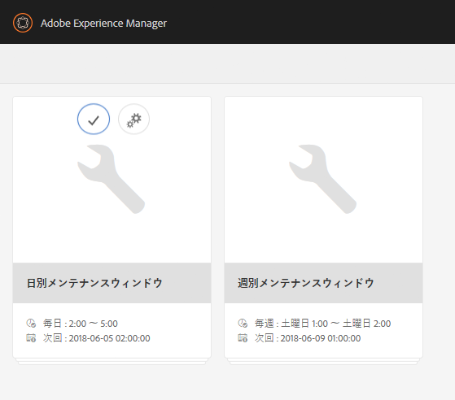
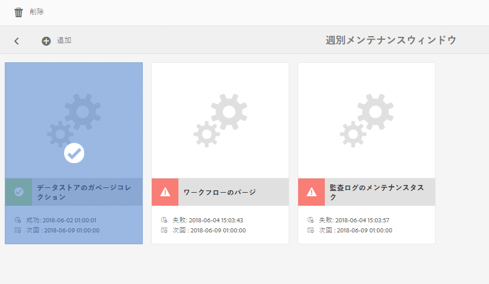
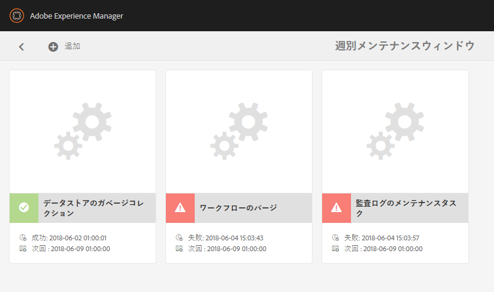

# データストアのガベージコレクション {#data-store-garbage-collection}

従来の WCM アセットを削除すると、データストアレコードの参照がノード階層から削除されますが、データストアレコード自体は削除されずに残ります。その結果、どこからも参照されることのないこのデータストアレコードは、不要な「ガベージ」として残ることになります。例えば、インスタンスにいくつかのガベージアセットが存在する場合、そのガベージアセットを削除すれば、領域を保護して、バックアップやファイルシステムのメンテナンスのパフォーマンスを最適化できます。

ほとんどの場合、WCM アプリケーションは、情報は収集しても、あまり頻繁に情報を削除しません。旧バージョンより優先する新しい画像が追加されたとしても、バージョン管理システムは、いつでも旧バージョンに戻せるように旧バージョンを残します。その結果、システムに追加されるコンテンツは、そのほとんどが永続的に保存されることになります。それでは、いったい何が原因でリポジトリ内に不要な「ガベージ」が生み出されるのでしょうか。

AEM では、以下に示す様々な内部アクティビティやハウスキーピングアクティビティのオブジェクトをリポジトリに保管します。

* ビルドおよびダウンロードされたパッケージ
* 公開レプリケーション用に作成された一時ファイル
* ワークフローのペイロード
* DAM レンダリング時に一時的に作成されたアセット

これらの一時オブジェクトがデータストア内の領域をある程度消費するほど大きく、しかもそのオブジェクトが最終的に使用されなかった場合は、そのデータストアレコード自体が「ガベージ」として残ります。標準的な WCM オーサー／パブリッシュアプリケーションの場合、このようなガベージが生まれる最大の原因は、一般的に、パブリッシュアクティベーションのプロセスにあります。When data is being replicated to Publish, it if first gathered in collections in an efficient data format called &quot;Durbo&quot; and stored in the repository under `/var/replication/data`. データバンドルは通常、データストアの上限サイズを超えるので、最終的にデータストアレコードとして保存されます。When the replication is complete, the node in `/var/replication/data` is deleted, but the data store record remains as &quot;garbage&quot;.

回収可能なガベージが生まれるもう 1 つの原因はパッケージです。他のデータもそうですが、パッケージデータもリポジトリ内に保存され、4 KB を超えるパッケージはデータストア内に保存されます。開発プロジェクトの工程やその後のシステムのメンテナンスでは、パッケージのビルドとリビルドが何度もおこなわれ、ビルドがおこなわれるたびに新しいデータストアレコードができて、以前のビルドのレコードは孤立します。

## データストアのガベージコレクションの機能 {#how-does-data-store-garbage-collection-work}

リポジトリが外部データストアに設定されている場合、週別メンテナンスウィンドウの一部として、[データストアのガベージコレクションは自動的に実行](/help/sites-administering/data-store-garbage-collection.md#automating-data-store-garbage-collection)されます。The system administrator can also [run data store garbage collection manually](#running-data-store-garbage-collection) on as as-needed basis. 一般的に、データストアのガベージコレクションは定期的に実行することが推奨されますが、データストアのガベージコレクションを計画するときは、次の事項を考慮する必要があります。

* データストアのガベージコレクションは時間がかかり、パフォーマンスに影響する可能性があるので、適切に計画する必要があります。
* データストアのガベージレコードを削除しても通常のパフォーマンスに影響はないので、これはパフォーマンス最適化ではありません。
* ストレージの使用状況や、バックアップ時間などの関連要素に問題がない場合は、データストアのガベージコレクションを延期しても安全です。

データストアのガベージコレクターは最初に、プロセスを開始する際に現在のタイムスタンプを記録します。その後、マルチパスマーク／消去パターンアルゴリズムを使用してガベージコレクションが実行されます。

第 1 段階では、データストアのガベージコレクターは、すべてのリポジトリコンテンツを包括的に調べます。データストアレコードを参照する各コンテンツオブジェクトについて、データストアのガベージコレクターは、ファイルシステムからファイルを見つけてメタデータの更新を実行し、「最終変更日」または MTIME 属性を変更します。この時点で、この段階までにアクセスされたファイルは、当初のベースラインタイムスタンプより新しいものになります。

第 2 段階では、データストアのガベージコレクターは、「検索」とほとんど同じ方法で、データストアの物理的なディレクトリ構造を調べます。データストアのガベージコレクターは、ファイルの「最終変更日」または MTIME 属性を調べて、次の判断をおこないます。

* MTIME が当初のベースラインタイムスタンプより新しい場合、そのファイルは、第 1 段階で見つけたファイルか、ガベージコレクション処理中にリポジトリに追加されたまったく新しいファイルであるかのどちらかです。どちらの場合も、レコードはアクティブ状態になるので、ファイルは削除されません。
* MTIME が当初のベースラインタイムスタンプより古い場合、そのファイルはアクティブに参照されていないので、削除可能なガベージと見なされます。

この方法は、プライベートなデータストアを持つ単一のノードに適しています。ただし、データストアは共有されている場合があります。その場合、他のリポジトリからデータストアレコードへのアクティブなライブ参照はチェックされず、そのアクティブな参照ファイルが誤って削除される可能性があります。システム管理者はガベージコレクションを計画する前に、データストアが共有されていないかどうかを確認し、データストアが共有されていないことが明確な場合にのみ、シンプルな組み込みデータストアのガベージコレクションプロセスを使用するようにしてください。

>[!NOTE]
>
>（Mongo または Segment Tar を備えた）クラスターまたは共有データストアのセットアップでガベージコレクションを実行するときに、特定の blob ID を削除できないことを知らせる警告がログに表示される場合があります。これは、以前のガベージコレクションで削除されたblob IDが、ID削除に関する情報を持たない他のクラスターまたは共有ノードによって誤って参照されるためです。 その結果、前回の実行時に既に削除された ID を、ガベージコレクションで再度削除しようとするので、警告がログに記録されます。この動作は、パフォーマンスや機能には影響しません。

## データストアのガベージコレクションの実行 {#running-data-store-garbage-collection}

データストアのガベージコレクションは、AEM が実行されているデータストアのセットアップに応じて、3 つの方法で実行できます。

1. Via [Revision Cleanup](/help/sites-deploying/revision-cleanup.md) - a garbage collection mechanism usually used for node store cleanup.

1. [データストアのガベージコレクション](/help/sites-administering/data-store-garbage-collection.md#running-data-store-garbage-collection-via-the-operations-dashboard) - 外部データストア用のガベージコレクションメカニズムで、操作ダッシュボードで使用可能。
1. [JMX コンソール](/help/sites-administering/jmx-console.md)。

TarMK がノードストアとデータストアの両方として使用されている場合は、その両方のガベージコレクションにリビジョンクリーンアップを使用できます。一方、ファイルシステムデータストアなど外部データストアが設定されている場合は、リビジョンクリーンアップとは別に、データストアのガベージコレクションを明示的に起動する必要があります。データストアのガベージコレクションは、操作ダッシュボードと JMX コンソールのどちらからでも起動できます。

次の表に、AEM 6 でサポートされているすべてのデータストアのデプロイメントで使用する必要がある、データストアのガベージコレクションの種類を示します。

<table>
 <tbody>
  <tr>
   <td><strong>ノードストア</strong><br /> </td>
   <td><strong>データストア</strong></td>
   <td><strong>ガベージコレクションのメカニズム</strong><br /> </td>
  </tr>
  <tr>
   <td>TarMK</td>
   <td>TarMK</td>
   <td>リビジョンのクリーンアップ（バイナリはセグメントストアと共にインライン）</td>
  </tr>
  <tr>
   <td>TarMK</td>
   <td>外部ファイルシステム</td>
   <td><p>オペレーションダッシュボードを介したデータストアのガベージコレクションタスク</p> <p>JMX コンソール</p> </td>
  </tr>
  <tr>
   <td>MongoDB</td>
   <td>MongoDB</td>
   <td><p>オペレーションダッシュボードを介したデータストアのガベージコレクションタスク</p> <p>JMX コンソール</p> </td>
  </tr>
  <tr>
   <td>MongoDB</td>
   <td>外部ファイルシステム</td>
   <td><p>オペレーションダッシュボードを介したデータストアのガベージコレクションタスク</p> <p>JMX コンソール</p> </td>
  </tr>
 </tbody>
</table>

### 操作ダッシュボードによるデータストアのガベージコレクションの実行 {#running-data-store-garbage-collection-via-the-operations-dashboard}

[操作ダッシュボード](/help/sites-administering/operations-dashboard.md)から使用できる組み込みの週別メンテナンスウィンドウには、データストアのガベージコレクションを毎週日曜日午前 1 時に起動する組み込みタスクが内蔵されています。

データストアのガベージコレクションを、この時間帯以外に実行する必要がある場合は操作ダッシュボードから手動で起動できます。

データストアのガベージコレクションを実行する前に、その時間にバックアップが実行されていないことを確認してください。

1. **ナビゲーション**／**ツール**／**操作**／**メンテナンス**&#x200B;を選択して、操作ダッシュボードを開きます。
1. 「**週別メンテナンスウィンドウ**」をクリックまたはタップします。

   

1. 「**データストアのガベージコレクション**」タスクを選択し、**実行**&#x200B;アイコンをクリックまたはタップします。

   

1. データストアのガベージコレクションが実行され、そのステータスがダッシュボードに表示されます。

   

>[!NOTE]
>
>「データストアのガベージコレクション」タスクは、外部ファイルデータストアが設定されている場合にのみ表示されます。See [Configuring node stores and data stores in AEM 6](/help/sites-deploying/data-store-config.md#file-data-store) for information on how to set up a file data store.

### JMX コンソールによるデータストアのガベージコレクションの実行 {#running-data-store-garbage-collection-via-the-jmx-console}

この節では、JMX コンソールを使用してデータストアのガベージコレクションを手動で実行する方法を説明します。外部データストアなしでインストールをセットアップしている場合は、この節で説明する内容は適用されません。その場合は、[リポジトリのメンテナンス](/help/sites-deploying/storage-elements-in-aem-6.md#maintaining-the-repository)で説明するリビジョンクリーンアップの実行方法を参照してください。

>[!NOTE]
>
>TarMK を外部データストアで実行している場合、ガベージコレクションを有効にするには、最初にリビジョンクリーンアップを実行する必要があります。

ガベージコレクションを実行するには：

1. Apache Felix OSGi Management Console で、「**メイン**」タブをアクティブにし、次のメニューから「**JMX**」を選択して、
1. 次に、「 **Repository Manager** MBean」を検索してクリックします(またはに移動 `https://<host>:<port>/system/console/jmx/org.apache.jackrabbit.oak%3Aname%3Drepository+manager%2Ctype%3DRepositoryManagement`)。
1. 「**startDataStoreGC(boolean markOnly)**」をクリックします。
1. enter &quot;`true`&quot; for the `markOnly` parameter if required:

   | **オプション** | **説明** |
   |---|---|
   | boolean markOnly | 参照のマークのみをおこない、マークスイープ操作でスイープを行わない場合は true に設定します。このモードは、元になる BlobStore が異なる複数のリポジトリで共有されているときに使用されます。それ以外の場合はすべて false に設定してフルガベージコレクションを実行します。 |

1. 「**呼び出し**」をクリックします。CRX でガベージコレクションが実行され、完了すると通知されます。

>[!NOTE]
>
>データストアのガベージコレクションでは、過去 24 時間以内に削除されたファイルは収集しません。

>[!NOTE]
>
>データストアのガベージコレクションタスクは、外部ファイルデータストアが設定されている場合にのみ開始されます。If an external file data store has not been configured, the task will return the message `Cannot perform operation: no service of type BlobGCMBean found` after invoking. See [Configuring node stores and data stores in AEM 6](/help/sites-deploying/data-store-config.md#file-data-store) for information on how to set up a file data store.

## データストアのガベージコレクションの自動化 {#automating-data-store-garbage-collection}

可能であれば、データストアのガベージコレクションは、（朝など）システムの負荷が低いときに実行してください。

[操作ダッシュボード](/help/sites-administering/operations-dashboard.md)から使用できる組み込みの週別メンテナンスウィンドウには、データストアのガベージコレクションを毎週日曜日午前 1 時に起動する組み込みタスクが内蔵されています。また、その時間にバックアップが実行されていないことを確認する必要もあります。メンテナンスウィンドウの開始時間は、必要に応じてダッシュボードでカスタマイズできます。

>[!NOTE]
>
>同時に実行しないのは、古い（および未使用の）データストアファイルもバックアップされるため、古いリビジョンに戻す必要がある場合でも、バイナリはバックアップに残るためです。

オペレーションダッシュボードの週別メンテナンスウィンドウでデータストアのガベージコレクションを実行しない場合は、wgetまたはcurl HTTPクライアントを使用して自動化することもできます。 次の例は、curlを使用してバックアップを自動化する方法を示しています。

>[!CAUTION]
>
>以下の `curl` コマンドでは、インスタンスに対して様々なパラメーターを設定する必要がある場合があります。例えば、ホスト名（`localhost`）、ポート（`4502`）、管理パスワード（`xyz`）および実際のデータストアのガベージコレクションのための各種パラメーターです。

次に、データストアのガベージコレクションをコマンドラインから起動する curl コマンドの例を示します。

```shell
curl -u admin:admin -X POST --data markOnly=true  https://localhost:4503/system/console/jmx/org.apache.jackrabbit.oak"%"3Aname"%"3Drepository+manager"%"2Ctype"%"3DRepositoryManagement/op/startDataStoreGC/boolean
```

curl コマンドはすぐに制御を返します。

## データストアの整合性チェック {#checking-data-store-consistency}

データストアの整合性チェックは、欠落しているもののまだ参照されているデータストアのバイナリを報告します。整合性チェックを開始するには、次の手順を実行します。

1. JMX コンソールに移動します。For information on how to use the JMX console, see [this article](/help/sites-administering/jmx-console.md#using-the-jmx-console).
1. Search for the **BlobGarbageCollection** Mbean and click it.
1. Click the `checkConsistency()` link.

整合性チェックが完了すると、メッセージに欠落として報告されるバイナリの数が表示されます。If the number is greater than 0, check the `error.log` for more details on the missing binaries.

欠落しているバイナリがログにどのように表示されるかを次に示します。

```xml
11:32:39.673 INFO [main] MarkSweepGarbageCollector.java:600 Consistency check found [1] missing blobs
```

```xml
11:32:39.673 WARN [main] MarkSweepGarbageCollector.java:602 Consistency check failure intheblob store : DataStore backed BlobStore [org.apache.jackrabbit.oak.plugins.blob.datastore.OakFileDataStore], check missing candidates in file /tmp/gcworkdir-1467352959243/gccand-1467352959243
```

