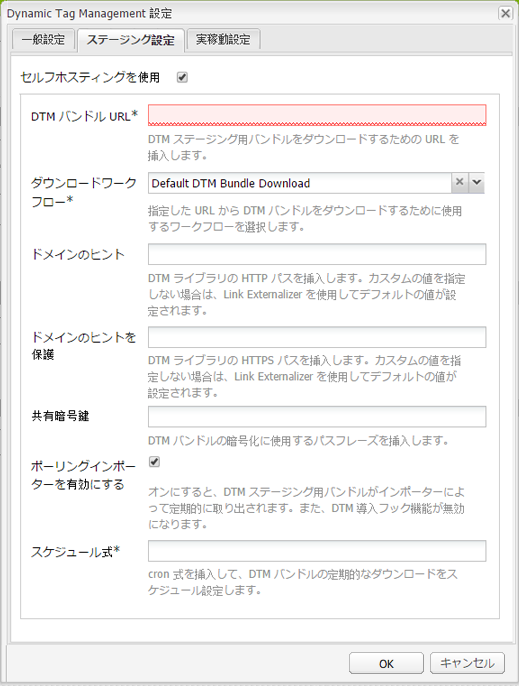
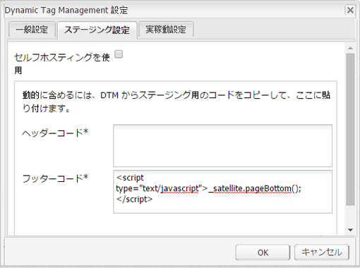
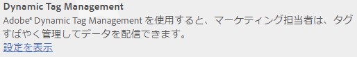
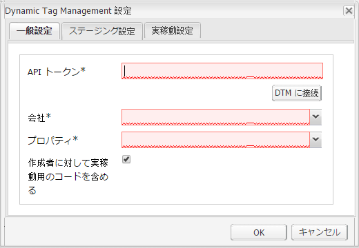
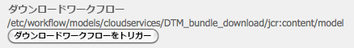
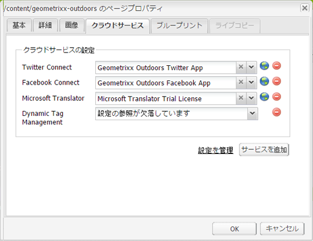
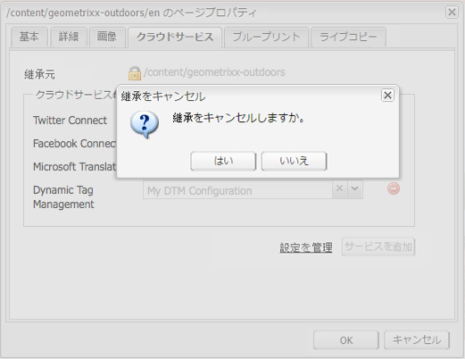

# Adobe Dynamic Tag Management との統合 {#integrating-with-adobe-dynamic-tag-management}

[Adobe Dynamic Tag Management](https://www.adobe.com/solutions/digital-marketing/dynamic-tag-management.html) と AEM を統合すると、Dynamic Tag Management Web プロパティを使用して AEM サイトを追跡できます。マーケターは、Dynamic Tag Management を使用して、データ収集のためのタグを管理し、複数のデジタルマーケティングシステムにデータを配信できます。例えば、Dynamic Tag Management を使用して、AEM Web サイトの使用状況データを収集し、そのデータを Adobe Analytics または Adobe Target に配信して分析します。

統合する前に、AEM サイトのドメインを追跡する Dynamic Tag Management [Web プロパティ](https://microsite.omniture.com/t2/help/ja_JP/dtm/#Web_Properties)を作成する必要があります。The [hosting options](https://microsite.omniture.com/t2/help/ja_JP/dtm/#Hosting__Embed_Tab) of the web property must be configured so that you can configure AEM to access the Dynamic Tag Management libraries.

統合を設定した後は、Dynamic Tag Management デプロイメントツールおよびルールを変更しても、AEM の Dynamic Tag Management 設定を変更する必要はありません。変更内容は AEM で自動的に有効になります。

>[!NOTE]
>
>カスタムプロキシ設定で DTM を使用している場合、AEM の一部の機能は 3.x API といくつかの 4.x API を使用するので、両方の HTTP クライアントプロキシを設定する必要があります。
>
>* 3.x は [http://localhost:4502/system/console/configMgr/com.day.commons.httpclient](http://localhost:4502/system/console/configMgr/com.day.commons.httpclient) のように設定します。
>* 4.x は [http://localhost:4502/system/console/configMgr/org.apache.http.proxyconfigurator](http://localhost:4502/system/console/configMgr/org.apache.http.proxyconfigurator) のように設定します。

>

## デプロイメントオプション {#deployment-options}

次のデプロイメントオプションは、Dynamic Tag Management との統合の設定に影響を与えます。

### Dynamic Tag Management のホスティング {#dynamic-tag-management-hosting}

AEM は、クラウド内または AEM にホストされている Dynamic Tag Management をサポートします。

* クラウドホスト型：Dynamic Tag Management の JavaScript ライブラリがクラウド内に保存されており、AEM ページはそれを直接参照します。
* AEM ホスト型：Dynamic Tag Management が JavaScript ライブラリを生成します。AEM はワークフローモデルを使用してライブラリを取得し、インストールします。

AEM が使用するホスティングのタイプによって、実行する設定および実装タスクの一部が決定されます。ホスティングオプションについては、Dynamic Tag Management ヘルプの[ホスティング - 「埋め込み」タブ](https://microsite.omniture.com/t2/help/ja_JP/dtm/#Hosting__Embed_Tab)を参照してください。

### ステージングおよび実稼動ライブラリ {#staging-and-production-library}

AEM オーサーインスタンスで Dynamic Tag Management のステージング用コードを使用するか実稼動用コードを使用するかを決定します。

一般的に、オーサーインスタンスでは Dynamic Tag Management のステージングライブラリを使用し、実稼動インスタンスでは実稼動ライブラリを使用します。このシナリオでは、オーサーインスタンスを使用して、未承認の Dynamic Tag Management 設定をテストできます。

必要に応じて、オーサーインスタンスで実稼動ライブラリを使用できます。ライブラリがクラウドホスト型の場合は、テスト目的でステージングライブラリを使用するよう切り替えられる Web ブラウザープラグインを利用できます。

### Dynamic Tag Management デプロイメントフックの使用 {#using-the-dynamic-tag-management-deployment-hook}

AEM が Dynamic Tag Management ライブラリをホストしている場合は、Dynamic Tag Management デプロイメントフックサービスを使用して、ライブラリの更新を AEM に自動的にプッシュできます。Dynamic Tag ManagementのWebプロパティの編集時など、ライブラリが変更されると、ライブラリが更新されます。

デプロイメントフックを使用するには、Dynamic Tag Management がライブラリをホストしている AEM インスタンスに接続できなければなりません。You must [enable access to AEM](/help/sites-administering/dtm.md#enabling-access-for-the-deployment-hook-service) for the Dynamic Tag Management servers.

AEM がファイアウォールの背後にある場合など、環境によっては AEM に到達できないことがあります。そのような場合には、AEM のポーリングインポーターオプションを使用して、ライブラリを定期的に取得できます。cron job 式でライブラリダウンロードのスケジュールを決定します。

## デプロイメントフックサービスへのアクセスの有効化 {#enabling-access-for-the-deployment-hook-service}

Dynamic Tag Management デプロイメントフックサービスによる AEM へのアクセスを有効にして、このサービスが AEM ホスト型ライブラリを更新できるようにします。必要に応じてステージングライブラリと実稼動ライブラリを更新するDynamic Tag ManagementサーバーのIPアドレスを指定します。

* ステージング: `107.21.99.31`
* Production: `23.23.225.112` and `204.236.240.48`

[Web コンソール](/help/sites-deploying/configuring-osgi.md#osgi-configuration-with-the-web-console)または [`sling:OsgiConfig`](/help/sites-deploying/configuring-osgi.md#osgi-configuration-in-the-repository) ノードを使用して、設定を実行します。

* Webコンソールで、設定ページの「AdobeDTM Deploy Fook Configuration」項目を使用します。
* OSGi 設定の場合、サービス PID は `com.adobe.cq.dtm.impl.servlets.DTMDeployHookServlet` です。

次の表に、設定するプロパティを示します。

| Web コンソールのプロパティ | OSGi のプロパティ | 説明 |
|---|---|---|
| ステージング DTM IP のホワイトリスト | `dtm.staging.ip.whitelist` | ステージングライブラリを更新する Dynamic Tag Management サーバーの IP アドレス。 |
| 実稼動 DTM IP のホワイトリスト | `dtm.production.ip.whitelist` | 実稼動ライブラリを更新する Dynamic Tag Management サーバーの IP アドレス。 |

## Dynamic Tag Management 設定の作成 {#creating-the-dynamic-tag-management-configuration}

AEM インスタンスが Dynamic Tag Management で認証され、Web プロパティとやり取りできるようにするクラウド設定を作成します。

>[!NOTE]
>
>DTM Web プロパティに Adobe Analytics ツールが含まれていて、[コンテンツインサイト](/help/sites-authoring/content-insights.md)も使用する場合は、ページに 2 つの Adobe Analytics トラッキングコードを含めないようにしてください。[Adobe Analyticsクラウドの設定で](/help/sites-administering/adobeanalytics-connect.md#configuring-the-connection-to-adobe-analytics)、「トラッキングコードを含めない」オプションを選択します。

### 一般的な設定 {#general-settings}

<table>
 <tbody>
  <tr>
   <th>プロパティ</th>
   <th>説明</th>
  </tr>
  <tr>
   <td>API トークン</td>
   <td>Dynamic Tag Management ユーザーアカウントの API トークンプロパティの値。AEM は、Dynamic Tag Management での認証にこのプロパティを使用します。</td>
  </tr>
  <tr>
   <td>会社</td>
   <td>ログイン ID が関連付けられている会社。</td>
  </tr>
  <tr>
   <td>Property</td>
   <td>AEM サイト用のタグを管理するために作成した Web プロパティの名前。</td>
  </tr>
  <tr>
   <td>作成者に対して実稼動用のコードを含める</td>
   <td>
AEM のオーサーインスタンスとパブリッシュインスタンスで実稼動バージョンの Dynamic Tag Management ライブラリを使用する場合は、このオプションをオンにします。 
 
このオプションがオフの場合は、オーサーインスタンスにはステージング設定が適用され、パブリッシュインスタンスには実稼動設定が適用されます。
 </td>
  </tr>
 </tbody>
</table>

### セルフホスティングプロパティ - ステージングと実稼動 {#self-hosting-properties-staging-and-production}

Dynamic Tag Management 設定の次のプロパティによって、AEM は Dynamic Tag Management ライブラリをホストできます。AEM は、これらのプロパティを使用してライブラリをダウンロードし、インストールできます。オプションで、ライブラリを自動的に更新し、Dynamic Tag Management 管理アプリケーションでおこなわれたすべての変更を反映させることができます。

一部のプロパティは、Dynamic Tag Management Web プロパティの「埋め込み」タブの「ライブラリのダウンロード」セクションから取得した値を使用します。詳しくは、Dynamic Tag Management ヘルプの[ライブラリダウンロード](https://microsite.omniture.com/t2/help/ja_JP/dtm/#Library_Download)を参照してください。

>[!NOTE]
>
>Dynamic Tag Management バンドルを AEM にホスティングしている場合は、Dynamic Tag Management でライブラリダウンロードを有効にしてから設定を作成する必要があります。また、ダウンロードするライブラリを提供する Akamai も有効にする必要があります。

Dynamic Tag Management ライブラリを AEM にホスティングしている場合は、設定に従って、AEM が Web プロパティの一部のプロパティを自動的に設定します。次の表の説明を参照してください。

<table>
 <tbody>
  <tr>
   <th>プロパティ</th>
   <th>説明</th>
  </tr>
  <tr>
   <td>セルフホスティングを使用</td>
   <td>Dynamic Tag Management ライブラリファイルを AEM にホスティングする場合にオンにします。このオプションをオンにすると、この表のその他のプロパティが表示されます。</td>
  </tr>
  <tr>
   <td>DTM バンドル URL</td>
   <td>Dynamic Tag Management ライブラリのダウンロードに使用する URL。この値は、Dynamic Tag Management のライブラリダウンロードページの「ダウンロード URL」セクションから取得します。安全上の理由から、この値は手動で設定する必要があります。</td>
  </tr>
  <tr>
   <td>ダウンロードワークフロー</td>
   <td>
Dynamic Tag Management ライブラリのダウンロードおよびインストールに使用するワークフローモデル。デフォルトのモデルは「デフォルトの DTM バンドルのダウンロード」です。カスタムモデルを作成した場合を除き、このモデルを使用します。
 
デフォルトのダウンロードワークフローは、ライブラリがダウンロードされると自動的にアクティベートします。
 </td>
  </tr>
  <tr>
   <td>ドメインのヒント</td>
   <td>
（オプション）Dynamic Tag Management ライブラリをホスティングしている AEM サーバーのドメイン。<a href="/help/sites-developing/externalizer.md">Day CQ Link Externalizer サービス</a>用に設定されているデフォルトのドメインを上書きする値を指定します。
 
Dynamic Tag Management に接続すると、AEM はこの値を使用して、Dynamic Tag Management Web プロパティのライブラリダウンロードプロパティのステージング HTTP パスまたは実稼動 HTTP パスを設定します。
 </td>
  </tr>
  <tr>
   <td>ドメインのヒントを保護</td>
   <td>
（オプション）HTTPS 経由で Dynamic Tag Management ライブラリをホスティングしている AEM サーバーのドメイン。<a href="/help/sites-developing/externalizer.md">Day CQ Link Externalizer サービス</a>用に設定されているデフォルトのドメインを上書きする値を指定します。
 
Dynamic Tag Management に接続すると、AEM はこの値を使用して、Dynamic Tag Management Web プロパティのライブラリダウンロードプロパティのステージング HTTPS パスまたは実稼動 HTTPS パスを設定します。
 </td>
  </tr>
  <tr>
   <td>共有暗号鍵</td>
   <td>
（オプション）ダウンロードの復号化に使用する共有暗号鍵。この値は、Dynamic Tag Managementのライブラリのダウンロードページにある「Shared Secret」フィールドから取得します。
 
<strong>注意：</strong>AEM がダウンロードしたライブラリを復号化できるよう、AEM がインストールされているコンピューター上に <a href="https://www.openssl.org/docs/apps/openssl.html">OpenSSL</a> ライブラリをインストールしておく必要があります。
 </td>
  </tr>
  <tr>
   <td>ポーリングインポーターを有効にする</td>
   <td>
（オプション）更新されたバージョンを確実に使用するよう、Dynamic Tag Management ライブラリを定期的にダウンロードおよびインストールするためにオンにします。選択すると、Dynamic Tag Managementは、デプロイフックURLにHTTPPOSTリクエストを送信しません。
 
AEM は、Dynamic Tag Management Web プロパティのライブラリダウンロードプロパティのデプロイフック URL プロパティを自動的に設定します。オンにした場合、このプロパティは値なしで設定されます。選択しない場合、プロパティはDynamic Tag Management設定のURLを使用して設定されます。
 
例えば、AEM がファイアウォールの背後にある場合など、Dynamic Tag Management デプロイフックが AEM に接続できない場合に、ポーリングインポーターを有効にします。
 </td>
  </tr>
  <tr>
   <td>スケジュール式</td>
   <td>（「ポーリングインポーターを有効にする」をオンにした場合に表示され、必須になります。）Dynamic Tag management ライブラリをいつダウンロードするかを制御する cron 式。</td>
  </tr>
 </tbody>
</table>

### クラウドホスティングプロパティ - ステージングと実稼動 {#cloud-hosting-properties-staging-and-production}

Dynamic Tag Configuration がクラウドホスト型の場合は、Dynamic Tag Management 設定の次のプロパティを設定します。

<table>
 <tbody>
  <tr>
   <th>プロパティ</th>
   <th>説明</th>
  </tr>
  <tr>
   <td>セルフホスティングを使用</td>
   <td>Dynamic Tag Management ライブラリファイルがクラウド内にホストされている場合は、このオプションをオフにします。</td>
  </tr>
  <tr>
   <td>ヘッダーコード</td>
   <td>
ホストの Dynamic Tag Management から取得したステージング用のヘッダーコード。Dynamic Tag Management に接続すると、この値が自動的に設定されます。
 
 Dynamic Tag Management でこのコードを確認するには、「埋め込み」タブをクリックし、ホスト名をクリックします。「ヘッダーコード」セクションを展開し、必要に応じて「ステージング埋め込みコード」領域または「実稼動埋め込みコード」領域の「埋め込みコードをコピー」をクリックします。
 </td>
  </tr>
  <tr>
   <td>フッターコード</td>
   <td>
ホストの Dynamic Tag Management から取得したステージング用のフッターコード。Dynamic Tag Management に接続すると、この値が自動的に設定されます。
 
Dynamic Tag Management でこのコードを確認するには、「埋め込み」タブをクリックし、ホスト名をクリックします。「フッターコード」セクションを展開し、必要に応じて「ステージング埋め込みコード」領域または「実稼動埋め込みコード」領域の「埋め込みコードをコピー」をクリックします。
 </td>
  </tr>
 </tbody>
</table>

以下の手順では、タッチ操作向け UI を使用して、Dynamic Tag Management との統合を設定します。

1. レールで、ツール／操作／クラウド／クラウドサービスをクリックします。
1. 「Dynamic Tag Management」領域に、設定を追加するために次のリンクのどちらかが表示されます。

   * 追加する最初の設定である場合は、「今すぐ設定」をクリックします。
   * ひとつ以上の設定が作成されている場合は、「設定を表示」をクリックし、「利用可能な設定」の横の「+」リンクをクリックします。

   

1. 設定のタイトルを入力して、「作成」をクリックします。
1. 「API トークン」フィールドに、Dynamic Tag Management ユーザーアカウントの API トークンプロパティの値を入力します。

   APIトークンの値を取得するには、DTM ClientCareにお問い合わせください。

   >[!NOTE]
   >
   >API トークンは、Dynamic Tag Management ユーザーが明示的にリクエストするまで有効期限切れになりません。

   

1. 「DTM に接続」をクリックします。AEM が Dynamic Tag Management で認証され、アカウントが関連付けられている会社のリストを取得します。
1. 会社を選択し、AEM サイトの追跡に使用するプロパティを選択します。
1. オーサーインスタンスでステージング用コードを使用する場合は、「作成者に対して実稼動用のコードを含める」をオフにします。
1. 必要に応じて「ステージング設定」タブおよび「実稼動設定」タブのプロパティに値を設定し、「OK」をクリックします。

## Dynamic Tag Management ライブラリの手動ダウンロード {#manually-downloading-the-dynamic-tag-management-library}

Dynamic Tag Management ライブラリを手動でダウンロードして、AEM 上でただちに更新します。例えば、ライブラリを自動ダウンロードするようにポーリングインポーターをスケジュール設定する前に更新されたライブラリをテストしたい場合は、手動でダウンロードします。

1. レールで、ツール／操作／クラウド／クラウドサービスをクリックします。
1. 「Dynamic Tag Management」領域で、「設定を表示」をクリックし、設定をクリックします。
1. 「ステージング設定」領域または「実稼動設定」領域で、「ダウンロードワークフローをトリガー」ボタンをクリックして、ライブラリバンドルをダウンロードおよびデプロイします。

   

>[!NOTE]
>
>ダウンロードしたファイルは、に保存され `/etc/clientlibs/dtm/my config/companyID/propertyID/servertype`ます。
>
>次の設定は、[DTM 設定](#creating-the-dynamic-tag-management-configuration)から直接取得しました。
>
>* `myconfig`
>* `companyID`
>* `propertyID`
>* `servertype`

>

## Dynamic Tag Management 設定とサイトの関連付け {#associating-a-dynamic-tag-management-configuration-with-your-site}

AEM が必要なスクリプトをページに追加できるよう、Dynamic Tag Management 設定と Web サイトのページを関連付けます。サイトのルートページと設定を関連付けます。そのページのすべての子孫が関連付けを継承します。 必要に応じて、子孫ページで関連付けを上書きできます。

ページと子孫をDynamic Tag Management設定に関連付けるには、次の手順を実行します。

1. サイトのルートページをクラシック UI で開きます。
1. サイドキックを使用して、ページのプロパティを開きます。
1. 「クラウドサービス」タブで、「サービスを追加」をクリックし、「Dynamic Tag Management」を選択して、「OK」をクリックします。

   

1. Dynamic Tag Management ドロップダウンメニューを使用して設定を選択し、「OK」をクリックします。

次の手順を実行して、ページに対する継承された設定の関連付けを上書きします。この上書きは、ページおよびページの子孫すべてに影響します。

1. クラシック UI でページを開きます。
1. サイドキックを使用して、ページのプロパティを開きます。
1. 「クラウドサービス」タブで、「継承元」プロパティの横の鍵アイコンをクリックし、確認ダイアログボックスで「はい」をクリックします。

   

1. Dynamic Tag Management 設定を削除するか、別の Dynamic Tag Management 設定を選択して、「OK」をクリックします。

