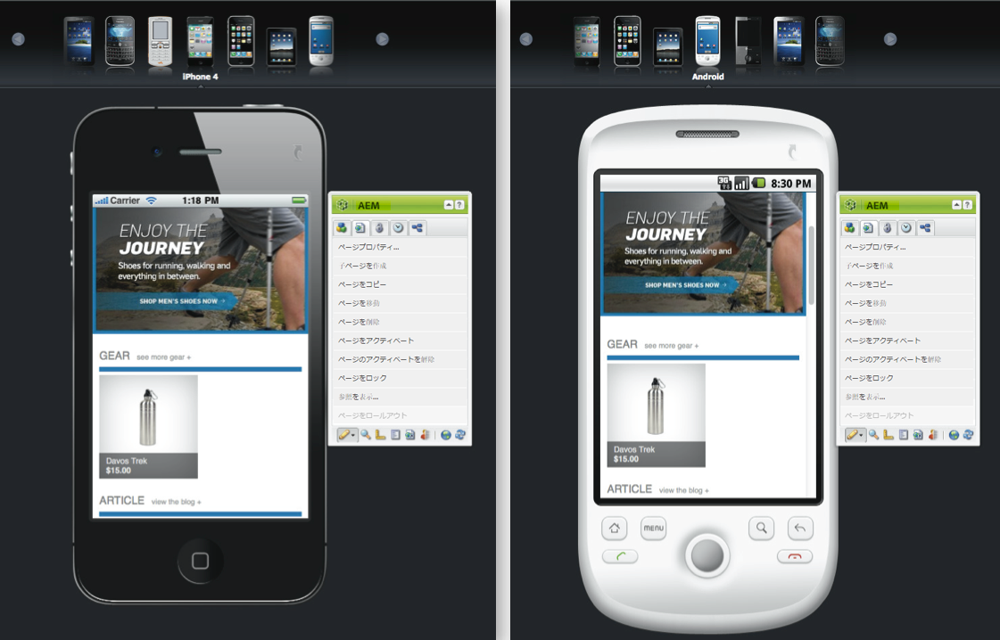
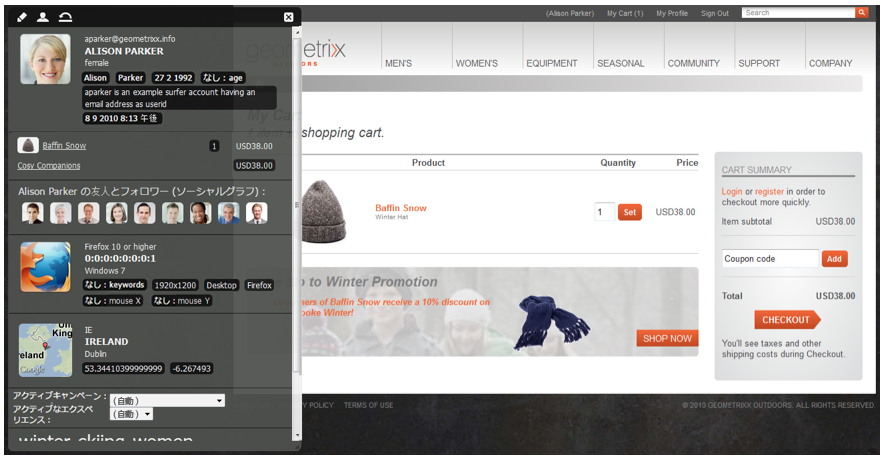
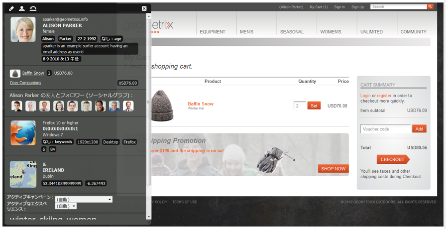

# e コマース{#ecommerce}

* [概念 ](/help/sites-administering/concepts.md)
* [管理（汎用）](/help/sites-administering/generic.md)

アドビでは、2 つのバージョンの Commerce 統合フレームワークを提供しています。

<table>
 <tbody>
  <tr>
   <th>
 
 </th>
   <th>
CIF オンプレミス
 </th>
   <th>
CIF クラウド
 </th>
  </tr>
  <tr>
   <td>
サポートされている AEM バージョン
 </td>
   <td>
AEM オンプレミスまたは AMS 6.x
 </td>
   <td>AEM AMS 6.4 および 6.5</td>
  </tr>
  <tr>
   <td>
バックエンド
 </td>
   <td>
    <ul>
     <li>AEM、Java</li>
     <li>モノリシック統合、ビルド前マッピング（テンプレート）</li>
     <li>JCR リポジトリ</li>
    </ul> </td>
   <td>
    <ul>
     <li>Magento</li>
     <li>Java と Javascript</li>
     <li>コマースデータは JCR リポジトリに保存されない</li>
    </ul> </td>
  </tr>
  <tr>
   <td>
フロントエンド
 </td>
   <td>
AEM サーバー側によってページをレンダリング
 </td>
   <td>混在型ページアプリケーション（ハイブリッドレンダリング）</td>
  </tr>
  <tr>
   <td>
製品カタログ
 </td>
   <td>
    <ul>
     <li>製品インポーター、エディター、AEMでのキャッシュ</li>
     <li>AEM またはプロキシページを含む標準のカタログ</li>
    </ul> </td>
   <td>
    <ul>
     <li>製品のインポートなし</li>
     <li>汎用テンプレート</li>
     <li>コネクタ経由のオンデマンドデータ</li>
    </ul> </td>
  </tr>
  <tr>
   <td>
スケーラビリティ
 </td>
   <td>
    <ul>
     <li>最大で数百万の製品をサポート可能（使用例に依存）</li>
     <li>Dispatcher でのキャッシュ</li>
    </ul> </td>
   <td>
    <ul>
     <li>ボリューム制限なし</li>
     <li>Dispatcher または CDN でのキャッシュ</li>
    </ul> </td>
  </tr>
  <tr>
   <td>標準化されたデータモデル</td>
   <td>不可</td>
   <td>あり。Magento GraphQL スキーマ</td>
  </tr>
  <tr>
   <td>入手方法</td>
   <td>
はい。SAP Commerce Cloud（拡張機能は AEM 6.4 および Hybris 5（デフォルト）をサポートするように更新され、Hybris 4 との互換性を維持）
 
Salesforce Commerce Cloud（AEM 6.4 をサポートするためにオープンソース化されたコネクタ）
 </td>
   <td>あり。GitHub 経由のオープンソース。Magento Commerce（Magento 2.3.2（デフォルト）をサポート、Magento 2.3.1 と互換性あり）</td>
  </tr>
  <tr>
   <td>用途</td>
   <td>限られた使用例：小規模で静的なカタログのインポートが必要なシナリオなど</td>
   <td>ほとんどの使用例で好ましいソリューション</td>
  </tr>
 </tbody>
</table>

e コマースフレームワークは、商品情報管理（PIM）と連動して、オンラインストアでの商品の販売に焦点を合わせた Web サイトの以下のアクティビティを扱います。

* 商品の作成、ライフタイム、陳腐化
* 価格管理
* トランザクション管理
* カタログ全体の管理
* ライブおよび一元管理されたストレージレコード
* Web インターフェイス

AEM e コマースフレームワークは、特定のブランド用に構築され、顧客ごとにパーソナライズされたショッピングエクスペリエンスを、Web、モバイル、ソーシャルという各種タッチポイントにまたがって提供するために役立ちます。AEM オーサリング環境では、ターゲット訪問者のコンテキストとマーチャンダイジング戦略に基づき、次のようなページとコンポーネントをカスタマイズできます。

* 商品ページ
* 買い物かごコンポーネント
* チェックアウトコンポーネント

これらを実装することで、商品情報へのリアルタイムアクセスが可能になります。リアルタイムアクセスにより、以下を実現できます。

* 商品情報の完全性
* 価格
* 在庫管理インベントリ
* 買い物かごの状態のバリエーション

>[!NOTE]
>
>この統合フレームワークを外部 e コマースプロバイダーと連携して利用するには、まず必要なパッケージをインストールする必要があります。For more information, see [Deploying eCommerce](/help/sites-deploying/ecommerce.md).
>
>For information about extending eCommerce capabilities, see [Developing eCommerce](/help/sites-developing/ecommerce.md).

## 主な機能 {#main-features}

AEM e コマースフレームワークは、以下の機能を提供します。

* A number of **out-of-the-box AEM components** to illustrate what can be achieved for your project:

   * 商品の表示
   * 買い物かご
   * チェックアウト
   * 最近表示した商品
   * 割引券
   * その他

   

   >[!NOTE]
   >
   >AEM が提供するこの統合フレームワークを利用して、特定の e コマースエンジンに依存しないコマース機能を実現する追加の AEM コンポーネントを作成することもできます。

* **検索** - 次のいずれかを使用します。

   * AEM 検索
   * e コマースシステムの検索
   * サードパーティの検索（Search&amp;Promote など）
   * またはこれらの組み合わせ

   

* Uses the AEM ability to **present your content on multiple channels**, be that full browser window or mobile device. これにより、訪問者が必要とする形式でコンテンツが提供されます。

   

* **[AEM e コマースフレームワーク](#the-framework)**&#x200B;に基づいて独自の統合実装を開発する機能。

   現在利用できる 2 つの実装は、どちらも同じ基盤、つまり一般的な API（フレームワーク）上で作成されています。新しい統合の実装は、統合に必要な機能を実装するだけです。すべての新しい実装はインターフェイスを使用する（したがって実装から独立している）ので、フロントエンドコンポーネントを使用できます。

* **買い物客データとアクティブティに基づくエクスペリエンス駆動型コマース**&#x200B;を開発する可能性。これにより、多くのシナリオを実現できます。

   * 1 つの例としては、合計注文金額が特定の金額を超えた場合に送料を下げることができます。
   * もう 1 つの例としては、プロファイルデータ（場所など）を使用したシーズンオファーを提供できます。必要な場合は、やはり他の要因に応じて、これらのオファーを強調表示できます。

   以下の例では、買い物かごの中身が 75 ドル未満なので、1 つのティーザーが表示されています。

   

   買い物かごの中身が 75 ドルを超えると、このティーザーを変更できます。

   

* その他の機能には、以下のものがあります。

   * セッションをまたがって維持される買い物かごの中身
   * 詳細な注文履歴
   * カタログの高速更新

## フレームワーク {#the-framework}

このフレームワークの詳細については「[概念](/help/sites-administering/concepts.md)」の節で説明しますが、ここで概要を簡単に説明しておきます。

### 概要 {#what}

* この統合フレームワークには、API、機能を説明するための幅広いコンポーネント、接続方法の例を示すためのいくつかの拡張が用意されています。
* このフレームワークは、プロジェクトの実装に必要な基本構造です。
* このフレームワークは拡張可能です。
* このフレームワークには、そのまま使用できるデフォルトのサイトはありません。フレームワークを実際の仕様に適合させるには、ある程度の開発作業が必要です。

### Why? {#why}

* カスタマイズされたeコマースサイトを迅速に実現するのに必要な基本メカニズムを提供する。
* 実際の e コマースサイトの開発に必要な柔軟性をもたらします。
* ベストプラクティスを示します。