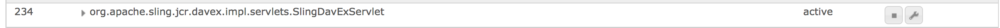

# AEM での CRXDE Lite の有効化{#enabling-crxde-lite-in-aem}

AEM のインストールを可能な限り保護するために、セキュリティチェックリストでは実稼動環境で [WebDAV を無効化](/help/sites-administering/security-checklist.md#disable-webdav)することをお勧めしています。

ただし、CRXDE Lite が正しく機能するには `org.apache.sling.jcr.davex` バンドルに依存するので、WebDAV を無効にすると CRXDE Lite も無効になります。

When this happens, browsing to `https://serveraddress:4502/crx/de/index.jsp` will display an empty root node, and all HTTP requests to CRXDE Lite resources will fail:

```xml
404 Resource at '/crx/server/crx.default/jcr:root/.1.json' not found: No resource found
```

この推奨事項は攻撃対象領域を可能な限り減らすことを目的としていますが、システム管理者はコンテンツの参照や実稼動インスタンスの問題をデバッグするために CRXDE Lite にアクセスする必要がある場合があります。

無効にした場合、CRXDE Lite をオンにするには次の手順を実行します。

1. Go to the OSGi Components console at `http://localhost:4502/system/console/components`
1. 次のコンポーネントを検索します。

   * `org.apache.sling.jcr.davex.impl.servlets.SlingDavExServlet`

1. その設定オプションを確認するには、その横にあるレンチアイコンをクリックします。

   

1. 次の設定を作成します。

   * **ルートパス:** `/crx/server`
   * 下の「**絶対 URI を使用**」ボックスにチェックマークを入れます。

1. CRXDE Lite の使用が終わったら、再度 WebDAV を無効にしてください。

CRXDE Lite は、次のコマンドを実行して、cURL を使用して有効にすることもできます。

```shell
curl -u admin:admin -F "jcr:primaryType=sling:OsgiConfig" -F "alias=/crx/server" -F "dav.create-absolute-uri=true" -F "dav.create-absolute-uri@TypeHint=Boolean" http://localhost:4502/apps/system/config/org.apache.sling.jcr.davex.impl.servlets.SlingDavExServlet
```

## その他のリソース {#other-resources}

AEM 6 のセキュリティ機能について詳しくは、次のページを参照してください。

* [AEM セキュリティチェックリスト](/help/sites-administering/security-checklist.md)
* [実稼動準備モードでの AEM の実行](/help/sites-administering/production-ready.md)

