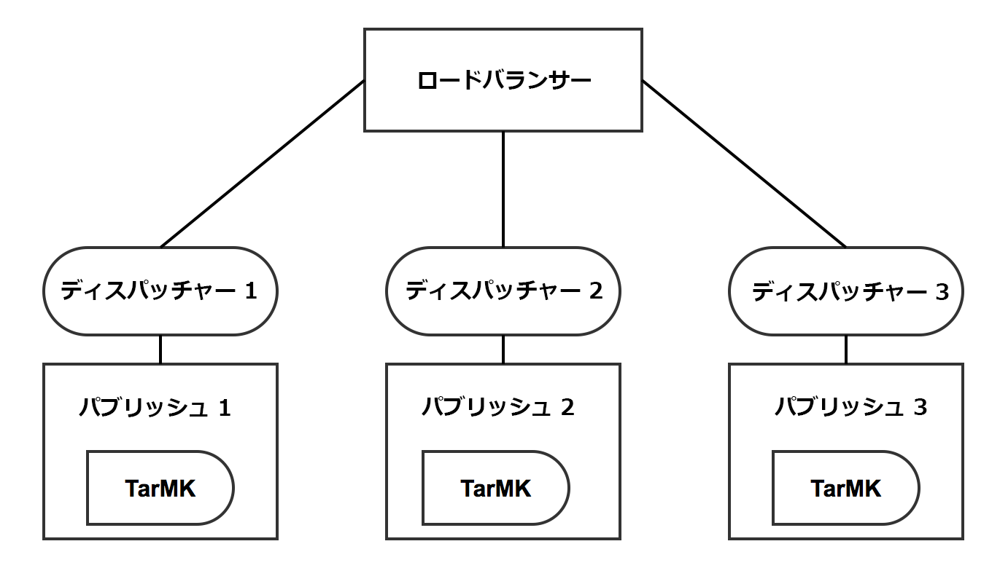
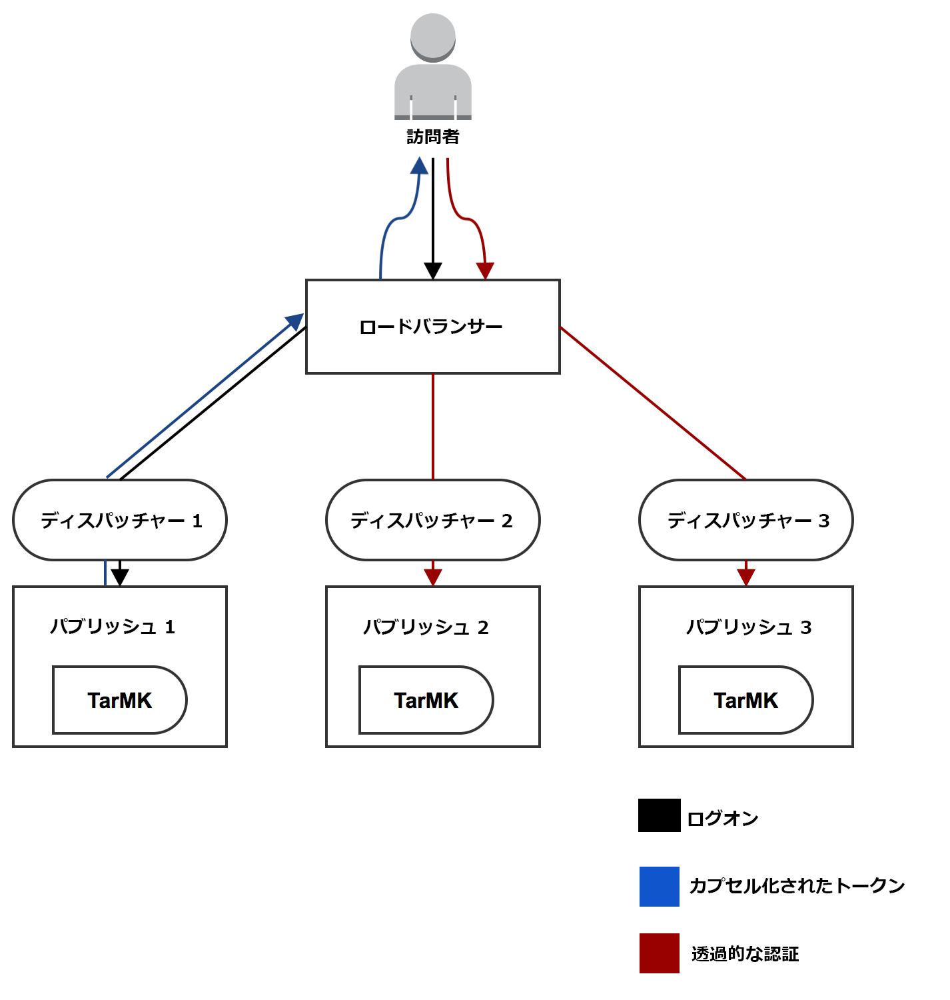
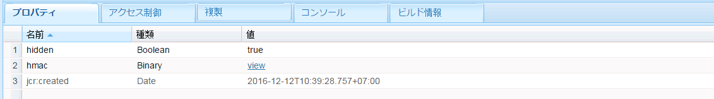

# カプセル化されたトークンのサポート{#encapsulated-token-support}

## 概要 {#introduction}

デフォルトでは、AEM は各リクエストの認証にトークン認証ハンドラーを使用します。ただし、認証リクエストに対応するために、トークン認証ハンドラーはリクエストごとにリポジトリにアクセスする必要があります。これは、認証の状態を維持するのに cookie が使用されるからです。理論上、後続のリクエストを検証するには、リポジトリに状態が保持される必要があります。要するに、認証メカニズムがステートフルであるということです。

これは、水平方向のスケーラビリティを確保するために特に重要です。以下のパブリッシュファームのようなマルチインスタンスの設定では、最適なロードバランシングは実現できません。ステートフル認証では、保持された認証状態はユーザーが最初に認証されたインスタンスでのみ使用できます。

次のシナリオを例として使用します。

ユーザーはパブリッシュインスタンス 1 で認証できますが、後続のリクエストがパブリッシュインスタンス 2 に送られても、状態はパブリッシュ 1 のリポジトリに保持されており、パブリッシュ 2 には独自のリポジトリがあるのでその保持された認証状態を持ちません。

これを解決するには、ロードバランサーレベルで定着接続を設定します。定着接続を使用すると、ユーザーは常に同じパブリッシュインスタンスに送られます。その結果、真に最適なロードバランシングは実現しません。

あるパブリッシュインスタンスが使用できなくなると、そのインスタンスで認証されているすべてのユーザーのセッションが失われます。これは、認証の cookie の検証にはリポジトリへのアクセスが必要なためです。

## カプセル化されたトークンを使用したステートレス認証 {#stateless-authentication-with-the-encapsulated-token}

AEM の新しいカプセル化されたトークンサポートを使用したステートレス認証により、水平方向のスケーラビリティを確保できます。

カプセル化トークンは暗号化の一部で、AEMは、リポジトリにアクセスすることなく、オフラインで認証情報を安全に作成および検証できます。 この方法により、認証リクエストがすべてのパブリッシュインスタンスでおこなわれるようになるので、定着接続は不要です。また、認証リクエストごとにリポジトリにアクセスする必要がなくなるので、認証のパフォーマンスが向上するというメリットもあります。

MongoMK オーサーインスタンスと TarMK パブリッシュインスタンスによる地理的に分散したデプロイメントでこれがどのように機能するかを以下に示します。

>[!NOTE]
>
>カプセル化されたトークンは認証に使用されます。これにより、リポジトリにアクセスすることなく cookie を確実に検証できます。ただし、すべてのインスタンスにユーザーが存在し、そのユーザーの下に保存された情報にすべてのインスタンスがアクセスできる必要があります。
>
>例えば、パブリッシュインスタンス 1 に新しく作成されたユーザーは、カプセル化されたトークンにより、パブリッシュインスタンス 2 でも正常に認証されます。ユーザーがパブリッシュインスタンス 2 に存在しない場合、リクエストは失敗します。

## カプセル化されたトークンの設定 {#configuring-the-encapsulated-token}

>[!NOTE]
>ユーザーを同期し、トークン認証に依存するすべての認証ハンドラー（SAMLおよびOAuthなど）は、次の場合にのみ、カプセル化されたトークンで機能します。
>
>* スティッキーセッションが有効になっているか、
   >
   >
* 同期開始時に、ユーザーがAEMで既に作成されている。 つまり、同期処理中にハンドラーが **ユーザーを** 作成する状況では、カプセル化されたトークンはサポートされません。

カプセル化されたトークンを設定する際には、いくつかの点を考慮する必要があります。

1. 関与する暗号作成技術により、すべてのインスタンスに同じ HMAC 鍵が必要です。AEM 6.3 以降、鍵要素はリポジトリではなく、実際のファイルシステムに保存されます。したがって、鍵をレプリケーションするのに最適な方法は、ソースインスタンスのファイルシステムから、鍵のレプリケーション先となるターゲットインスタンスのファイルシステムに鍵要素をコピーすることです。詳しくは、次の「HMAC 鍵のレプリケーション」を参照してください。
1. カプセル化されたトークンを有効にする必要があります。これは Web コンソールで実行できます。

### HMAC 鍵のレプリケーション {#replicating-the-hmac-key}

The HMAC key is present as a binary property of `/etc/key` in the repository. その横にある **View** リンクをクリックすることで別個にダウンロードできます。

インスタンス間で鍵をレプリケーションするには、次の手順に従います。

1. コピーする鍵要素を含む AEM インスタンス（通常はオーサーインスタンス）にアクセスします。
1. ローカルファイルシステム内で、`com.adobe.granite.crypto.file` を見つけます。例えば、次のパスにあります。

   * &lt;author-aem-install-dir>/crx-quickstart/launchpad/felix/bundle21

   各フォルダー内の `bundle.info` ファイルは、バンドル名を示します。 

1. データフォルダーに移動します。次に例を示します。

   * `<author-aem-install-dir>/crx-quickstart/launchpad/felix/bundle21/data`

1. HMAC とマスターファイルをコピーします。
1. 次に、HMAC 鍵の複製先となるターゲットインスタンスにアクセスし、データフォルダーに移動します。次に例を示します。

   * `<publish-aem-install-dir>/crx-quickstart/launchpad/felix/bundle21/data`

1. 前の手順でコピーした 2 つのファイルを貼り付けます。
1. ターゲットインスタンスが既に実行されている場合は、[Crypto バンドルを更新](/help/communities/deploy-communities.md#refresh-the-granite-crypto-bundle)します。

1. 鍵のレプリケーション先のすべてのインスタンスに対して上記の手順を繰り返します。

#### カプセル化されたトークンの有効化 {#enabling-the-encapsulated-token}

HMAC 鍵がレプリケートされたら、Web コンソールを介してカプセル化されたトークンを有効化できます。

1. ブラウザーで `https://serveraddress:port/system/console/configMgr`
1. **Day CRX Token Authentication Handler** というエントリを探し、クリックします。
1. 次の画面で「**Enable encapsulated token support**」ボックスにチェックマークを入れて「**Save**」を押します。

