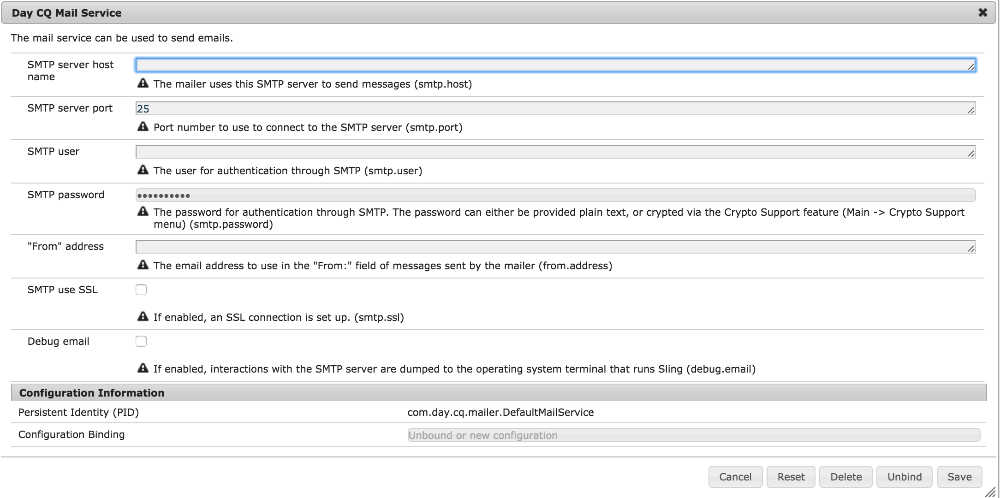

# 設定プロパティの暗号化サポート{#encryption-support-for-configuration-properties}

## 概要 {#overview}

この機能を使用すると、すべての OSGI 設定プロパティをクリアテキストではなく保護された暗号化形式で保存できます。WebコンソールUIのフォームは、システム全体の暗号化マスターキーを使用して、クリアテキストから暗号化テキストを作成するために使用します。

OSGi 設定プラグインのサポートは、サービスによって使用される前に、プロパティを復号化するために追加されました。

>[!NOTE]
>
>暗号化された値を予期するサービスは、値を復号化する前に IsProtected チェックを使用して、暗号化されているかどうかを確認する必要があります。

## 暗号化サポートの有効化 {#enabling-encryption-support}

これらの手順は、メールサービスの SMTP パスワードを暗号化する方法を示します。暗号化する OSGI プロパティに対してこれらのステップを完了します。

1. Go to the AEM Web Console at *https://&lt;serveraddress>:&lt;serverport>/system/console/configMgr*
1. 左上隅の **Main／Crypto Support** に移動します。

   

1. **Adobe Experience Manager Web Console Crypto Support** ページが表示されます。

   

1. 「**Plain Text**」フィールドに保護する機密データのテキストを入力します。
1. 「**Protect**」を選択します。保護されたテキストは暗号化されたテキストとして表示されます。

   

1. ステップ 5 の保護テキストをコピーして OSGI フォーム値に貼り付けます。この例では、暗号化された **SMTP パスワード** は *Day CQ Mail Service* に追加されます。

   

1. Day CQ Mail Service のプロパティを保存します。SMTP パスワードは暗号化された値として送信されます。

## 復号化サポート {#decryption-support}

AEM は現在、設定プロパティを復号化するための設定プラグインを提供しています。このAEM Plugin は自動的に復号化してクリアテキストプロパティを取得します。
