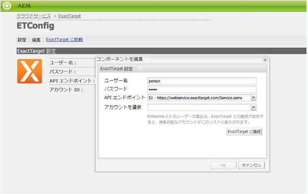
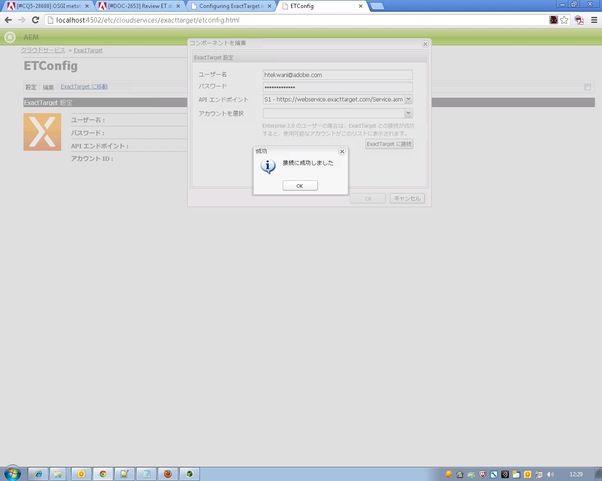
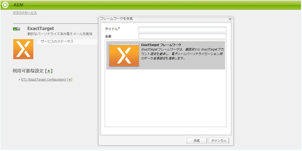

# ExactTarget との統合{#integrating-with-exacttarget}

AEMと完全一致ターゲットを統合すると、AEMで作成した電子メールを管理し、完全一致ターゲットを使用して送信できます。 また、AEMページのAEM formsを介した正確なターゲットのリード管理機能を使用することもできます。

この統合によって次の機能を使用できるようになります。

* AEM で電子メールを作成し、その電子メールを配信するために ExactTarget に公開する機能。
* AEM フォームのアクションを設定して ExactTarget 購読者を作成する機能。

ExactTarget の設定後、ニュースレターや電子メールを ExactTarget に公開できます。[電子メールサービスへのニュースレターの公開](/help/sites-authoring/personalization.md)を参照してください。

## ExactTarget 設定の作成 {#creating-an-exacttarget-configuration}

ExactTarget 設定は、クラウドサービスまたはツールを使用して追加できます。ここでは、両方の手順について説明します。

### クラウドサービスを使用した ExactTarget の設定 {#configuring-exacttarget-via-cloudservices}

クラウドサービスで ExactTarget 設定を作成するには：

1. ようこそページで「**クラウドサービス**」をクリックします(Or directly access at `https://<hostname>:<port>/etc/cloudservices.html`.)
1. Click **ExactTarget** and then **Configure**. ExactTarget 設定ウィンドウが開きます。

   

1. タイトルを入力し、オプションで名前を入力して、「**作成**」をクリックします。**ExactTarget 設定**&#x200B;ウィンドウが開きます。

   

1. ユーザー名とパスワードを入力し、API エンドポイント（例：**https://webservice.exacttarget.com/Service.asmx**）を選択します。
1. 「**ExactTarget に接続」をクリックします。**&#x200B;接続に成功したら、成功ダイアログが表示されます。「**OK**」をクリックしてウィンドウを閉じます。

   

1. アカウントを使用できる場合は選択します。アカウントは Enterprise 2.0 ユーザー向けのものです。「**OK**」をクリックします。

   これで、ExactTarget が設定されました。「**編集**」をクリックして、この設定を編集できます。You can go to ExactTarget by clicking **Go to ExactTarget**.

1. AEM にはデータ拡張機能が備わっています。ExactTarget データ拡張列を読み込むことができます。ExactTarget データ拡張列は、作成後の ExactTarget 設定の横にある「+」記号をクリックして設定できます。ドロップダウンリストから既存のデータ拡張を選択できます。データ拡張の設定方法について詳しくは、[ExactTarget のドキュメント](https://help.exacttarget.com/en/documentation/exacttarget/subscribers/data_extensions_and_data_relationships)を参照してください。

   読み込まれたデータ拡張列は、後で&#x200B;**テキストおよびパーソナライゼーション**&#x200B;コンポーネントにより使用できます。

   

### ツールを使用した ExactTarget の設定 {#configuring-exacttarget-via-tools}

ツールで ExactTarget 設定を作成するには：

1. ようこそページで「**ツール**」をクリックします。または、に移動して直接移動し `https://<hostname>:<port>/misadmin#/etc`ます。
1. 「**ツール**」、「**クラウドサービス設定**」、「**ExactTarget**」の順に選択します。
1. Click **New** to open the **Create Page **window.

   

1. **タイトル**&#x200B;を入力し、オプションで&#x200B;**名前**&#x200B;を入力して、「**作成**」をクリックします。
1. 前述の手順 4 で示した設定情報を入力します。その手順に従って、ExactTarget の設定を完了します。

### 複数の設定の追加 {#adding-multiple-configurations}

複数の設定を追加するには：

1. ようこそページで「**クラウドサービス**」をクリックし、「**ExactTarget**」をクリックします。Click on **Show Configurations** button which appears if one or more ExactTarget configurations is available. 利用可能なすべての設定が一覧表示されます。
1. 「利用可能な設定」の横にある「**+**」記号をクリックします。**設定を作成**&#x200B;ウィンドウが開きます。前述の設定手順に従って新しい設定を作成します。