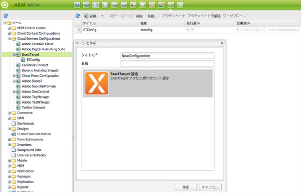

# ExactTarget との統合{#integrating-with-exacttarget}

AEM と ExactTarget の統合によって、AEM で作成されたメールを管理し、ExactTarget 経由で送信することができます。また、AEM ページの AEM フォームを使用して、ExactTarget のリード管理機能を使用できます。

統合により、次の機能を利用できます。

* E メールをAEMで作成し、ExactTarget に公開して配布する機能。
* AEMフォームのアクションを設定して、ExactTarget 購読者を作成する機能。

ExactTarget の設定後、ExactTarget にニュースレターや電子メールを発行できます。 詳しくは、 [電子メールサービスへのニュースレターの公開](/help/sites-authoring/personalization.md).

## ExactTarget 設定の作成 {#creating-an-exacttarget-configuration}

ExactTarget 設定は、クラウドサービスまたはツールを使用して追加できます。 この節では、両方の方法について説明します。

### クラウドサービスを使用した ExactTarget の設定 {#configuring-exacttarget-via-cloudservices}

Cloud Servicesで ExactTarget 設定を作成するには：

1. ようこそページで、 **Cloud Services**. （または `https://<hostname>:<port>/etc/cloudservices.html` で直接アクセスします）。
1. 「**ExactTarget**」、「**設定**」の順にクリックします。ExactTarget 設定ウィンドウが開きます。

   

1. タイトルを入力し、オプションで名前を入力して、「**作成**」をクリックします。**ExactTarget 設定**&#x200B;の設定ウィンドウが開きます。

   

1. ユーザー名とパスワードを入力し、API エンドポイント（例： **https://webservice.exacttarget.com/Service.asmx**）を選択します。
1. クリック **ExactTarget に接続します。** 接続に成功すると、成功ダイアログが表示されます。 「**OK**」をクリックしてウィンドウを閉じます。

   

1. アカウントを選択します（使用可能な場合）。 このアカウントは Enterprise 2.0 のお客様向けです。 「**OK**」をクリックします。

   ExactTarget が設定されました。 「**編集**」をクリックして、この設定を編集できます。「**ExactTarget に移動**」をクリックして、ExactTarget に移動できます。

1. AEMにデータ拡張機能が追加されました。 ExactTarget データ拡張列をインポートできます。 ExactTarget 設定が正常に作成された以外に表示される「+」記号をクリックすることで、設定できます。 ドロップダウンリストから既存のデータ拡張を選択できます。 データ拡張機能の設定方法について詳しくは、 [ExactTarget ドキュメント](https://help.salesforce.com/s/articleView?id=sf.mc_es_data_extension_data_relationships_classic.htm&amp;type=5).

   インポートされたデータ拡張列は、後で **テキストとパーソナライゼーション** コンポーネント。

   

### ツールを使用した ExactTarget の設定 {#configuring-exacttarget-via-tools}

ツールで ExactTarget 設定を作成するには：

1. ようこそページで、 **ツール**. または、`https://<hostname>:<port>/misadmin#/etc` に移動して直接そこに移動します。
1. 「**ツール**」、「**クラウドサービス設定**」、「**ExactTarget**」の順に選択します。
1. 「**新規**」をクリックして、ページを作成ウィンドウを開きます。

   

1. 次を入力します。 **タイトル** オプションで **名前**&#x200B;をクリックし、 **作成**.
1. 前の手順 4 で説明した設定情報を入力します。 この手順に従って、ExactTarget の設定を完了します。

### 複数の設定の追加 {#adding-multiple-configurations}

複数の設定を追加するには：

1. ようこそページで、 **Cloud Services** をクリックし、 **ExactTarget**. 「**設定を表示**」ボタンをクリックします。このボタンは、1 つ以上の ExactTarget 設定がある場合に表示されます。使用可能なすべての設定が表示されます。
1. 次をクリック： **+** [ 利用可能な設定 ] の横に記号を付けます。 これにより、 **設定を作成** ウィンドウ 前の設定手順に従って、新しい設定を作成します。
