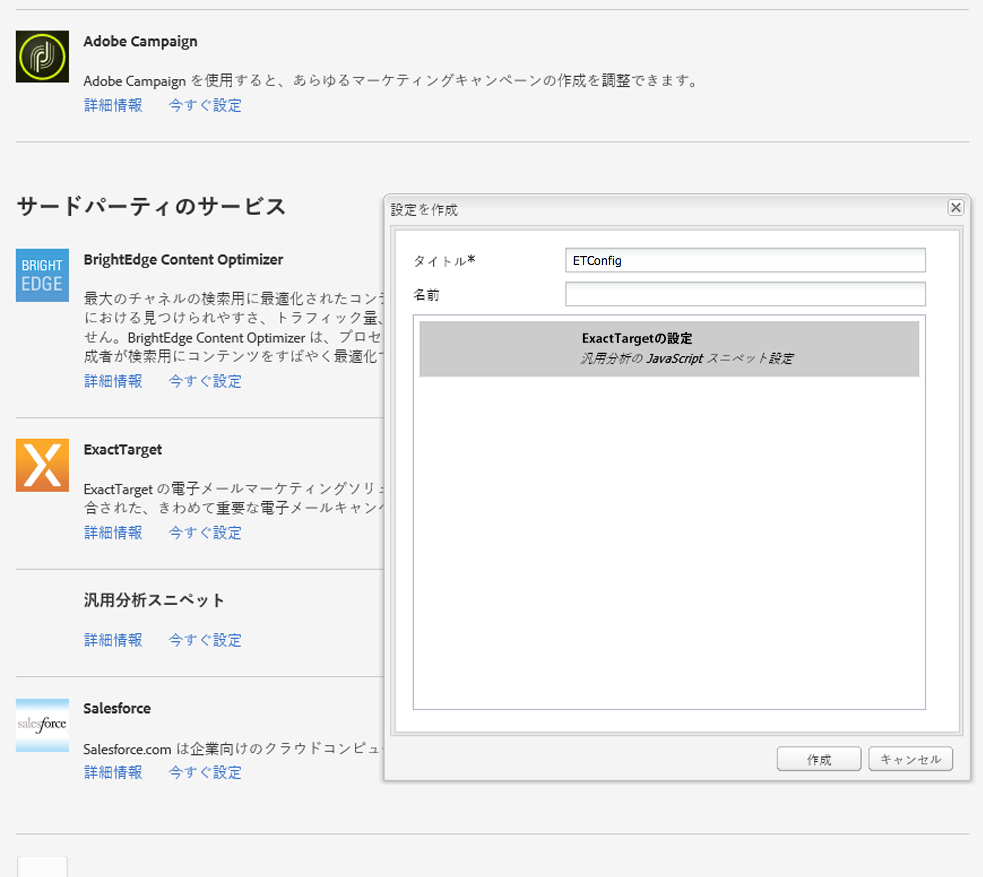

# ExactTarget との統合{#integrating-with-exacttarget}

Adobe Experience Manager（AEM）と Exact Target の統合によって、AEM で作成されたメールを管理し、Exact Target 経由で送信することができます。また、AEM ページの AEM フォームを使用して、Exact Target のリード管理機能を使用できます。

この統合によって次の機能を使用できるようになります。

* AEM でメールを作成し、そのメールを配信するために ExactTarget に公開する機能。
* AEM フォームのアクションを設定して、ExactTarget サブスクライバーを作成する機能。

ExactTarget の設定後に、ニュースレターやメールを ExactTarget に公開できます。[メールサービスへのニュースレターの公開](/help/sites-authoring/personalization.md)を参照してください。

## ExactTarget 設定の作成 {#creating-an-exacttarget-configuration}

ExactTarget 設定は、クラウドサービスまたはツールを使用して追加できます。この節では、両方の手順について説明します。

### クラウドサービスを使用した ExactTarget の設定 {#configuring-exacttarget-via-cloudservices}

クラウドサービスで ExactTarget 設定を作成するには、次の操作を実行します。

1. ようこそページで「**クラウドサービス**」をクリックします。（または `https://<hostname>:<port>/etc/cloudservices.html` で直接アクセスします）。
1. 「**ExactTarget**」、「**設定**」の順にクリックします。ExactTarget 設定ウィンドウが開きます。

   

1. タイトルを入力し、オプションで名前を入力して、「**作成**」をクリックします。**ExactTarget 設定**&#x200B;の設定ウィンドウが開きます。

   

1. ユーザー名とパスワードを入力し、API エンドポイント（例：**https://webservice.exacttarget.com/Service.asmx**）を選択します。
1. 「**ExactTarget に接続」をクリックします。** 接続に成功したら、成功ダイアログボックスが表示されます。「**OK**」をクリックして、ウィンドウを閉じます。

   

1. 可能であれば、アカウントを選択します。このアカウントは Enterprise 2.0 のお客様向けです。「**OK**」をクリックします。

   これで、ExactTarget が設定されました。「**編集**」をクリックして、この設定を編集できます。「**ExactTarget に移動**」をクリックして、ExactTarget に移動できます。

1. AEM にデータ拡張機能が追加されました。ExactTarget データ拡張列を読み込むことができます。ExactTarget データ拡張列は、作成後に ExactTarget 設定の横に表示される「+」記号をクリックして設定できます。ドロップダウンリストから既存のデータ拡張を選択できます。データ拡張の設定方法についての詳細情報は、[ExactTarget のドキュメント](https://help.salesforce.com/s/articleView?id=sf.mc_es_data_extension_data_relationships_classic.htm&amp;type=5)を参照してください。

   読み込まれたデータ拡張列は、後で&#x200B;**テキストおよびパーソナライゼーション**&#x200B;コンポーネントを通じて使用できます。

   

### ツールを使用した ExactTarget の設定 {#configuring-exacttarget-via-tools}

ツールで ExactTarget 設定を作成するには、次の操作を実行します。

1. ようこそページで、「**ツール**」をクリックします。または、`https://<hostname>:<port>/misadmin#/etc` に移動して直接そこに移動します。
1. 「**ツール**」、「**クラウドサービス設定**」、「**ExactTarget**」の順に選択します。
1. 「**新規**」をクリックして、ページを作成ウィンドウを開きます。

   

1. **タイトル**&#x200B;を入力し、必要に応じて&#x200B;**名前**&#x200B;を入力して、「**作成**」をクリックします。
1. 前の手順 4 で説明した設定情報を入力します。この手順に従って、ExactTarget の設定を完了します。

### 複数の設定の追加 {#adding-multiple-configurations}

複数の設定を追加するには：

1. ようこそページで「**クラウドサービス**」をクリックし、「**ExactTarget**」をクリックします。「**設定を表示**」をクリックします。このボタンは、利用可能な ExactTarget 設定が 1 つ以上ある場合に表示されます。利用可能なすべての設定が一覧表示されます。
1. 「利用可能な設定」の横にある「**+**」記号をクリックします。**設定を作成**&#x200B;ウィンドウが開きます。前述の設定手順に従って、設定を作成します。
