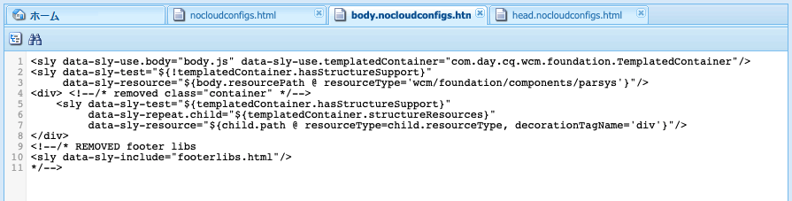
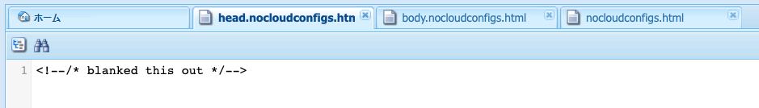
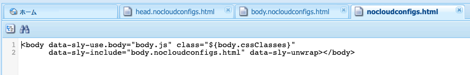

# Adobe Target へのエクスペリエンスフラグメントの書き出し {#exporting-experience-fragments-to-adobe-target}

>[!CAUTION]
>
>このページの一部の機能には、AEM 6.5.3.0 以降のアプリケーションが必要です。
>
>6.5.3.0:
>
>* **Externalizer ドメイン**を選択できるようになりました。
>  **メモ：** Externalizer ドメインは、Target に送信されるエクスペリエンスフラグメントのコンテンツにのみ関連し、「オファーコンテンツを表示」などのメタデータには関連しません。
>
>6.5.2.0：
>
>* エクスペリエンスフラグメントは、次のいずれかに書き出すことができます。
>
>   * デフォルトのワークスペース。
>   * クラウド設定で指定された名前付きワークスペース。
>   * **メモ：**&#x200B;特定のワークスペースに書き出すには、Adobe Target Premium が必要です。
>
>* AEM は [IMS を使用した Adobe Target と統合](/help/sites-administering/integration-target-ims.md)する必要があります。
>
>AEM 6.5.0.0 および 6.5.1.0：
>
>* AEM エクスペリエンスフラグメントは、Adobe Target のデフォルトのワークスペースに書き出されます。
>* AEM は、 [Adobe Target との統合](/help/sites-administering/target.md)の手順に従って Adobe Target と統合する必要があります。

Adobe Target（Target）向けに Adobe Experience Manager（AEM）で作成された[エクスペリエンスフラグメント](/help/sites-authoring/experience-fragments.md)を書き出すことができます。書き出したエクスペリエンスフラグメントは、Target アクティビティのオファーとして使用し、幅広くエクスペリエンスをテストおよびパーソナライズできます。

エクスペリエンスフラグメントをAdobe Target に書き出す際には、3 つのフォーマットオプションを利用できます。

* HTML（デフォルト）：Web およびハイブリッドコンテンツ配信のサポート
* JSON：ヘッドレスコンテンツ配信のサポート
* HTML と JSON

AEM エクスペリエンスフラグメントは、Adobe Target のデフォルトワークスペースまたは Adobe Target のユーザー定義ワークスペースに書き出すことができます。これは、Adobe Developer Console を使用して行います。その場合、AEM は [IMS を使用した Adobe Target と統合](/help/sites-administering/integration-target-ims.md)する必要があります。

>[!NOTE]
>
>Adobe Target のワークスペースは、Adobe Target 自体には存在しません。これらのワークスペースは、Adobe IMS（Identity Management System）で定義および管理され、Adobe Developer Console からの統合を使用するソリューション全体で使用するために選択されます。

>[!NOTE]
>
>Adobe Target のワークスペースを使用すると、組織（グループ）のメンバーは、他のユーザーにアクセス権を付与することなく、その組織専用のオファーとアクティビティを作成および管理することができます。例えば、国際的な企業の国別の組織などです。

>[!NOTE]
>
>詳しくは、以下も参照してください。
>
>* [Adobe Target Developers](https://developers.adobetarget.com/)
>* [コアコンポーネント - エクスペリエンスフラグメント](https://experienceleague.adobe.com/docs/experience-manager-core-components/using/wcm-components/experience-fragment.html?lang=ja)
>

## 前提条件 {#prerequisites}

>[!CAUTION]
>
>このページの一部の機能には、AEM 6.5.3.0 のアプリケーションが必要です。

様々なアクションが必要です。

1. [IMS を使用して AEM と Adobe Target を統合する](/help/sites-administering/integration-target-ims.md)必要があります。
2. エクスペリエンスフラグメントは AEM オーサーインスタンスから書き出されます。このため、オーサーインスタンスで [AEM Link Externalizer を設定](/help/sites-administering/target-requirements.md#configuring-the-aem-link-externalizer)し、エクスペリエンスフラグメント内の参照が web 配信用に外部化されるようにします。

   >[!NOTE]
   >
   >デフォルトでカバーされていないリンクの書き換えについては、[Experience Fragment Link リライタープロバイダー](/help/sites-developing/experience-fragments.md#the-experience-fragment-link-rewriter-provider-html)が利用可能です。これにより、インスタンスに合わせてカスタマイズされたルールを開発できます。

## クラウド設定の追加 {#add-the-cloud-configuration}

フラグメントを書き出す前に、**Adobe Target** 用の&#x200B;**クラウド設定**&#x200B;をフラグメント、またはフォルダーに追加する必要があります。この結果、次のことも可能になります。

* 書き出しに使用する形式オプションを指定する
* Target ワークスペースを宛先として選択する
* エクスペリエンスフラグメントに含まれる参照を書き換えるための Externalizer ドメインを選択する（オプション）

必要なオプションは、必要なフォルダーやフラグメントの&#x200B;**ページのプロパティ**&#x200B;で選択できます。仕様は必要に応じて継承されます。

1. **エクスペリエンスフラグメント**&#x200B;コンソールに移動します。

1. 適切なフォルダーまたはフラグメントの&#x200B;**ページのプロパティ**&#x200B;を開きます。

   >[!NOTE]
   >
   >クラウド設定をエクスペリエンスフラグメントの親フォルダーに追加すると、設定はすべての子に継承されます。
   >
   >
   >クラウド設定をエクスペリエンスフラグメント自体に追加すると、その設定がすべてのバリエーションに継承されます。

1. 「**クラウドサービス**」タブを選択します。

1. **クラウドサービス設定**&#x200B;で、ドロップダウンリストから「**Adobe Target**」を選択します。

   >[!NOTE]
   >
   >エクスペリエンスフラグメントオファーの JSON 形式はカスタマイズできます。これを行うには、カスタマーエクスペリエンスフラグメントコンポーネントを定義したあと、そのプロパティをコンポーネント Sling Model に書き出す方法に注釈を付けます。
   >
   >コアコンポーネントを参照してください。
   >
   >[コアコンポーネント - エクスペリエンスフラグメント](https://experienceleague.adobe.com/docs/experience-manager-core-components/using/wcm-components/experience-fragment.html?lang=ja)

   **Adobe Target** の下で、次を選択します。

   * 適切な設定
   * 必要な形式オプション
   * Adobe Target ワークスペース
   * Externalizer ドメイン（必要な場合）

   >[!CAUTION]
   >
   >Externalizer ドメインはオプションです。
   >
   >AEM Externalizer を設定するのは、コンテンツの書き出し先を特定の&#x200B;*公開*&#x200B;ドメインに指定する場合です。詳しくは、[AEM Link Externalizer の設定](/help/sites-administering/target-requirements.md#configuring-the-aem-link-externalizer)を参照してください。
   >
   >また、Externalizer ドメインは、Target に送信されるエクスペリエンスフラグメントのコンテンツにのみ関係があり、「オファーコンテンツを表示」などのメタデータには関係しません。

   例えば、フォルダーの場合は下図のようになります。

   

1. **保存して閉じる**。

## Adobe Target へのエクスペリエンスフラグメントの書き出し {#exporting-an-experience-fragment-to-adobe-target}

>[!CAUTION]
>
>画像などのメディアアセットの場合、参照のみが Target に書き出されます。アセット自体は AEM Assets に保存されたままで、AEM パブリッシュインスタンスから配信されます。
>
>このため、Target に書き出す前に、エクスペリエンスフラグメントとすべての関連アセットを公開する必要があります。

（クラウド設定を指定した後に）エクスペリエンスフラグメントを AEM から Target に書き出すには、次の手順を実行します。

1. エクスペリエンスフラグメントコンソールに移動します。
1. ターゲットに書き出すエクスペリエンスフラグメントを選択します。

   >[!NOTE]
   >
   >エクスペリエンスフラグメント web のバリエーションである必要があります。

1. 「**Adobe Target に書き出し**」をクリックします。

   >[!NOTE]
   >
   >エクスペリエンスフラグメントが既に書き出されている場合は、「**Adobe Target でアップデート**」を選択します。

1. 必要に応じて、「**公開せずに書き出し**」または「**公開**」をクリックします。

   >[!NOTE]
   >
   >「**公開**」を選択すると、エクスペリエンスフラグメントはすぐに公開され、Target に送信されます。

1. 確認ダイアログで「**OK**」をクリックします。

   エクスペリエンスフラグメントは Target に送信されています。

   >[!NOTE]
   >
   >書き出しについての[様々な詳細](/help/sites-authoring/experience-fragments.md#details-of-your-experience-fragment)は、コンソールの&#x200B;**リスト表示**&#x200B;と&#x200B;**プロパティ**&#x200B;で参照できます。

   >[!NOTE]
   >
   >Adobe Target でエクスペリエンスフラグメントを表示すると、表示される&#x200B;*最終変更日*&#x200B;は、フラグメントが最後に Adobe Target に書き出された日付ではなく、AEM でフラグメントが最後に変更された日付です。

>[!NOTE]
>
>あるいは、[ページ情報](/help/sites-authoring/author-environment-tools.md#page-information)メニューの同等のコマンドを使用して、ページエディターから書き出しを実行することもできます。

## Adobe Target でのエクスペリエンスフラグメントの使用 {#using-your-experience-fragments-in-adobe-target}

ここまでのタスクを完了すると、エクスペリエンスフラグメントが Adobe Target のオファーページに表示されます。Target 側でできることを詳しく知るには、[Target 固有のドキュメント](https://experienceleague.adobe.com/docs/target/using/experiences/offers/aem-experience-fragments.html?lang=ja)を参照してください。

>[!NOTE]
>
>Adobe Target でエクスペリエンスフラグメントを表示すると、表示される&#x200B;*最終変更日*&#x200B;は、フラグメントが最後に Adobe Target に書き出された日付ではなく、AEM でフラグメントが最後に変更された日付です。

## Adobe Target に書き出し済みのエクスペリエンスフラグメントの削除 {#deleting-an-experience-fragment-already-exported-to-adobe-target}

Target に書き出し済みのエクスペリエンスフラグメントを削除すると、そのフラグメントが既に Adobe Target のオファーで使用されている場合は、問題が発生する可能性があります。フラグメントコンテンツが AEM によって配信されるので、フラグメントを削除すると、オファーが使用できなくなります。

このような状況を回避するには、次の手順に従います。

* エクスペリエンスフラグメントが現在アクティビティで使用されていない場合、AEM ではユーザーが警告メッセージを表示せずにフラグメントを削除できます。
* エクスペリエンスフラグメントが Adobe Target のアクティビティで使用されている場合、フラグメントを削除するとアクティビティに影響が及ぶ可能性があると、AEM ユーザーに警告メッセージが表示されます。

  AEM のエラーメッセージは、ユーザーによるエクスペリエンスフラグメントの（強制）削除を禁止するものではありません。エクスペリエンスフラグメントが削除された場合は、次のような結果になります。

   * AEM エクスペリエンスフラグメントを使用した Target オファーで望ましくない動作が見られる場合があります。

      * エクスペリエンスフラグメント HTML が Target にプッシュされたため、オファーが引き続きレンダリングされる可能性があります。
      * 参照されているアセットが AEM でも削除されている場合、エクスペリエンスフラグメント内の参照はどれも正しく機能しない可能性があります。

   * エクスペリエンスフラグメントは AEM にはもう存在しないため、さらに変更することは不可能です。


## Target に書き出したエクスペリエンスフラグメントからの ClientLibs の削除 {#removing-clientlibs-from-fragments-exported-target}

エクスペリエンスフラグメントには、完全な HTML タグと、エクスペリエンスフラグメントコンテンツ作成者が作成したとおりにフラグメントをレンダリングするために必要なすべてのクライアントライブラリ（CSS／JS）が含まれています。これは仕様によるものです。

AEM によって配信されるページで Adobe Target とエクスペリエンスフラグメントオファーを併用する場合、ターゲットページには必要なすべてのクライアントライブラリが既に含まれています。また、エクスペリエンスフラグメントオファーの不要な HTML も必要ありません（[考慮事項](#considerations)を参照）。

次に、エクスペリエンスフラグメントオファーの HTML の擬似例を示します。

```html
<!DOCTYPE>
<html>
   <head>
      <title>…</title>
      <!-- all the client libraries (css/js) -->
      …
   </head>
   <body>
        <!--/* Actual XF Offer content would appear here... */-->
   </body>
</html>
```

大まかに言えば、AEM が Adobe Target にエクスペリエンスフラグメントを書き出す際に、いくつかの追加の Sling セレクターを使用します。例えば、書き出されたエクスペリエンスフラグメントの URL は次のようになります（`nocloudconfigs.atoffer` に注意）。

* http://www.your-aem-instance.com/content/experience-fragments/my-offers/my-xf-offer.nocloudconfigs.atoffer.html

`nocloudconfigs` セレクターは HTL を使用して定義され、次の場所からコピーしてオーバーレイできます。

* /libs/cq/experience-fragments/components/xfpage/nocloudconfigs.html

`atoffer` セレクターは、[Sling Rewriter](/help/sites-developing/experience-fragments.md#the-experience-fragment-link-rewriter-provider-html) を使用した後処理で適用されます。いずれかを使用して、クライアントライブラリを削除できます。

### 例 {#example}

ここでは、`nocloudconfigs` を使用してこれを行う方法を説明します。

>[!NOTE]
>
>詳しくは、[編集可能なテンプレート](/help/sites-developing/templates.md#editable-templates)を参照してください。

#### オーバーレイ {#overlays}

この特定の例では、[オーバーレイ](/help/sites-developing/overlays.md)が含まれているため、クライアントライブラリ&#x200B;*と*&#x200B;不要な HTML が削除されます。エクスペリエンスフラグメントのテンプレートタイプを既に作成していることを前提としています。 `/libs/cq/experience-fragments/components/xfpage/` からコピーする必要がある必要なファイルは次のとおりです。

* `nocloudconfigs.html`
* `head.nocloudconfigs.html`
* `body.nocloudconfigs.html`

#### テンプレートタイプのオーバーレイ {#template-type-overlays}

この例では、次の構造を使用します。


これらのファイルの内容は次のとおりです。

* `body.nocloudconfigs.html`

  

* `head.nocloudconfigs.html`

  

* `nocloudconfigs.html`

  

>[!NOTE]
>
>`data-sly-unwrap` を使用して本文タグを削除するには、`nocloudconfigs.html` が必要です。

### 検討事項 {#considerations}

Adobe Target でエクスペリエンスフラグメントオファーを使用して AEM サイトと AEM 以外のサイトの両方をサポートする必要がある場合は、2 つのエクスペリエンスフラグメント（2 つの異なるテンプレートタイプ）を作成する必要があります。

* clientlibs/extra html を削除するオーバーレイを使用しているもの

* オーバーレイがなく、必要な clientlibs が含まれているもの