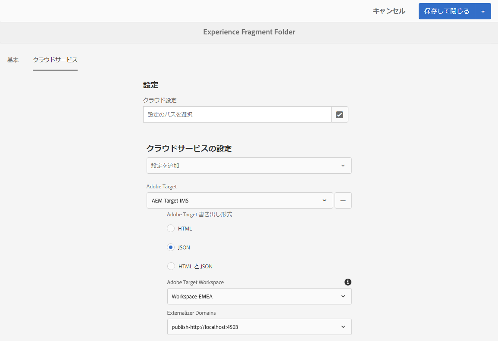

# エクスペリエンスフラグメントのAdobe Targetへの書き出し{#exporting-experience-fragments-to-adobe-target}

>[!CAUTION]
>
>このページの一部の機能には、AEM 6.5.3.0のアプリケーションが必要です。
>
>6.5.3.0
>
>* **Externalizerドメイン** (Externalizer Domains)を選択できるようになりました。
>
>
6.5.2.0:
>
>* エクスペリエンスフラグメントは次のいずれかに書き出すことができます。
   >
   >   
   * デフォルトのワークスペース。
   >   * クラウド設定で指定された、名前付きのワークスペース。
      >     **注意：** 特定のワークスペースに書き出すには、Adobe Targetプレミアムが必要です。
>* AEMは、AdobeI/Oを使用してAdobe Targetと [統合する必要がある](/help/sites-administering/integration-ims-adobe-io.md)。

>
>
AEM 6.5.0.0および6.5.1.0:
>
>* AEM Experience Fragmentsは、Adobe Targetのデフォルトのワークスペースに書き出されます。
>* AEMは、「Adobe Targetとの [統合」の指示に従って、Adobe Targetと統合する必要があります](/help/sites-administering/target.md)。

You can export [Experience Fragments](/help/sites-authoring/experience-fragments.md), created in Adobe Experience Manager (AEM), to Adobe Target (Target). 書き出したエクスペリエンスフラグメントは、Target アクティビティのオファーとして使用し、幅広くエクスペリエンスをテストおよびパーソナライズできます。

エクスペリエンスフラグメントをAdobe Target に書き出す際には、3 つのフォーマットオプションを利用できます。

* HTML（デフォルト）: Webおよびハイブリッドコンテンツ配信のサポート
* JSON: ヘッドレスコンテンツ配信のサポート
* HTML と JSON

AEM Experience Fragmentsは、Adobe Targetのデフォルトのワークスペースに書き出すことも、Adobe Targetのユーザー定義のワークスペースに書き出すこともできます。 これは、AdobeI/Oを介して行われ、AEMI/Oを使用してAdobeをAdobe Targetと [統合する必要があり](/help/sites-administering/integration-ims-adobe-io.md)ます。

>[!NOTE]
>
>Adobe TargetはAdobe Target自体には存在しない。 これらは、AdobeIMS(Identity Managementシステム)で定義および管理され、AdobeI/O統合を使用するソリューション間での使用に選択されます。

>[!NOTE]
>
>Adobe Targetのワークスペースは、組織（グループ）のメンバーが、この組織のオファーとアクティビティのみを作成および管理できるようにするために使用できます。 他のユーザーへのアクセスを許可しない 例えば、グローバルな関心事の対象となる国固有の組織を考えてみましょう。

>[!NOTE]
>
>詳しくは、次を参照してください。
>
>* [Adobe Target開発](https://www.adobe.io/apis/experiencecloud/target.html)
>* [コアコンポーネント — エクスペリエンスフラグメント](https://docs.adobe.com/content/help/en/experience-manager-core-components/using/components/experience-fragment.html)

>

## 前提条件 {#prerequisites}

>[!CAUTION]
>
>このページの一部の機能には、AEM 6.5.3.0のアプリケーションが必要です。

様々なアクションが必要です。

1. AdobeI/Oを使用してAEMをAdobe Targetと [統合する必要がある](/help/sites-administering/integration-ims-adobe-io.md)。
2. エクスペリエンスフラグメントはAEM作成者インスタンスから書き出されるので、エクスペリエンスフラグメント内の参照がWeb配信用に外部化されるように、作成者インスタンスでAEM Link Externalizer [( Link Externalizer](/help/sites-administering/target-requirements.md#configuring-the-aem-link-externalizer) )を設定する必要があります。

   >[!NOTE]
   >
   >デフォルトでカバーされていないリンクの書き換えでは、[Experience Fragment Link Rewriter Provider](/help/sites-developing/experience-fragments.md#the-experience-fragment-link-rewriter-provider-html) が利用可能です。これにより、インスタンスに合わせてカスタマイズされたルールを開発できます。

## 追加クラウドの設定 {#add-the-cloud-configuration}

フラグメントを書き出す前に、**Adobe Target** 用の&#x200B;**クラウド設定**&#x200B;をフラグメント、またはフォルダーに追加する必要があります。また、次のことも可能です。

* 書き出しに使用する形式オプションを指定します。
* ターゲットワークスペースを宛先として選択
* エクスペリエンスフラグメント内の参照を書き換えるための外部化子ドメインを選択します（オプション）

必要なオプションは、必要なフォルダーやフラグメントの&#x200B;**ページのプロパティ**&#x200B;で選択できます。仕様は必要に応じて継承されます。

1. **エクスペリエンスフラグメント**&#x200B;コンソールに移動します。

1. 適切なフォルダーまたはフラグメントの&#x200B;**ページのプロパティ**&#x200B;を開きます。

   >[!NOTE]
   >
   >クラウド設定をエクスペリエンスフラグメントの親フォルダーに追加すると、設定はすべての子に継承されます。
   >
   >
   >クラウド設定をエクスペリエンスフラグメント自体に追加すると、設定はすべての変更によって継承されます。

1. 「**クラウドサービス**」タブを選択します。

1. Under **Cloud Service Configuration**, select **Adobe Target** from the drop-down list.

1. 
   >[!NOTE]
   >
   >エクスペリエンスフラグメントオファーのJSON形式はカスタマイズできます。 これを行うには、顧客エクスペリエンスフラグメントコンポーネントを定義し、コンポーネントSlingモデルでそのプロパティを書き出す方法に注釈を付けます。
   >
   >コアコンポーネントを参照してください。
   >
   >[コアコンポーネント — エクスペリエンスフラグメント](https://docs.adobe.com/content/help/en/experience-manager-core-components/using/components/experience-fragment.html)

   「 **Adobe Target** 」で次を選択します。

   * 適切な設定
   * 必要な形式オプション
   * Adobe Targetの作業場
   * 必要な場合 — externalizerドメイン

   >[!CAUTION]
   >
   >外部化子ドメインはオプションです。 AEM externalizerは、書き出したコンテンツが特定の *公開* ドメインを指すようにする場合に設定します。 詳しくは、AEM Link Externalizerの [設定を参照してください](/help/sites-administering/target-requirements.md#configuring-the-aem-link-externalizer)。

   例えば、フォルダーの場合：

   

1. **保存して閉じます**。

## Exporting an Experience Fragment to Adobe Target {#exporting-an-experience-fragment-to-adobe-target}

>[!CAUTION]
>
>画像などのメディアアセットでは、参照のみが Target に書き出されます。アセット自体は AEM Assets に格納されたままで、AEM パブリッシュインスタンスから配信されます。
>
>このため、エクスペリエンスフラグメントは、すべての関連アセットと共に、Target に書き出す前に公開する必要があります。

AEM から Target にエクスペリエンスフラグメントを書き出すには（クラウド設定を指定した後）：

1. エクスペリエンスフラグメントコンソールに移動します。
1. Target に書き出すエクスペリエンスフラグメントを選択します。

   >[!NOTE]
   >
   >エクスペリエンスフラグメント Web のバリエーションである必要があります。

1. **Adobe Target に書き出し**&#x200B;をタップ／クリックします。

   >[!NOTE]
   >
   >エクスペリエンスフラグメントがすでに書き出されている場合は、**Adobe Target でアップデート** を選択します。

1. 要求に応じて&#x200B;**公開せずに書き出し**&#x200B;または&#x200B;**公開**&#x200B;をタップ／クリックします。

   >[!NOTE]
   >
   >**公開**&#x200B;を選択すると、エクスペリエンスフラグメントはすぐに公開され、Target に送信されます。

1. Tap/click **OK** in the confirmation dialog.

   エクスペリエンスフラグメントは Target に送信されているはずです。

   >[!NOTE]
   >
   >書き出しについての[様々な詳細](/help/sites-authoring/experience-fragments.md#details-of-your-experience-fragment)は、コンソールの&#x200B;**リストビュー**&#x200B;と&#x200B;**プロパティ**&#x200B;で参照できます。

   >[!NOTE]
   >
   >Adobe Target でエクスペリエンスフラグメントを表示すると、表示される&#x200B;*最終変更日*&#x200B;は、フラグメントが最後に Adobe Target に書き出された日付ではなく、AEM でフラグメントが最後に変更された日付です。

>[!NOTE]
>
>あるいは、[ページ情報](/help/sites-authoring/author-environment-tools.md#page-information)メニューの同等のコマンドを使用して、ページエディターから書き出しを実行することもできます。

## Using your Experience Fragments in Adobe Target {#using-your-experience-fragments-in-adobe-target}

上記のタスクを実行した後、エクスペリエンスフラグメントはターゲットのオファーページに表示されます。 Target 側でできることを詳しく知るには、[Target に特化したドキュメント](https://experiencecloud.adobe.com/resources/help/en_US/target/target/aem-experience-fragments.html)を参照してください。

>[!NOTE]
>
>Adobe Target でエクスペリエンスフラグメントを表示すると、表示される&#x200B;*最終変更日*&#x200B;は、フラグメントが最後に Adobe Target に書き出された日付ではなく、AEM でフラグメントが最後に変更された日付です。

## Deleting an Experience Fragment already exported to Adobe Target {#deleting-an-experience-fragment-already-exported-to-adobe-target}

Target に書き出し済みのエクスペリエンスフラグメントを削除すると、そのフラグメントがすでに Target のオファーで使用されている場合に問題が発生する可能性があります。フラグメントのコンテンツが AEM によって配信されているため、フラグメントを削除するとオファーが使用できなくなります。

そのような状況を避けるためには：

* エクスペリエンスフラグメントが現在アクティビティで使用されていない場合、AEM はユーザーに警告メッセージなしでフラグメントを削除することを許可します。
* エクスペリエンスフラグメントが現在ターゲットのアクティビティで使用されている場合、フラグメントを削除するとアクティビティに影響が及ぶ可能性があると、AEM ユーザーに警告メッセージが表示されます。

   AEM のエラーメッセージは、ユーザーがエクスペリエンスフラグメントを（強制的に）削除することを禁止するものではありません。エクスペリエンスフラグメントを削除する場合：

   * AEMエクスペリエンスフラグメントを含むターゲットオファーで、意図しない動作が表示される場合があります。

      * エクスペリエンスフラグメントのHTMLがターゲットにプッシュされたので、オファーは引き続きレンダリングされる可能性が高くなります。
      * AEMで参照アセットも削除された場合、エクスペリエンスフラグメント内の参照が正しく機能しない可能性があります。
   * もちろん、エクスペリエンスフラグメントに対するそれ以上の変更は、そのエクスペリエンスフラグメントがAEMに存在しなくなったので、不可能です。