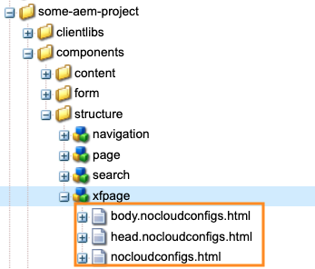

# Adobe Target へのエクスペリエンスフラグメントの書き出し {#exporting-experience-fragments-to-adobe-target}

>[!CAUTION]
>
>このページの一部の機能には、AEM 6.5.3.0 以降のアプリケーションが必要です。
>
>6.5.3.0:
>
>* **Externalizer ドメイン**を選択できるようになりました。
>  **注意：** Externalizer ドメインは、Target に送信されるエクスペリエンスフラグメントのコンテンツにのみ関連し、「オファーコンテンツを表示」などのメタデータには関連しません。
>
>6.5.2.0：
>
>* エクスペリエンスフラグメントは、次のいずれかに書き出すことができます。
>
>   * デフォルトのワークスペース。
>   * クラウド設定で指定された名前付きワークスペース。
>   * **メモ：**&#x200B;特定のワークスペースに書き出すには、Adobe Target Premium が必要です。
>
>* AEM は [IMS を使用した Adobe Target と統合](/help/sites-administering/integration-target-ims.md)する必要があります。
>
>AEM 6.5.0.0 および 6.5.1.0：
>
>* AEM エクスペリエンスフラグメントは、Adobe Target のデフォルトのワークスペースに書き出されます。
>* AEM は、 [Adobe Target との統合](/help/sites-administering/target.md)の手順に従って Adobe Target と統合する必要があります。

Adobe Target（Target）向けに Adobe Experience Manager（AEM）で作成された[エクスペリエンスフラグメント](/help/sites-authoring/experience-fragments.md)を書き出すことができます。その後、Target アクティビティでオファーとして使用して、エクスペリエンスを大規模にテストおよびパーソナライズできます。

エクスペリエンスフラグメントをAdobe Target に書き出す際には、3 つのフォーマットオプションを利用できます。

* HTML（デフォルト）：Web およびハイブリッドコンテンツ配信のサポート
* JSON：ヘッドレスコンテンツ配信のサポート
* HTML と JSON

AEM エクスペリエンスフラグメントは、Adobe Target のデフォルトワークスペースまたは Adobe Target のユーザー定義ワークスペースに書き出すことができます。これは、Adobe Developer Console を使用して行います。その場合、AEM は [IMS を使用した Adobe Target と統合](/help/sites-administering/integration-target-ims.md)する必要があります。

>[!NOTE]
>
>Adobe Target のワークスペースは、Adobe Target 自体には存在しません。これらのワークスペースは、Adobe IMS（Identity Management System）で定義および管理され、Adobe Developer Console からの統合を使用するソリューション全体で使用するために選択されます。

>[!NOTE]
>
>Adobe Target のワークスペースを使用すると、組織（グループ）のメンバーは、他のユーザーにアクセス権を付与することなく、その組織専用のオファーとアクティビティを作成および管理することができます。例えば、国際的な企業の国別の組織などです。

>[!NOTE]
>
>詳しくは、以下も参照してください。
>
>* [Adobe Target Developers](https://developers.adobetarget.com/)
>* [コアコンポーネント - エクスペリエンスフラグメント](https://experienceleague.adobe.com/docs/experience-manager-core-components/using/wcm-components/experience-fragment.html)
>

## 前提条件 {#prerequisites}

>[!CAUTION]
>
>このページの一部の機能には、AEM 6.5.3.0 のアプリケーションが必要です。

様々なアクションが必要です。

1. [IMS を使用して AEM と Adobe Target を統合する](/help/sites-administering/integration-target-ims.md)必要があります。
2. エクスペリエンスフラグメントはAEMオーサーインスタンスから書き出されるので、次の操作を行う必要があります。 [AEM Link Externalizer を設定](/help/sites-administering/target-requirements.md#configuring-the-aem-link-externalizer) オーサーインスタンスを使用して、エクスペリエンスフラグメント内の参照が Web 配信用に外部化されていることを確認します。

   >[!NOTE]
   >
   >デフォルトでカバーされていないリンクの書き換えについては、[Experience Fragment Link リライタープロバイダー](/help/sites-developing/experience-fragments.md#the-experience-fragment-link-rewriter-provider-html)が利用可能です。これにより、インスタンスに合わせてカスタマイズされたルールを開発できます。

## クラウド設定の追加 {#add-the-cloud-configuration}

フラグメントを書き出す前に、 **クラウド設定** 対象： **Adobe Target** をフラグメントまたはフォルダーに追加します。 この結果、次のことも可能になります。

* エクスポートに使用する形式オプションを指定します。
* Target ワークスペースを宛先として選択する
* エクスペリエンスフラグメント内の参照を書き換える Externalizer ドメインを選択します（オプション）。

必要なオプションは、必要なフォルダーやフラグメントの&#x200B;**ページのプロパティ**&#x200B;で選択できます。仕様は必要に応じて継承されます。

1. **エクスペリエンスフラグメント**&#x200B;コンソールに移動します。

1. 適切なフォルダーまたはフラグメントの&#x200B;**ページのプロパティ**&#x200B;を開きます。

   >[!NOTE]
   >
   >クラウド設定をエクスペリエンスフラグメントの親フォルダーに追加すると、設定はすべての子に継承されます。
   >
   >
   >クラウド設定をエクスペリエンスフラグメント自体に追加した場合、設定はすべてのバリエーションに継承されます。

1. 「**クラウドサービス**」タブを選択します。

1. **クラウドサービス設定**&#x200B;で、ドロップダウンリストから「**Adobe Target**」を選択します。

   >[!NOTE]
   >
   >エクスペリエンスフラグメントオファーの JSON 形式はカスタマイズできます。これをおこなうには、顧客のエクスペリエンスフラグメントコンポーネントを定義し、そのプロパティを Sling Model コンポーネントに書き出す方法に注釈を付けます。
   >
   >コアコンポーネントを参照してください。
   >
   >[コアコンポーネント - エクスペリエンスフラグメント](https://experienceleague.adobe.com/docs/experience-manager-core-components/using/wcm-components/experience-fragment.html)

   **Adobe Target** の下で、次を選択します。

   * 適切な設定
   * 必要な形式オプション
   * Adobe Target ワークスペース
   * 必要に応じて、 Externalizer ドメインを設定します。

   >[!CAUTION]
   >
   >Externalizer ドメインはオプションです。
   >
   >AEM Externalizer は、書き出されたコンテンツが特定の *公開* ドメイン。 詳しくは、 [AEM Link Externalizer の設定](/help/sites-administering/target-requirements.md#configuring-the-aem-link-externalizer).
   >
   >また、Externalizer ドメインは、Target に送信されるエクスペリエンスフラグメントのコンテンツにのみ関係があり、「オファーコンテンツを表示」などのメタデータには関係しません。

   例えば、フォルダーの場合は下図のようになります。

   

1. **保存して閉じる**。

## Adobe Target へのエクスペリエンスフラグメントの書き出し {#exporting-an-experience-fragment-to-adobe-target}

>[!CAUTION]
>
>画像などのメディアアセットの場合、参照のみが Target に書き出されます。アセット自体は AEM Assets に保存されたままで、AEM パブリッシュインスタンスから配信されます。
>
>このため、Target に書き出す前に、すべての関連アセットを含むエクスペリエンスフラグメントを公開する必要があります。

（クラウド設定を指定した後に）エクスペリエンスフラグメントをAEMから Target に書き出すには、次の手順に従います。

1. エクスペリエンスフラグメントコンソールに移動します。
1. ターゲットに書き出すエクスペリエンスフラグメントを選択します。

   >[!NOTE]
   >
   >エクスペリエンスフラグメント web のバリエーションである必要があります。

1. クリック **Adobe Targetにエクスポート**.

   >[!NOTE]
   >
   >エクスペリエンスフラグメントが既に書き出されている場合は、**Adobe Target でアップデート** を選択します。

1. クリック **公開せずに書き出し** または **公開** 必要に応じて。

   >[!NOTE]
   >
   >選択 **公開** は、エクスペリエンスフラグメントをすぐに公開し、Target に送信します。

1. クリック **OK** をクリックします。

   これで、エクスペリエンスフラグメントが Target に表示されます。

   >[!NOTE]
   >
   >書き出しについての[様々な詳細](/help/sites-authoring/experience-fragments.md#details-of-your-experience-fragment)は、コンソールの&#x200B;**リスト表示**&#x200B;と&#x200B;**プロパティ**&#x200B;で参照できます。

   >[!NOTE]
   >
   >Adobe Target でエクスペリエンスフラグメントを表示すると、表示される&#x200B;*最終変更日*&#x200B;は、フラグメントが最後に Adobe Target に書き出された日付ではなく、AEM でフラグメントが最後に変更された日付です。

>[!NOTE]
>
>あるいは、[ページ情報](/help/sites-authoring/author-environment-tools.md#page-information)メニューの同等のコマンドを使用して、ページエディターから書き出しを実行することもできます。

## Adobe Target でのエクスペリエンスフラグメントの使用 {#using-your-experience-fragments-in-adobe-target}

上記のタスクを実行すると、エクスペリエンスフラグメントがAdobe Targetのオファーページに表示されます。 以下を見る： [特定の Target ドキュメント](https://experienceleague.adobe.com/docs/target/using/experiences/offers/aem-experience-fragments.html?lang=ja) そこで何を達成できるかを学ぶために

>[!NOTE]
>
>Adobe Target でエクスペリエンスフラグメントを表示すると、表示される&#x200B;*最終変更日*&#x200B;は、フラグメントが最後に Adobe Target に書き出された日付ではなく、AEM でフラグメントが最後に変更された日付です。

## Adobe Target に書き出し済みのエクスペリエンスフラグメントの削除 {#deleting-an-experience-fragment-already-exported-to-adobe-target}

Target に既に書き出されたエクスペリエンスフラグメントを削除すると、そのフラグメントが既にAdobe Targetのオファーで使用されている場合に、問題が発生する可能性があります。 フラグメントコンテンツが AEM によって配信されるので、フラグメントを削除すると、オファーが使用できなくなります。

このような状況を回避するには、次の手順に従います。

* エクスペリエンスフラグメントが現在アクティビティで使用されていない場合、AEM ではユーザーが警告メッセージを表示せずにフラグメントを削除できます。
* エクスペリエンスフラグメントがAdobe Targetのアクティビティで使用中の場合は、フラグメントを削除するとアクティビティに発生する可能性がある結果についてAEMユーザーに警告するエラーメッセージが表示されます。

  AEM のエラーメッセージは、ユーザーによるエクスペリエンスフラグメントの（強制）削除を禁止するものではありません。エクスペリエンスフラグメントが削除された場合は、次のような結果になります。

   * AEM エクスペリエンスフラグメントを使用した Target オファーで望ましくない動作が見られる場合があります。

      * エクスペリエンスフラグメント HTML が Target にプッシュされたため、オファーが引き続きレンダリングされる可能性があります。
      * 参照されているアセットが AEM でも削除されている場合、エクスペリエンスフラグメント内の参照はどれも正しく機能しない可能性があります。

   * エクスペリエンスフラグメントはAEMには存在しなくなったので、エクスペリエンスフラグメントに対するそれ以上の変更はできません。


## Target に書き出したエクスペリエンスフラグメントからの ClientLibs の削除 {#removing-clientlibs-from-fragments-exported-target}

エクスペリエンスフラグメントには、完全な html タグと、エクスペリエンスフラグメントコンテンツ作成者が作成したとおりにフラグメントをレンダリングするために必要なすべてのクライアントライブラリ (CSS/JS) が含まれます。 これは仕様によるものです。

AEMで配信されるページ上でAdobe Targetと共にエクスペリエンスフラグメントオファーを使用する場合、ターゲットページには、必要なすべてのクライアントライブラリが既に含まれています。 また、エクスペリエンスフラグメントオファーの不要な HTML も必要ありません（[考慮事項](#considerations)を参照）。

次に、エクスペリエンスフラグメントオファーの HTML の擬似例を示します。

```html
<!DOCTYPE>
<html>
   <head>
      <title>…</title>
      <!-- all the client libraries (css/js) -->
      …
   </head>
   <body>
        <!--/* Actual XF Offer content would appear here... */-->
   </body>
</html>
```

AEMがAdobe Targetにエクスペリエンスフラグメントを書き出す場合は、追加の Sling セレクターをいくつか使用します。 例えば、書き出されたエクスペリエンスフラグメントの URL は次のようになります（`nocloudconfigs.atoffer` に注意）。

* http://www.your-aem-instance.com/content/experience-fragments/my-offers/my-xf-offer.nocloudconfigs.atoffer.html

The `nocloudconfigs` セレクターは、HTL を使用して定義され、次の場所からコピーしてオーバーレイできます。

* /libs/cq/experience-fragments/components/xfpage/nocloudconfigs.html

The `atoffer` セレクターを次を使用して後処理に適用： [Sling Rewriter](/help/sites-developing/experience-fragments.md#the-experience-fragment-link-rewriter-provider-html). いずれかを使用して、クライアントライブラリを削除できます。

### 例 {#example}

ここでは、 `nocloudconfigs`.

>[!NOTE]
>
>詳しくは、 [編集可能なテンプレート](/help/sites-developing/templates.md#editable-templates) 詳しくは、を参照してください。

#### オーバーレイ {#overlays}

この特定の例では、[オーバーレイ](/help/sites-developing/overlays.md)が含まれているため、クライアントライブラリ&#x200B;*と*&#x200B;不要な HTML が削除されます。エクスペリエンスフラグメントのテンプレートタイプを既に作成していることを前提としています。 コピーする必要があるファイル `/libs/cq/experience-fragments/components/xfpage/` 次を含む：

* `nocloudconfigs.html`
* `head.nocloudconfigs.html`
* `body.nocloudconfigs.html`

#### テンプレートタイプのオーバーレイ {#template-type-overlays}

この例では、次の構造を使用します。



これらのファイルの内容は次のとおりです。

* `body.nocloudconfigs.html`

  

* `head.nocloudconfigs.html`

  

* `nocloudconfigs.html`

  

>[!NOTE]
>
>次を使用するには： `data-sly-unwrap` body タグを削除するには、 `nocloudconfigs.html`.

### 検討事項 {#considerations}

Adobe Targetでエクスペリエンスフラグメントオファーを使用してAEMサイトとAEM以外のサイトの両方をサポートする必要がある場合は、2 つのエクスペリエンスフラグメント（2 つの異なるテンプレートタイプ）を作成する必要があります。

* clientlibs/extra html を削除するオーバーレイを使用しているもの

* オーバーレイがなく、必要な clientlibs が含まれているもの