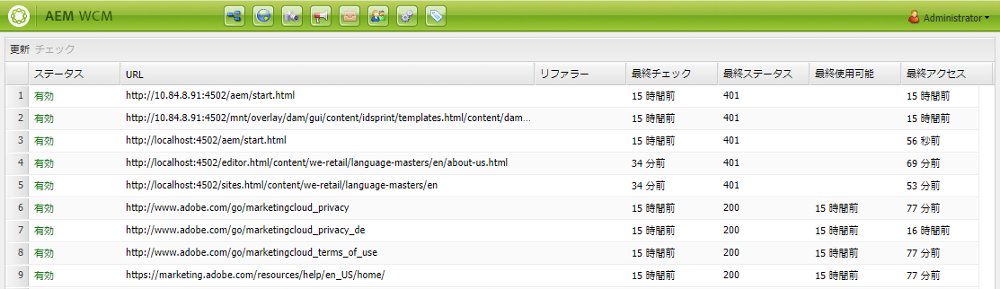

# 外部リンクチェック{#the-external-link-checker}

AEM には、外部リンクチェッカーが用意されています。リンクチェッカー

* すべてのコンテンツページをスキャンします。
* すべての有効なリンクおよび無効なリンクのリストを生成します。
* 個々のコンテンツページで、無効なリンクをその場で壊れているとマークします。

## 外部リンクを検証する方法 {#how-to-validate-external-links}

外部リンクチェックを使用するには：

1. **ナビゲーション**&#x200B;を使用して、**ツール**／**サイト**&#x200B;を選択します。
1. **外部リンクチェック**&#x200B;を選択すると、すべての外部リンクのリストが生成されます。
1. 特定のリンクをリスト内で選択し、「**チェック**」をクリックして検証します。

   

   情報が表示されます。

   * リンクの&#x200B;**ステータス**
   * **URL**
   * **リファラー**
   * リンクが&#x200B;**前回チェック**（検証）されてからの経過時間
   * 返された&#x200B;**最終ステータス**

   * リンクが&#x200B;**前回使用可能**&#x200B;になってからの経過時間
   * リンクが&#x200B;**最後アクセス**&#x200B;されからの経過時間

1. 個々のコンテンツページで、無効なリンクは壊れていると表示されます。

   