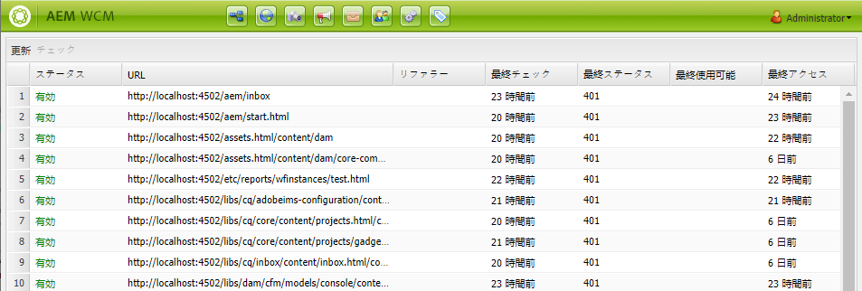

# リンクチェッカー {#the-link-checker}

コンテンツ作成者は、コンテンツページに含まれるすべてのリンクの検証に関心を持つ必要はありません。

リンクチェッカーが自動的に実行され、コンテンツ作成者は次のリンクを使用できます。

* コンテンツに追加されたリンクの検証
* コンテンツ内のすべての外部リンクのリストの表示
* リンク変換の実行

リンクチェッカーには多数の[設定オプション](#configuring)があります（内部検証の定義、特定のリンクやリンクパターを検証から除外、リンクの書き換えルールの書き換えなど）。

リンクチェッカーは、 [内部リンク](#internal)および[外部リンク](#external)の両方を検証します。

>[!NOTE]
>
>リンクチェッカーはすべてのコンテンツページのリンクをチェックするため、リンクチェッカーは大きなリポジトリのパフォーマンスに影響を与える可能性があります。このような場合、 [リンクチェッカーの実行頻度の設定](#configuring)または[無効化](#disabling)が必要になる場合があります。

## 内部リンクチェック {#internal}

内部リンクは、AEM リポジトリ内の他のコンテンツへのリンクです。内部リンクは、RTE のパスピッカーまたはカスタムコンポーネントを使用して追加できます。次に例を示します。

* ページ `/content/wknd/us/en/adventures/ski-touring.html`
* [テキストコンポーネント](https://experienceleague.adobe.com/docs/experience-manager-core-components/using/components/text.html?lang=ja)内の `/content/wknd/us/en/adventures/extreme-ironing.html` へのリンクが含まれます。

内部リンクは、コンテンツ作成者がページに内部リンクを追加するとすぐに検証されます。リンクが無効になった場合：

* 投稿者から削除されます。リンクのテキストは残りますが、リンク自体は削除されます。
* オーサリングインターフェイスでは壊れたリンクとして表示されます。

## 外部リンクの確認 {#external}

外部リンクは、AEM リポジトリ外のコンテンツへのリンクです。外部リンクは、RTE を使用するか、カスタムコンポーネントを使用して追加できます。次に例を示します。

* ページ `/content/wknd/us/en/adventures/ski-touring.html`
* [テキストコンポーネント](https://experienceleague.adobe.com/docs/experience-manager-core-components/using/components/text.html)内の `https://bunwarmerthermalunderwear.com` へのリンクが含まれます。

外部リンクは、構文や、使用可能かどうかを確認することで検証されます。このチェックは、設定可能な内部で非同期的に実行されます。リンクチェッカーで外部リンクが無効であることが検出された場合：

* 投稿者から削除されます。リンクのテキストは残りますが、リンク自体は削除されます。
* オーサリングインターフェイスでは壊れたリンクとして表示されます。

また、 [外部リンクチェッカー](#external-link-checker)インターフェイスには、コンテンツページ上のすべての外部リンクの概要が表示されます。

### 外部リンクチェッカーの使用 {#external-link-checker}

外部リンクチェッカーを使用するには：

1. **ナビゲーション**&#x200B;を使用して、**ツール**／**サイト**&#x200B;を選択します。
1. **外部リンクチェッカー**&#x200B;を選択すると、すべての外部リンクのリストが生成されます。

次の情報が提供されます。

* **ステータス** - リンクの検証ステータス。次のいずれかを指定できます。
   * **有効** - 外部リンクはリンクチェッカーでアクセスできます
   * **保留中** - 外部リンクはサイトコンテンツに追加されましたが、まだリンクチェッカーでは検証されていません
   * **無効** - 外部リンクがリンクチェッカーでアクセスできません
* **URL** - 外部リンク
* **リファラー** - 外部リンクを含むコンテンツページ
   * [設定されている場合のみ](#configuring)入力されます。
* **最終確認日** - リンクチェッカーが最後に外部リンクを検証した日時
   * リンクのチェック頻度は[設定可能](#configuring)です。
* **最終ステータス** - リンクチェックが外部リンクを最後にチェックしたときに返される最後の HTML ステータスコード。
* **最終使用可能日** - リンクチェッカーが最後にリンクを使用できた時点からの経過時間
* **最終アクセス日** - 外部リンクを含むページがオーサリングインターフェイスで最後にアクセスされてからの経過時間

リンクのリストの上部にある 2 つのボタンを使用して、ウィンドウのコンテンツを操作できます。

* **更新** - リストのコンテンツを更新します
* **チェック** - リストで選択した個々の外部リンクを確認します

### 外部リンクチェッカーの仕組み {#how-it-works}

外部リンクチェッカーは簡単に使用できますが、多くのサービスに依存しており、それらの仕組みを理解することで、[リンクチェッカーの設定](#configuring)をニーズに合わせて設定する方法を理解することができます。

1. コンテンツ作成者がページへのリンクを保存すると、イベントハンドラーがトリガーされます。
1. イベントハンドラーは、`/content` のすべてのコンテンツをトラバースします。 新しいリンクまたは更新されたリンクの有無を確認し、それらをリンクチェッカーのキャッシュに追加します。
1. 次にこの **Day CQ Link Checker Service** は通常のスケジュールで実行され、キャッシュ内のエントリの構文が有効かどうかを確認します。
1. 構文が検証されたリンクが、[外部リンクチェッカー](#external-link-checker)ウィンドウに表示されます。ただしこれらのリンクは、**保留**&#x200B;状態にとどまります。
1. この **Day CQ Link Checker Task** は定期的に実行され、GET を呼び出すことによりリンクを検証します。
1. 次にこの **Day CQ Link Checker Task** は、GET 呼び出しの結果を使用して、外部リンクチェッカーウィンドウのエントリをアップデートします。

## リンクチェッカーの設定 {#configuring}

リンクチェッカーは自動ですぐに使える AEM の機能です。ただし、ビヘイビアーを変えるために変更できる OSGi 設定は多数あります。

* **Day CQ Link Checker Info Storage Service** - このサービスは、リポジトリ内のリンクチェッカーキャッシュのサイズを定義します。
* **Day CQ Link Checker Service** - このサービスは外部リンクの構文の非同期チェックを実行します。チェック期間と、チェッカーがスキップするリンクのタイプを他のオプションで定義できます。
* **Day CQ Link Checker Task** - このサービスは外部リンクの GET 検証を実行します。間隔を別々に定義することを可能にし、他のオプション間で不正なリンクや正常なリンクを確認します。
* **Day CQ Link Checker Transformer** - ユーザー定義のルールセットに基づいてリンクを変換します。

OSGi 設定を変更する方法の詳細に関しては、ドキュメント [OSGi 設定](/help/sites-deploying/osgi-configuration-settings.md)を参照してください。

## リンクチェッカーの無効化 {#disabling}

リンクチェックを完全に無効化することもできます。この作業を行うには、以下の手順を実行します。

1. OSGi コンソールを開きます。
1. **Day CQ Link Checker Transformer** を編集します。
1. 無効にするオプションを選択します。
   * **Disable Checking** - リンクの検証を無効にします。
   * **Disable Rewriting** - リンク変換を無効にします。

>[!NOTE]
>
>コンテンツの作成を開始した後でリンクチェックを無効にした場合、[外部リンクチェッカーウィンドウ](#external-link-checker)への入力は引き続き表示されますが、更新されなくなります。
