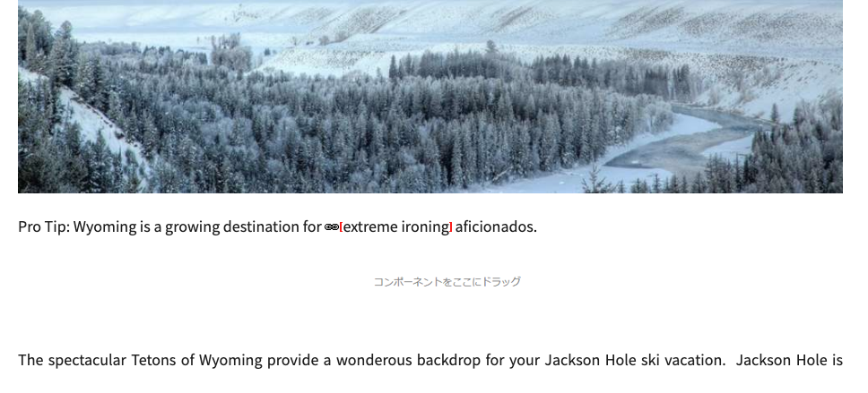
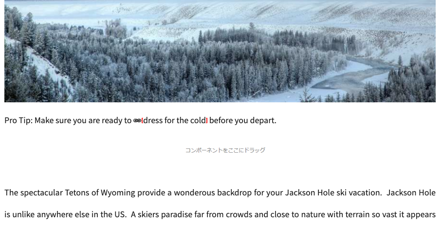

# リンクチェッカー{#the-link-checker}

コンテンツ作成者は、コンテンツページに含まれるすべてのリンクの検証に関心を持つ必要はありません。

リンクチェッカーは、コンテンツ作成者が次のリンクを含むコンテンツを自動的に支援するために実行されます。

* コンテンツに追加されたリンクの検証
* コンテンツ内のすべての外部リンクのリストの表示
* リンク変換の実行

リンクチェッカーには、検証内部の定義、検証から特定のリンクやリンクパターを省略したり、リンクの書き換え規則を書き換えたりするなど、多くの[設定オプション](#configuring)があります。

リンクチェッカーは、[内部リンク](#internal)と[外部リンクの両方を検証します。](#external)

>[!NOTE]
>
>リンクチェッカーはすべてのコンテンツページのリンクをチェックするので、リンクチェッカーは大きなリポジトリでパフォーマンスに影響を与える可能性があります。 そのような場合は、[リンクチェッカーが](#configuring)または[無効にする頻度を設定する必要があります。](#disabling)

## 内部リンクチェック{#internal}

内部リンクは、AEMリポジトリ内の他のコンテンツへのリンクです。 内部リンクは、RTEのパスピッカーまたはカスタムコンポーネントを使用して追加できます。 次に例を示します。

* ページ`/content/wknd/us/en/adventures/ski-touring.html`
* [テキストコンポーネントに`/content/wknd/us/en/adventures/extreme-ironing.html`へのリンクを含めます。](https://experienceleague.adobe.com/docs/experience-manager-core-components/using/components/text.html)

内部リンクは、コンテンツ作成者がページに内部リンクを追加するとすぐに検証されます。 リンクが無効になった場合：

* 投稿者から削除されます。 リンクのテキストは残りますが、リンク自体は削除されます。
* オーサリングインターフェイスでは、壊れたリンクとして表示されます。

## 外部リンクチェック{#external}

外部リンクは、AEMリポジトリ外のコンテンツへのリンクです。 外部リンクはRTEを使用して追加するか、カスタムコンポーネントを使用して追加できます。 次に例を示します。

* ページ`/content/wknd/us/en/adventures/ski-touring.html`
* [テキストコンポーネントに`https://bunwarmerthermalunderwear.com`へのリンクを含めます。](https://experienceleague.adobe.com/docs/experience-manager-core-components/using/components/text.html)

外部リンクの構文が検証され、使用可能かどうかをチェックします。 このチェックは、設定可能な内部で非同期に実行されます。 リンクチェッカーで外部リンクが無効であると見つけた場合：

* 投稿者から削除されます。 リンクのテキストは残りますが、リンク自体は削除されます。
* オーサリングインターフェイスでは、壊れたリンクとして表示されます。

さらに、[外部リンクチェッカー](#external-link-checker)のインターフェイスは、コンテンツページ上のすべての外部リンクの概要を提供します。

### 外部リンクチェッカーの使用{#external-link-checker}

外部リンクチェッカーを使用するには：

1. **ナビゲーション**&#x200B;を使用して、**ツール**／**サイト**&#x200B;を選択します。
1. 「**外部リンクチェッカー**」を選択すると、すべての外部リンクのリストが表示されます。

![[外部リンクチェッカー]ウィンドウ](assets/external-link-checker.png)

次の情報が表示されます。

* **ステータス**  — リンクの検証ステータス。次のいずれかを指定できます。
   * **有効**  — 外部リンクはリンクチェッカーで到達可能です
   * **保留中**  — 外部リンクはサイトのコンテンツに追加されましたが、まだリンクチェッカーで検証されていません
   * **無効**  — 外部リンクはリンクチェッカーで到達できません
* **URL**  — 外部リンク
* **転送者**  — 外部リンクを含むコンテンツページ
   * これは、設定されている場合にのみ[入力されます。](#configuring)
* **最後にチェック**  — リンクチェッカーが最後に外部リンクを検証した時
   * [リンクのチェック頻度は設定可能です。](#configuring)
* **最後のステータス**  — 最後にチェックされたリンクが外部リンクをチェックしたときに返された最後のHTMLステータスコード
* **最後に使用可能**  — リンクが最後に使用可能になってからの時間
* **最終アクセス**  — 外部リンクを含むページが最後にオーサリングインターフェイスでアクセスされてからの時間

リンクのリストの上部にある2つのボタンを使用して、ウィンドウのコンテンツを操作できます。

* **更新** -リストの内容を更新します。
* **チェック** -リストで選択した個々の外部リンクをチェックするには

### 外部リンクチェッカーの動作{#how-it-works}

使いやすいものの、外部リンクチェッカーは多くのサービスに依存し、その仕組みを理解することで、必要に応じて[リンクチェッカー](#configuring)を設定する方法を理解できます。

1. コンテンツ作成者がページへのリンクを保存すると、イベントハンドラーがトリガーされます。
1. イベントハンドラーは`/content`の下のすべてのコンテンツをトラバースし、新しいリンクや更新されたリンクをチェックして、リンクチェッカーのキャッシュに追加します。
1. 次に、**Day CQ Link Checker Service**&#x200B;が、キャッシュ内のエントリの有効な構文を調べるための定期的なスケジュールで実行されます。
1. 次に、構文で検証されたリンクが[外部リンクチェッカー](#external-link-checker)ウィンドウに表示されます。 ただし、**保留**&#x200B;状態になります。
1. **Day CQ Link Checkerタスク**&#x200B;は、定期的に実行され、GET呼び出しを行ってリンクを検証します。
1. 次に、**Day CQ Link Checkerタスク**&#x200B;が、GET呼び出しの結果を反映して、外部リンクチェッカーウィンドウのエントリを更新します。

## リンクチェッカーの設定{#configuring}

リンクチェッカーは、AEMでは自動的に標準搭載で使用できます。 ただし、OSGiの設定には、動作を変更するために変更できるものがいくつかあります。

* **Day CQ Link Checker Infoストレージサービス**  — このサービスは、リポジトリのリンクチェッカーキャッシュのサイズを定義します。
* **Day CQ Link Checker Service**  — このサービスは、外部リンクの構文の非同期チェックを実行します。チェック期間と、チェッカーによってスキップされるリンクのタイプを定義できます。
* **Day CQリンクチェッカーのタスク**  — このサービスは、外部リンクのGET検証を実行します。間隔の定義を分けて、他のオプション間の不正なリンクや良いリンクを調べることができます。
* **Day CQ Link Checker Transformer**  — ユーザ定義のルールセットに基づいてリンクを変換できます。

OSGi設定の変更方法の詳細については、ドキュメント[OSGi設定](/help/sites-deploying/osgi-configuration-settings.md)を参照してください。

## リンクチェッカーの無効化{#disabling}

リンクチェッカーを完全に無効にすることもできます。 この作業を行うには：

1. OSGiコンソールを開きます。
1. **Day CQ Link Checker Transformer**&#x200B;の編集
1. 無効にするオプションを選択します。
   * **チェックを無効にする**  — リンクの検証を無効にする
   * **「書き換えの無効化**  — リンク変換を無効にする

>[!NOTE]
>
>コンテンツの作成を開始した後にリンクチェックを無効にした場合、[外部リンクチェッカーウィンドウ](#external-link-checker)にエントリが表示される可能性がありますが、エントリは更新されなくなります。
