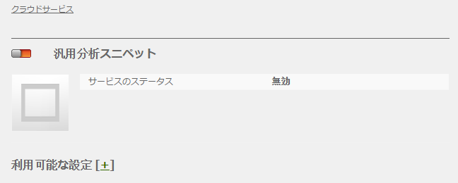
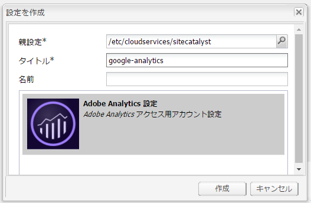
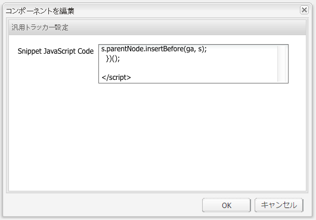
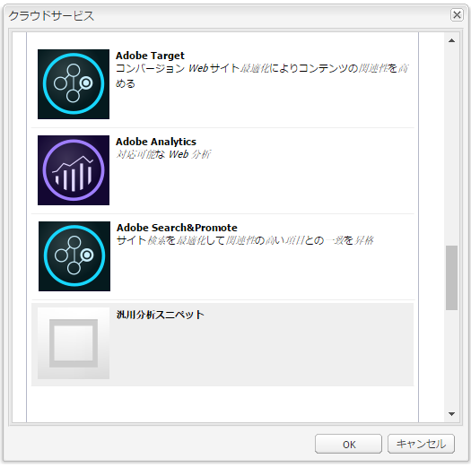
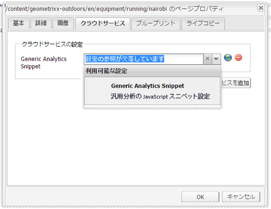

# Analytics と外部プロバイダー {#analytics-with-external-providers}

Analytics は、Web サイトがどのように使用されているかに関する、重要で興味深い情報を提供できます。

様々な標準提供の設定が、次のような適切なサービスとの統合で利用できます。

* [Adobe Analytics](/help/sites-administering/adobeanalytics.md)
* [Adobe Target](/help/sites-administering/target.md)

また、**汎用分析スニペット**&#x200B;の独自のインスタンスを設定して、新しいサービス設定を定義できます。

情報は、Web ページに追加されるコードの小さなスニペットを使用して収集されます。次に例を示します。

>[!CAUTION]
>
>スクリプトは、`script` タグで囲まないようにしてください。

```
var _gaq = _gaq || [];
_gaq.push(['_setAccount', 'UA-XXXXX-X']);
_gaq.push(['_trackPageview']);

(function() {
    var ga = document.createElement('script'); ga.type = 'text/javascript'; ga.async = true;
    ga.src = ('https:' == document.location.protocol ? 'https://ssl' : 'https://www') + '.google-analytics.com/ga.js';
    var s = document.getElementsByTagName('script')[0]; s.parentNode.insertBefore(ga, s);
})();
```

このようなスニペットを使用して、データを収集しレポートを生成できます。収集される実際のデータは、プロバイダーおよび実際に使用されるスニペットによって異なります。統計の例には次が含まれます。

* 経時的な訪問者数
* 訪問ページ数
* 使用された検索語句
* ランディングページ

>[!CAUTION]
>
>Geometrixx-Outdoors デモサイトは、ページプロパティで提供した属性が、対応する `js` スクリプトの HTML ソースコード（`</html>` 終了タグのすぐ上）に追加されます。
>
>独自の `/apps` がデフォルトページコンポーネント（`/libs/foundation/components/page`）から継承しない場合、ユーザー（またはその開発者）が対応する `js` スクリプトが含まれていること（例えば、`cq/cloudserviceconfigs/components/servicescomponents` が含まれているか、同様のメカニズムが使用されているか）を確認する必要があります。
>
>これをしないと、どのサービス（汎用、Analytics、Target など）も機能しません。

## 汎用スニペットを使用した新しいサービスの作成 {#creating-a-new-service-with-a-generic-snippet}

基本設定の場合：

1. **ツール**&#x200B;コンソールを開きます。
1. 左側のパネルから、**クラウドサービス設定**&#x200B;を展開します。
1. 「**汎用分析スニペット**」をダブルクリックしてページを開きます。

   

1. &#x200B;+ をクリックし、ダイアログを使用して新しい設定を追加します。最小限の割り当てでは、名前（例：google analytics）を試用します。

   

1. 「**作成**」をクリックすると、スニペットダイアログがすぐに開くので、適切な JavaScript スニペットをフィールドに貼り付けます。

   

1. 「**OK**」をクリックして保存します。

## ページでの新しいサービスの使用 {#using-your-new-service-on-pages}

今作成したサービス設定は、必要なページで使用するように設定する必要があります。

1. ページに移動します。
1. サイドキックから&#x200B;**ページプロパティ**&#x200B;を開き、「**クラウドサービス**」タブを選択します。
1. 「**サービスを追加**」をクリックし、必要なサービス（例：**汎用分析スニペット**）を選択します。

   

1. 「**OK**」をクリックして保存します。
1. 「**クラウドサービス**」タブに戻されます。**汎用分析スニペット**&#x200B;が、`Configuration reference missing` のメッセージと共に表示されます。ドロップダウンリストを使用して、具体的なサービスインスタンス（例：google-analytics）を選択します。

   

1. 「**OK**」をクリックして保存します。

   これで、ページのページソースを表示すると、スニペットが表示されるようになりました。

   適切な期間が経過した後、収集された統計が表示できるようになります。

   >[!NOTE]
   >
   >設定が子ページを持つページに添付されている場合、サービスはそれらにも継承されます。
