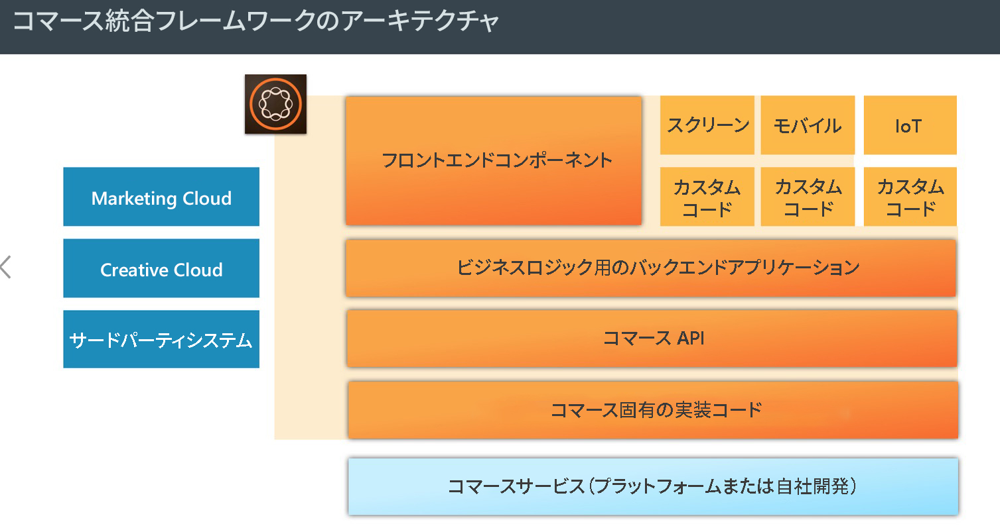
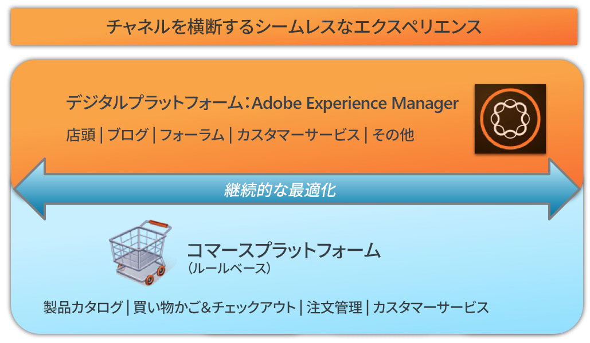

# AEM Commerce - GDPR 対応{#aem-commerce-gdpr-readiness}

>[!IMPORTANT]
>
>以下の節ではGDPRを例に挙げていますが、詳細はデータ保護とプライバシーに関するすべての規制に適用されます。GDPR、CCPAなど

データのプライバシー権に関する EU 一般データ保護規則（GDPR）が 2018 年 5 月に発効します。詳しくは、[アドビプライバシーセンターの GDPR ページ](https://www.adobe.com/jp/privacy/general-data-protection-regulation.html)を参照してください。

>[!NOTE]
>
>詳しくは、[AEM の GDPR 対応](/help/managing/data-protection-and-privacy.md)を参照してください。

デフォルトのコマース統合では AEM がエクスペリエンスレイヤーとなり、サービスを利用して得られたデータをヘッドレスモードで動作する顧客のコマースプラットフォームに送り返します。

For some commerce platforms, we store profile information ( `/home/users`) and commerce tokens (to login in the commerce platform) in AEM. これらのユースケースについては、[AEM プラットフォームでの GDPR 要求の処理](/help/sites-administering/handling-gdpr-requests-for-aem-platform.md)をお読みください。

## AEM Commerce での GDPR 要求の処理 {#handling-gdpr-requests-for-aem-commerce}

Salesforces Commerce Cloud 統合の場合、AEM Commerce には GDPR 関連の情報は一切格納されません。[Salesforce Cloud](https://documentation.demandware.com/) に要求を転送してください。

おろかさとIBM WebSphereの統合に関しては、AEMにいくつかのデータがあります。 [AEM プラットフォームの GDPR 手順](/help/sites-administering/handling-gdpr-requests-for-aem-platform.md)に従い、以下の質問について考察してください。

1. **データはどこに格納され、使用されているか？** 名前、コマースユーザーID、トークン、パスワード、アドレスデータなど、キャッシュされたユーザープロファイル情報がAEMに表示されます。
1. **対象となる GDPR データを誰と共有するか？** AEM Commerce 内の GDPR 関連データの更新は一切格納されず（前述の関連プロファイル情報は除く）、すべて管理元のコマースプラットフォームへと送り返されます。
1. **ユーザーデータの削除方法は？**  AEM でユーザープロファイルを削除し、コマースプラットフォームでユーザーの削除を呼び出してください。

>[!NOTE]
>
>[hybris の wiki](https://wiki.hybris.com/) または [Websphere Commerce のドキュメント](https://www-01.ibm.com/support/docview.wss?uid=swg27036450)を必要に応じて参照してください。

