# 汎用 e コマースの管理 {#administering-generic-ecommerce}

AEM の汎用ソリューションは、（外部の e コマースエンジンを使用するのではなく）リポジトリ内に保持されているコマース情報を管理する手段を提供します。これには以下が含まれます。

* [製品](/help/sites-administering/concepts.md#products)
* [製品バリアント](/help/sites-administering/concepts.md#product-variants)
* [カタログ](/help/sites-administering/concepts.md#catalogs)
* [プロモーション](/help/sites-administering/concepts.md#promotions)
* [割引券](/help/sites-administering/concepts.md#vouchers)
* [注文](/help/sites-administering/concepts.md#shopping-cart-and-orders)
* [プロキシページ](/help/sites-administering/concepts.md#proxy-pages)

>[!NOTE]
>
>標準の AEM インストールには、汎用 AEM（JCR）e コマース実装が含まれています。
>
>現時点では、デモンストレーション目的またはユーザーの要件に応じたカスタム実装の基盤として使用されています。

## 商品と商品バリエーション {#products-and-product-variations}

>[!NOTE]
>
>以下の手順は、商品と商品バリエーションのどちらにも適用されます。

商品を作成する前に、[基礎モード](/help/sites-authoring/scaffolding.md)を定義する必要があります。基礎モードでは、商品の定義に必要なフィールドと、その編集方法を指定します。

基礎モードは、異なる商品タイプごとに必要です。次のどちらかの方法で、適切な基礎モードを商品に関連付けます。

* path
* 商品が基礎モードを参照できる

>[!NOTE]
>
>Geometrixx-Outdoors ストアの商品タイプは 1 つだけです（したがって基礎モードも次の場所に 1 つです）。
>
>`/etc/scaffolding/geometrixx-outdoors`
>
>Geometrixx-Outdoors の商品タイプは、次の場所でアクティブになっています。
>
>`/etc/commerce/products/geometrixx-outdoors`
>
>この場所の下のどこにでも、新しい商品定義を追加の設定なしで作成できます。

### 商品の読み込み {#importing-products}

#### 商品の読み込み - タッチ操作向け UI {#importing-products-touch-optimized-ui}

1. **コマース**&#x200B;から&#x200B;**製品**&#x200B;コンソールに移動します。
1. **製品**&#x200B;コンソールを使用して、必要な場所に移動します。
1. **製品を読み込み**&#x200B;アイコンを使用すると、ウィザードが表示されます。

   

1. 以下を指定します。

   * **インポーター**

      The importer for the specific [commerce provider](/help/sites-administering/concepts.md#commerce-providers), by default `Geometrixx`.

   * **ソース**

      読み込むファイルブラウザーを使用してファイルを選択できます。

   * **増分読み込み**

      これが（フルインポートではなく）増分インポートであるかどうかを示します。
   >[!NOTE]
   >
   >（サンプル geometrixx-outdoor インポーターの）増分読み込みは、商品レベルで動作します。
   >
   >必要に応じて、カスタマイズされたインポーターが動作するように定義できます。

1. 「**次へ**」を選択して商品を読み込みます。実行されたアクションのログが表示されます。

   >[!NOTE]
   >
   >商品は現在の場所、または現在の場所に相対的な場所に読み込まれます。

   >[!NOTE]
   >
   >「**次へ**」と「**戻る**」を繰り返し使用すると、商品定義が繰り返し読み込まれます。ただし、SKU が同じ場合は、リポジトリ内に存在する情報が上書きされるだけです。

1. 「**完了**」を選択して、ウィザードを閉じます。

#### 商品の読み込み - クラシック UI {#importing-products-classic-ui}

1. **ツール**&#x200B;コンソールを使用して、**コマース**&#x200B;フォルダーを開きます。
1. ダブルクリックして&#x200B;**製品インポーター**&#x200B;を開きます。

   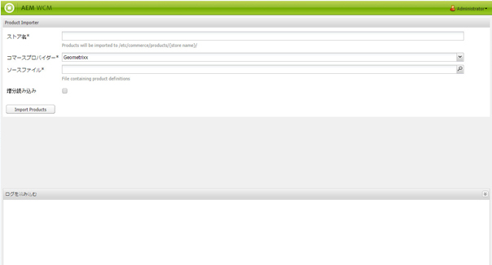

1. 以下を指定します。

   * **ストア名**

      製品のインポート先：

      `/etc/commerce/products/<*store name*>/`

   * **コマースプロバイダー**

      The importer for your [commerce provider](/help/sites-administering/concepts.md#commerce-providers); by default Geometrixx.

   * **ソースファイル**

      読み込むファイルのリポジトリ内の場所。

   * **増分読み込み**

      これが（フルインポートではなく）増分インポートであるかどうかを示します。

1. 「**製品を読み込み**」をクリックします。

### 商品情報の作成 {#creating-product-information}

>[!NOTE]
>
>標準の商品管理は必要最小限です。Geometrixx-Outdoors の商品セットは、基本的なものだからです。The complexity is based on the product [scaffolding](/help/sites-authoring/scaffolding.md), so with your own product scaffolding it is possible to achieve more sophisticated editing.

#### 商品情報の作成 - タッチ操作向け UI {#creating-product-information-touch-optimized-ui}

1. （**コマース**&#x200B;から）**製品**&#x200B;コンソールを使用して、必要な場所に移動します。
1. **作成**&#x200B;アイコンを使用して、（構造と場所に応じて）次のどちらかを選択します。

   * **製品を作成**
   * **製品バリエーションを作成**

   

1. ウィザードが表示されます。「**基本**」タブと「**製品**」タブを使用して、新しい商品または製品バリアントの[製品属性](/help/sites-administering/concepts.md#product-attributes)を入力します。

   >[!NOTE]
   >
   >商品またはバリアントを作成するには、少なくとも&#x200B;**タイトル**&#x200B;と **SKU** が必要です。

1. 「**作成**」を選択して情報を保存します。

>[!NOTE]
>
>多くの商品は、幅広いカラーやサイズで提供されています。基本となる商品と関連する製品バリアントに関する情報は、どちらも&#x200B;**製品**&#x200B;コンソールから管理できます。
>
>商品とそのバリアントはツリー構造として保存されます。商品情報が一番上にあり、バリアントがその下にあります（この構造は UI によって強制されます）。

### 商品情報の編集 {#editing-product-information}

>[!NOTE]
>
>geometrixx-outdoors の商品画像は、次の場所から供給されます。
>
>`/etc/commerce/products/...`
>
>つまり、デフォルトでは [Dispatcher](https://helpx.adobe.com/jp/experience-manager/dispatcher/using/dispatcher-configuration.html) によって商品画像がブロックされるので、必要に応じて設定してください。

#### 商品情報の編集 - タッチ操作向け UI {#editing-product-information-touch-optimized-ui}

1. （**コマース**&#x200B;から）**製品**&#x200B;コンソールを使用して、商品情報に移動します。
1. 次のいずれかを使用します。

   * [クイックアクション](/help/sites-authoring/basic-handling.md#quick-actions)
   * [選択モード](/help/sites-authoring/basic-handling.md#navigating-and-selection-mode)

   **製品データを表示**&#x200B;アイコンを選択します。

   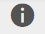

1. [製品属性](/help/sites-administering/concepts.md#product-attributes)が表示されます。「**編集**」と「**完了**」を使用して、変更があれば実行します。

### 商品リファレンスの表示 {#showing-product-references}

#### 商品リファレンスの表示 - タッチ操作向け UI {#showing-product-references-touch-optimized-ui}

1. （**コマース**&#x200B;から）**製品**&#x200B;コンソールを使用して、商品情報に移動します。
1. 次のアイコンを使用して、参照のセカンダリレールを開きます。

   

1. 必要な商品を選択します。セカンダリレールが更新され、使用可能な参照タイプが表示されます。

   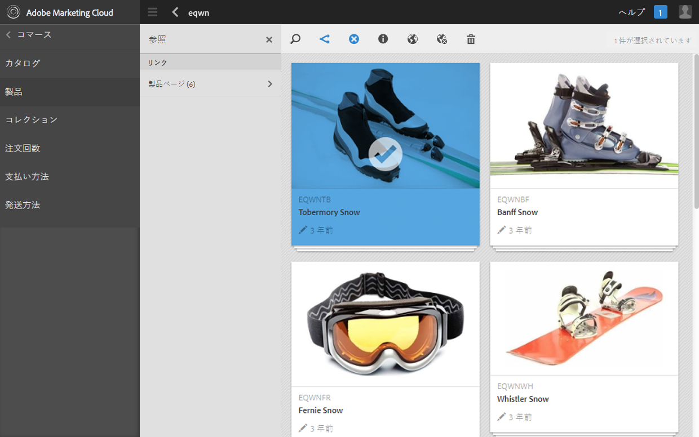

1. 参照タイプ（商品ページなど）をクリックまたはタップして、リストを展開します。
1. 特定の参照を選択すると、以下のオプションが表示されます。

   * 製品ページに移動
   * 製品ページを編集

   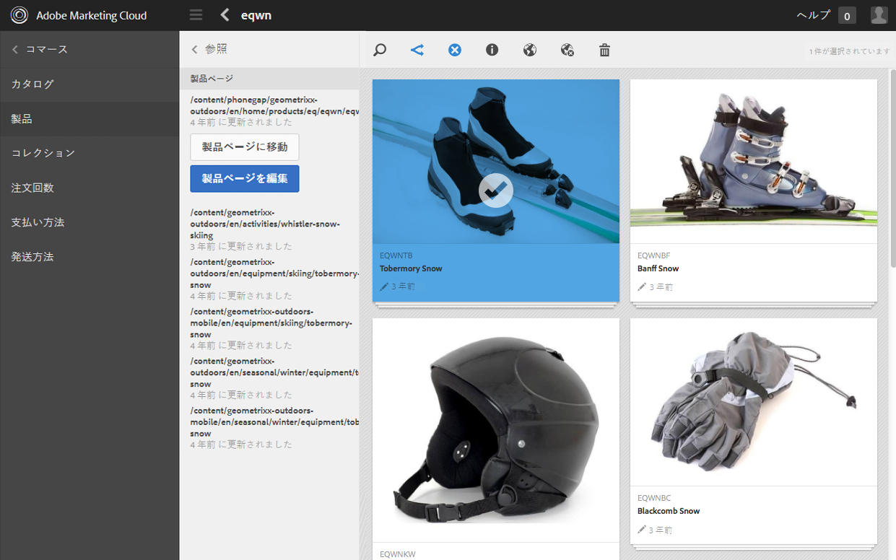

### 商品の検索 {#search-for-products}

1. **コマース**&#x200B;から&#x200B;**製品**&#x200B;コンソールに移動します。
1. 次のアイコンを使用して、検索のセカンダリレールを開きます。

   

1. 商品の検索に使用できるファセットがいくつか表示されます。検索には 1 つまたはいくつかのファセットだけを使用できます。見つかった商品が表示されます。

   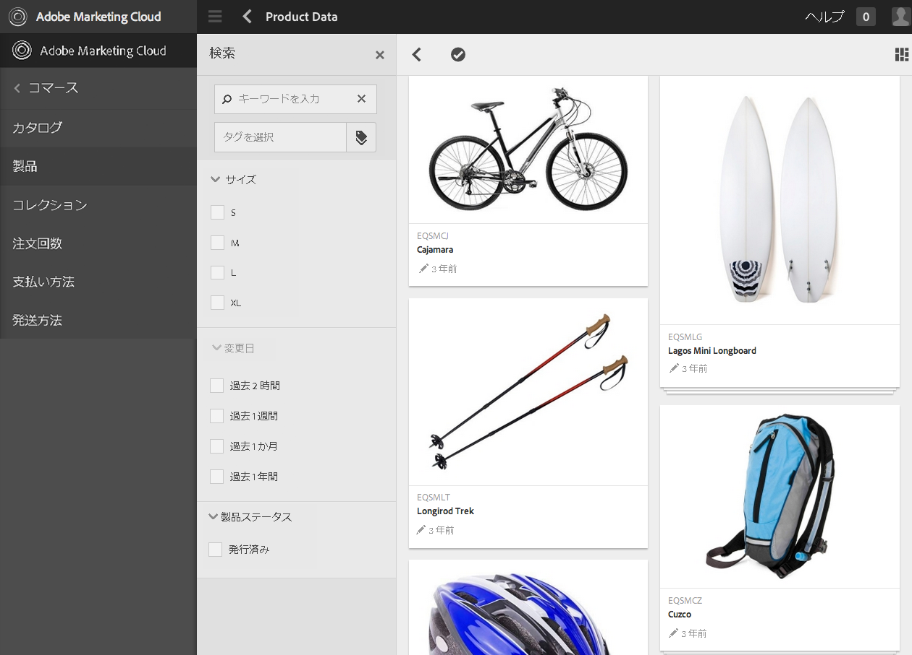

1. 商品をクリックまたはタップして開きます。商品を公開したり、商品データを表示したりもできます。

#### 検索の拡張 {#extending-search}

CRXDE Lite を使用して、既存のファセットを変更したり、新しいファセットを追加したりできます。

1. 次の URL に移動します。

   `http://localhost:4502/crx/de/index.jsp#/libs/commerce/gui/content/products/aside/items/search/items/searchpanel/facets`

1. 例えば、商品の検索ページに表示するサイズを変更できます。Click the `sizegroup` node.
1. Click `items` node, then click `propertypredicate` node.
1. You can modify the `propertyValues`. 例えば、XS または XXL を追加したり、サイズを削除したりできます。
1. Click **Save All** and navigate to the products search page. 変更内容が表示されます。

### 複数アセット {#multiple-assets}

商品コンポーネントに複数のアセットを追加して、商品ページに表示するアセットを指定できます。

>[!NOTE]
>
>複数アセットに関連する作業はすべて、タッチ操作向け UI で実行します。

#### 複数アセットの追加 {#adding-multiple-assets}

1. **コマース**&#x200B;から&#x200B;**製品**&#x200B;コンソールに移動します。
1. Using the **Products** console, navigate to the required product.

   >[!NOTE]
   >
   >バリアントレベルではなく商品レベルに移動する必要があります。

1. 選択モードまたはクイックアクションを使用して、**製品データを表示**&#x200B;アイコンをタップまたはクリックします。
1. 編集アイコンをタップまたはクリックします。
1. 「**追加**」までスクロールします。

   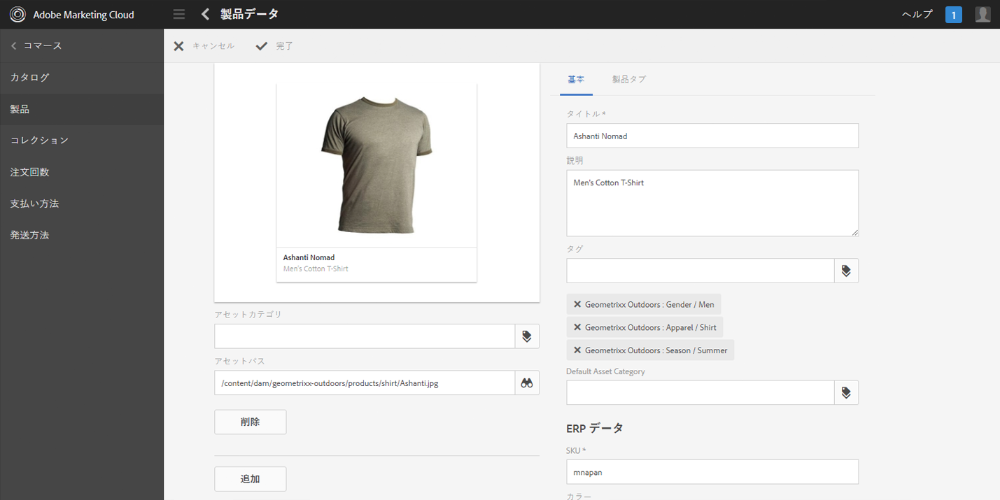

1. 「**追加**」をタップまたはクリックします。新しいアセットのプレースホルダーが表示されます。
1. 「**Change **」をタップ/クリックすると、ダイアログが開き、アセットを選択できます。
1. 追加するアセットを選択します。

   >[!NOTE]
   >
   >選択できるアセットは、[Assets](https://helpx.adobe.com/experience-manager/aem-previous-versions.html#assets) のものです。

1. 完了アイコンをタップまたはクリックします。

2 つのアセットが製品コンポーネントに保存されました。商品ページに表示するアセットを設定できます。この機能は、カテゴリシステムと連動しています。まず、個々のアセットにカテゴリを追加する必要があります。

1. Tap/click **View Product Data**.
1. Type an **Asset Category** under the assets, for example `cat1` and `cat2`.

   >[!NOTE]
   >
   >カテゴリにはタグも使用できます。

1. 完了アイコンをタップまたはクリックします。今度は変更内容を[ロールアウト](#rolling-out-a-catalog)する必要があります。

製品コンポーネント内のアセットには、カテゴリがあります。表示するカテゴリを次の 3 種類のレベルで設定できます。

* [製品ページ](#product-page)
* [カタログ](#catalog)
* [製品コンソール](#products-console)

>[!NOTE]
>
>カテゴリを設定していない場合、最初のアセットが商品ページに表示されます。

表示する画像を選択する仕組みは次のとおりです。

1. 商品ページ用にカテゴリが設定されているかどうかを確認します。
1. 設定されていない場合、カタログ用にカテゴリが設定されているかどうかを確認します。
1. 設定されていない場合、製品コンソール用にカテゴリが設定されているかどうかを確認します。

>[!NOTE]
>
>カタログレベルと製品コンソールレベルの両方で変更内容をロールアウトして、変更を適用し、商品ページ上で違いを確認する必要があります。

#### 製品ページ {#product-page}

1. 商品ページに移動します。
1. 製品コンポーネントを&#x200B;**編集**&#x200B;します。
1. 選択した&#x200B;**画像カテゴリ**&#x200B;を入力します（例：`cat1`）。
1. 「**完了**」をタップまたはクリックします。ページを更新すると、正しいアセットが表示されます。

#### カタログ  {#catalog}

1. カタログに移動します。
1. 「**プロパティを表示**」をタップまたはクリックします。
1. 「**編集**」をタップまたはクリックします。
1. Tap/click the **Assets** tab.
1. 必要な&#x200B;**製品アセットカテゴリ**&#x200B;を入力します。
1. 「**完了**」をタップまたはクリックします。
1. 変更内容を[ロールアウト](#rolling-out-a-catalog)します。

#### 製品コンソール {#products-console}

1. Using the **Products** console, navigate to the required Product.
1. Tap/click **View Product Data**.
1. 「**編集**」をタップまたはクリックします。
1. **デフォルトのアセットカテゴリ**&#x200B;を入力します。
1. 「**完了**」をタップまたはクリックします。
1. 変更内容を[ロールアウト](#rolling-out-a-catalog)します。

### 商品情報の公開／非公開 {#publishing-unpublishing-product-information}

#### 商品情報の公開／非公開 - タッチ操作向け UI {#publishing-unpublishing-product-information-touch-optimized-ui}

>[!NOTE]
>
>多くの場合、商品情報は商品を参照するページを通じて公開されます。例えば、製品Yを参照するページXを公開すると、AEMは製品Yも公開するかどうかを尋ねます。
>
>特別なケースでは、AEMは製品データからの直接公開もサポートしています。

1. （**コマース**&#x200B;から）**製品**&#x200B;コンソールを使用して、商品情報に移動します。
1. 次のいずれかを使用します。

   * [クイックアクション](/help/sites-authoring/basic-handling.md#quick-actions)
   * [選択モード](/help/sites-authoring/basic-handling.md#navigating-and-selection-mode)

   必要に応じて&#x200B;**公開**&#x200B;アイコンまたは&#x200B;**非公開**&#x200B;アイコンを選択します。

    

   それぞれに応じて商品情報が公開または非公開になります。

### 製品フィード {#product-feed}

Search&amp;Promote 統合を使用すると、次のことができます。

* 基になるリポジトリ構造やコマースプラットフォームと関係なく、e コマース API を使用する。
* Search&amp;Promote のインデックスコネクタ機能を利用して、XML 形式で製品フィードを提供する。
* Search&amp;Promote のリモート制御機能を利用して、製品フィードのオンデマンドリクエストまたはスケジュール済みリクエストを実行する。
* クラウドサービス設定として指定された、様々な Search&amp;Promote アカウント用のフィードを生成する。

詳しくは、[製品フィード](/help/sites-administering/product-feed.md)を参照してください。

### 商品アップデート用のイベントハンドラー {#event-handler-for-product-updates}

商品が追加、変更または削除された場合や、商品ページが追加、変更または削除された場合にイベントを記録するイベントハンドラーがあります。次の OSGi イベントが用意されています。

* `com/adobe/cq/commerce/pim/PRODUCT_ADDED`
* `com/adobe/cq/commerce/pim/PRODUCT_MODIFIED`
* `com/adobe/cq/commerce/pim/PRODUCT_DELETED`
* `com/adobe/cq/commerce/pim/PRODUCT_PAGE_ADDED`
* `com/adobe/cq/commerce/pim/PRODUCT_PAGE_MODIFIED`
* `com/adobe/cq/commerce/pim/PRODUCT_PAGE_DELETED`

For the `PRODUCT_*` events, the path points to the base product in `/etc/commerce/products`. For the `PRODUCT_PAGE_*` events, the path points to the `cq:Page` node.

You can look at them in the Web Console in OSGI events ( `/system/console/events`), for example:

>[!NOTE]
>
>Read also [Event handling in AEM](https://blogs.adobe.com/experiencedelivers/experience-management/event_handling_incq/). 

### カートへ追加リンクを含む画像 {#image-with-add-to-cart-links}

カートへ追加リンクを含む画像コンポーネントを使用すると、画像上の商品にリンクされているホットスポットを作成することによって、商品を買い物かごにすばやく追加できます。

ホットスポットをクリックすると、商品のサイズと数量を選択できるダイアログが表示されます。

1. コンポーネントを追加するページに移動します。
1. コンポーネントをページにドラッグ＆ドロップします。
1. [アセットブラウザー](/help/sites-authoring/author-environment-tools.md#assets-browser)からコンポーネントに画像をドラッグ＆ドロップします。
1. 次のいずれかを実行できます。

   * コンポーネントをクリックし、「編集」アイコンをクリックします
   * ゆっくりとダブルクリックする

1. フルスクリーンアイコンをクリックします。

   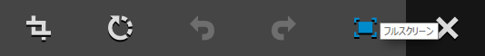

1. ローンチマップアイコンをクリックします。

   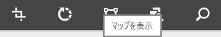

1. 形状アイコンのいずれかをクリックします。

   

1. 必要に応じて形状を変更および移動します。
1. 形状をクリックします。
1. 参照アイコンをクリックすると、[アセットピッカー](../assets/search-assets.md#assetpicker)が表示されます。

   >[!NOTE]
   >
   >または、商品パスを直接入力できます。商品パスは、バリアントレベルではなく商品レベルである必要があります。

   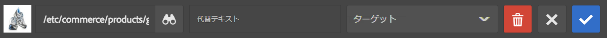

1. 確認アイコンを 2 回クリックしてから、「フルスクリーンを終了」をクリックします。
1. ページ上でコンポーネントの横の任意の場所をクリックします。ページが更新され、画像の上に次の記号が表示されます。

   

1. [プレビュー](/help/sites-authoring/editing-content.md#previewingpagestouchoptimizedui)モードに切り替えます。
1. 「+」ホットスポットをクリックします。A dialog opens where you can choose the size and quantity of the product you entered in **Path**.

   

1. サイズと数量を入力します。
1. 「カートへ追加」ボタンをクリックします。ダイアログが閉じます。
1. 買い物かごに移動します。商品が入っているはずです。

#### 設定オプション {#configuration-options}

ホットスポットをクリックしたときのダイアログの表示を設定できます。

1. コンポーネントをクリックして、設定アイコンをクリックします。

   

1. 下にスクロールします。「**カートへ追加**」タブがあります。

   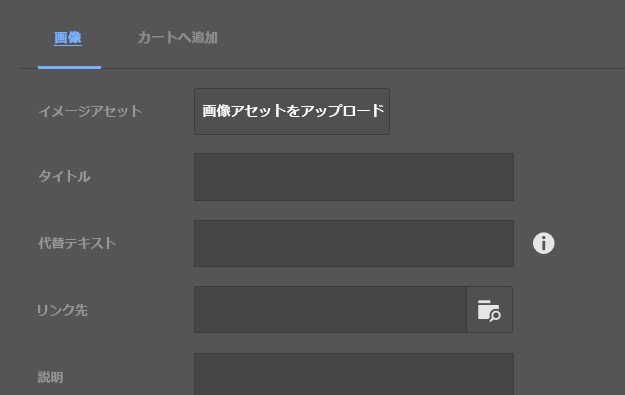

1. 「**カートへ追加**」タブをクリックします。3 つの設定オプションを使用できます。

   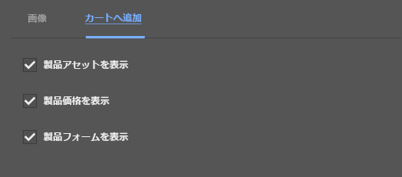

1. 完了アイコンをクリックします。

## カタログ {#catalogs}

### カタログの生成 {#generating-a-catalog}

#### カタログの生成 - タッチ操作向け UI {#generating-a-catalog-touch-optimized-ui}

>[!NOTE]
>
>カタログは、商品データを参照します。

カタログを生成するには：

1. サイトコンソールを開きます（例：[http://localhost:4502/sites.html/content](http://localhost:4502/sites.html/content)）。
1. 新しいページを作成する場所に移動します。
1. オプションリストを開くには、**作成**&#x200B;アイコンを使用します。

   

1. From the list select **Create Catalog**, the Create Catalog wizard will open.

   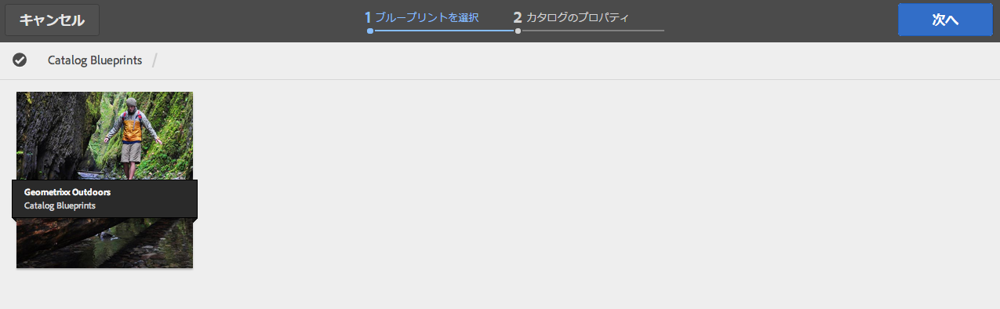

1. 必要なカタログのブループリントに移動します。
1. 「**選択**」ボタンをタップまたはクリックし、必要なカタログのブループリントをタップまたはクリックします。
1. 「**次へ**」をタップまたはクリックします。

   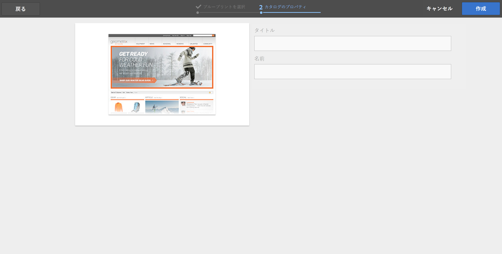

1. Type a **Title** and a **Name**.
1. 「**作成**」ボタンをタップまたはクリックします。カタログが作成され、ダイアログが表示されます。

   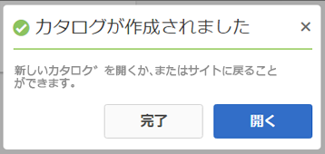

1. 「**完了**」ボタンをタップまたはクリックすると、サイトコンソールに戻り、カタログを表示することができます。

   Tapping/clicking **Open Catalog** button opens your catalog (for example `http://localhost:4502/editor.html/content/test-catalog.html`).

#### カタログの生成 - クラシック UI {#generating-a-catalog-classic-ui}

>[!NOTE]
>
>カタログは、[商品データ](#products-and-product-variants)を参照します。

1. **Web サイト**&#x200B;コンソールを使用して、**カタログのブループリント**&#x200B;に移動し、基本カタログに移動します。

   次に例を示します。

   `http://localhost:4502/siteadmin#/content/catalogs/geometrixx-outdoors/base-catalog`

1. **セクションのブループリント**&#x200B;テンプレートを使用して新規ページを作成します。

   例： `Swimwear`

1. Open the new `Swimwear` page, then click **Edit Blueprint** to open the **Properties** dialog, where you can set up the **Products** selection.

   例えば、「**タグ／キーワード**」フィールドを開いてアクティビティを選択し、Geometrixx-Outdoors セクションから「Swimming」を選択します。

1. 「**OK**」をクリックしてプロパティを保存します。サンプルの商品が、ブループリントページの「**製品の選択条件**」の下に表示されます。
1. 「**ロールアウトの変更...**」をクリックし、「**ページとすべてのサブページをロールアウト**」を選択して、「**次へ**」をクリックしてから「**ロールアウト**」をクリックします。Once the rollout is completed successfully the **Status** indicator will be shown as green.
1. 「**閉じる**」をクリックして、次の場所およびその下にある新しいカタログセクションを確認します。

   `http://localhost:4502/cf#/content/geometrixx-outdoors/en/swimwear.html`

1. ブループリントページで再び「**ブループリントを編集**」をクリックし、**プロパティ**&#x200B;ダイアログで「**生成されたページ**」タブを開きます。バナーリストフィールドで、表示する画像を選択します（例：`summer.jpg`）。
1. 「**OK**」をクリックしてプロパティを保存します。バナー情報が、ブループリントページの「**製品の選択条件**」の下に表示されます。
1. これらの新しい変更をロールアウトします。

### カタログのロールアウト {#rolling-out-a-catalog}

#### カタログのロールアウト - タッチ操作向け UI {#rolling-out-a-catalog-touch-optimized-ui}

カタログをロールアウトするには：

1. Navigate to the **Catalogs** console, via **Commerce**.
1. ロールアウトするカタログに移動します。
1. 次のいずれかを使用します。

   * [クイックアクション](/help/sites-authoring/basic-handling.md#quick-actions)
   * [選択モード](/help/sites-authoring/basic-handling.md#navigating-and-selection-mode)

   **ロールアウトの変更**&#x200B;アイコンを選択します。

   

1. In the wizard, set the rollout as needed and then tap/click **Rollout Changes**.
1. ダイアログが表示されます。Tap/click **Done** when the process is finished.

#### カタログのロールアウト - クラシック UI {#rolling-out-a-catalog-classic-ui}

カタログをロールアウトするには：

1. ロールアウトするカタログに移動します。 次に例を示します。

   `http://localhost:4502/cf#/content/catalogs/geometrixx-outdoors/base-catalog.html`

1. 「**ロールアウトの変更...**」をクリックします。
1. 必要に応じてロールアウトを設定します。
1. 「**ロールアウト**」をクリックします。

### ブループリントインポーター {#blueprint-importer}

#### ブループリントインポーター - タッチ操作向け UI {#blueprint-importer-touch-optimized-ui}

1. Navigate to the **Catalogs** console, via **Commerce**.
1. カタログのブループリントを読み込む場所に移動します。
1. **ブループリントを読み込み**&#x200B;アイコンをタップまたはクリックします。

   

1. ウィザードで、必要に応じてソースを選択し、「**次へ**」をタップまたはクリックします。

   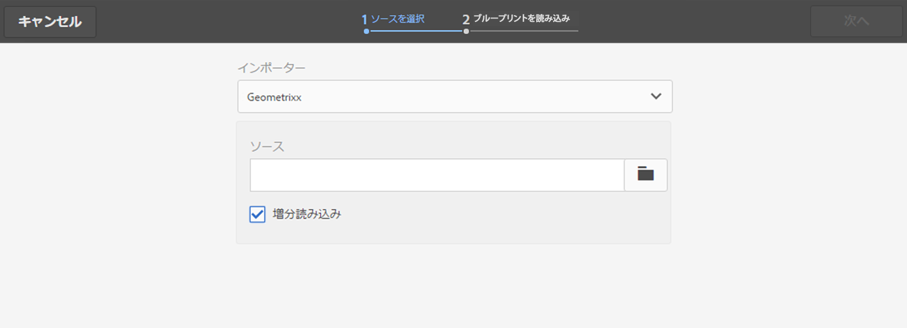

1. 読み込みが終了したら、「**完了**」をタップまたはクリックします。

#### ブループリントインポーター - クラシック UI {#blueprint-importer-classic-ui}

1. Using the **Tools** console, navigate to **Commerce**.

   次に例を示します。

   `http://localhost:4502/miscadmin#/etc/commerce`

1. **カタログブループリントインポーター**&#x200B;を開きます。
1. 必要に応じて読み込みを設定します。
1. 「**カタログのブループリントを読み込み**」をクリックします。

## プロモーション {#promotions}

### プロモーションの作成 {#creating-a-promotion}

#### プロモーションの作成 - クラシック UI {#creating-a-promotion-classic-ui}

>[!NOTE]
>
>次の例では、[キャンペーン](/help/sites-classic-ui-authoring/classic-personalization-campaigns.md)内に直接保持されているプロモーションを扱います。このキャンペーンは、割引券に使用されます。
>
>プロモーションは、キャンペーン内の[エクスペリエンス](/help/sites-authoring/personalization.md)に含めることもできます。
>
>詳しくは、[プロモーションと割引券](#promotions-and-vouchers)を参照してください。

1. オーサーインスタンスの **Web サイト**&#x200B;コンソールを開きます。
1. 左側のパネルで、必要な&#x200B;**キャンペーン**&#x200B;を選択します。
1. 「**新規**」をクリックし、**プロモーション**&#x200B;テンプレートを選択して、新しい割引券の&#x200B;**タイトル**（および必要な場合は&#x200B;**名前**）を指定します。
1. 「**作成**」をクリックします。新しいプロモーションページが右側のパネルに表示されます。

1. 次のどちらかの方法で、**プロパティ**&#x200B;を編集します。

   * このページを開き、「編集」ボタンをクリックしてプロパティダイアログを表示する
   * Web サイトコンソールでこのページを選択し、コンテキストメニュー（通常はマウスの右ボタン）を使用して「**プロパティ...**」を選択し、プロパティダイアログを表示する

   「**プロモーションタイプ**」、「**割引のタイプ**」、「**割引値**」およびその他すべてのフィールドを必要に応じて指定します。

1. 「**OK**」をクリックして保存します。

1. これでプロモーションをアクティベートできるので、パブリッシュインスタンス上でプロモーションが買い物客に表示されます。

## 割引券 {#vouchers}

### 割引券の作成 {#creating-a-voucher}

#### 割引券の作成 - クラシック UI {#creating-a-voucher-classic-ui}

1. オーサーインスタンスの **Web サイト**&#x200B;コンソールを開きます。
1. 左側のパネルで、必要な&#x200B;**キャンペーン**&#x200B;を選択します。
1. 「**新規**」をクリックし、**割引券**&#x200B;テンプレートを選択して、新しい割引券の&#x200B;**タイトル**（および必要な場合は&#x200B;**名前**）を指定します。
1. 「**作成**」をクリックします。新しい割引券ページが右側のパネルに表示されます。

1. ダブルクリックして新しい割引券ページを開き、「**編集**」をクリックして、必要に応じて情報を設定します。
1. 「**OK**」をクリックして保存します。

1. これで割引券をアクティベートできるので、買い物客はパブリッシュインスタンス上でこの割引券を買い物かごに入れて使用できます。

### 割引券の削除 {#removing-vouchers}

#### 割引券の削除 - クラシック UI {#removing-vouchers-classic-ui}

顧客が割引券を利用できないようにするには、次のどちらかの方法を実行します。

* 割引券のアクティベートを解除する - オーサー環境では引き続き利用可能なので、後で再アクティベートできます。
* 完全に削除する。

どちらのアクションも、**Web サイト**&#x200B;コンソールから実行できます。

### 割引券の変更 {#modifying-vouchers}

#### 割引券の変更 - クラシック UI {#modifying-vouchers-classic-ui}

割引券またはプロモーションのプロパティを変更するには、**Web サイト**&#x200B;コンソールでその割引券またはプロモーションをダブルクリックし、「**編集**」をクリックします。保存後、変更がパブリッシュインスタンスにプッシュされるように、アクティベートする必要があります。

### 買い物かごへの割引券の追加 {#adding-vouchers-to-a-cart}

ユーザーが買い物かごに割引券を追加できるようにするには、組み込みの&#x200B;**割引券**&#x200B;コンポーネント（コマースカテゴリ）を使用します。このコンポーネントを、買い物かごが表示されているのと同じページに追加する必要があります（ただし必須ではありません）。ほとんどの場合、割引券コンポーネントはユーザーが割引券コードを入力できるフォームにすぎません。適用された割引券とその割引の一覧を実際に表示するのは、買い物かごコンポーネントです。

デモサイト（Geometrixx Outdoors - English）では、買い物かごページの実際の買い物かごの下に、割引券フォームが表示されます。

## 注文回数 {#orders}

>[!NOTE]
>
>デフォルトの AEM には、マーチャンダイズの返送、注文ステータスの更新、受け渡しの実行、納品書の生成など、注文に関連する標準機能に必要なアクションがないことを思い出してください。主な目的は技術のプレビューです。
>
>AEMの一般的な注文管理は、基本的なものとして保たれています。ウィザードで使用できるフィールドは、スキャフォールドに応じて異なります。
>`/etc/scaffolding/geometrixx-outdoors/order/jcr:content/cq:dialog`
>
>カスタマイズされた基礎モードを作成する場合は、さらに多くの注文情報を保存できます。

>[!NOTE]
>
>注文コンソールには、公開されることのないベンダーの注文情報が表示されます。
>
> 顧客の注文情報はそのホームディレクトリに保持され、顧客のアカウントの注文履歴で公開されます。この情報は、ホームディレクトリの残りの情報とともに公開されます。

### 注文情報の作成 {#creating-order-information}

#### 注文情報の作成 - タッチ操作向け UI {#creating-order-information-touch-optimized-ui}

1. **注文**&#x200B;コンソールを使用して、必要な場所に移動します。
1. **作成**&#x200B;アイコンを使用して、「**注文を作成**」を選択します。

   

1. ウィザードが表示されます。「**基本**」、「**コンテンツ**」、「**支払い**」および「**受渡**」タブを使用して、[新しい注文に関する情報](/help/sites-administering/concepts.md#order-information)を入力します。

1. 「**作成**」を選択して情報を保存します。

### 注文情報の編集 {#editing-order-information}

#### 注文情報の編集 - タッチ操作向け UI {#editing-order-information-touch-optimized-ui}

1. **注文**&#x200B;コンソールを使用して、注文に移動します。
1. 次のいずれかを使用します。

   * [クイックアクション](/help/sites-authoring/basic-handling.md#quick-actions)
   * [選択モード](/help/sites-authoring/basic-handling.md#navigating-and-selection-mode)

   **注文データを表示**&#x200B;アイコンを選択します。

   

1. [注文情報](/help/sites-administering/concepts.md#order-information)が表示されます。「**編集**」と「**完了**」を使用して、変更があれば実行します。

