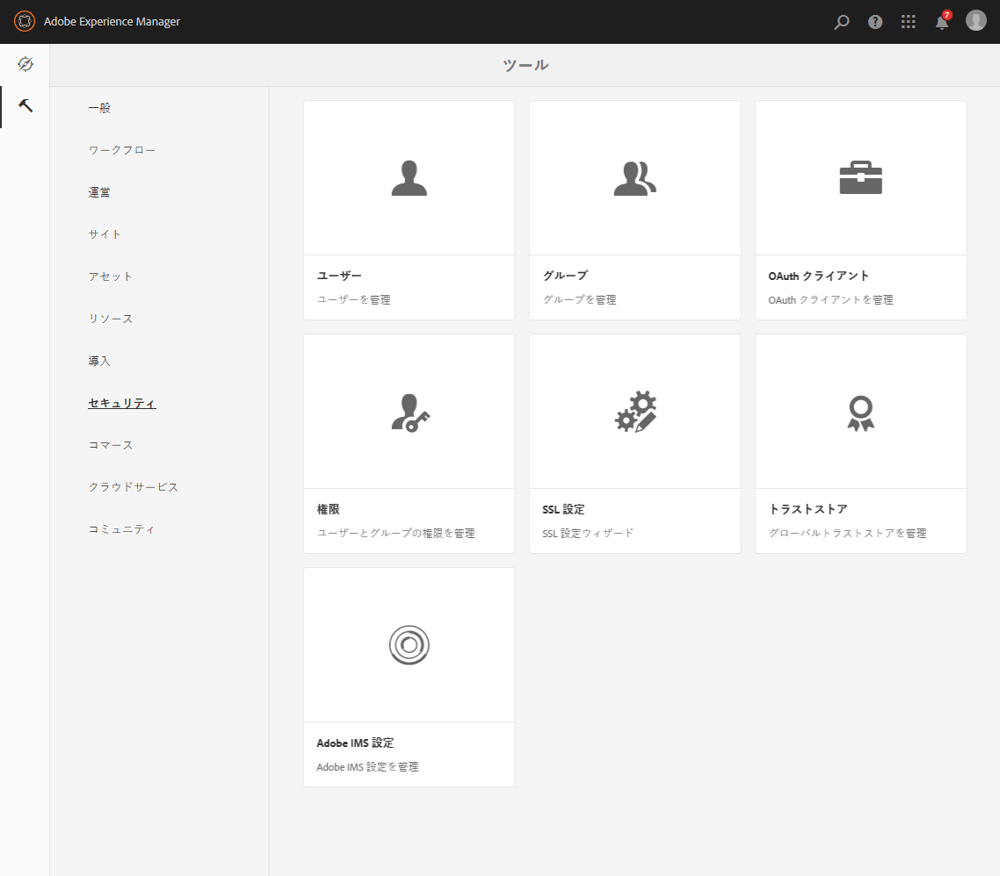
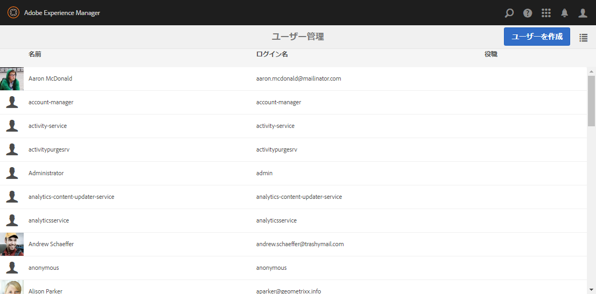
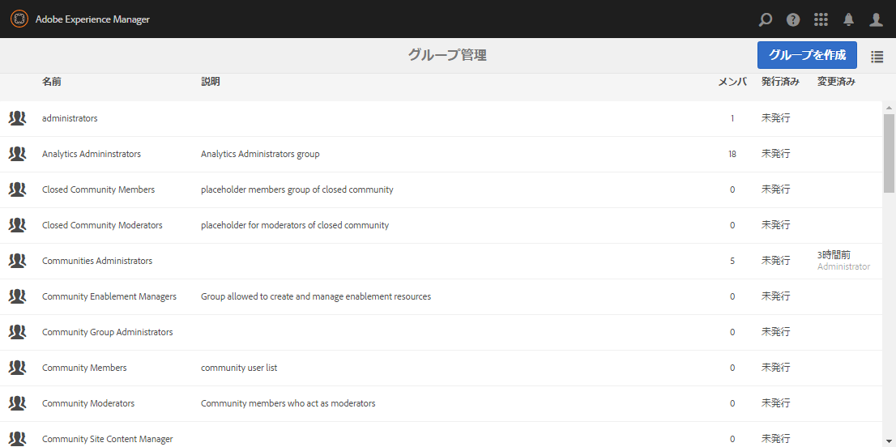
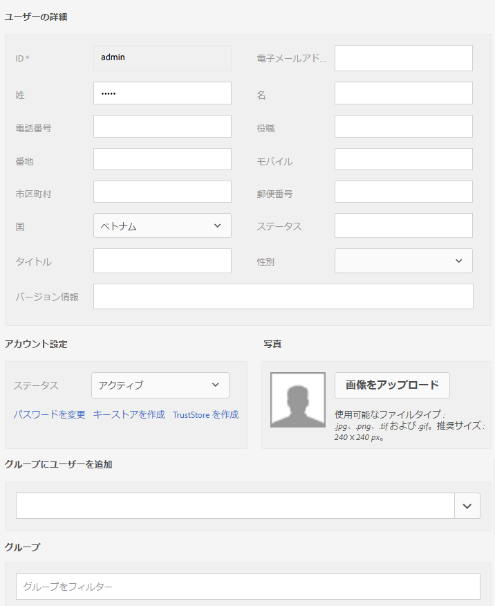
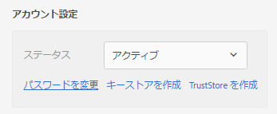
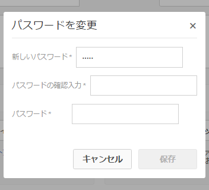
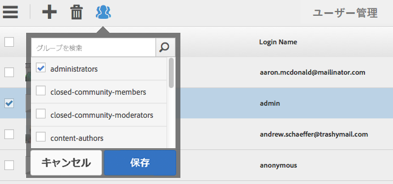
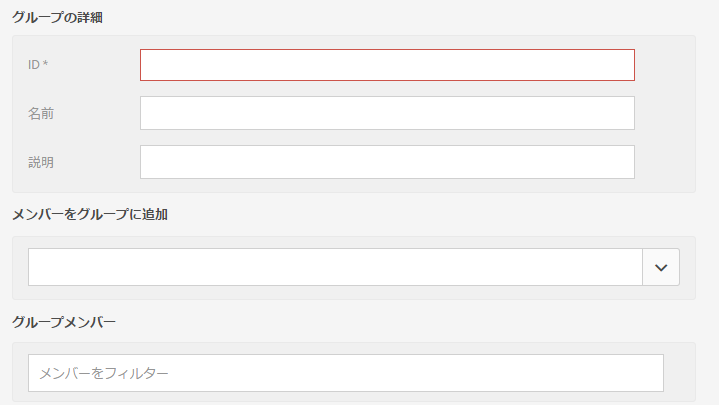

# Granite の操作 - ユーザー管理とグループ管理{#granite-operations-user-and-group-administration}

Granite には JCR API 仕様の CRX リポジトリ実装が組み込まれているので、独自のユーザー管理とグループ管理が使用されます。

These accounts are the underlying basis of the [AEM accounts](/help/sites-administering/security.md) and any account changes made with the Granite administration will be reflected if/when the accounts are accessed from the [AEM Users console](/help/sites-administering/security.md#accessing-user-administration-with-the-security-console) (e.g. `http://localhost:4502/useradmin`). From the AEM Users console you can also manage the privileges and other AEM specifics.

Granite ユーザー管理コンソールとグループ管理コンソールは、どちらもタッチ操作向け UI の&#x200B;**[ツール](/help/sites-administering/tools-consoles.md)**&#x200B;コンソールから利用できます。

ツールコンソールから「**ユーザー**」または「**グループ**」を選択すると、該当するコンソールが開きます。どちらの場合も、アクションを実行するには、クリックボックスとツールバーのアクションを使用するか、「**名前**」の下のリンクからアカウント詳細を開きます。

* [ユーザー管理](#user-administration)

   

   **ユーザー**&#x200B;コンソールには、次のリストが表示されます。

   * ユーザー名
   * ユーザーのログイン名（アカウント名）
   * アカウントに割り当てられているタイトル

* [グループ管理](#group-administration)

   

   **グループ**&#x200B;コンソールには、次のリストが表示されます。

   * グループ名
   * グループの説明
   * グループ内のユーザー／グループの数

## User Administration {#user-administration}

### Adding a New User {#adding-a-new-user}

1. **ユーザーを追加**&#x200B;アイコンを使用します。

   

1. **ユーザーを作成**&#x200B;フォームが開きます。

   

   ここに、アカウントのユーザー詳細を入力できます（ほとんどは標準的で、説明は不要なものです）。

   * **ID**

      ユーザーアカウントの一意の ID です。必須で、スペースは使用不可です。

   * **電子メールアドレス**
   * **パスワード**

      パスワードは必須です。

   * **パスワードの確認入力**

      パスワードの確認用として必須です。

   * **名**
   * **姓**
   * **電話番号**
   * **役職**
   * **番地**
   * **モバイル**
   * **市区町村**
   * **郵便番号**
   * **国**
   * **都道府県**
   * **タイトル**
   * **性別**
   * **** について
   * **アカウント設定**

      * **ステータス**
アカウントにフラグを付けることもできます。 
**active** （アクティブ）または **inactive（非アクティブ）**。
   * **写真**

      ここで、アバターとして使用する写真をアップロードできます。

      Accepted file types: `.jpg .png .tif .gif`

      推奨サイズ： `240x240px`

   * **グループにユーザーを追加**

      選択ドロップダウンを使用して、ユーザーをメンバーとして所属させるグループを選択します。選択した内容を保存前に解除するには、名前の横にある **X** を使用します。

   * **グループ**

      ユーザーが現在メンバーとして所属しているグループのリストです。選択した内容を保存前に解除するには、名前の横にある **X** を使用します。

1. ユーザーアカウントの定義が終了したら、以下を使用します。

   * 登録を中止するには、「**キャンセル**」を使用します。
   * 登録を完了するには、「**保存**」を使用します。メッセージが表示され、ユーザーアカウントの作成が確定されます。

### 既存ユーザーの編集 {#editing-an-existing-user}

1. ユーザーコンソールで、ユーザー名のリンクからユーザー詳細にアクセスします。

1. [新規ユーザーの追加](#adding-a-new-user)の場合と同様に、詳細を編集できます。

1. ユーザーコンソールで、ユーザー名のリンクからユーザー詳細にアクセスします。

1. [新規ユーザーの追加](#adding-a-new-user)の場合と同様に、詳細を編集できます。

### 既存ユーザーのパスワードの変更 {#changing-the-password-for-an-existing-user}

1. ユーザーコンソールで、ユーザー名のリンクからユーザー詳細にアクセスします。

1. [新規ユーザーの追加](#adding-a-new-user)の場合と同様に、詳細を編集できます。「**アカウント設定**」に「**パスワードを変更**」リンクがあります。

   

1. **パスワードを変更**&#x200B;ダイアログが開きます。新しいパスワードを確認用も含め 2 回入力し、自分のパスワードを入力します。「**OK**」を使用して変更を確定します。

   

   パスワードが変更されたことを示すメッセージが表示されます。

### 簡単なグループ割り当て {#quick-group-assignment}

1. クリックボックスを使用して 1 人以上のユーザーにフラグを設定します。
1. **グループ**&#x200B;アイコンを使用します。

   

   グループ選択ドロップダウンが開きます。

   

1. 選択ボックスでは、ユーザーアカウントを所属させるグループを選択したり、その選択を解除したりすることができます。

1. 必要なグループ割り当てまたは割り当て解除が終了したら、以下を使用します。

   * 変更を中止するには、「**キャンセル**」を使用します。
   * 変更を確定するには、「**保存**」を使用します。

### 既存ユーザーの詳細の削除 {#deleting-existing-user-details}

1. クリックボックスを使用して 1 人以上のユーザーにフラグを設定します。
1. **削除**&#x200B;アイコンを使用してユーザー詳細を削除します。

   

1. 削除を確定するかどうかを確認するメッセージが表示され、確定すると、削除が実際に実行されたことを示すメッセージが表示されます。

## Group Administration {#group-administration}

### Adding a New Group {#adding-a-new-group}

1. グループを追加アイコンを使用します。

   

1. **グループを作成**&#x200B;フォームが開きます。

   

   ここに、グループ詳細を入力できます。

   * **ID**

      グループの一意の ID です。必須で、スペースは使用不可です。

   * **名前**

      グループの名前です。グループコンソールに表示されます。

   * **説明**

      グループの説明です。

   * **メンバーをグループに追加**

      選択ドロップダウンを使用して、ユーザーをグループに追加します。選択した内容を保存前に解除するには、名前の横にある **X** を使用します。

   * **グループメンバー**

      グループ内のユーザーのリストです。選択した内容を保存前に解除するには、名前の横にある **X** を使用します。

1. グループの定義が終了したら、以下を使用します。

   * 登録を中止するには、「**キャンセル**」を使用します。
   * 登録を完了するには、「**保存**」を使用します。メッセージが表示され、グループの作成が確定されます。

### 既存グループの編集 {#editing-an-existing-group}

1. グループコンソールで、グループ名のリンクからグループ詳細にアクセスします。

1. [新規グループの追加](#adding-a-new-group)の場合と同様に、詳細を編集して保存できます。

### 既存グループのコピー {#copying-an-existing-group}

1. クリックボックスを使用してグループにフラグを設定します。
1. **コピー**&#x200B;アイコンを使用してグループ詳細をコピーします。

   

1. **グループ設定を編集**&#x200B;フォームが開きます。

   グループIDは元のIDと同じですが、先頭にはが付き `Copy of`ます。IDにスペースを含めることはできないので、これを編集する必要があります。 その他の詳細は元の情報とすべて同じです。

   [新規グループの追加](#adding-a-new-group)の場合と同様に、詳細を編集して保存できます。

### 既存グループの削除 {#deleting-an-existing-group}

1. クリックボックスを使用して 1 つ以上のグループにフラグを設定します。
1. **削除**&#x200B;アイコンを使用してグループ詳細を削除します。

   

1. 削除を確定するかどうかを確認するメッセージが表示され、確定すると、削除が実際に実行されたことを示すメッセージが表示されます。

