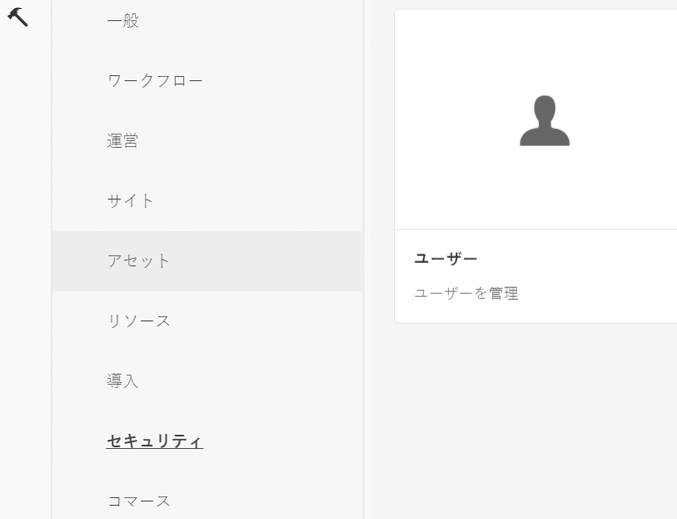
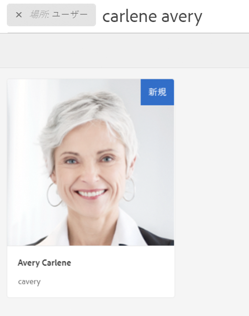
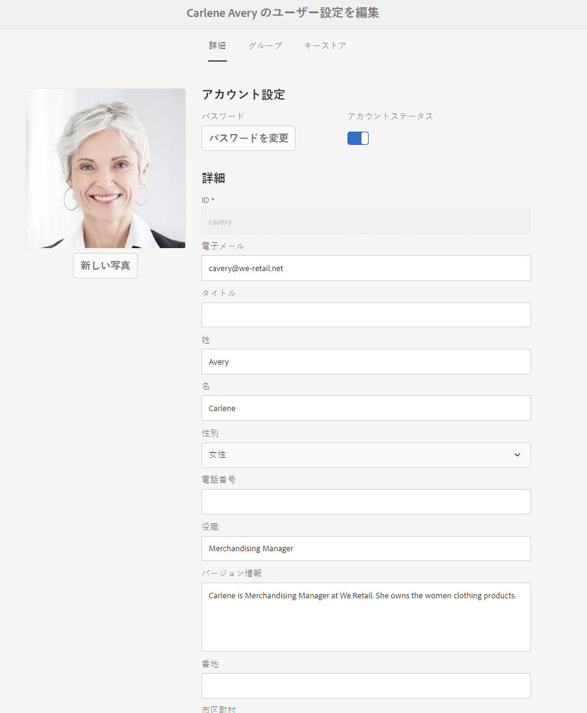
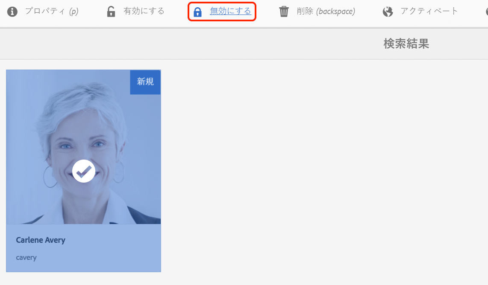
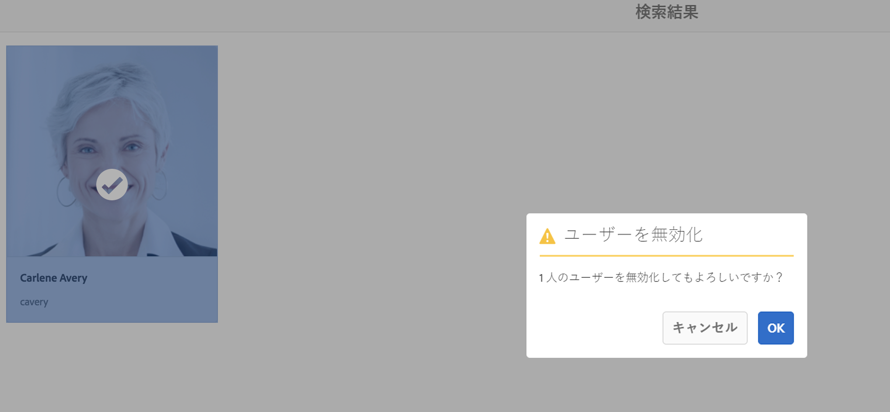
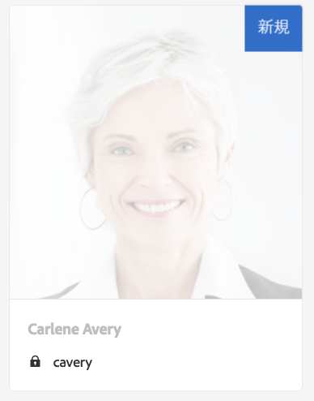
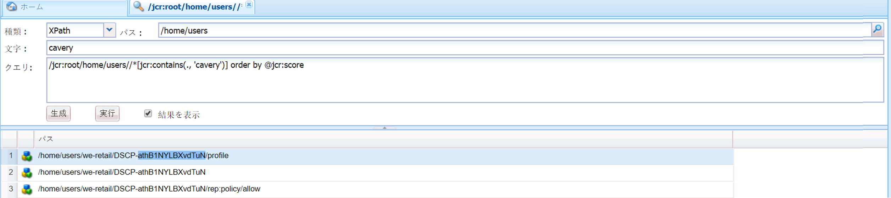
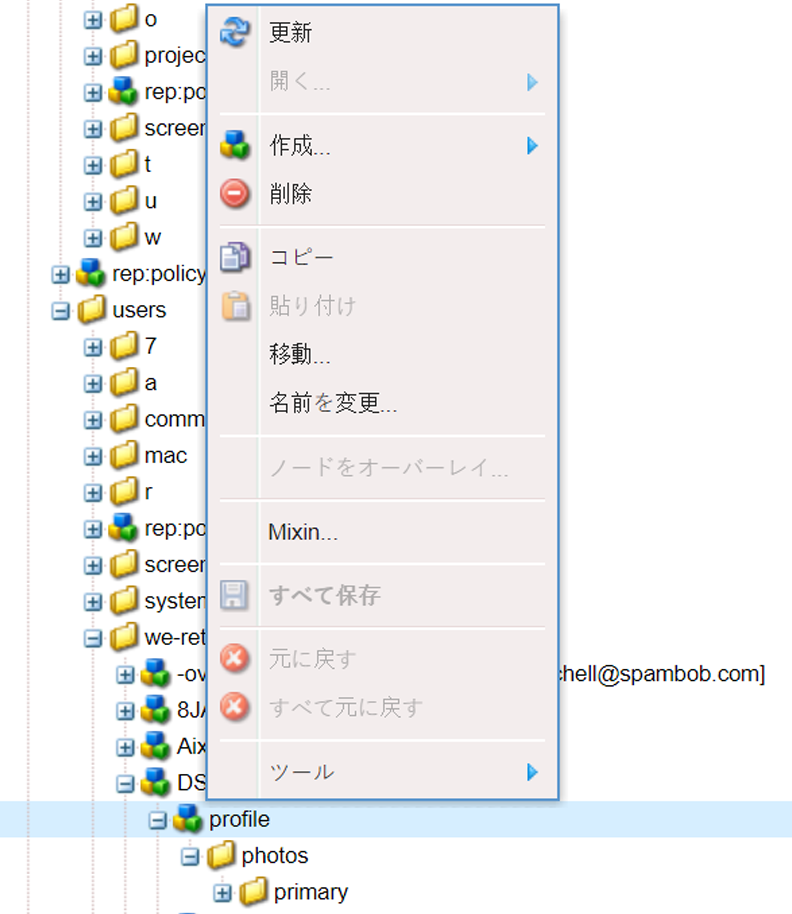

# AEM の基盤での GDPR 要求の処理{#handling-gdpr-requests-for-the-aem-foundation}

>[!IMPORTANT]
>
>以下の節ではGDPRを例に挙げていますが、詳細はデータ保護とプライバシーに関するすべての規制に適用されます。GDPR、CCPAなど

## AEM Foundation GDPR support {#aem-foundation-gdpr-support}

AEM Foundationレベルでは、保存される個人データはユーザープロファイルです。 したがって、この記事では主に、GDPR のアクセス要求と削除要求にそれぞれ対処できるように、ユーザープロファイルのアクセス方法と削除方法について説明します。

## ユーザープロファイルへのアクセス {#accessing-a-user-profile}

### 手動の手順 {#manual-steps}

1. Open the User Administration console, by browsing to **[!UICONTROL Settings - Security - Users]** or by browsing directly to `https://<serveraddress>:<serverport>/libs/granite/security/content/useradmin.html`

   

1. 次に、ページの上部にある検索バーに目的のユーザーの名前を入力して検索します。

   

1. 最後に、ユーザープロファイルをクリックして開き、「**[!UICONTROL 詳細]**」タブの下で情報を確認します。

   

### HTTP API {#http-api}

前述したように、自動化を促進するために、ユーザーデータにアクセスするための API が用意されています。利用可能な API には、以下のようにいくつかのタイプがあります。

**UserProperties API**

```shell
curl -u user:password http://localhost:4502/libs/granite/security/search/profile.userproperties.json\?authId\=cavery
```

**Sling API**

*ユーザーホームの検索：*

```xml
curl -g -u user:password 'http://localhost:4502/libs/granite/security/search/authorizables.json?query={"condition":[{"named":"cavery"}]}'
     {"authorizables":[{"type":"user","authorizableId_xss":"cavery","authorizableId":"cavery","name_xss":"Carlene Avery","name":"Carlene Avery","home":"/home/users/we-retail/DSCP-athB1NYLBXvdTuN"}],"total":1}
```

*ユーザーデータを取得する*

上記のコマンドから返されたJSONペイロードのホームプロパティのノードパスを使用する：

```shell
curl -u user:password  'http://localhost:4502/home/users/we-retail/DSCP-athB1NYLBXvdTuN/profile.-1.json'
```

```shell
curl -u user:password  'http://localhost:4502/home/users/we-retail/DSCP-athB1NYLBXvdTuN/profiles.-1.json'
```

## ユーザーの無効化と関連プロファイルの削除 {#disabling-a-user-and-deleting-the-associated-profiles}

### ユーザーの無効化 {#disable-user}

1. 前述のように、ユーザー管理コンソールを開き、目的のユーザーを検索します。
1. ユーザーの上にマウスポインターを置き、選択アイコンをクリックします。プロファイルがグレーに変わり、選択されたことが示されます。

1. 上部のメニューの「無効にする」ボタンをクリックして、このユーザーを無効にします。

   

1. 最後に、アクションを確認します。

   

   次に、ユーザーインターフェイスは、ユーザーが次のようにグレーアウトし、プロファイルカードにロックを追加することで非アクティブ化されたことを示します。

   

### ユーザープロファイル情報の削除 {#delete-user-profile-information}

1. Log in to CRXDE Lite, then search for the `[!UICONTROL userId]`:

   

1. Open the user node which is located under `[!UICONTROL /home/users]` by default:

   

1. プロファイルノードとそのすべての子ノードを削除します。プロファイルノードには、AEM のバージョンに応じて以下の 2 種類の形式があります。

   1. The default private profile under `[!UICONTROL /profile]`
   1. `[!UICONTROL /profiles]`AEM 6.5を使用して作成された新しいプロファイル用。

   

### HTTP API {#http-api-1}

以下の手順では `curl`コマンドラインツールを使用して、**[!UICONTROL cavery]** `userId` を持つユーザーを無効化し、デフォルト位置にあるそのユーザーのプロファイルを削除する方法を示しています。

* *ユーザーホームの検索*

```shell
curl -g -u user:password 'http://localhost:4502/libs/granite/security/search/authorizables.json?query={"condition":[{"named":"cavery"}]}'
     {"authorizables":[{"type":"user","authorizableId_xss":"cavery","authorizableId":"cavery","name_xss":"Carlene Avery","name":"Carlene Avery","home":"/home/users/we-retail/DSCP-athB1NYLBXvdTuN"}],"total":1}
```

* *ユーザーの無効化*

上記のコマンドから返されたJSONペイロードのホームプロパティのノードパスを使用する：

```shell
curl -X POST -u user:password -FdisableUser="describe the reasons for disabling this user (GDPR in this case)" 'http://localhost:4502/home/users/we-retail/DSCP-athB1NYLBXvdTuN.rw.userprops.html'
```

* *ユーザープロファイルの削除*

アカウント検出コマンドから返されたJSONペイロードのホームプロパティのノードパスと、既知のプロファイルノードの場所を使用します。

```shell
curl -X POST -u user:password -H "Accept: application/json,**/**;q=0.9" -d ':operation=delete' 'http://localhost:4502/home/users/we-retail/DSCP-athB1NYLBXvdTuN/profile'
```

```shell
curl -X POST -u user:password -H "Accept: application/json,**/**;q=0.9" -d ':operation=delete' 'http://localhost:4502/home/users/we-retail/DSCP-athB1NYLBXvdTuN/profile'
```

