# ID 管理{#identity-management}

Web サイトの個々の訪問者を識別できるのは、その訪問者にログインを許可する場合のみです。次に示すように、様々な理由でログイン機能が提供されます。

* [AEM Communities](/help/communities/overview.md) サイト訪問者がコミュニティにコンテンツを投稿するにはログインする必要があります。
* [閉じられたユーザーグループ](/help/sites-administering/cug.md)

   Webサイト（またはWebサイトのセクション）へのアクセスを特定の訪問者に制限する必要がある場合があります。

* [パーソナライゼーション](/help/sites-administering/personalization.md) :訪問者がWebサイトにアクセスする方法の特定の側面を設定できます。

ログイン（およびログアウト）機能は、[**プロファイル**](#profiles-and-user-accounts)&#x200B;付きのアカウントによって指定されます。プロファイルには、登録済みの訪問者（ユーザー）に関する追加情報が保持されます。実際の登録および承認のプロセスは状況によって異なります。

* Webサイトからの自己登録

   A [Community Site](/help/communities/sites-console.md) may be configured to allow visitors to self-register or sign-in with their Facebook or Twitter accounts.

* Webサイトからの登録の要求

   非公開ユーザーグループの場合は、訪問者が登録をリクエストすることを許可し、ワークフローによって承認を強制できます。

* 作成者環境から各アカウントを登録

   プロファイルの数が少ない場合は、認証が必要になるので、個々のユーザーを直接登録することもできます。

訪問者による登録を許可するには、一連のコンポーネントとフォームを使用して、必要な ID 情報、追加の（多くの場合、オプションです）プロファイル情報の順に収集できます。また、登録の完了後に、訪問者が送信した詳細の確認と更新をおこなえるようにする必要があります。

次に示す追加の機能を設定または作成できます。

* 必要なリバースレプリケーションを設定します。
* ワークフローと共にフォームを作成して、ユーザーが自身のプロファイルを削除できるようにします。

>[!NOTE]
>
>プロファイルに指定した情報を使用し、[セグメント](/help/sites-administering/campaign-segmentation.md)と[キャンペーン](/help/sites-classic-ui-authoring/classic-personalization-campaigns.md)を通じて、ターゲットとなるコンテンツをユーザーに提供することもできます。

## 登録フォーム {#registration-forms}

[フォーム](/help/sites-authoring/default-components.md#form-component)を使用すると、登録情報を収集して新しいアカウントとプロファイルを生成できます。

For example, users can request a new profile, using the Geometrixx page
`http://localhost:4502/content/geometrixx-outdoors/en/user/register.html`


要求を送信すると、プロファイルページが開きます。ユーザーはこのページに個人の詳細情報を指定できます。

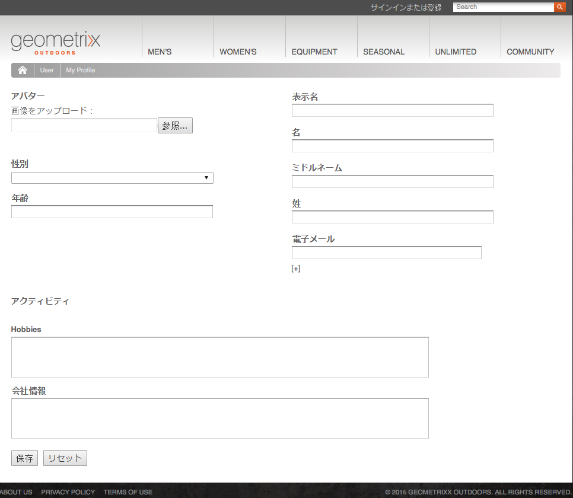

新しいアカウントは[ユーザーコンソール](/help/sites-administering/security.md)にも表示されます。

## ログイン {#login}

ログインコンポーネントを使用すると、ログイン情報を収集して、ログインプロセスをアクティベートできます。

これにより、訪問者には標準のフィールド（「**ユーザー名**」および「**パスワード**」）と「**ログイン**」ボタンが表示され、資格情報を入力するとログインプロセスがアクティベートされます。

例えば、ユーザーは Geometrixx ツールバーの「**Sign In**」オプションを使用して、ログインするか、新しいアカウントを作成できます。使用するページを次に示します。

`http://localhost:4502/content/geometrixx-outdoors/en/user/sign-in.html`

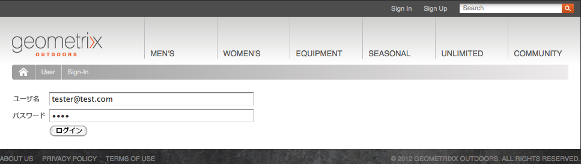

## ログアウト {#logging-out}

ログインメカニズムと共にログアウトメカニズムも必要です。ログアウトの際は、Geometrixx の「**Sign Out**」オプションを使用します。

## プロファイルの確認と更新 {#viewing-and-updating-a-profile}

登録フォームによっては、訪問者の情報が自身のプロファイルに登録されます。訪問者が以降のステージでこの情報を確認および更新できるようにする必要があります。これは、同じような形で行うことができます。例えば、Geometrixx内：

```
http://localhost:4502/content/geometrixx-outdoors/en/user/profile.html
```

To see the details of your profile click on **My Profile** in the top right corner of any page; for example with the `admin` account:
`http://localhost:4502/home/users/a/admin/profile.form.html/content/geometrixx-outdoors/en/user/profile.html.`

オーサー環境の [ClientContext](/help/sites-administering/client-context.md) を使用すると、別のプロファイルを確認できます（十分な権限がある場合）。

1. ページを開く、例えば、Geometrixxページ：

   `http://localhost:4502/cf#/content/geometrixx/en.html`

1. 右上隅にある「**マイプロファイル**」をクリックします。現在のアカウント（例：管理者）のプロファイルを確認できます。
1. **Ctrl + Alt + C** キーを押して ClientContext を開きます。
1. ClientContext の左上隅にある **ClientContext にプロファイルを読み込み**&#x200B;ボタンをクリックします。

   

1. ダイアログウィンドウのドロップダウンリストから別のプロファイルを選択します。例えば、**Alison Parker** のプロファイルを選択します。
1. 「**OK**」をクリックします。
1. もう一度「**マイプロファイル**」をクリックします。Alison の詳細を使用してフォームが更新されます。

   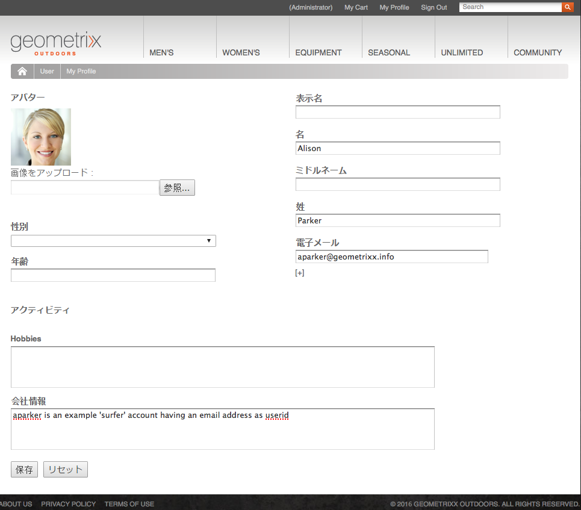

1. 「**プロファイルを編集**」または「**パスワードを変更**」を使用して詳細を更新できます。

## プロファイル定義へのフィールドの追加 {#adding-fields-to-the-profile-definition}

プロファイル定義にフィールドを追加できます。例えば、Geometrixx プロファイルに「Favorite Color」（好きな色）フィールドを追加します。

1. Web サイトコンソールから Geometrixx Outdoors Site／英語／ユーザー／マイプロファイルに移動します。
1. **マイプロファイル**&#x200B;ページをダブルクリックして編集用に開きます。
1. サイドキックの「**コンポーネント**」タブで、「**フォーム**」セクションを展開します。
1. サイドキックからフォーム（「**会社情報**」フィールドの直下）に&#x200B;**ドロップダウンリスト**&#x200B;をドラッグします。
1. **ドロップダウンリスト**&#x200B;コンポーネントをダブルクリックして設定用のダイアログを開き、次の情報を入力します。

   * **要素名** - `favoriteColor`
   * **タイトル** - `Favorite Color`
   * **項目** - 複数の色を項目として追加します。

   「**OK**」をクリックして保存します。

1. ページを閉じて **Web サイト**&#x200B;コンソールに戻り、マイプロファイルページをアクティベートします。

   次回プロファイルを確認する際に、好きな色を選択できます。

   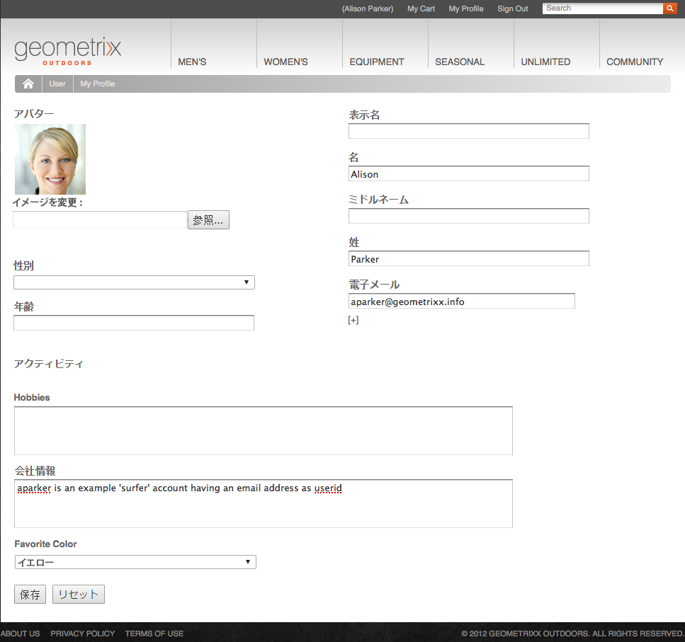

   このフィールドは、関連するユーザーアカウントの **profile** セクションに保存されます。

   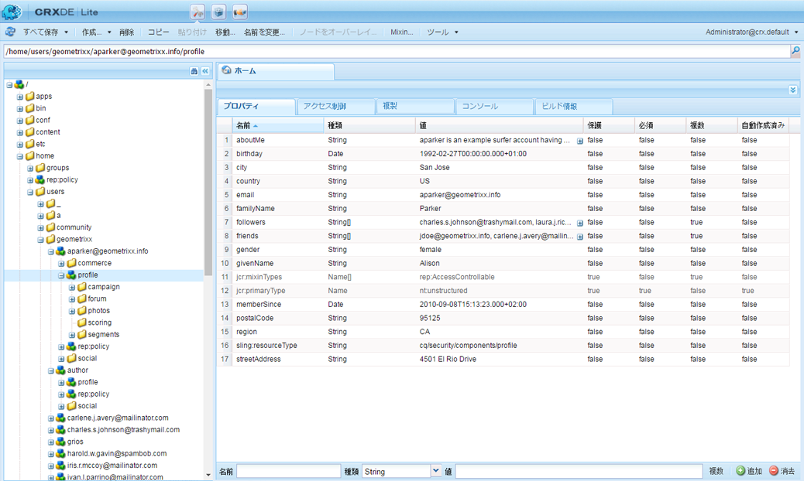

## プロファイルの状態 {#profile-states}

ユーザー（またはユーザーのプロファイル）が特定の状態かどうかを確認しなければならない場合があります。**

そのためには、次に示す方法で、ユーザープロファイルに適切なプロパティを定義する必要があります。

* ユーザーに対する表示およびアクセスが可能
* 各プロパティに 2 つの状態を定義する
* 定義した 2 つの状態の切り替えが可能

この定義をおこなうには、次の項目を使用します。

* [State Providers](#state-providers)

   特定のプロパティの2つの状態と2つのトランジションを管理する。

* [ワークフロー](#workflows)

   状態に関連するアクションを管理する。

複数の状態を定義できます。例えば、Geometrixx では次の定義をおこなうことができます。

* ニュースレターまたはコメントスレッドの通知を購読／購読解除
* 友人とのつながりを追加／削除

### State Providers {#state-providers}

状態プロバイダーは、対象となるプロパティの現在の状態を、取りうる 2 つの状態のトランジションと共に管理します。

状態プロバイダーはコンポーネントとして実装されるので、プロジェクト用にカスタマイズできます。Geometrixx では、次のカスタマイズをおこなうことができます。

* Un-/Subscribe Forum Topic
* Add/Remove Friend

### ワークフロー {#workflows}

状態プロバイダーは、プロファイルのプロパティとその状態を管理します。

ワークフローは、状態に関連するアクションを実装する必要があります。例えば、通知を購読する場合、ワークフローは実際の購読アクションを処理します。通知の購読を解除する場合、ワークフローは購読リストからのユーザーの削除を処理します。

## Profiles and User Accounts {#profiles-and-user-accounts}

Profiles are stored in the Content Repository as part of the[user account](/help/sites-administering/user-group-ac-admin.md).

The profile can be found under `/home/users/geometrixx`:

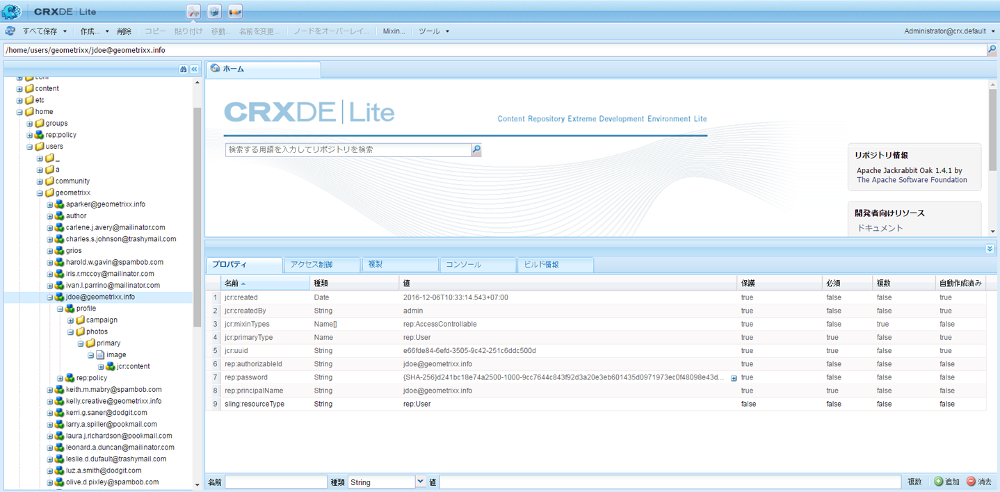

*標準インストール（オーサーまたはパブリッシュ）では、すべてのユーザーの全プロファイル情報に対する読み取りアクセス権限が everyone（全員）に付与されています。everyone は「既存のすべてのユーザーとグループが自動的に含まれる組み込みのグループであり、メンバーのリストの編集は不可」と定義されます。*

これらのアクセス権限は次のワイルドカード ACL によって定義されます。

/home everyone allow jcr:read rep:glob = */プロファイル*

これにより、次の処理が可能になります。

* フォーラム、コメントまたはブログの投稿に、適切なプロファイルからの情報（アイコンやフルネームなど）を表示する
* Geometrixx のプロファイルページにリンクする

このようなアクセスがインストール環境に適していない場合は、デフォルト設定を変更できます。

This can be done using the **[Access Control](/help/sites-administering/user-group-ac-admin.md#access-right-management)** tab:

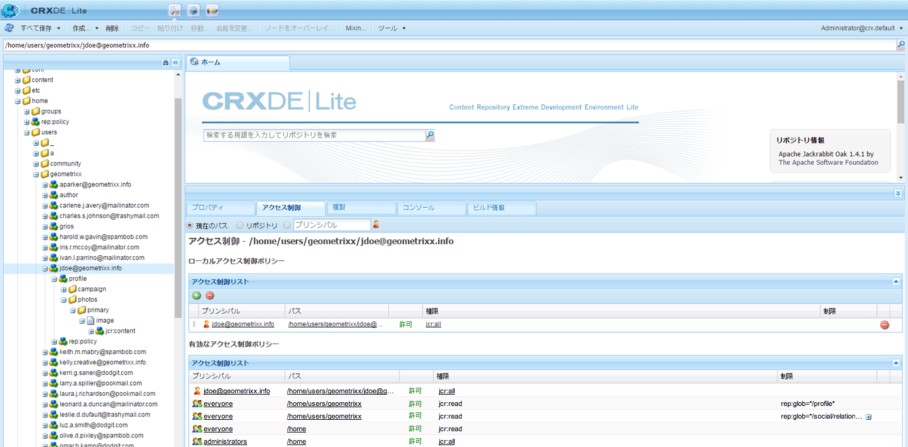

## プロファイルコンポーネント {#profile-components}

サイト用のプロファイルの要件を定義するための様々なプロファイルコンポーネントが用意されています。

### チェック済みパスワードフィールド {#checked-password-field}

このコンポーネントには、次の 2 つのフィールドがあります。

* パスワードの入力用フィールド
* パスワードが正しく入力されていることを確認するチェック用フィールド

デフォルト設定を使用すると、コンポーネントは次のように表示されます。

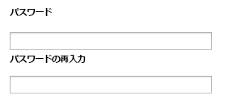

### プロファイルのアバター写真 {#profile-avatar-photo}

このコンポーネントを使用すると、ユーザーがアバター写真ファイルを選択およびアップロードできるようになります。

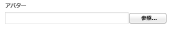

### プロファイルの詳細名 {#profile-detailed-name}

このコンポーネントを使用すると、ユーザーは詳細な名前を入力できます。

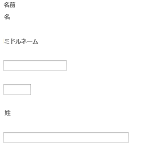

### プロファイルの性別 {#profile-gender}

このコンポーネントを使用すると、性別を入力できます。

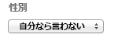

