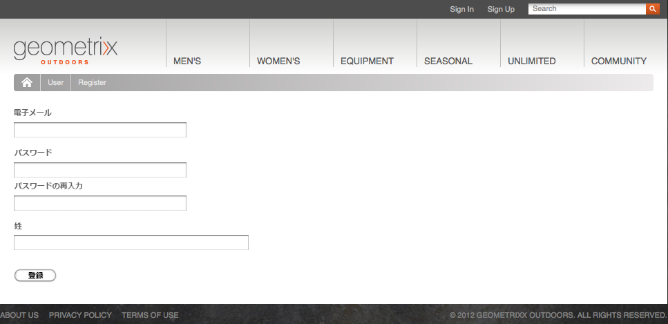

# ID 管理{#identity-management}

Web サイトの個々の訪問者は、ユーザーがログインできる場合にのみ識別できます。 ログイン機能を提供する理由は、次のように様々です。

* [AEM Communities](/help/communities/overview.md) サイト訪問者がコミュニティにコンテンツを投稿するにはログインする必要があります。
* [閉じられたユーザーグループ](/help/sites-administering/cug.md)

  Web サイト（または Web サイト内のセクション）へのアクセスを特定の訪問者に制限することが必要な場合があります。

* [パーソナライズ機能](/help/sites-administering/personalization.md) 訪問者が web サイトへのアクセス方法に関する特定の要素を設定できるようにします。

ログイン（およびログアウト）機能は、[**プロファイル**](#profiles-and-user-accounts)&#x200B;付きのアカウントによって指定されます。プロファイルには、登録済みの訪問者（ユーザー）に関する追加情報が保持されます。実際の登録および承認のプロセスは状況によって異なります。

* Web サイトでの自己登録

  [コミュニティサイト](/help/communities/sites-console.md)は、訪問者が自身の Facebook や Twitter のアカウントから自動登録またはログインすることを許可するように設定できます。

* Web サイトからの登録のリクエスト

  閉じられたユーザーグループでは、訪問者が登録をリクエストできるようにし、ワークフローによる承認を強制的に行います。

* オーサー環境からの各アカウントの登録

  認証が必要なプロファイルの数が少ない場合は、各プロファイルを直接登録することもできます。

訪問者が登録できるように、一連のコンポーネントやフォームを使用して、必要な識別情報を収集し、さらに追加の（多くの場合はオプション）プロファイル情報を収集できます。 登録が完了したら、送信した詳細や確認、更新もできるようになります。

追加機能は、次のように設定または開発できます。

* 必要なリバースレプリケーションを設定します。
* ワークフローと共にフォームを作成することで、ユーザーが自分のプロファイルを削除できるようにします。

>[!NOTE]
>
>プロファイルで指定した情報を使用して、 [セグメント](/help/sites-administering/campaign-segmentation.md) および [キャンペーン](/help/sites-classic-ui-authoring/classic-personalization-campaigns.md).

## 登録Forms {#registration-forms}

[フォーム](/help/sites-authoring/default-components.md#form-component)を使用すると、登録情報を収集して新しいアカウントとプロファイルを生成できます。

例えば、ユーザーは次の Geometrixx ページを使用して新しいプロファイルをリクエストできます。
`http://localhost:4502/content/geometrixx-outdoors/en/user/register.html`



要求を送信すると、プロファイルページが開きます。ユーザーはこのページに個人の詳細情報を指定できます。


新しいアカウントは[ユーザーコンソール](/help/sites-administering/security.md)にも表示されます。

## ログイン {#login}

ログインコンポーネントを使用して、ログイン情報を収集し、ログインプロセスを有効化することができます。

これにより、訪問者には標準のフィールド（「**ユーザー名**」および「**パスワード**」）と「**ログイン**」ボタンが表示され、資格情報を入力するとログインプロセスがアクティベートされます。

例えば、ユーザーは Geometrixx ツールバーの「**Sign In**」オプションを使用して、ログインするか、新しいアカウントを作成できます。使用するページを次に示します。

`http://localhost:4502/content/geometrixx-outdoors/en/user/sign-in.html`


## ログアウト {#logging-out}

ログインメカニズムがあるので、ログアウトメカニズムも必要です。 これは、 **ログアウト** オプションを使用します。Geometrixx

## プロファイルの表示と更新 {#viewing-and-updating-a-profile}

登録フォームによっては、訪問者が自分のプロファイルに登録した情報がある場合があります。 後の段階でこれを表示または更新できるはずです。 そのためには、同様のフォームを用意します。例えば、Geometrixx では次を使用します。

```
http://localhost:4502/content/geometrixx-outdoors/en/user/profile.html
```

プロファイルの詳細を確認するには、ページの右上隅にある「**マイプロファイル**」をクリックします。例えば、`admin` アカウントを使用する場合のプロファイルは次のとおりです。
`http://localhost:4502/home/users/a/admin/profile.form.html/content/geometrixx-outdoors/en/user/profile.html.`

オーサー環境の [ClientContext](/help/sites-administering/client-context.md) を使用すると、別のプロファイルを確認できます（十分な権限がある場合）。

1. ページを開きます（例：Geometrixx ページ）。

   `http://localhost:4502/cf#/content/geometrixx/en.html`

1. クリック **マイプロファイル** をクリックします。 現在のアカウントのプロファイルが表示されます。例えば、管理者。
1. 押す **control-alt-C** をクリックして、clientcontext を開きます。
1. ClientContext の左上隅で、 **プロファイルの読み込み** 」ボタンをクリックします。

   

1. ダイアログウィンドウのドロップダウンリストから別のプロファイルを選択します。例： **Alison Parker**.
1. 「**OK**」をクリックします。
1. を再度クリックします。 **マイプロファイル**. フォームは Alison の詳細で更新されます。

   

1. これで、 **プロファイルを編集** または **パスワードを変更** をクリックして詳細を更新します。

## プロファイル定義へのフィールドの追加 {#adding-fields-to-the-profile-definition}

プロファイル定義にフィールドを追加できます。例えば、Geometrixx プロファイルに「Favorite Color」（好きな色）フィールドを追加するには、次の手順を実行します。

1. Web サイトコンソールから Geometrixx Outdoors Site／英語／ユーザー／マイプロファイルに移動します。
1. **マイプロファイル**&#x200B;ページをダブルクリックして編集用に開きます。
1. サイドキックの「**コンポーネント**」タブで、「**フォーム**」セクションを展開します。
1. サイドキックからフォーム（「**会社情報**」フィールドの直下）に&#x200B;**ドロップダウンリスト**&#x200B;をドラッグします。
1. **ドロップダウンリスト**&#x200B;コンポーネントをダブルクリックして設定用のダイアログを開き、次の情報を入力します。

   * **要素名** - `favoriteColor`
   * **タイトル** - `Favorite Color`
   * **項目** - 複数の色を項目として追加します。

   「**OK**」をクリックして保存します。

1. ページを閉じて **web サイト**&#x200B;コンソールに戻り、マイプロファイルページをアクティベートします。

   次回プロファイルを確認する際に、好きな色を選択できます。

   

   このフィールドは、関連するユーザーアカウントの **profile** セクションに保存されます。

   

## プロファイルの状態 {#profile-states}

ユーザー（またはユーザーのプロファイル）が&#x200B;*特定の状態*&#x200B;かどうかを確認しなければならない場合があります。

これには、次の方法でユーザープロファイルに適切なプロパティを定義する必要があります。

* が表示され、ユーザーがアクセス可能
* 各プロパティに 2 つの状態を定義します
* 定義された 2 つの状態の切り替えを許可

これは、次を使用しておこないます。

* [状態プロバイダー](#state-providers)

  特定のプロパティの 2 つの状態とその間の遷移を管理します。

* [ワークフロー](#workflows)

  状態に関連するアクションを管理します。

複数の状態を定義できます。例えば、Geometrixx では次の定義を行うことができます。

* ニュースレターまたはコメントスレッドの通知を購読／購読解除
* 友人とのつながりを追加／削除

### 状態プロバイダー {#state-providers}

状態プロバイダーは、対象となるプロパティの現在の状態を、取りうる 2 つの状態のトランジションと共に管理します。

状態プロバイダーはコンポーネントとして実装されるので、プロジェクトに合わせてカスタマイズできます。 Geometrixxには、以下が含まれます。

* フォーラムのトピックを購読 / 購読解除
* 友達を追加/削除

### ワークフロー {#workflows}

状態プロバイダーは、プロファイルのプロパティとその状態を管理します。

ワークフローは、状態に関連するアクションを実装するのに必要です。例えば、通知を購読する場合、ワークフローは実際の購読アクションを処理します。通知の購読を解除する場合、ワークフローは購読リストからのユーザーの削除を処理します。

## プロファイルとユーザーアカウント {#profiles-and-user-accounts}

プロファイルは、[ユーザーアカウント](/help/sites-administering/user-group-ac-admin.md)の一部としてコンテンツリポジトリに格納されます。

プロファイルは `/home/users/geometrixx` にあります。


標準インストール（オーサーまたはパブリッシュ）では、すべてのユーザーがすべてのユーザーのプロファイル情報全体に対する読み取りアクセス権を持ちます。 全員が&quot;*すべての既存のユーザーとグループが自動的に含まれる組み込みグループ。 メンバーのリストは編集できません*&quot;.

これらのアクセス権は、次のワイルドカード ACL で定義されます。

/home everyone allow jcr:read rep:glob = &#42;/profile&#42;

これにより、以下が可能になります。

* 適切なプロファイルから情報（アイコンや氏名など）を表示するためのフォーラム、コメント、ブログ投稿
* geometrixx プロファイルページへのリンク

このようなアクセスがご使用のインストールに適さない場合は、これらのデフォルト設定を変更できます。

これを行うには「**[アクセス制御](/help/sites-administering/user-group-ac-admin.md#access-right-management)**」タブを使用します。


## プロファイルコンポーネント {#profile-components}

サイトのプロファイル要件を定義するために、様々なプロファイルコンポーネントも使用できます。

### チェック済みパスワードフィールド {#checked-password-field}

このコンポーネントには、次の 2 つのフィールドが用意されています。

* パスワードの入力
* パスワードが正しく入力されたことを確認するチェック。

デフォルト設定では、コンポーネントは次のように表示されます。


### プロファイルのアバター写真 {#profile-avatar-photo}

このコンポーネントは、アバター写真ファイルを選択してアップロードするメカニズムをユーザーに提供します。


### プロファイルの詳細名 {#profile-detailed-name}

このコンポーネントを使用すると、ユーザーは詳細な名前を入力できます。


### プロファイルの性別 {#profile-gender}

このコンポーネントを使用すると、ユーザーは性別を入力できます。


