# Adobe IMS Authentication and [!DNL Admin Console] Support for AEM Managed Services {#adobe-ims-authentication-and-admin-console-support-for-aem-managed-services}

>[!NOTE]
>
>この機能は、Adobe Managed Services のお客様にのみご利用いただけます。

## 概要 {#introduction}

AEM 6.4.3.0 introduces [!DNL Admin Console] support for AEM instances and Adobe IMS(Identity Management System) based authentication for **AEM Managed Services** customers.

AEM onboarding to the [!DNL Admin Console] will allow AEM Managed Services customers to manage all Experience Cloud users in one console. ユーザーとグループをAEMインスタンスに関連付けられた製品プロファイルに割り当て、特定のインスタンスにログインできます。

## 主なハイライト {#key-highlights}

* AEM の IMS 認証サポートは、AEM 作成者、管理者、または開発者のみを対象としており、サイト訪問者のような顧客サイトの外部エンドユーザーを対象としていません。
* The [!DNL Admin Console] will represent AEM Managed Services customers as IMS Organizations and their Instances as Product Contexts. 顧客システムおよび製品管理者は、インスタンスへのアクセスを管理できるようになります。
* AEM Managed Services will sync customer topologies with the [!DNL Admin Console]. There will be one instance of AEM Managed Services Product Context per Instance in the [!DNL Admin Console].
* Product Profiles in [!DNL Admin Console] will determine which instances a user can access
* お客様独自の SAML 2 準拠の ID プロバイダーを使用したフェデレーテッド認証がサポートされています。
* 個人用の Adobe ID ではなく、エンタープライズ ID またはフェデレーデッド ID（お客様のシングルサインオン用）のみがサポートされます。
* [!DNL User Management] (Adobe内 [!DNL Admin Console])は、引き続き顧客の管理者が所有します。

## アーキテクチャ {#architecture}

IMS 認証は、AEM と Adobe IMS エンドポイントの間で OAuth プロトコルを使用して機能します。ユーザーが IMS に追加され、Adobe Identity を持つようになると、IMS 資格情報を使用して AEM Managed Services インスタンスにログインできます。

ユーザーログインフローを以下に示します。ユーザーは IMS にリダイレクトされ、オプションで SSO 検証のためにカスタマー IDP にリダイレクトされてから、AEM にリダイレクトされます。

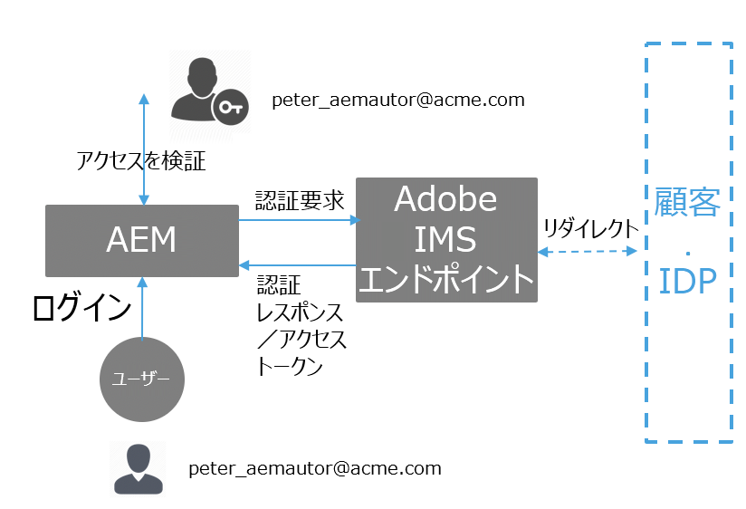

## 設定方法 {#how-to-set-up}

### Onboarding Organizations to [!DNL Admin Console] {#onboarding-organizations-to-admin-console}

The customer onboarding to [!DNL Admin Console] is a pre-requisite to using Adobe IMS for AEM authentication.

最初のステップとして、Adobe IMS に組織をプロビジョニングする必要があります。Adobe Enterprise customers are represented as IMS Organizations in the [Adobe [!DNL Admin Console]](https://helpx.adobe.com/jp/enterprise/using/admin-console.html).

AEM Managed Services customers should already have an organization provisioned, and as part of the IMS provisioning, the customer instances will be made available in the [!DNL Admin Console] for managing user entitlements and access.

ユーザー認証のための IMS への移行は、AMS とお客様の共同作業となり、それぞれがワークフローを完了させます。

顧客が IMS 組織として存在し、AMS が顧客の IMS へのプロビジョニングを完了したら、次のような設定ワークフローを実行する必要があります。

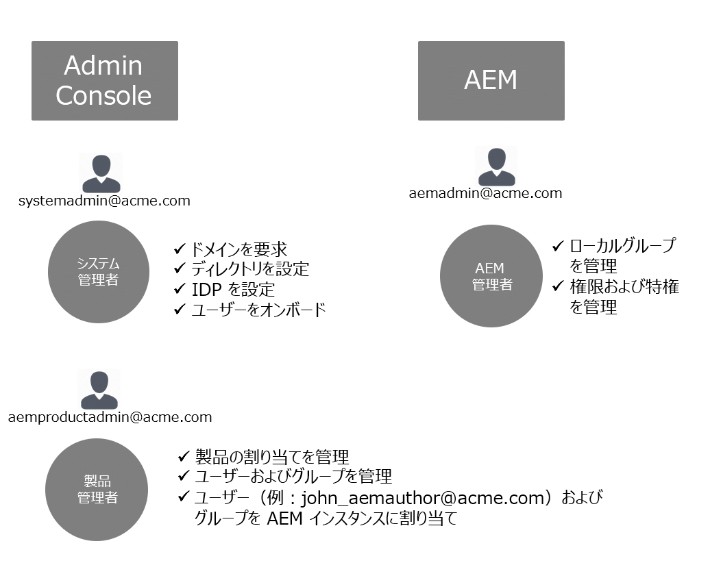

1. The designated System Admin receives an invite to log in to the [!DNL Admin Console]
1. システム管理者は、ドメインの所有権を確認するためにドメインを要求する（この例では acme.com）
1. システム管理者はユーザーディレクトリを設定する
1. The System Admin configures the Identity Provider (IDP) in the [!DNL Admin Console] for SSO setup.
1. AEM 管理者は、通常どおりローカルグループ、権限、および特権を管理する。「ユーザーとグループの同期」を参照してください。

>[!NOTE]
>
>IDP 設定を含む Adobe Identity Management Basics の詳細については、[このページ](https://helpx.adobe.com/jp/enterprise/using/set-up-identity.html)の記事を参照してください。
>
>For more info about the Enterprise Administration and [!DNL Admin Console] see the article [this page](https://helpx.adobe.com/jp/enterprise/managing/user-guide.html).

### ユーザーを [!DNL Admin Console] {#onboarding-users-to-the-admin-console}

お客様の規模と好みに応じて、ユーザーをオンボードする方法は 3 つあります。

1. 手動で [!DNL Admin Console]
1. ユーザーと一緒に CSV ファイルをアップロードする
1. お客様のエンタープライズ Active Directory からユーザーとグループを同期する

#### Manual Addition through [!DNL Admin Console] UI {#manual-addition-through-admin-console-ui}

Users and Groups can be manually created in the [!DNL Admin Console] UI. この方法は、管理するユーザー数が多くない場合に使用できます。（例：AEM ユーザーが 50 人未満の場合）

Analytics、Target、Creative Cloud などの他の Adobe 製品を管理するためにすでにこの方法を使用している場合は、ユーザーを手動で作成することもできます。

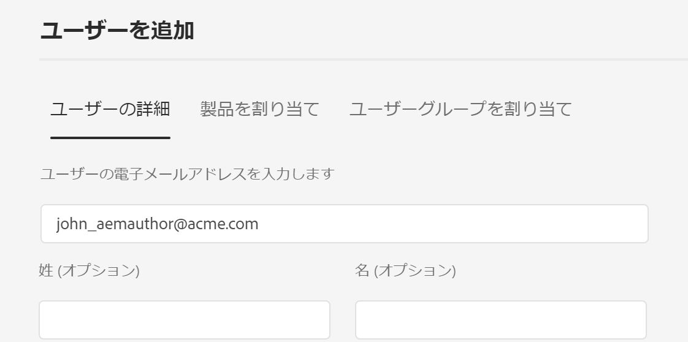

#### UIでのファイルのアップロード [!DNL Admin Console] {#file-upload-in-the-admin-console-ui}

ユーザー作成を簡単に処理するには、CSV ファイルをアップロードしてまとめて追加します。

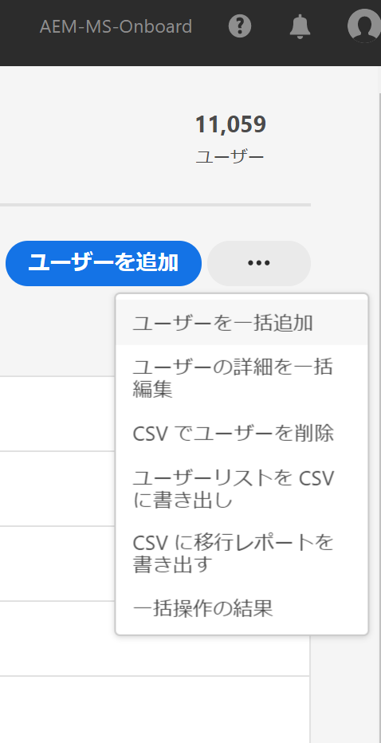

#### ユーザー同期ツール {#user-sync-tool}

ユーザー同期ツール（UST）は、Active Directory または他のテスト済み OpenLDAP ディレクトリサービスを利用して、Adobe ユーザーを作成または管理することができます。対象ユーザーは、このツールをインストールおよび設定できる IT ID 管理者（エンタープライズディレクトリとシステムの管理者）です。オープンソースツールはカスタマイズ可能であるため、顧客は特定の要件に合うように開発者に修正させることができます。

When User Sync runs, it fetches a list of users from the organization’s Active Directory (or any other compatible data source) and compares it with the list of users within the [!DNL Admin Console]. It then calls the Adobe [!DNL User Management] API so that the [!DNL Admin Console] is synchronized with the organization’s directory. The change flow is entirely one-way; any edits made in the [!DNL Admin Console] do not get pushed out to the directory.

The tool allows the system admin to map user groups in the customer’s directory with product configuration and user groups in the [!DNL Admin Console], the new UST version also allows dynamic creation of user groups in the [!DNL Admin Console].

ユーザー同期を設定するには、[[!DNL User Management]  API](https://www.adobe.io/apis/cloudplatform/usermanagement/docs/setup.html) を使用する場合と同様に、組織が一連の資格情報を作成する必要があります。

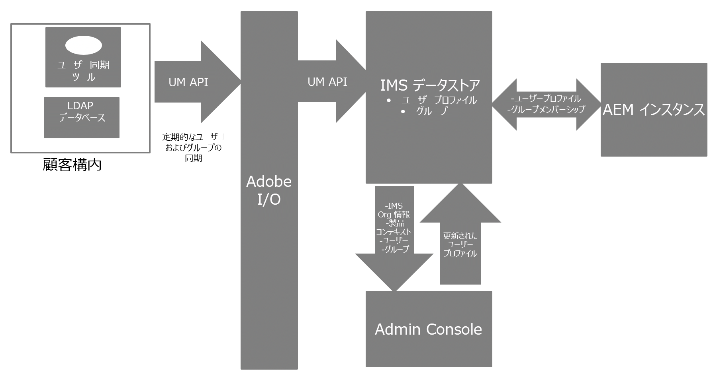

ユーザー同期は、次の場所にある Adobe Github リポジトリを介して配布されます。

[https://github.com/adobe-apiplatform/user-sync.py/releases/latest](https://github.com/adobe-apiplatform/user-sync.py/releases/latest)

Note that a pre-release version 2.4RC1 is available with dynamic group creation support and can be found here: [https://github.com/adobe-apiplatform/user-sync.py/releases/tag/v2.4rc1](https://github.com/adobe-apiplatform/user-sync.py/releases/tag/v2.4rc1)

The major features for this release are the ability to dynamically map new LDAP groups for user membership in the [!DNL Admin Console], as well as dynamic user group creation.

新しいグループ機能の詳細については、次を参照してください。

[https://github.com/adobe-apiplatform/user-sync.py/blob/v2/docs/en/user-manual/advanced_configuration](https://github.com/adobe-apiplatform/user-sync.py/blob/v2/docs/en/user-manual/advanced_configuration.md#additional-group-options)

>[!NOTE]
>
>ユーザー同期ツールの詳細については、[ドキュメントページ](https://adobe-apiplatform.github.io/user-sync.py/en/)を参照してください。
>
>
>ユーザー同期ツールは、[ここ](https://adobe-apiplatform.github.io/umapi-documentation/en/UM_Authentication.html)に説明されている手順を使用して、Adobe I/O クライアント UMAPI として登録する必要があります。
>
>Adobe I/O コンソールのドキュメントは[ここ](https://www.adobe.io/apis/cloudplatform/console.html)を参照してください。
>
>
>The [!DNL User Management] API that is used by the User Sync Tool is covered at this [location](https://www.adobe.io/apis/cloudplatform/umapi-new.html).

>[!NOTE]
>
>AEM IMS の設定は、Adobe Managed Services チームによって処理されます。ただし、お客様の管理者は必要に応じて変更することができます（例えば、自動グループメンバーシップやグループマッピングなど）。IMS クライアントは、ご自身の Managed Services チームによっても登録されます。

## 使用方法 {#how-to-use}

### Managing Products and User Access in [!DNL Admin Console] {#managing-products-and-user-access-in-admin-console}

When the customer Product Administrator logs in to [!DNL Admin Console], they will see multiple instances of the AEM Managed Services Product Context as shown below:

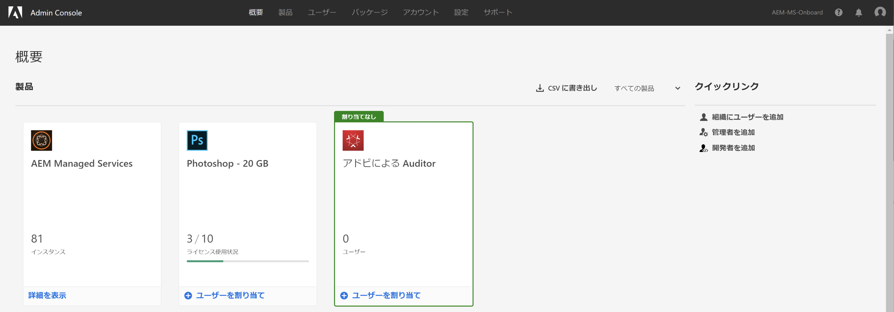

この例では、*AEM-MS-Onboard* 組織は、Stage、Prod など、さまざまなトポロジと環境にまたがる 32 のインスタンスがあります。

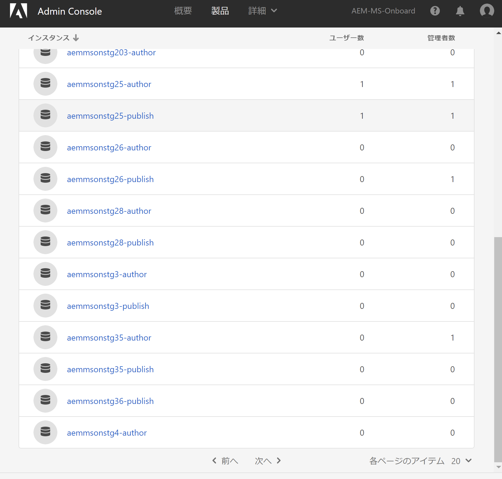

詳細を確認してインスタンスを識別できます。

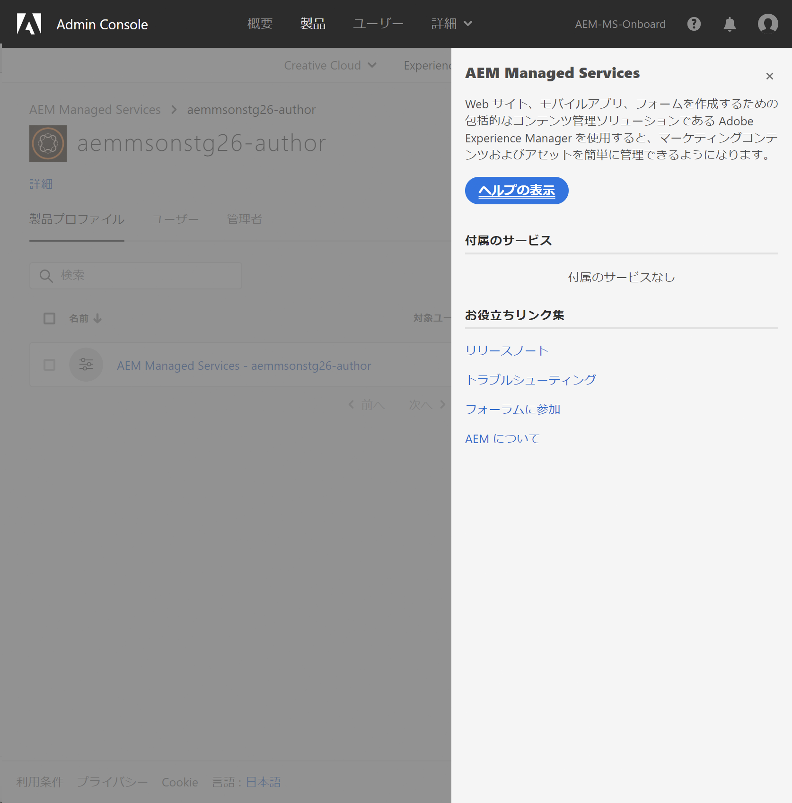

各製品コンテキストインスタンスの下に、関連付けられた製品プロファイルがあります。この製品プロファイルは、ユーザーおよびグループにアクセス権を割り当てるために使用されます。

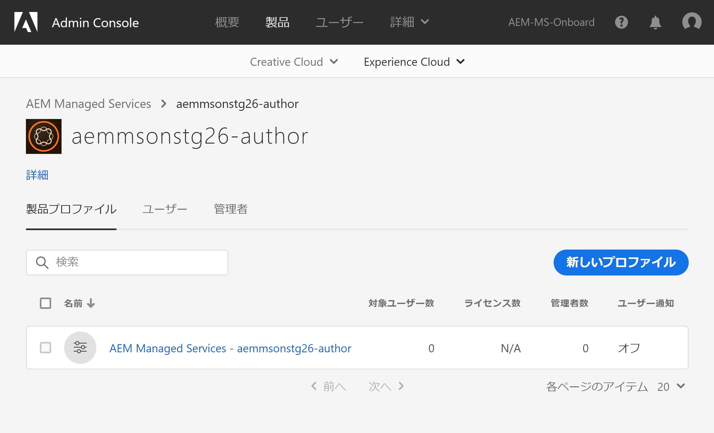

この製品プロファイルの下に追加されたすべてのユーザーおよびグループは、以下の例に示すように、そのインスタンスにログインできます。

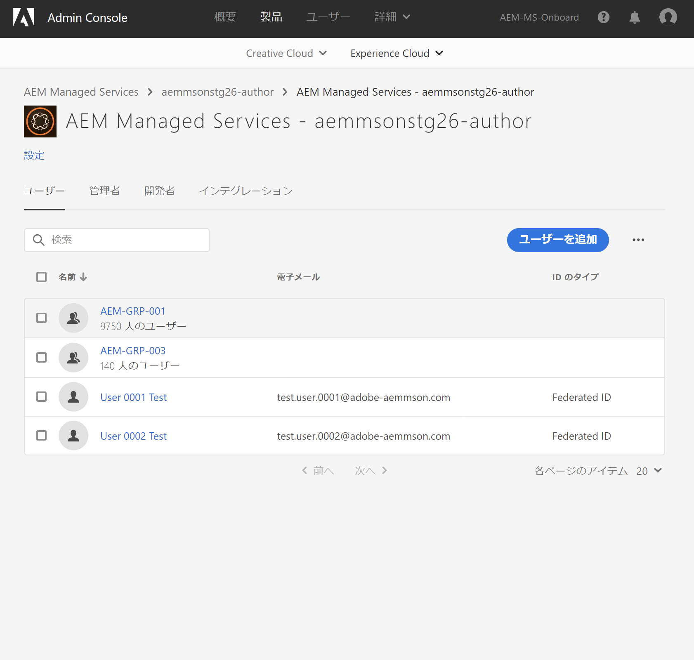

### AEM へのログイン {#logging-into-aem}

#### ローカル管理者ログイン {#local-admin-login}

AEM では引き続き、管理ユーザーのローカルログインをサポートし、ログイン画面にはローカルでログインするオプションがあります。

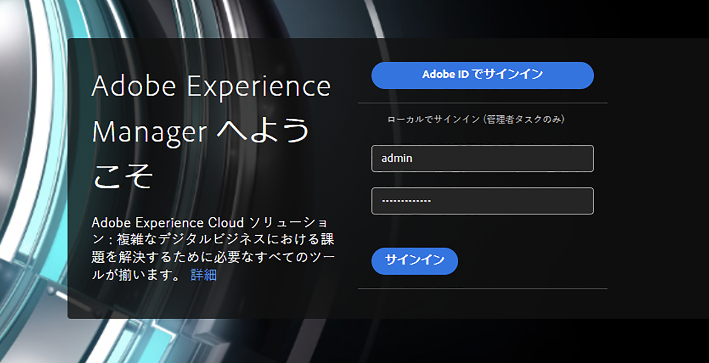

#### IMS ベースのログイン {#ims-based-login}

他のユーザーの場合は、IMS がインスタンスに設定された後に、IMS ベースのログインを使用できます。ユーザーはまず、下に示すように、「**Sign in with Adobe**」ボタンをクリックします。

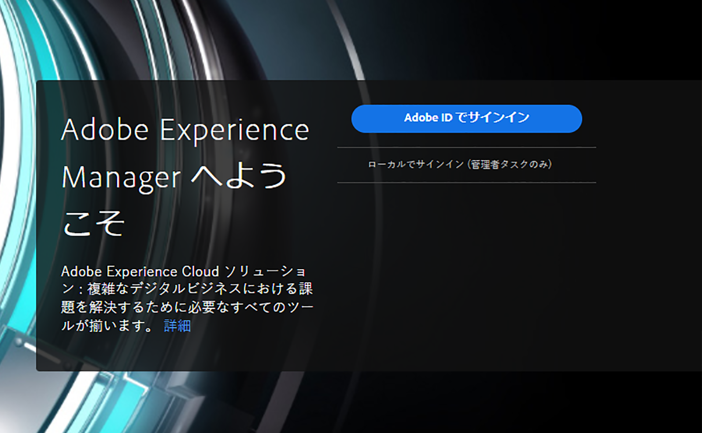

その後、ユーザーは IMS ログイン画面にリダイレクトされ、資格情報を入力します。

If a federated IDP is configured during initial [!DNL Admin Console] setup, then the user will be redirected to the customer IDP for SSO.

以下の例では、IDP は Okta です。

認証が完了すると、ユーザーは AEM にリダイレクトされてログインします。

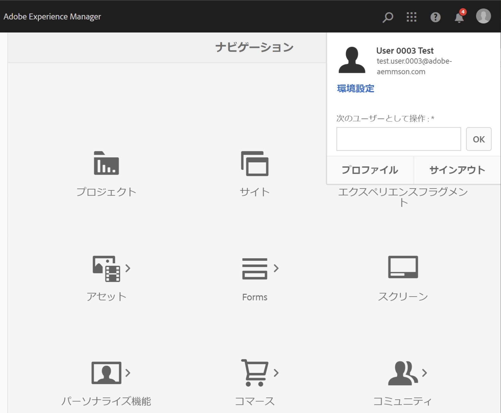

### 既存ユーザーの移行 {#migrating-existing-users}

別の認証方式を使用していて、現在 IMS に移行されている既存の AEM インスタンスの場合、移行手順が必要です。

AEMリポジトリ内の既存のユーザー（ローカルソース、LDAPまたはSAML）は、User Migration Utilityを使用して、IDPとしてIMSに移行できます。

このユーティリティは、IMS プロビジョニングの一部として AMS チームによって実行されます。

### AEM での権限と ACL の管理 {#managing-permissions-and-acls-in-aem}

アクセス制御と権限は、AEMで引き続き管理されます。これは、IMSからのユーザーグループ(下の例ではAEM-GRP-008)と、権限とアクセス制御が定義されたローカルグループを分離することで実現できます。 IMS から同期されたユーザーグループは、ローカルグループに割り当てられ、権限を継承することができます。

以下の例では、同期グループをローカル *Dam_Users* グループに追加しています。

Here, a user has also been assigned to a few groups in the [!DNL Admin Console]. ( Please note that the users and groups can be synced from LDAP using the user sync tool or created locally, please see the section **Onboarding Users to the[!DNL Admin Console]** above).

&amp;ast；ユーザーグループは、ユーザーがインスタンスにログインした場合にのみ同期されます。大量のユーザーとグループを持つお客様の場合は、グループ同期ユーティリティをAMSで実行して、上述のアクセス制御および権限管理用のグループを事前取得できます。

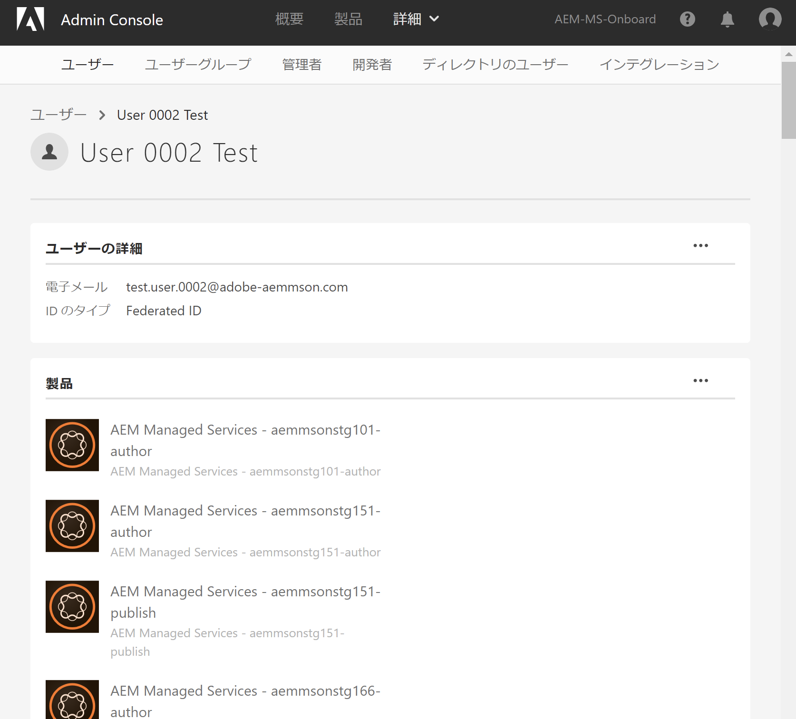

ユーザーは、IMS の以下のグループの一部です。

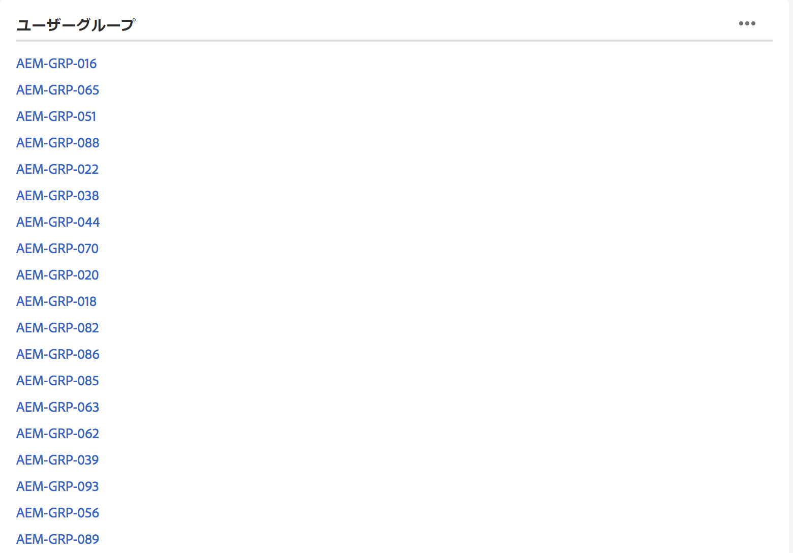

ユーザーがログインすると、以下に示すように、グループメンバーシップが同期されます。

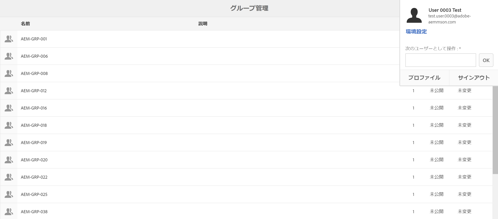

AEM では、IMS から同期されたユーザーグループを既存のローカルグループ（DAM ユーザーなど）にメンバーとして追加できます。

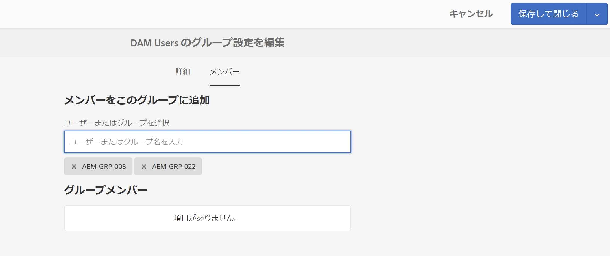

以下に示すように、グループ *AEM-GRP_008* は DAM ユーザーの権限と特権を継承します。これは同期されたグループに対する権限を管理する効果的な方法であり、LDAP ベースの認証方法でも一般的に使用されています。

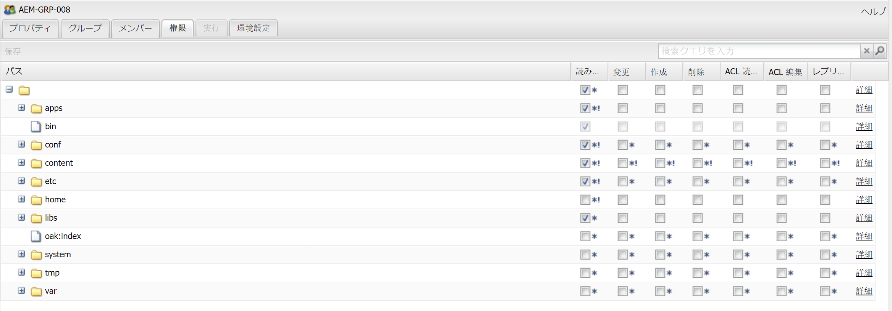
