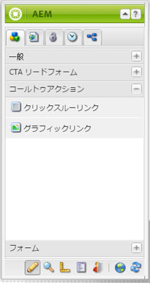
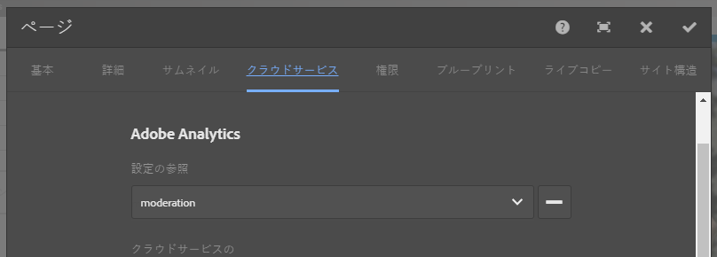

# ランディングページと Adobe Analytics の統合{#integrating-landing-pages-with-adobe-analytics}

AEM has integrated the landing pages solution with [Adobe Analytics](https://www.omniture.com/en/products/analytics/sitecatalyst) by using the following call-to-action (CTA) components:

1. クリックスルーコンポーネント
1. グラフィックリンクコンポーネント

これらのコンポーネントは、Adobe Analytics変数（トラフィック、コンバージョン変数）と成功イベントを介してマッピングできる特定の属性を公開し、Adobe Analyticsに情報を送信します。

## 前提条件 {#prerequisites}

Adobe recommends that you go through the [existing AEM-Adobe Analytics integration](/help/sites-administering/adobeanalytics.md) to understand how this integration works.

## マッピングに使用できるコンポーネント {#components-available-for-mapping}

In AEM, the **Call to Action** components - **ClickThroughLink** and **GraphicalLink** - displayed here in the sidekick, can be mapped to Adobe Analytics variables.

### Adobe Analytics へのランディングページコンポーネントのマッピング {#mapping-landing-page-components-to-adobe-analytics}

ランディングページコンポーネントを Adobe Analytics にマッピングするには：

1. Adobe Analytics設定を作成し、新しいフレームワークを作成したら、ドロップダウンメニューから適切なレポートスイートを選択します。 この結果、Adobe Analytics の変数が取得され、コンテンツファインダーに表示されます。
1. コールトゥアクション（CTA）コンポーネントを、サイドキックからページ中央のマッピング領域の適切な場所にドラッグ＆ドロップします。

<table>
 <tbody>
  <tr>
   <td><strong>コンポーネント名</strong></td>
   <td><strong>公開される属性</strong></td>
   <td><strong>属性の意味</strong></td>
  </tr>
  <tr>
   <td><strong>CTA クリックスルーリンク</strong></td>
   <td><i>eventdata.clickthroughLinkLabel</i>   </td>
   <td>リンク上のラベルまたはリンクのテキスト </td>
  </tr>
  <tr>
   <td>  </td>
   <td><i>eventdata.clickthroughLinkTarget</i>   </td>
   <td>リンクをクリックしたときの移動先 </td>
  </tr>
  <tr>
   <td>  </td>
   <td><i>eventdata.events.clickthroughLinkClick</i>   </td>
   <td>クリックイベント </td>
  </tr>
  <tr>
   <td><strong>CTA グラフィックリンク</strong></td>
   <td><i>eventdata.clicktroughImageLabel</i>   </td>
   <td>CTA画像のタイトル </td>
  </tr>
  <tr>
   <td>  </td>
   <td><i>eventdata.clicktroughImageTarget</i>   </td>
   <td>リンクを含む画像をクリックしたときの移動先</td>
  </tr>
  <tr>
   <td>  </td>
   <td><i>eventdata.clicktroughImageAsset</i>   </td>
   <td>リポジトリ内の画像アセットへのパス </td>
  </tr>
  <tr>
   <td>  </td>
   <td><i>eventdata.events.clicktroughImageClick</i>   </td>
   <td>クリックイベント</td>
  </tr>
 </tbody>
</table>

1. コンテンツファインダーで、これらの公開される属性と Adobe Analytics 変数をマッピングします。フレームワークを使用する準備が整いました。
1. You can now create a new landing page or open an existing landing page with existing CTA components and click **Cloud Services** tab in **Page Properties** from the sidekick (in the touch-optimized UI, select **Open Properties** and click **Cloud Services**) and configure the framework to use with landing page. ドロップダウンリストからフレームワークを選択します。

   

1. ランディングページを含むフレームワークを設定したら、実装されたコンポーネントが使用できるようになり、CTA でのクリックがすべて Adobe Analytics に記録されます。

