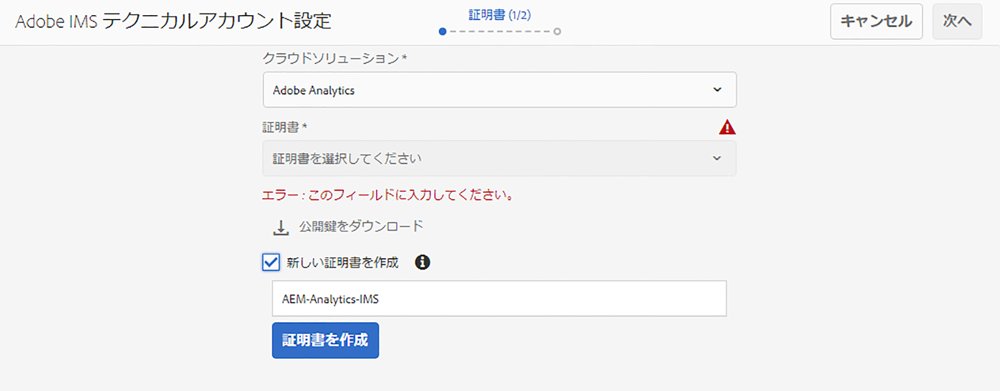
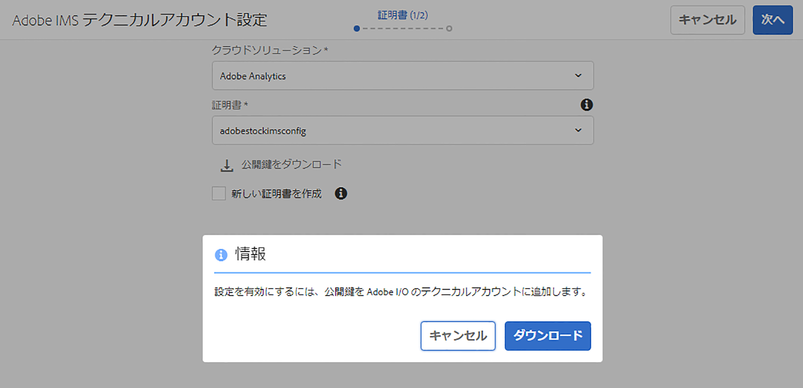
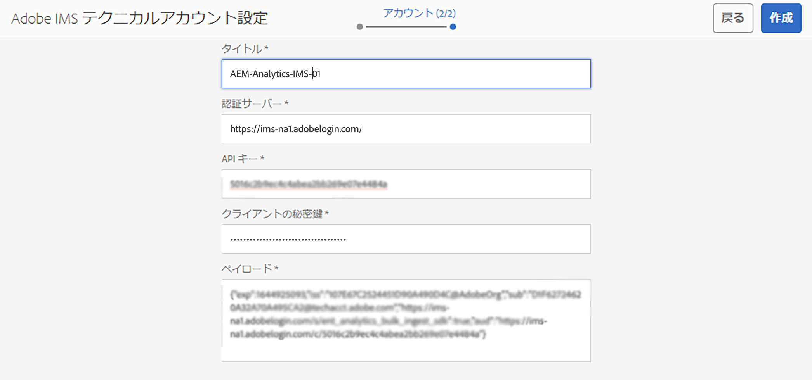
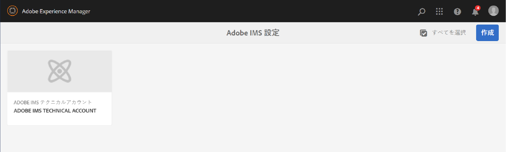
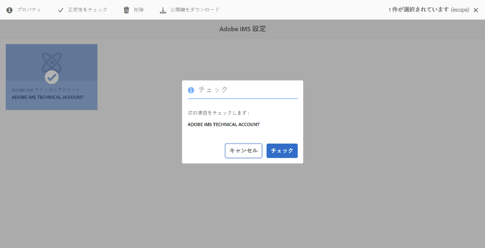

# IMS を使用したAdobe Analyticsとの統合 {#integration-with-adobe-analytics-using-ims}

Analytics Standard API を使用してAEMとAdobe Analyticsを統合するには、Adobe Developerコンソールを使用してAdobe IMS(Identity Managementシステム ) を設定する必要があります。

>[!NOTE]
>
>Adobe Analytics Standard API 2.0 のサポートは、AEM 6.5.12.0で新しく追加されました。このバージョンの API は、IMS 認証をサポートします。
>
>AEMでのAdobe Analytics Classic API 1.4 の使用は、後方互換性のために引き続きサポートされます。 この [Analytics Classic API はユーザー資格情報認証を使用します](/help/sites-administering/adobeanalytics-connect.md).
>
>API の選択は、AEM/Analytics 統合に使用される認証方法によって実行されます。
>
>詳しくは、 [2.0 API への移行](https://developer.adobe.com/analytics-apis/docs/2.0/guides/migration/).

## 前提条件 {#prerequisites}

この手順を開始する前に、以下を実行します。

* [アドビサポート](https://helpx.adobe.com/jp/contact/enterprise-support.ec.html)は、次のアカウントをプロビジョニングする必要があります。

   * アドビコンソール
   * Adobe 開発者コンソール
   * Adobe Analyticsと
   * Adobe IMS（Identity Management System）

* 組織のシステム管理者は、Admin Console を使用して、組織内で必要な開発者を関連する製品プロファイルに追加する必要があります。

   * これにより、特定の開発者に、Adobe Developerコンソール内で統合を有効にする権限を付与できます。
   * 詳しくは、[開発者の管理](https://helpx.adobe.com/jp/enterprise/admin-guide.html/enterprise/using/manage-developers.ug.html)を参照してください。

## IMS 設定の指定 - 公開鍵の生成 {#configuring-an-ims-configuration-generating-a-public-key}

設定の最初の段階は、AEMで IMS 設定を作成し、公開鍵を生成することです。

1. AEM で、**ツール**&#x200B;メニューを開きます。
1. **セキュリティ**&#x200B;セクションで、**Adobe IMS 設定**&#x200B;を選択します。
1. **作成**&#x200B;を選択して、**Adobe IMS テクニカルアカウント設定**&#x200B;を開きます。
1. 下のドロップダウンを使用 **クラウド設定**&#x200B;を選択します。 **Adobe Analytics**.
1. **新しい証明書の作成**&#x200B;をアクティブにして、新しいエイリアスを入力します。
1. 「**証明書の作成**」で確認します。

   

1. 選択 **ダウンロード** ( または **公開鍵をダウンロード**) をクリックして、ファイルをローカルドライブにダウンロードし、 [AEMとのAdobe Analytics統合用の IMS の設定](#configuring-ims-for-adobe-analytics-integration-with-aem).

   >[!CAUTION]
   >
   >この設定は、[AEM で IMS 設定を完了する](#completing-the-ims-configuration-in-aem)ときに再び必要になるため、開いたままにしてください。

   

## AEMとのAdobe Analytics統合用の IMS の設定 {#configuring-ims-for-adobe-analytics-integration-with-aem}

Adobe Developer Console を使用する場合は、Adobe Analyticsでプロジェクト（統合）を作成し、AEMで使用するための権限を割り当てる必要があります。

### プロジェクトの作成 {#creating-the-project}

Adobe Developerコンソールを開いて、AEMが使用するAdobe Analyticsでプロジェクトを作成します。

1. Adobe Developer Console を開いて、プロジェクトを表示します。

   [https://developer.adobe.com/console/projects](https://developer.adobe.com/console/projects)

1. 既に作成したプロジェクトが表示されます。 **新規プロジェクトの作成**&#x200B;を選択 - 場所と使用方法は、以下に依存します。

   * まだプロジェクトがない場合は、 **新規プロジェクトを作成**が中央の下に表示されます。
      
   * 既存のプロジェクトがある場合は、それらがリストされ、 **新規プロジェクトの作成**が右上に表示されます。
      

1. **プロジェクトに追加**&#x200B;を選択し、続いて **API** を選択します。

   

1. 選択 **Adobe Analytics**&#x200B;を、 **次へ**:

   >[!NOTE]
   >
   >Adobe Analyticsを購読しているが、リストに表示されない場合は、 [前提条件](#prerequisites).

   

1. 選択 **サービスアカウント (JWT)** 認証のタイプとして、次に **次へ**:

   

1. **公開鍵**&#x200B;をアップロードして、完了したら&#x200B;**次へ**&#x200B;に進みます。

   

1. 資格情報を確認して、**次へ**&#x200B;に進みます。 

   

1. 必要な製品プロファイルを選択して、**設定済み API を保存**&#x200B;に進みます。 

   

1. 設定が確認されます。

### 統合への権限の割り当て {#assigning-privileges-to-the-integration}

次に、必要な権限を統合に割り当てる必要があります。

1. Adobe **Admin Console** を開きます。

   * [https://adminconsole.adobe.com](https://adminconsole.adobe.com/)

1. に移動します。 **製品** （上部のツールバー）、「 **Adobe Analytics - &lt;*your-tenant-id*>** （左のパネルから）。
1. **製品プロファイル**&#x200B;を選択して、表示されるリストから必要なワークスペースを選択します（例：「デフォルトのワークスペース」）。
1. 選択 **API 資格情報**&#x200B;を選択し、必要な統合設定を選択します。
1. **製品の役割**&#x200B;として、**オブザーバー**&#x200B;の代わりに&#x200B;**編集者**&#x200B;を選択します。

## Adobe Developer Console Integration Project 用に保存される詳細 {#details-stored-for-the-ims-integration-project}

Adobe Developerプロジェクトコンソールから、すべての統合プロジェクトのリストを表示できます。

* [https://developer.adobe.com/console/projects](https://developer.adobe.com/console/projects)

特定のプロジェクトエントリを選択して、設定の詳細を表示します。 次のものが含まれます。

* プロジェクトの概要
* Insights
* 資格情報
   * サービスアカウント（JWT）
      * 資格情報の詳細
      * JWT の生成
* API
   * 例： Adobe Analytics

これらの一部は、AEMのAdobe Analyticsとの統合を完了する必要があります。

## AEM での IMS 設定の完了 {#completing-the-ims-configuration-in-aem}

AEMに戻ると、Analytics の統合プロジェクトから必要な値を追加することで、IMS 設定を完了できます。

1. [AEM で IMS 設定を開く](#configuring-an-ims-configuration-generating-a-public-key)に戻ります。
1. 「**次へ**」を選択します。

1. ここで、 [Adobe Developer Console Integration Project 用に保存される詳細](#details-stored-for-the-ims-integration-project):

   * **タイトル**：テキスト。
   * **認証サーバー**：以下の&#x200B;**ペイロード**&#x200B;セクションの `aud` 行からこれをコピーして貼り付けます。例：以下の例では `https://ims-na1.adobelogin.com`　
   * **API キー**:これを **資格情報** セクション [プロジェクトの概要](#details-stored-for-the-ims-integration-project)
   * **クライアント秘密鍵**:これを [「サービスアカウント (JWT) 」セクションの「クライアントの秘密鍵」タブ](#details-stored-for-the-ims-integration-project)、および
   * **ペイロード**:これを [「サービスアカウント (JWT) 」セクションの「 JWT 」タブを生成](#details-stored-for-the-ims-integration-project)

   

1. 「**作成**」で確定します。

1. Adobe Analyticsの設定がAEMコンソールに表示されます。

   

## IMS 設定の確認 {#confirming-the-ims-configuration}

設定が期待どおりに動作していることを確認するには：

1. 次を開きます。

   * `https://localhost<port>/libs/cq/adobeims-configuration/content/configurations.html`

   次に例を示します。

   * `https://localhost:4502/libs/cq/adobeims-configuration/content/configurations.html`

1. 設定を選択します。
1. ツールバーから&#x200B;**ヘルスチェック**&#x200B;を選択し、次に&#x200B;**チェック**&#x200B;を選択します。

   

1. 成功した場合は、確認メッセージが表示されます。

## Adobe Analytics Cloudサービスの設定 {#configuring-the-adobe-analytics-cloud-service}

Analytics Standard API を使用するCloud Service向けに、次の設定を参照できるようになりました。

1. **ツール**&#x200B;メニューを開きます。次に、**クラウドサービス**&#x200B;セクション内で、**従来のクラウドサービス**&#x200B;を選択します。
1. 下にスクロールして **Adobe Analytics** を選択し、 **今すぐ設定**.

   **設定の作成**&#x200B;ダイアログが開きます。

1. **タイトル**&#x200B;と、必要に応じて&#x200B;**名前**&#x200B;を入力します（空白の場合、タイトルから生成されます）。

   また、必要なテンプレートを選択することもできます（複数のテンプレートを使用できる場合）。

1. 「**作成**」で確認します。

   **コンポーネントの編集**&#x200B;ダイアログが開きます。

1. 詳細を **Analytics 設定** タブ：

   * **認証**：IMS

   * **IMS 設定**：IMS 設定の名前を選択します。

1. クリック **Analytics に接続** :Adobe Analyticsとの接続を初期化します。

   接続に成功すると、「**接続に成功しました**」というメッセージが表示されます。

1. 選択 **OK** をクリックします。

1. 必要に応じて他のパラメーターを入力し、その後にを入力します。 **OK** をクリックして、設定を確認します。

1. 次に進むことができます： [Analytics フレームワークの追加](/help/sites-administering/adobeanalytics-connect.md) Adobe Analyticsに送信するパラメーターを設定する場合。
