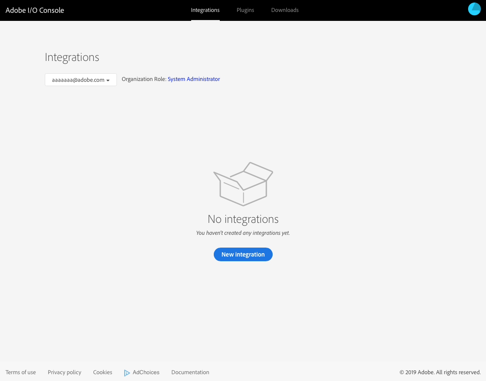

# Adobe I/Oを使用したAdobe targetとの統合{#integration-with-adobe-target-using-adobe-i-o}

Target Standard APIを使用してAEMをAdobe targetと統合するには、Adobe IMS(Identity Management System)とAdobe I/Oの設定が必要です。

>[!NOTE]
>
>Adobe Target Standard APIのサポートは、AEM 6.5で新たに追加されました。Target Standard APIはIMS認証を使用します。
>
>AEMでのAdobe Target Classic APIの使用は、後方互換性のために引き続きサポートされます。 Target Classic API [は、ユーザー資格情報認証を使用します](/help/sites-administering/target-configuring.md#manually-integrating-with-adobe-target)。
>
>APIの選択は、AEM/Target統合で使用される認証方法によって決まります。

## 前提条件 {#prerequisites}

この手順を開始する前に、アドビサ [ポートが](https://helpx.adobe.com/contact/enterprise-support.ec.html) 、次のアカウントをプロビジョニングする必要があります。

* Adobe Console
* Adobe I/O
* Adobe targetおよび
* Adobe IMS(Identity Management System)

## IMS設定の設定 — 公開鍵の生成 {#configuring-an-ims-configuration-generating-a-public-key}

設定の最初の段階は、AEMでIMS設定を作成し、公開鍵を生成することです。

1. AEMでツールメニュー **を開きます** 。
1. 「セキュリ **ティ** 」セクションで「 **Adobe IMS設定」を選択します**。
1. 「作成 **」を選択して** Adobe IMSテクニカルアカウント設定を開きます ****。
1. 「クラウドの設定」の下のド **ロップダウンを使用し**、「 **Adobe Target**」を選択します。
1. 「新しい **証明書を作成** 」をアクティブにし、新しいエイリアスを入力します。
1. 「証明書の作 **成」で確認**。

   

1. 「ダウ **ンロード** (ま **たは公開鍵をダウンロード**)」を選択してローカルドライブにファイルをダウンロードし、AEMとAdobe targetの統合用に [Adobe I/Oを設定する際に使用できる状態にします](#configuring-adobe-i-o-for-adobe-target-integration-with-aem)。

   >[!CAUTION]
   >
   >この設定は開いたままにしておくと、AEMでIMS設定を完了す [る際に再度必要になります](#completing-the-ims-configuration-in-aem)。

   

## AEMとAdobe target統合のためのAdobe I/Oの設定 {#configuring-adobe-i-o-for-adobe-target-integration-with-aem}

AEMが使用するAdobe targetとのAdobe I/O統合を作成し、必要な権限を割り当てる必要があります。

### 統合の作成 {#creating-the-integration}

Adobe I/Oコンソールを開き、AEMが使用するAdobe targetとのI/O統合を作成します。

>[!NOTE]
>
>詳しくは、 [Adobe I/Oチュートリアルも参照してください](https://www.adobe.io/apis/experienceplatform/home/tutorials/alltutorials.html)。

1. Adobe I/Oコンソールを開いて統合を行います。

   * [https://console.adobe.io/integrations](https://console.adobe.io/integrations)

1. 新しい **統合の選択**:

   >[!NOTE]
   >
   >既に統合が存在する場合は、これらの統合が表示され、「 **新規統合** 」ボタンが右上に表示されます。

   

1. 「 **Access an API** 」を選択し、「 **Continue**」を選択します。

   

1. 「 **Adobe Target**」を選択し、「 **続行**」を選択します。

   

1. 統合設定に必要な詳細を追加します。

   * **名前**

      名前を入力します。

   * **説明**

      説明はオプションです。

   * **公開鍵証明書**

      公開鍵ファイルをアップロードします。を生成す [る方法を説明します](#configuring-an-ims-configuration-generating-a-public-key)。

      読み込まれた証明書は「証明書」の下に表示さ **れます**。

   * **製品プロファイル**

      製品プロファイルは、AEMがコンテンツのエクスポートやオファーの作成に使用できるTargetのワークスペースと同じです。 デフォルトでは、「ターゲットのデフォルトのワークスペース」が選択されています。 AEMで書き出し先として公開する他のプロファイル/ワークスペースを選択します。
   次に例を示します。

   

1. 「統合を作成」で **確認します**。
1. 作成が確認され、「統合の詳細を続行」 **をクリックできます**。これらは、AEMでIMS [設定を完了する際に必要です](#completing-the-ims-configuration-in-aem)。

   

### 統合への権限の割り当て {#assigning-privileges-to-the-integration}

次に、必要な権限を統合に割り当てる必要があります。

1. Adobe **Admin Consoleを開きます**。

   * [https://adminconsole.adobe.com](https://adminconsole.adobe.com/)

1. 「製品 **」（上部のツールバー）に移動し、** Adobe Target - &lt; **your-tenant-id *>*** （左のパネルから）を選択します。
1. 「製品プ **ロファイル**」を選択し、表示されるリストから必要なワークスペースを選択します。 例えば、デフォルトのワークスペースです。
1. 「統 **合**」を選択し、必要な統合設定を選択します。
1. 「 **Editor** 」を「 **Product Role**」として選択します。オブザーバーの代 **わりに**。

## Adobe I/O統合用に保存される詳細 {#details-stored-for-the-adobe-i-o-integration}

Adobe I/O統合コンソールから、すべての統合のリストを表示できます。

* [https://console.adobe.io/integrations](https://console.adobe.io/integrations)

「 **View** 」（特定の統合エントリの右側）を選択して、設定に関する詳細を表示します。 有効なタイプには以下が含まれます。

* 概要
* インサイト
* サービス
* イベント
* JWT（JSON webトークン）

これらの一部は、AEMでTargetのAdobe I/O統合を完了する必要があります。

1. **概要**:

   

1. **JWT**:

   

## AEMでのIMS設定の完了 {#completing-the-ims-configuration-in-aem}

AEMに戻ると、TargetのAdobe I/O統合から必要な値を追加することで、IMS設定を完了できます。

1. AEMで開いてい [るIMS設定に戻ります](#configuring-an-ims-configuration-generating-a-public-key)。
1. 「**次へ**」を選択します。

1. ここでは、Adobe I/O [の次の詳細を使用できます](#details-stored-for-the-adobe-i-o-integration)。

   * **タイトル**:テキスト。
   * **Authorization Server**:下の例のように、下のペイロ `"aud"` ードセクションの行から **これをコピー** /貼り付け `"https://ims-na1.adobelogin.com"` ます。
   * **APIキー**:Target用のAdobe I/O統 [合の](#details-stored-for-the-adobe-i-o-integration) 「概要」セクションからコピーします。
   * **Client Secret**:Target用Adobe I/O統 [合の](#details-stored-for-the-adobe-i-o-integration) 「概要」セクションでこれを生成し、
   * **ペイロード**:Target用のAdobe I/O統合の [JWT](#details-stored-for-the-adobe-i-o-integration) セクションからこれをコピーします。
   

1. 「作成」で確 **認します**。

1. Adobe targetの設定がAEMコンソールに表示されます。

   

## IMS設定の確認 {#confirming-the-ims-configuration}

設定が期待どおりに動作していることを確認するには：

1. 次のファイルを開きます。

   * `https://localhost<port>/libs/cq/adobeims-configuration/content/configurations.html`
   次に例を示します。

   * `https://localhost:4502/libs/cq/adobeims-configuration/content/configurations.html`

1. 設定を選択します。
1. ツールバ **ーから「Check Health** 」を選択し、「 **Check**」を選択します。

   

1. 成功した場合は、次のメッセージが表示されます。

   

## Configuring the Adobe Target Cloud Service {#configuring-the-adobe-target-cloud-service}

Target Standard APIを使用するために、クラウドサービスの設定を参照できるようになりました。

1. Open the **Tools** menu. 次に、「クラウドサービス」 **セクションで** 「レガシークラウドサー **ビス」を選択します**。
1. 「 **Adobe Target** 」まで下にスクロールし、「今すぐ **設定**」を選択します。

   The **Create Configuration** dialog will open.

1. タイトル **を入力し** 、必要に応じて **名前を入力します** （空欄の場合は、タイトルから生成されます）。

   また、必要なテンプレートを選択することもできます（複数のテンプレートが使用可能な場合）。

1. 「作成」で確 **認します**。

   [コンポ **ーネントを編集** ]ダイアログが開きます。

1. 「 **Adobe Target Settings」タブに詳細を入力します** 。

   * **クライアントコード**:adobe IMSテナントID

      >[!CAUTION]
      >
      >Adobe IMSテナントIDは、「クライアントコード」というフィールドに入力する必要があります。

   * **認証**:IMS
   * **IMS設定**:ims設定の名前を選択します
   * **APIタイプ**:REST
   * **A4T Analytics クラウド設定**：ターゲットアクティビティの目標と指標に使用する Analytics クラウド設定。これは、コンテンツをターゲット化するときに、Adobe Analytics をレポートソースとして使用している場合に必要です。If you do not see your cloud configuration, see note in [Configuring A4T Analytics Cloud Configuration](/help/sites-administering/target-configuring.md#configuring-a-t-analytics-cloud-configuration).
   * **正確なターゲット設定を使用**:デフォルトでは、このチェックボックスは選択されています。 オンにすると、クラウドサービス設定はコンテンツが読み込まれるまでコンテキストの読み込みを待機します。続きのメモを確認してください。
   * **Adobe targetからのセグメントの同期**:Targetで定義されたセグメントをダウンロードしてAEMで使用するには、このオプションを選択します。 「API のタイプ」プロパティが REST のときは、インラインのセグメントがサポートされておらず、常に Target からセグメントを使用する必要があるので、このオプションをオンにする必要があります（AEM の用語「セグメント」は、Target の「オーディエンス」と同じです）。
   * **クライアントライブラリ**:AT.jsクライアントライブラリまたはmbox.js（非推奨）のどちらを使用するかを選択します。
   * **Tag Management systemを使用したクライアントライブラリの提供**:DTM（非推奨）、Adobe Launchまたはその他のタグ管理システムを使用します。
   * **Custom AT.js**:「Tag Management」ボックスをオンにした場合、またはデフォルトのAT.jsを使用する場合は、空白のままにします。 それ以外の場合は、カスタム AT.js をアップロードします。AT.js を選択した場合にのみ表示されます。
   >[!NOTE]
   >
   >[Target Classic APIを使用するクラウドサービスの設定は廃止されました](/help/sites-administering/target-configuring.md#manually-integrating-with-adobe-target) （「Adobe Recommendationsの設定」タブを使用）。

   次に例を示します。

   

1. Click **Connect to Target** to initialize the connection with Adobe Target.

   接続に成功すると、「**接続に成功しました**」というメッセージが表示されます。

1. メッセージ **で「** OK **」を選択し、ダイアログで「** OK」を選択して設定を確認します。
1. 「Targetフレームワークの追加」に進 [んで](/help/sites-administering/target-configuring.md#adding-a-target-framework) 、Targetに送信するContextHubまたはClientContextパラメーターを設定できるようになりました。 これは、AEMエクスペリエンスフラグメントをTargetに書き出す場合には必要でない場合があります。

