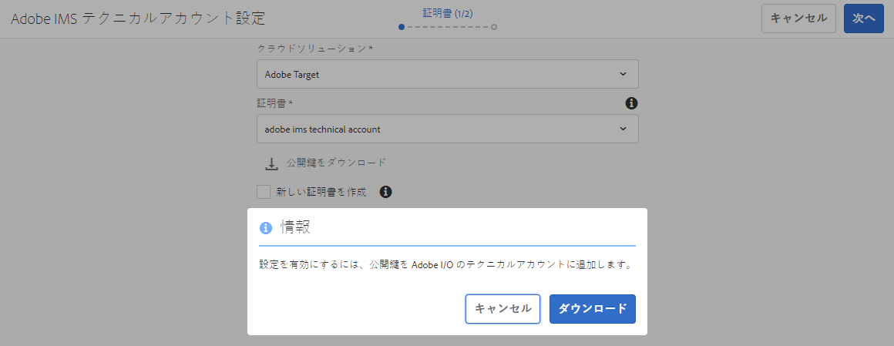
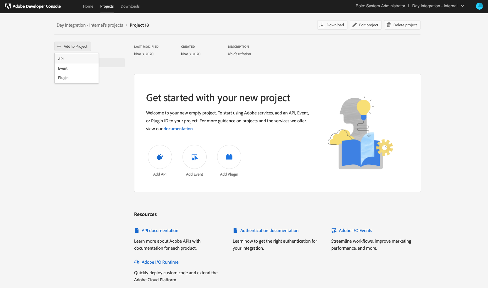
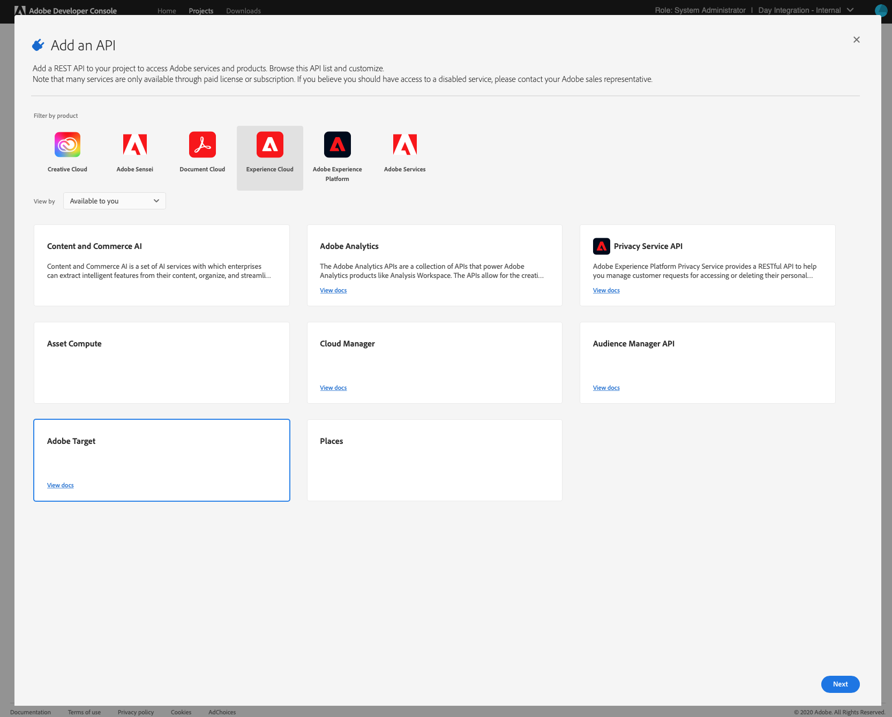
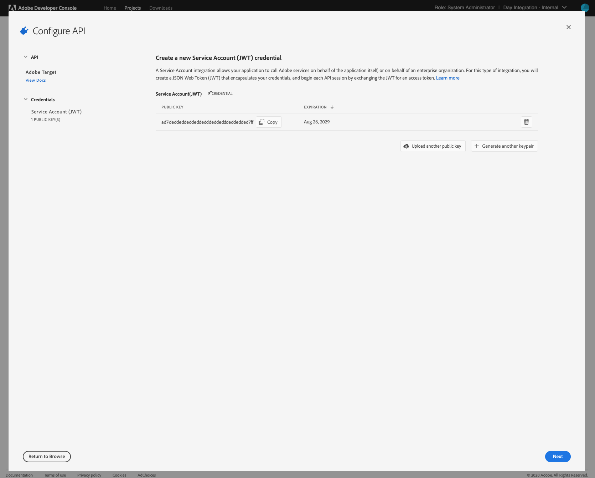
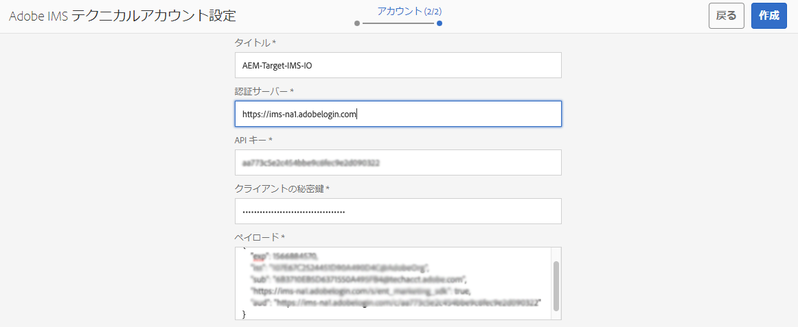
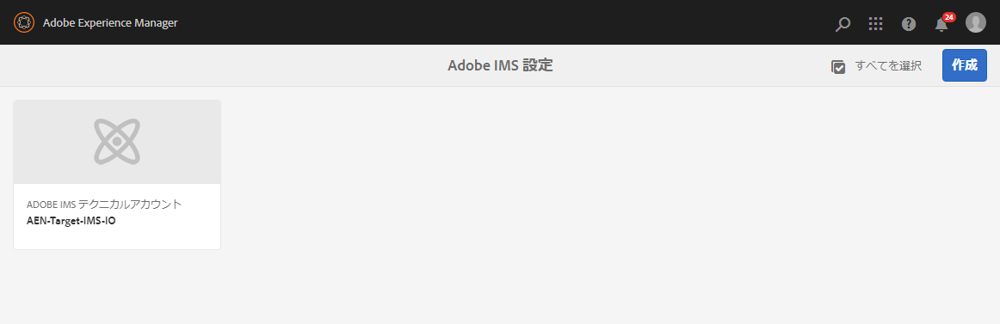
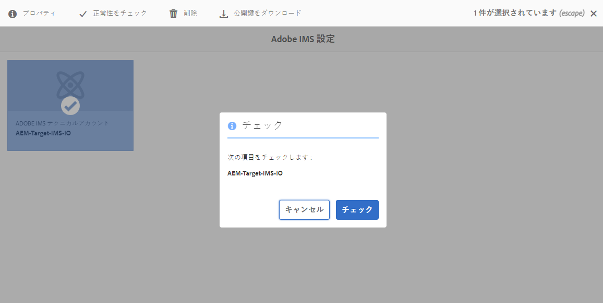
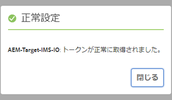
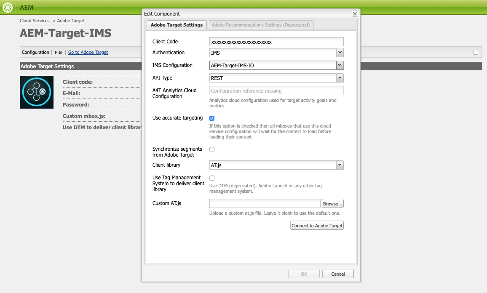

# Adobe I/O を使用した Adobe Target との統合{#integration-with-adobe-target-using-adobe-i-o}

Target Standard APIを介してAEMをAdobe Targetと統合するには、AdobeIMS(Identity Managementシステム)とAdobeI/Oの設定が必要です。

>[!NOTE]
>
>Adobe Target標準APIのサポートは、AEM 6.5で新たに追加されました。Target Standard APIはIMS認証を使用します。
>
>AEMでのAdobe TargetクラシックAPIの使用は、後方互換性を維持するために引き続きサポートされています。 ターゲット [クラシックAPIは、ユーザー資格情報認証を使用します](/help/sites-administering/target-configuring.md#manually-integrating-with-adobe-target)。
>
>APIの選択は、AEM/ターゲット統合に使用される認証方式によって決定されます。

## 前提条件 {#prerequisites}

この手順を開始する前に、次の手順を実行します。

* [Adobeサポート](https://helpx.adobe.com/jp/contact/enterprise-support.ec.html) :

   * Adobeコンソール
   * AdobeI/O
   * Adobe Targetと
   * AdobeIMS(Identity Managementシステム)

* 組織のシステム管理者は、Admin Consoleを使用して、組織内の必要な開発者を関連する製品プロファイルに追加する必要があります。

   * これにより、特定の開発者に対して、AdobeI/O内での統合を有効にする権限を提供します。
   * 詳しくは、「開発者の [管理](https://helpx.adobe.com/enterprise/admin-guide.html/enterprise/using/manage-developers.ug.html)」を参照してください。

## IMS設定の設定 — 公開鍵の生成 {#configuring-an-ims-configuration-generating-a-public-key}

設定の最初の段階は、AEMでIMS設定を作成し、公開鍵を生成することです。

1. AEMで、「 **ツール** 」メニューを開きます。
1. 「 **セキュリティ** 」セクションで、「 **AdobeIMS設定**」を選択します。
1. 「 **作成** 」を選択して、 **Adobe「IMSテクニカルアカウント設定**」を開きます。
1. 「 **クラウドの設定**」のドロップダウンを使用して、 **Adobe Targetを選択します**。
1. 「 **Create new certificate** 」をアクティブにし、新しいエイリアスを入力します。
1. 「証明書の **作成**」で確認します。

   

1. [ **ダウンロード** ](または[公開鍵を **ダウンロード**])を選択してファイルをローカルドライブにダウンロードし、AEMとのAdobe Target統合用にAdobeI/Oを 構成する際に使用できるようにします。

   >[!CAUTION]
   >
   >この設定は開いたままにしておきます。AEMでIMS設定を [完了するときに再度必要になり](#completing-the-ims-configuration-in-aem)ます。

   

## AEMとのAdobe Target統合のためのAdobeI/Oの設定 {#configuring-adobe-i-o-for-adobe-target-integration-with-aem}

AEMが使用するAdobe TargetとのAdobeI/Oプロジェクト（統合）を作成し、必要な権限を割り当てる必要があります。

### プロジェクトの作成 {#creating-the-project}

AdobeI/Oコンソールを開き、AEMが使用するAdobe TargetのI/Oプロジェクトを作成します。

>[!NOTE]
>
>「 [AdobeI/Oチュートリアル](https://www.adobe.io/apis/experienceplatform/home/tutorials/alltutorials.html)」も参照してください。

1. プロジェクトのAdobeI/Oコンソールを開く：

   [https://console.adobe.io/projects](https://console.adobe.io/projects)

1. 自分が所有しているプロジェクトが表示されます。 「 **新規プロジェクトを作成** 」を選択します。場所と使用方法は次の項目によって異なります。

   * まだプロジェクトがない場合は、 **「新しいプロジェクトを** 作成」は中央下に表示されます。
      
   * 既に既存のプロジェクトがある場合は、これらが表示され、 **「新規プロジェクトを作成** 」が右上に表示されます。
      

1. プロジェクト **追加** に選択し **、** APIを選択します。

   

1. 「 **Adobe Target**」、「 **次へ**」の順に選択します。

   >[!NOTE]
   >
   >Adobe Targetを購読しているが、一覧に表示されない場合は、 [前提条件を確認する必要があります](#prerequisites)。

   

1. **公開鍵をアップロードし**、完了したら **次へ**:

   

1. 秘密鍵証明書を確認し、 **次へ**:

   

1. 必要な製品プロファイルを選択し、「設定済みAPIを **保存**:

   >[!NOTE]
   >
   >に表示される製品プロファイルは、次の項目があるかどうかによって異なります。
   >
   >* Adobe Target標準 — **デフォルトのWorkspace** のみ使用可能
   >* Adobe Targetプレミアム — 使用可能なすべてのワークスペースが、次のように表示されます。

   

1. 作成が確認される。

<!--
1. The creation will be confirmed, you can now **Continue to integration details**; these are needed for [Completing the IMS Configuration in AEM](#completing-the-ims-configuration-in-aem).

   
-->

### 統合への権限の割り当て {#assigning-privileges-to-the-integration}

次に、必要な権限を統合に割り当てる必要があります。

1. Adobe **Admin Consoleを開きます**:

   * [https://adminconsole.adobe.com](https://adminconsole.adobe.com/)

1. 「 **Products** (top toolbar)」に移動し、 **「*Adobe Target- &lt;*your-tenant-id** >」（左のパネルから）を選択します。
1. 「 **製品プロファイル**」を選択し、表示されるリストから必要なワークスペースを選択します。 例えば、デフォルトのワークスペースです。
1. 「 **統合**」を選択し、必要な統合設定を選択します。
1. 「 **Editor** 」を **製品の役割として選択します**。( **監視者**)。

## AdobeI/O統合プロジェクト用に保存された詳細 {#details-stored-for-the-adobe-io-integration-project}

AdobeI/Oプロジェクトコンソールから、すべての統合プロジェクトのリストを確認できます。

* [https://console.adobe.io/projects](https://console.adobe.io/projects)

（特定のプロジェクトエントリの右側にある） **表示** を選択して、設定に関する詳細を表示します。 有効なタイプには以下が含まれます。

* プロジェクトの概要
* インサイト
* 秘密鍵証明書
   * サービスアカウント(JWT)
      * 秘密鍵証明書の詳細
      * JWTを生成
* API
   * 例えば、Adobe Target

これらの一部は、AEMでのターゲット用にAdobeI/O統合を完了する必要があります。

## AEMでのIMS設定の完了 {#completing-the-ims-configuration-in-aem}

AEMに戻ると、ターゲットに必要な値をAdobeI/O統合から追加して、IMS設定を完了できます。

1. AEMで開いている [IMS設定に戻ります](#configuring-an-ims-configuration-generating-a-public-key)。
1. 「**次へ**」を選択します。

1. AdobeI/Oの [詳細は次のとおりです](#details-stored-for-the-adobe-io-integration-project)。

   * **タイトル**:テキスト。
   * **認証サーバー**:下の `"aud"` 例のように、下の **Payload**`"https://ims-na1.adobelogin.com"` セクションの行からこれをコピー&amp;ペーストします。
   * **APIキー**:ターゲット用AdobeI/O統合の [概要](#details-stored-for-the-adobe-io-integration-project) ・セクションからこれをコピーします。
   * **クライアントシークレット**:ターゲット用AdobeI/O統合の [概要](#details-stored-for-the-adobe-io-integration-project) ・セクションでこれを生成し、
   * **ペイロード**:ターゲット用のAdobeI/O統合の [Generate JWT](#details-stored-for-the-adobe-io-integration-project) （JWTの生成）セクションからこれをコピーします。

   

1. 「 **作成**」で確認します。

1. Adobe Target設定がAEMコンソールに表示されます。

   

## IMS設定の確認 {#confirming-the-ims-configuration}

設定が期待どおりに動作していることを確認するには：

1. 次のファイルを開きます。

   * `https://localhost<port>/libs/cq/adobeims-configuration/content/configurations.html`

   次に例を示します。

   * `https://localhost:4502/libs/cq/adobeims-configuration/content/configurations.html`

1. 設定を選択します。
1. ツールバーから「 **ヘルスをチェック** 」を選択し、「 **チェック**」を選択します。

   

1. 成功すると、次のメッセージが表示されます。

   

## Configuring the Adobe Target Cloud Service {#configuring-the-adobe-target-cloud-service}

Target Standard APIを使用するCloud Serviceに対して、設定を参照できるようになりました。

1. Open the **Tools** menu. 次に、「 **Cloud Services** 」セクションで「 **レガシーCloud Services**」を選択します。
1. 「 **Adobe Target** 」まで下にスクロールし、「 **今すぐ設定**」を選択します。

   The **Create Configuration** dialog will open.

1. 「 **タイトル** 」を入力し、必要に応じて「 **名前** 」を入力します（空白の場合は、タイトルから生成されます）。

   また、必要なテンプレートを選択することもできます（複数のテンプレートが使用可能な場合）。

1. 「 **作成**」で確認します。

   「コンポーネント **を編集** 」ダイアログが開きます。

1. 「 **Adobe Target設定** 」タブに詳細を入力します。

   * **認証**:IMS
   * **テナントID**:adobeIMSテナントID

      >[!NOTE]
      >
      >IMSの場合、この値はターゲット自体から取得する必要があります。 ターゲットにログインし、URLからテナントIDを抽出できます。
      >
      >例えば、URLが次の場合、
      >
      >`https://experience.adobe.com/#/@yourtenantid/target/activities`
      >
      >その後、を使用し `yourtenantid`ます。

   * **IMS設定**:IMS設定の名前を選択します
   * **APIタイプ**:REST
   * **A4T Analytics クラウド設定**：ターゲットアクティビティの目標と指標に使用する Analytics クラウド設定。これは、コンテンツをターゲット化するときに、Adobe Analytics をレポートソースとして使用している場合に必要です。If you do not see your cloud configuration, see note in [Configuring A4T Analytics Cloud Configuration](/help/sites-administering/target-configuring.md#configuring-a-t-analytics-cloud-configuration).
   * **正確なターゲット設定を使用**:デフォルトでは、このチェックボックスは選択されています。 オンにすると、クラウドサービス設定はコンテンツが読み込まれるまでコンテキストの読み込みを待機します。続きのメモを確認してください。
   * **Adobe Targetからのセグメントの同期**:AEMで使用するターゲットで定義されたセグメントをダウンロードするには、このオプションを選択します。 「API のタイプ」プロパティが REST のときは、インラインのセグメントがサポートされておらず、常に Target からセグメントを使用する必要があるので、このオプションをオンにする必要があります（AEM の用語「セグメント」は、Target の「オーディエンス」と同じです）。
   * **クライアントライブラリ**:AT.jsクライアントライブラリまたはmbox.js（非推奨）のどちらにするかを選択します。
   * **Tag Management Systemを使用したクライアントライブラリの配信**:DTM（非推奨）、Adobe起動、またはその他のタグ管理システムを使用します。
   * **Custom AT.js**:「Tag Management」ボックスをオンにした場合、またはデフォルトのAT.jsを使用する場合は、空白のままにします。 それ以外の場合は、カスタム AT.js をアップロードします。AT.js を選択した場合にのみ表示されます。

   >[!NOTE]
   >
   >[ターゲットクラシックAPI](/help/sites-administering/target-configuring.md#manually-integrating-with-adobe-target) (Adobe Recommendationsの「設定」タブを使用)を使用するCloud Serviceの設定は廃止されました。

   次に例を示します。

   

1. Click **Connect to Target** to initialize the connection with Adobe Target.

   接続に成功すると、「**接続に成功しました**」というメッセージが表示されます。

1. メッセージで「 **OK** 」を選択し、次に設定を確認するダイアログで「 **OK** 」を選択します。
1. 「ターゲットフレームワークの [追加](/help/sites-administering/target-configuring.md#adding-a-target-framework) 」に進み、ターゲットに送信するContextHubまたはClientContextのパラメーターを設定できます。 これは、AEMエクスペリエンスフラグメントをターゲットに書き出す場合には必要でない場合があります。

