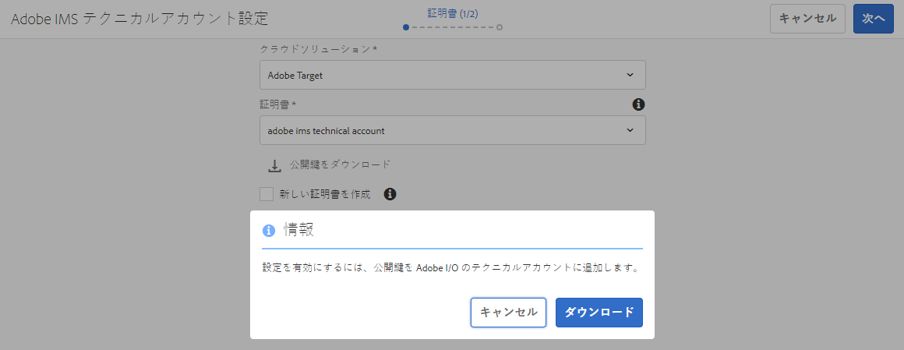

# IMS を使用した Adobe Target との統合{#integration-with-adobe-target-using-ims}

Target Standard API を介して AEM と Adobe Target を統合するには、Adobe Developer Console を使用して Adobe IMS（Identity Management System）を設定する必要があります。

>[!NOTE]
>
>Adobe Target Standard API のサポートは、AEM 6.5 の新機能です。Target Standard API は IMS 認証を使用します。
>
>AEM での Adobe Target Classic API の使用は、後方互換性のために引き続きサポートされています。[Target Classic API はユーザーの資格情報認証を使用します](/help/sites-administering/target-configuring.md#manually-integrating-with-adobe-target)。
>
>API の選択は、AEM/Target 統合に使用される認証方法によって決定されます。
>「[テナント ID とクライアントコード](#tenant-client) 」の節も参照してください。

## 前提条件 {#prerequisites}

この手順を開始する前に、以下を実行します。

* [アドビサポート](https://experienceleague.adobe.com/?support-solution=General&amp;lang=ja&amp;support-tab=home#support)は、次のアカウントをプロビジョニングする必要があります。

   * アドビコンソール
   * Adobe 開発者コンソール
   * Adobe Target と
   * Adobe IMS（Identity Management System）

* 組織のシステム管理者は、Admin Console を使用して、組織内で必要な開発者を関連する製品プロファイルに追加する必要があります。

   * これにより、Adobe Developer Console 内で統合を有効にするための権限が特定の開発者に与えられます。
   * 詳しくは、 [開発者の管理](https://helpx.adobe.com/jp/enterprise/using/manage-developers.html).

## IMS 設定の指定 - 公開鍵の生成 {#configuring-an-ims-configuration-generating-a-public-key}

設定の最初の段階は、AEMで IMS 設定を作成し、公開鍵を生成することです。

1. AEM で、**ツール**&#x200B;メニューを開きます。
1. Adobe Analytics の **セキュリティ** セクション、選択 **Adobe IMS設定**.
1. **作成**&#x200B;を選択して、**Adobe IMS テクニカルアカウント設定**&#x200B;を開きます。
1. **クラウド設定**&#x200B;の下のドロップダウンを使用して、**Adobe Target** を選択します。
1. **新しい証明書の作成**&#x200B;をアクティブにして、新しいエイリアスを入力します。
1. 「**証明書の作成**」で確認します。

   

1. 「**ダウンロード**」（または「**公開鍵のダウンロード**」）を選択してファイルをローカルドライブにダウンロードし、[Adobe Target と AEM の統合に向けて IMS を設定する](#configuring-ims-for-adobe-target-integration-with-aem)際に使用できるようにします。

   >[!CAUTION]
   >
   >この設定は開いたままにしておきます。この設定は、次の場合に再び必要になります。 [AEMでの IMS 設定の完了](#completing-the-ims-configuration-in-aem).

   

## Adobe Target と AEM の統合に向けた IMS の設定 {#configuring-ims-for-adobe-target-integration-with-aem}

Adobe Developerコンソールを使用して、AEMで使用できるAdobe Targetのプロジェクト（統合）を作成し、必要な権限を割り当てます。

### プロジェクトの作成 {#creating-the-project}

AEMで使用できるAdobe Targetを使用したプロジェクトを作成するには、Adobe Developerコンソールを開きます。

>[!CAUTION]
>
>現在、AdobeはAdobe Developerコンソールの **サービスアカウント (JWT)** 資格情報のタイプ。
>
>次を使用しない **OAuth サーバー間通信** 秘密鍵証明書のタイプ。今後サポートされる予定です。

1. Adobe Developer Console を開いて、プロジェクトを表示します。

   [https://developer.adobe.com/console/projects](https://developer.adobe.com/console/projects)

1. 自分が持つプロジェクトが表示されます。選択 **新規プロジェクトを作成**  — 場所と使用方法は、次の条件によって異なります。

   * まだプロジェクトがない場合は、「**新規プロジェクトを作成**」が中央の下に表示されます。
     
   * 既存のプロジェクトがある場合は、それらのプロジェクトがリストされ、 **新規プロジェクトを作成** は右上にあります。
     

1. **プロジェクトに追加**&#x200B;を選択し、続いて **API** を選択します。

   

1. **Adobe Target** を選択し、続いて&#x200B;**次へ**&#x200B;を選択します。

   >[!NOTE]
   >
   >Adobe Target を購読しているが、リストに表示されない場合は、 [前提条件](#prerequisites)を確認する必要があります。

   

1. **公開鍵**&#x200B;をアップロードして、完了したら&#x200B;**次へ**&#x200B;をクリックして進みます。

   

1. 資格情報を確認して、**次へ**&#x200B;をクリックして進みます。

   

1. 必要な製品プロファイルを選択して、**設定済み API を保存**&#x200B;に進みます。

   >[!NOTE]
   >
   >で表示される製品プロファイルは、次のものがあるかどうかによって異なります。
   >
   >* Adobe Target Standard - **デフォルトのワークスペース**&#x200B;のみ使用可能です
   >* Adobe Target Premium - 以下に示すように、使用可能なすべてのワークスペースが一覧表示されます

   

1. 作成が確定されました。

<!--
1. The creation is confirmed, you can now **Continue to integration details**; these are needed for [Completing the IMS Configuration in AEM](#completing-the-ims-configuration-in-aem).

   
-->

### 統合への権限の割り当て {#assigning-privileges-to-the-integration}

次に、必要な権限を統合に割り当てます。

1. Adobe **Admin Console** を開きます。

   * [https://adminconsole.adobe.com](https://adminconsole.adobe.com/)

1. **製品** （上部のツールバー）に移動し、**Adobe Target - &lt;*your-tenant-id*>**（左のパネルから）を選択します。
1. **製品プロファイル**&#x200B;を選択して、表示されるリストから必要なワークスペースを選択します（例：「デフォルトのワークスペース」）。
1. **API 資格情報**&#x200B;を選択して、必要な統合設定を選択します。
1. **製品の役割**&#x200B;として、**オブザーバー**&#x200B;の代わりに&#x200B;**編集者**&#x200B;を選択します。

## Adobe Developer Console 統合プロジェクト用に保存された詳細 {#details-stored-for-the-ims-integration-project}

Adobe Developer Console - プロジェクトから、すべての統合プロジェクトのリストを表示できます。

* [https://developer.adobe.com/console/projects](https://developer.adobe.com/console/projects)

設定の詳細を表示するには、 **表示** （特定のプロジェクトエントリの右側）。 次のものが含まれます。

* プロジェクトの概要
* Insights
* 資格情報
   * サービスアカウント（JWT）
      * 資格情報の詳細
      * JWT の生成
* API
   * 例：Adobe Target

これらの一部は、IMS に基づいてAEMでAdobe Targetの統合を完了する必要があります。

## AEM での IMS 設定の完了 {#completing-the-ims-configuration-in-aem}

AEMに戻ると、Target 用のAdobe Developerコンソール統合から必要な値を追加することで、IMS 設定を完了できます。

1. [AEM で IMS 設定を開く](#configuring-an-ims-configuration-generating-a-public-key)に戻ります。
1. 「**次へ**」を選択します。

1. ここで、[Adobe Developer Console のプロジェクト設定の詳細](#details-stored-for-the-ims-integration-project)を使用できます。

   * **タイトル**：テキスト。
   * **認証サーバー**：以下の&#x200B;**ペイロード**&#x200B;セクションの `aud` 行からこれをコピーして貼り付けます。例：以下の例では `https://ims-na1.adobelogin.com`　
   * **API キー**：これを「[概要](#details-stored-for-the-ims-integration-project)」セクションからコピーします
   * **クライアント秘密鍵**：これを「[概要](#details-stored-for-the-ims-integration-project)」セクションで生成してコピーします
   * **ペイロード**：これを「[JWT を生成](#details-stored-for-the-ims-integration-project)」セクションからコピーします

   

1. 「**作成**」で確定します。

1. Adobe Target の設定が AEM コンソールに表示されます。

   

## IMS 設定の確認 {#confirming-the-ims-configuration}

設定が期待どおりに動作していることを確認するには：

1. 次を開きます。

   * `https://localhost<port>/libs/cq/adobeims-configuration/content/configurations.html`

   次に例を示します。

   * `https://localhost:4502/libs/cq/adobeims-configuration/content/configurations.html`

1. 設定を選択します。
1. ツールバーから&#x200B;**ヘルスチェック**&#x200B;を選択し、次に&#x200B;**チェック**&#x200B;を選択します。

   

1. 成功した場合は、次のメッセージが表示されます。

   

## Adobe Target Cloud Service の設定 {#configuring-the-adobe-target-cloud-service}

これで、Cloud Service の設定を参照して Target Standard API を使用できるようになりました。

1. **ツール**&#x200B;メニューを開きます。次に、**クラウドサービス**&#x200B;セクション内で、**従来のクラウドサービス**&#x200B;を選択します。
1. **Adobe Target** までスクロールダウンし、「**今すぐ設定**」を選択します。

   The **設定を作成** ダイアログボックスが開きます。

1. を入力します。 **タイトル** 必要に応じて、 **名前** （空白の場合、タイトルから生成されます）。

   また、必要なテンプレートを選択することもできます（複数のテンプレートを使用できる場合）。

1. 「**作成**」で確認します。

   The **コンポーネントを編集** ダイアログボックスが開きます。

1. **Adobe Target 設定**&#x200B;タブに詳細を入力します。

   * **認証**：IMS

   * **テナント ID**：Adobe IMS テナント ID。[テナント ID とクライアントコード](#tenant-client)セクションも参照してください。

     >[!NOTE]
     >
     >IMS の場合、この値は Target 自体から取得する必要があります。 Target にログインし、URL からテナント ID を抽出できます。
     >
     >例えば、URL が次のような場合：
     >
     >`https://experience.adobe.com/#/@yourtenantid/target/activities`
     >
     >次に、`yourtenantid`を使用します。

   * **クライアントコード**：[テナント ID とクライアントコード](#tenant-client)セクションを参照してください。

   * **IMS 設定**：IMS 設定の名前を選択します。

   * **API のタイプ**：REST

   * **A4T Analytics クラウド設定**：ターゲットアクティビティの目標と指標に使用する Analytics クラウド設定を選択します。これは、コンテンツをターゲット化するときに、Adobe Analytics をレポートソースとして使用している場合に必要です。クラウド設定が表示されない場合は、 [A4T Analytics Cloud設定の指定](/help/sites-administering/target-configuring.md#configuring-a-t-analytics-cloud-configuration).

   * **正確なターゲティングの使用**：デフォルトではこのチェックボックスはオンになっています。選択した場合、クラウドサービス設定は、コンテキストの読み込みを待ってからコンテンツを読み込みます。次のメモを参照してください。

   * **Adobe Targetからセグメントを同期**：このオプションを選択すると、Target で定義されているセグメントをダウンロードしてAEMで使用できます。 インラインセグメントはサポートされておらず、常に Target のセグメントを使用する必要があるので、API Type プロパティが REST の場合は、このオプションを選択します。 （AEM の用語「セグメント」は、Target の「オーディエンス」と同じです。）

   * **クライアントライブラリ**：AT.js クライアントライブラリと mbox.js（非推奨）のどちらを使用するかを選択します。

   * **Tag Management System を使用してクライアントライブラリを配信する**:DTM（非推奨）、Tag Launch、またはその他のAdobe管理システムを使用します。

   * **カスタムの AT.js**：タグ管理ボックスをオンにした場合またはデフォルトの AT.js を使用する場合は空にします。それ以外の場合は、カスタム AT.js をアップロードします。AT.js を選択した場合にのみ表示されます。

   >[!NOTE]
   >
   >[Target Classic API を使用する Cloud Service の設定](/help/sites-administering/target-configuring.md#manually-integrating-with-adobe-target)は廃止されました（「Adobe Recommendations 設定」タブを使用します）。

1. 「**Target に接続**」をクリックして、Adobe Target との接続を初期化します。

   接続に成功すると、「**接続に成功しました**」というメッセージが表示されます。

1. 選択 **OK** メッセージに続いて **OK** をクリックして設定を確認できるようにします。

1. 次に進むことができます： [Target フレームワークの追加](/help/sites-administering/target-configuring.md#adding-a-target-framework) :Target に送信する ContextHub またはClientContextのパラメーターを設定します。 AEM エクスペリエンスフラグメントを Target に書き出す場合は、この設定が不要な場合があります。

### テナント ID と クライアントコード {#tenant-client}

[Adobe Experience Manager 6.5.8.0](/help/release-notes/release-notes.md) では、Target 設定ウィンドウに「クライアントコード」フィールドが追加されました。

「テナント ID 」フィールドと「クライアントコード」フィールドを設定する際は、次の点に注意してください。

1. ほとんどのお客様の場合、テナント ID とクライアントコードは同じです。つまり、両方のフィールドに同じ情報が含まれ、フィールドは同じになります。両方のフィールドにテナント ID を必ず入力してください。
2. 従来の目的では、テナント ID とクライアントコードのフィールドに異なる値を入力することもできます。

どちらの場合も、次の点に注意してください。

* デフォルトでは、（最初に追加された場合は）「クライアントコード」も「テナント ID」フィールドに自動的にコピーされます。
* オプションで、デフォルトのテナント ID セットを変更できます。
* そのため、Target へのバックエンド呼び出しはテナント ID に基づき、Target へのクライアント側呼び出しはクライアントコードに基づきます。

前述のように、最初のケースはAEM 6.5 で最も一般的です。どちらにしても、必ず **両方** フィールドには、必要に応じて正しい情報が含まれます。

>[!NOTE]
>
>既存の Target 設定を変更する場合：
>
>1. テナント ID を再入力します。
>2. Target に再接続します。
>3. 設定を保存します。
