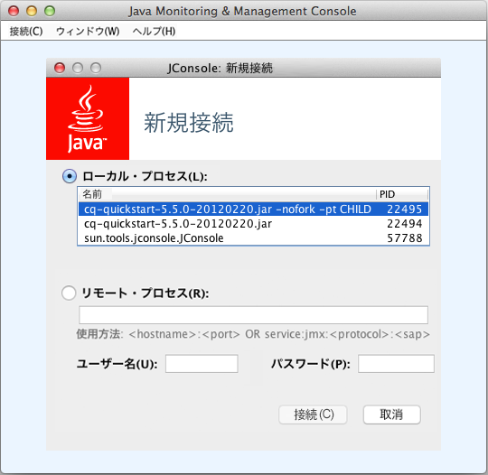
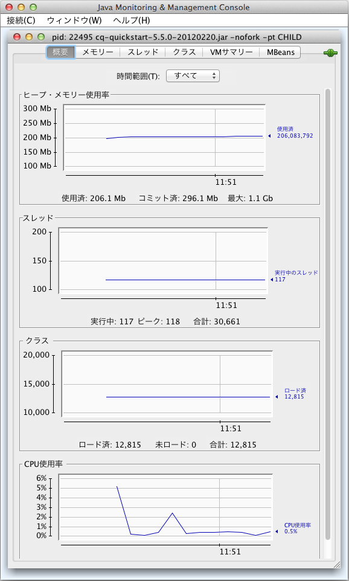
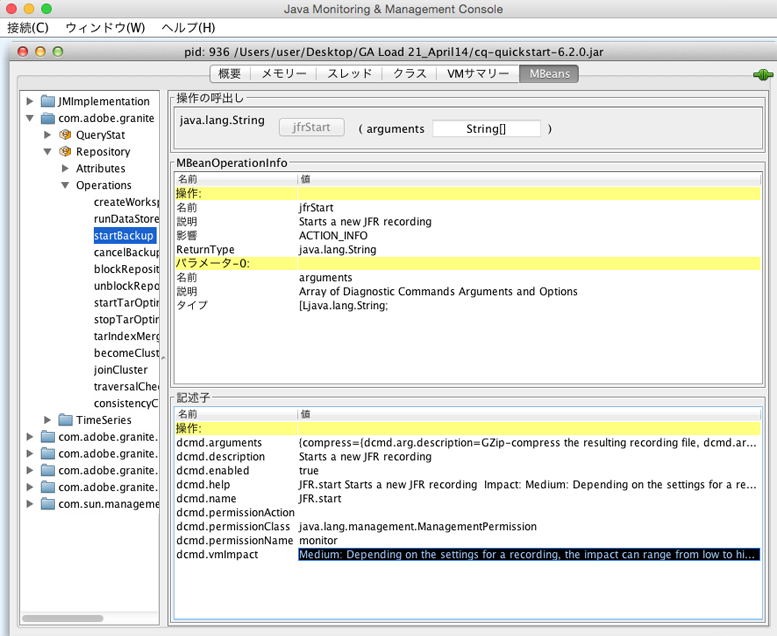

# JMX コンソールを使用したサーバーリソースの監視{#monitoring-server-resources-using-the-jmx-console}

JMXコンソールを使用すると、CRXサーバー上のサービスの監視と管理を行うことができます。以降の節では、JMXフレームワークで公開される属性と操作をまとめます。

For information about how to use the console controls, see [Using the JMX Console](#using-the-jmx-console). For background information about JMX, see the [Java Management Extensions (JMX) Technology](https://www.oracle.com/technetwork/java/javase/tech/javamanagement-140525.html) page on the Oracle website.

JMX コンソールを使用して、MBean を作成し、サービスを管理する方法について詳しくは、[サービスと JMX コンソールの統合](/help/sites-developing/jmx-integration.md)を参照してください。

## ワークフローのメンテナンス {#workflow-maintenance}

実行中、完了済み、古い、失敗したワークフローインスタンスを管理する操作です。

* ドメイン：com.adobe.granite.workflow
* タイプ：メンテナンス

>[!NOTE]
>
>その他のワークフロー管理ツールおよびワークフローインスタンスに考えられるステータスの説明は、[ワークフローコンソール](/help/sites-administering/workflows-administering.md)を参照してください。

### 運用 {#operations}

**listRunningWorkflowsPerModel** リストは、各ワークフローモデルで実行されているワークフローインスタンスの数です。

* 引数：なし
* 戻り値：数およびモデル ID の列を含む表形式のデータ

**listCompletedWorkflowsPerModel** リストは、各ワークフローモデルに対して完了したワークフローインスタンスの数です。

* 引数：なし
* 戻り値：数およびモデル ID の列を含む表形式のデータ

**returnWorkflowQueueInfo** リストは、処理済みで処理のためにキューに格納されているワークフロー項目に関する情報を処理します。

* 引数：なし
* 戻り値：以下の列を含む表形式のデータ：

   * ジョブ
   * キュー名
   * アクティブなジョブ
   * 平均処理時間
   * 平均待機時間
   * キャンセルされたジョブ
   * 失敗したジョブ
   * 完了したジョブ
   * 処理済みのジョブ
   * 待機中のジョブ

**returnWorkflowJobTopicInfo** リストは、ワークフロージョブの情報をトピック別に整理して処理します。

* 引数：なし
* 戻り値：以下の列を含む表形式のデータ：

   * トピック名
   * 平均処理時間
   * 平均待機時間
   * キャンセルされたジョブ
   * 失敗したジョブ
   * 完了したジョブ
   * 処理済みのジョブ

**returnFailedWorkflowCount** ：失敗したワークフローインスタンスの数を表示します。 ワークフローモデルを指定して、クエリを行ったり、すべてのワークフローモデルの情報を取得したりできます。

* 引数：

   * モデル：問い合わせるモデルの ID。すべてのワークフローモデルについて失敗したワークフローインスタンスの数を確認するには、値を指定しません。IDはモデルノードへのパスです。例：

      `/conf/global/settings/workflow/models/dam/update_asset/jcr:content/model`

* 戻り値：失敗したワークフローインスタンスの数。

**returnFailedWorkflowCountPerModel** 各ワークフローモデルで失敗したワークフローインスタンスの数を表示します。

* 引数：なし
* 戻り値：数およびモデル ID の列を含む表形式のデータ

**terminateFailedInstances** ：失敗したワークフローインスタンスを終了します。 特定のモデルの失敗したインスタンスをすべて終了するか、失敗したインスタンスのみを終了することができます。 オプションで、インスタンスが終了した後で再起動できます。 また、操作を実際に実行せずに、操作をテストして結果を確認することもできます。

* 引数：

   * インスタンスを再起動します。（オプション）の値を指定して、インスタンスが終了 `true` した後に再起動します。 のデフォルト値により、終了したワークフローインスタンス `false` は再起動されません。
   * ドライ作動：（オプション）の値を指定して、操作 `true` を実際に実行せずに操作の結果を表示します。 のデフォルト値 `false` により、操作が実行されます。
   * モデル：（オプション）操作が適用されるモデルの ID。すべてのワークフローモデルの失敗したインスタンスに操作を適用するには、モデルを指定しないでください。IDはモデルノードへのパスです。例：

      `/conf/global/settings/workflow/models/dam/update_asset/jcr:content/model`

* 戻り値：以下の列を含む、終了されたインスタンスに関する表形式のデータ：

   * イニシエーター
   * インスタンス ID
   * モデル ID
   * ペイロード
   * 開始コメント
   * ワークフロータイトル

**retryFailedWorkItems** ：失敗した作業項目ステップを実行します。 失敗したすべての作業項目を再試行するか、特定のワークフローモデルに対して失敗した作業項目のみを再試行できます。 必要に応じて、操作をテストし、実際に操作を実行せずに結果を確認できます。

* 引数：

   * ドライ作動：（オプション）の値を指定して、操作 `true` を実際に実行せずに操作の結果を表示します。 のデフォルト値 `false` により、操作が実行されます。
   * モデル：（オプション）操作が適用されるモデルのID。すべてのワークフローモデルの失敗した作業項目に操作を適用するには、モデルを指定しないでください。IDはモデルノードへのパスです。例：

      `/conf/global/settings/workflow/models/dam/update_asset/jcr:content/model`

* 戻り値：以下の列を含む、再試行された作業項目に関する表形式のデータ：

   * イニシエーター
   * インスタンス ID
   * モデル ID
   * ペイロード
   * 開始コメント
   * ワークフロータイトル

**PurgeActive** 特定のページのアクティブなワークフローインスタンスを削除します。 すべてのモデルのアクティブなインスタンス、または特定のモデルのインスタンスのみをクリアできます。 必要に応じて、操作をテストし、実際に操作を実行せずに結果を確認できます。

* 引数：

   * モデル：（オプション）操作が適用されるモデルのID。すべてのワークフローモデルのワークフローインスタンスに操作を適用するには、モデルを指定しないようにします。IDはモデルノードへのパスです。例：

      `/conf/global/settings/workflow/models/dam/update_asset/jcr:content/model`
   * ワークフローが開始してからの日数：パージするワークフローインスタンスの有効期間（日数）。
   * ドライ作動：（オプション）の値を指定して、操作 `true` を実際に実行せずに操作の結果を表示します。 のデフォルト値 `false` により、操作が実行されます。

* 戻り値：以下の列を含む、パージされたアクティブなワークフローインスタンスに関する表形式のデータ：

   * イニシエーター
   * インスタンス ID
   * モデル ID
   * ペイロード
   * 開始コメント
   * ワークフロータイトル

**countStaleWorkflows** ：古いワークフローインスタンスの数を返します。 すべてのワークフローモデルまたは特定のモデルの古いインスタンスの数を取得できます。

* 引数：

   * モデル：（オプション）操作が適用されるモデルのID。すべてのワークフローモデルのワークフローインスタンスに操作を適用するには、モデルを指定しないようにします。IDはモデルノードへのパスです。例：

      `/conf/global/settings/workflow/models/dam/update_asset/jcr:content/model`

* 戻り値：古くなったワークフローインスタンスの数。

**restartStaleWorkflows** ：古いワークフローインスタンスを再開します。 すべての古いインスタンスを再起動するか、特定のモデルの古いインスタンスのみを再起動できます。 また、操作を実際に実行せずに、操作をテストして結果を確認することもできます。

* 引数：

   * モデル：（オプション）操作が適用されるモデルの ID。すべてのワークフローモデルの古くなったインスタンスに操作を適用するには、モデルを指定しないでください。IDはモデルノードへのパスです。例：

      `/conf/global/settings/workflow/models/dam/update_asset/jcr:content/model`
   * ドライ作動：（オプション）の値を指定して、操作 `true` を実際に実行せずに操作の結果を表示します。 のデフォルト値 `false` により、操作が実行されます。

* 戻り値：再開されたワークフローインスタンスのリスト。

**fetchModelList** リストは、すべてのワークフローモデルを指定します。

* 引数：なし
* 戻り値：モデル ID 列とモデル名列を含む、ワークフローモデルを識別する表形式のデータ。

**countRunningWorkflows** ：実行中のワークフローインスタンスの数を返します。 すべてのワークフローモデルまたは特定のモデルの実行中のインスタンス数を取得できます。

* 引数：

   * モデル：（オプション）実行中のインスタンス数が返されるモデルのID。すべてのワークフローモデルの実行中のインスタンス数を返すには、モデルを指定しないようにします。IDはモデルノードへのパスです。例：

      `/conf/global/settings/workflow/models/dam/update_asset/jcr:content/model`

* 戻り値：実行中のワークフローインスタンスの数。

**countCompletedWorkflows** ：完了したワークフローインスタンスの数を返します。 すべてのワークフローモデルまたは特定のモデルに対して完了したインスタンスの数を取得できます。

* 引数：

   * モデル：（オプション）完了したインスタンスの数が返されるモデルのID。すべてのワークフローモデルの完了したインスタンスの数を返すには、モデルを指定しないようにします。IDはモデルノードへのパスです。例：

      `/conf/global/settings/workflow/models/dam/update_asset/jcr:content/model`

* 戻り値：完了したワークフローインスタンスの数。

**purgeCompleted** ：特定のページの完了したワークフローのレコードをリポジトリから削除します。 ワークフローを頻繁に使用する場合は、この操作を定期的に使用して、リポジトリのサイズを最小限に抑えます。 すべてのモデルの完了済みインスタンス、または特定のモデルのインスタンスのみをクリアできます。 必要に応じて、操作をテストし、実際に操作を実行せずに結果を確認できます。

* 引数：

   * モデル：（オプション）操作が適用されるモデルのID。すべてのワークフローモデルのワークフローインスタンスに操作を適用するには、モデルを指定しないようにします。IDはモデルノードへのパスです。例：

      `/conf/global/settings/workflow/models/dam/update_asset/jcr:content/model`
   * ワークフローが完了してからの日数：ワークフローインスタンスが完了状態になっている日数。
   * ドライ作動：（オプション）の値を指定して、操作 `true` を実際に実行せずに操作の結果を表示します。 のデフォルト値 `false` により、操作が実行されます。

* 戻り値：以下の列を含む、パージされた完了済みのワークフローインスタンスに関する表形式のデータ：

   * イニシエーター
   * インスタンス ID
   * モデル ID
   * ペイロード
   * 開始コメント
   * ワークフロータイトル

## リポジトリ {#repository}

CRX リポジトリに関する情報

* ドメイン：com.adobe.granite
* タイプ：リポジトリ

### 属性 {#attributes}

**名前** :JCRリポジトリ実装の名前。 読み取り専用。

**バージョン** ：リポジトリ実装のバージョンです。 読み取り専用。

**HomeDir** ：リポジトリが存在するディレクトリ。 デフォルトの場所は&lt;QuickStart_Jar_Location>/crx-quickstart/repositoryです。 読み取り専用。

**CustomerName** ：ソフトウェアライセンスの発行先の顧客の名前。 読み取り専用。

**LicenseKey** ：リポジトリのこのインストール用の一意のライセンスキー。 読み取り専用。

**AvailableDiskSpace** ：リポジトリのこのインスタンスで使用できるディスク領域(MB)。 読み取り専用。

**MaximumNumberOfOpenFiles** ：一度に開くことができるファイルの数です。 読み取り専用。

**SessionTracker** :crx.debug.sessionsシステム変数の値。 trueはデバッグセッションを示します。 falseは、通常のセッションを示します。 読み取り/書き込み。

**記述子** ：リポジトリのプロパティを表すキーと値のペアのセットです。 すべてのプロパティは読み取り専用です。

<table>
 <tbody>
  <tr>
   <th>キー</th>
   <th>値</th>
  </tr>
  <tr>
   <td>option.node.and.property.with.same.name.supported</td>
   <td>ノードとノードのプロパティに同じ名前を指定できるかどうかを示します。true は同じ名前がサポートされていることを示し、false はサポートされていないことを示します。 </td>
  </tr>
  <tr>
   <td>identifier.stability</td>
   <td>参照不可能なノード識別子の安定性を示します。以下の値が指定可能です。
    <ul>
     <li>identifier.stability.indefinite.duration：識別子は変わりません。</li>
     <li>identifier.stability.method.duration：メソッド呼び出しの合間に識別子が変わる可能性があります。</li>
     <li>identifier.stability.save.duration：保存／更新サイクル内では、識別子は変わりません。</li>
     <li>identifier.stability.session.duration：セッション中は、識別子は変わりません。</li>
    </ul> </td>
  </tr>
  <tr>
   <td>query.xpath.pos.index</td>
   <td>JCR 1.0 XPath クエリ言語がサポートされているかどうかを示します。true はサポートを示し、false はサポートなしを示します。</td>
  </tr>
  <tr>
   <td>crx.repository.systemid</td>
   <td>system.id ファイル内のシステム識別子。</td>
  </tr>
  <tr>
   <td>option.query.sql.supported</td>
   <td>JCR 1.0 XPath クエリ言語がサポートされているかどうかを示します。true はサポートを示し、false はサポートなしを示します。</td>
  </tr>
  <tr>
   <td>jcr.repository.version</td>
   <td>リポジトリ実装のバージョン。</td>
  </tr>
  <tr>
   <td>option.update.primary.node.type.supported</td>
   <td>あるノードのプライマリノードタイプを変更できるかどうかを示します。true はプライマリノードタイプを変更できることを示し、false は変更がサポートされていないことを示します。</td>
  </tr>
  <tr>
   <td>option.node.type.management.supported</td>
   <td>ノードタイプの管理がサポートされているかどうかを示します。true はサポートされていることを示し、false はサポートなしを示します。</td>
  </tr>
  <tr>
   <td>node.type.management.overrides.supported</td>
   <td>継承されたプロパティまたは子ノードで定義されているノードタイプを上書きできるかどうかを示します。true は上書きがサポートされていることを示し、false は上書きなしを示します。</td>
  </tr>
  <tr>
   <td>option.observation.supported</td>
   <td>true はリポジトリ変更の非同期の監視がサポートされていることを示します。非同期の監視をサポートすると、変更が発生するたびに、アプリケーションが通知を受け取ったり、通知に応答したりできます。</td>
  </tr>
  <tr>
   <td>query.jcrscore</td>
   <td><p>trueは、jcr:score擬似プロパティが、（XPathで）jcrfn:contains関数または（SQLで）contains関数を含むXPathおよびSQLクエリで使用可能で、フルテキスト検索を実行できることを示します。</p> </td>
  </tr>
  <tr>
   <td>option.simple.versioning.supported</td>
   <td>true は、リポジトリが単純なバージョン管理をサポートしていることを示します。単純なバージョン管理を使用すると、一連の連続したノードのバージョンが維持されます。</td>
  </tr>
  <tr>
   <td>option.workspace.management.supported</td>
   <td>true は、API を使用したワークスペースの作成および削除をリポジトリがサポートしていることを示します。</td>
  </tr>
  <tr>
   <td>option.update.mixin.node.types.supported</td>
   <td>true は、既存のノードの mixin ノードタイプの追加および削除をリポジトリがサポートしていることを示します。</td>
  </tr>
  <tr>
   <td>node.type.management.primary.item.name.supported</td>
   <td>true は、プライマリ項目を子として含めるノード定義がリポジトリによって可能になることを示します。プライマリ項目は、項目名がわからなくとも、API を使用してアクセスできます。</td>
  </tr>
  <tr>
   <td>level.2.supported</td>
   <td>true は、LEVEL_1_SUPPORTED と OPTION_XML_IMPORT_SUPPORTED がいずれも true であることを示します。</td>
  </tr>
  <tr>
   <td>write.supported</td>
   <td>true はリポジトリによって API を使用した書き込みアクセスが提供されることを示し、false は読み取り専用アクセスを示します。</td>
  </tr>
  <tr>
   <td>node.type.management.update.in.use.supported</td>
   <td>true は、既存のノードで使用中のノード定義を変更できることを示します。</td>
  </tr>
  <tr>
   <td>jcr.specification.version</td>
   <td>リポジトリが実装する JCR 仕様のバージョン。</td>
  </tr>
  <tr>
   <td>option.journaled.observation.supported</td>
   <td>true は、アプリケーションがリポジトリのジャーナル監視を実行できることを示します。ジャーナル監視を使用すると、一連の変更通知を特定の期間にわたって取得できます。 </td>
  </tr>
  <tr>
   <td>query.languages</td>
   <td>リポジトリがサポートするクエリ言語。値なしは、クエリサポートがないことを示します。</td>
  </tr>
  <tr>
   <td>option.xml.export.supported</td>
   <td>true は、ノードを XML コードとして書き出すことをリポジトリがサポートしていることを示します。</td>
  </tr>
  <tr>
   <td>node.type.management.multiple.binary.properties.supported</td>
   <td>true は複数のバイナリプロパティを持つノードタイプの登録をリポジトリがサポートしていることを示し、false は 1 つのノードタイプに対して単一のバイナリプロパティがサポートされていることを示します。</td>
  </tr>
  <tr>
   <td>option.access.control.supported</td>
   <td>true は、ノードアクセス用のユーザーの権限を設定および決定するために、リポジトリがアクセス制御をサポートすることを示します。</td>
  </tr>
  <tr>
   <td>option.baselines.supported</td>
   <td>true は、リポジトリが設定とベースラインの両方をサポートしていることを示します。</td>
  </tr>
  <tr>
   <td>option.shareable.nodes.supported</td>
   <td>true は、リポジトリが共有可能なノードの作成をサポートしていることを示します。</td>
  </tr>
  <tr>
   <td>crx.cluster.id</td>
   <td>リポジトリクラスターの識別子。</td>
  </tr>
  <tr>
   <td>query.stored.queries.supported</td>
   <td>true は、保存されたクエリをリポジトリがサポートしていることを示します。</td>
  </tr>
  <tr>
   <td>query.full.text.search.supported</td>
   <td>true は、リポジトリがフルテキスト検索をサポートしていることを示します。</td>
  </tr>
  <tr>
   <td>node.type.management.inheritance</td>
   <td><p>ノードタイプの継承に関するリポジトリサポートのレベルを示します。以下の値が指定可能です。</p> <p>node.type.management.inheritance.minimal：プライマリノードタイプの登録は、nt:base のみをスーパータイプとして持つものに限られます。mixin ノードタイプの登録は、スーパータイプがないものに限られます。</p> <p>node.type.management.inheritance.single:主ノードタイプの登録は、1つのスーパータイプを持つものに限定されます。ミックスインノードタイプの登録は、最大1つのスーパータイプを持つものに制限されます。</p> <p><br /> node.type.management.inheritance.multiple:プライマリノードタイプは、1つ以上のスーパータイプに登録できます。Mixinノードタイプは、0個以上のスーパータイプで登録できます。</p> </td>
  </tr>
  <tr>
   <td>crx.cluster.preferredMaster</td>
   <td>true は、このクラスターノードがクラスターのマスターとして望ましいことを示します。</td>
  </tr>
  <tr>
   <td>option.transactions.supported</td>
   <td>true は、リポジトリがトランザクションをサポートしていることを示します。</td>
  </tr>
  <tr>
   <td>jcr.repository.vendor.url</td>
   <td>リポジトリベンダーの URL。</td>
  </tr>
  <tr>
   <td>node.type.management.value.constraints.supported</td>
   <td>true は、ノードプロパティの値の制約をリポジトリがサポートしていることを示します。</td>
  </tr>
  <tr>
   <td>node.type.management.property.types</td>
   <td>an array of javax.jcr.PropertyType constants that represent the property types that a registered node type can specify. A zero-length array indicates registered node types cannot specify property definitions. Property types are STRING, URI, BOOLEAN, LONG, DOUBLE, DECIMAL, BINARY, DATE, NAME, PATH, WEAKREFERENCE, REFERENCE, and UNDEFINED (if supported)</td>
  </tr>
  <tr>
   <td>node.type.management.orderable.child.nodes.supported</td>
   <td>true は、子ノードの順序の保持をリポジトリがサポートしていることを示します。</td>
  </tr>
  <tr>
   <td>jcr.repository.vendor</td>
   <td>リポジトリベンダーの名前。</td>
  </tr>
  <tr>
   <td>query.joins</td>
   <td><p>クエリ内の結合のサポートレベル。以下の値が指定可能です。</p>
    <ul>
     <li>query.joins.none：結合のサポートなし。クエリでは 1 つのセレクターを使用できます。</li>
     <li>query.joins.inner：内部結合のサポート。</li>
     <li>query.joins.inner.outer：内部結合と外部結合のサポート。</li>
    </ul> </td>
  </tr>
  <tr>
   <td>org.apache.jackrabbit.spi.commons.AdditionalEventInfo</td>
   <td> </td>
  </tr>
  <tr>
   <td>query.xpath.doc.order</td>
   <td>true は、リポジトリが XPath 1.0 クエリ言語をサポートしていることを示します。</td>
  </tr>
  <tr>
   <td>query.jcrpath</td>
   <td> </td>
  </tr>
  <tr>
   <td>option.xml.import.supported</td>
   <td>true は、XML コードをコンテンツとして読み込むことをリポジトリがサポートしていることを示します。</td>
  </tr>
  <tr>
   <td>node.type.management.same.name.siblings.supported</td>
   <td>true は、同じ名前の兄弟ノード（親が同じノード）をリポジトリがサポートしていることを示します。</td>
  </tr>
  <tr>
   <td>node.type.management.residual.definitions.supported</td>
   <td>true は、残差定義を持つ名前プロパティをリポジトリがサポートしていることを示します。サポートされている場合、項目定義の名前属性にアスタリスク（「*」）を指定できます。</td>
  </tr>
  <tr>
   <td>node.type.management.autocreated.definitions.supported</td>
   <td>true は、ノード作成時にそのノードの子項目（ノードまたはプロパティ）の自動作成をリポジトリがサポートしていることを示します。</td>
  </tr>
  <tr>
   <td>crx.cluster.master</td>
   <td>true は、このリポジトリノードがクラスターのマスターノードであることを示します。</td>
  </tr>
  <tr>
   <td>level.1.supported</td>
   <td>true は、option.xml.export.support が true であり、query.languages がゼロ以外の長さであることを示します。</td>
  </tr>
  <tr>
   <td>option.unfiled.content.supported</td>
   <td>true は、ファイルされていないコンテンツをリポジトリがサポートしていることを示します。ファイルされていないノードは、リポジトリ階層の一部ではありません。</td>
  </tr>
  <tr>
   <td>jcr.specification.name</td>
   <td>リポジトリが実装する JCR 仕様の名前。</td>
  </tr>
  <tr>
   <td>option.versioning.supported</td>
   <td>true は、リポジトリが完全なバージョン管理をサポートしていることを示します。</td>
  </tr>
  <tr>
   <td>jcr.repository.name</td>
   <td>リポジトリの名前。</td>
  </tr>
  <tr>
   <td>option.locking.supported</td>
   <td>true は、リポジトリがノードのロックをサポートしていることを示します。ロックすると、他のユーザーが一時的に変更できなくなります。</td>
  </tr>
  <tr>
   <td>jcr.repository.version.display</td>
   <td> </td>
  </tr>
  <tr>
   <td>option.activities.supported</td>
   <td>trueは、リポジトリがアクティビティをサポートすることを示します。アクティビティとは、ワークスペース内で実行され、別のワークスペースに統合される変更のセットです。</td>
  </tr>
  <tr>
   <td>node.type.management.multivalued.properties.supported</td>
   <td>true は、ゼロ個以上の値を指定できるノードプロパティをリポジトリがサポートしていることを示します。</td>
  </tr>
  <tr>
   <td>option.retention.supported</td>
   <td>true は、保持ポリシーをコンテンツに適用する外部保持管理アプリケーションの使用、および保持と解放を、リポジトリがサポートしていることを示します。</td>
  </tr>
  <tr>
   <td>option.lifecycle.supported</td>
   <td>true は、リポジトリがライフサイクル管理をサポートしていることを示します。</td>
  </tr>
 </tbody>
</table>

**WorkspaceNames** ：リポジトリ内のワークスペースの名前。 読み取り専用。

**DataStoreGarbageCollectionDelay** 10分の1ノードごとにガベージコレクションがスリープする時間（ミリ秒）。 読み取り/書き込み。

**BackupDelay** ：バックアッププロセスがバックアップの各ステップ間をスリープする時間（ミリ秒）。 読み取り/書き込み。

**BackupInProgress** 値をtrueに設定した場合、バックアッププロセスが実行中です。 読み取り専用。

**BackupProgress** ：現在のバックアップでは、バックアップされたすべてのファイルの割合。 読み取り専用。

**CurrentBackupTarget** ：現在のバックアップ用の、バックアップファイルが保存されるZIPファイル。 バックアップが進行中でない場合は、値は表示されません。 読み取り専用。

**BackupWasSuccessful** 値をtrueに設定した場合、現在のバックアップ中にエラーが発生していないか、バックアップが進行中でないことを示します。 falseは、現在のバックアップ中にエラーが発生したことを示します。 読み取り専用。

**BackupResult** ：現在のバックアップのステータス。 次の値を指定できます。

* バックアップ中：バックアップが現在実行中です。
* バックアップキャンセル：バックアップがキャンセルされました。
* バックアップでエラー発生：バックアップ中にエラーが発生しました。エラーメッセージでは、原因に関する情報が提供されます。
* バックアップ完了：バックアップが成功しました。
* バックアップの実行なし：進行中のバックアップがありません。

読み取り専用。

**TarOptimizationRunningSince** ：現在のTARファイル最適化プロセスが開始された時刻。 読み取り専用。

**TarOptimizationDelay** : TAR最適化プロセスがプロセスの各ステップ間をスリープする時間（ミリ秒）。 読み取り/書き込み。

**ClusterProperties** ：クラスターのプロパティと値を表すキーと値のペアのセットです。 表の各行は、クラスターのプロパティを表します。 読み取り専用。

**ClusterNodes** ：リポジトリクラスターのメンバーです。

**ClusterId** ：このリポジトリクラスターの識別子。 読み取り専用。

**ClusterMasterId** ：このリポジトリクラスターのマスターノードの識別子。 読み取り専用。

**ClusterNodeId** ：リポジトリクラスターのこのノードの識別子。 読み取り専用。

### 運用 {#operations-1}

**createWorkspace** ：このリポジトリにワークスペースを作成します。

* 引数：

   * 名前：新しいワークスペースの名前を表す String 値。

* 戻り値：なし

**runDataStoreGarbageCollection** ：リポジトリノードでガベージコレクションを実行します。

* 引数：

   * 削除：未使用のリポジトリ項目を削除するかどうかを示すBoolean値。値をtrueに設定すると、未使用のノードとプロパティが削除されます。値をfalseに設定すると、すべてのノードがスキャンされますが、削除されません。

* 戻り値：なし

**stopDataStoreGarbageCollection** ：実行中のデータストアのガベージコレクションを停止します。

* 引数：なし
* 戻り値：現在のステータスの文字列表現

**startBackup** ZIPファイル内のリポジトリデータをバックアップします。

* 引数：

   * `target`:（オプション）リポジトリデータをアーカイブするZIPファイルまたはディレクトリの名前を表す `String` 値。 ZIPファイルを使用するには、ZIPファイル名拡張子を含めます。 ディレクトリを使用する場合は、ファイル名拡張子を含めません。

      増分バックアップを実行するには、バックアップに以前使用したディレクトリを指定します。

      絶対パスまたは相対パスを指定できます。 相対パスは、crx-quickstartディレクトリの親に対する相対パスです。

      値を指定しない場合は、のデフォルト値 `backup-currentdate.zip` が使用されます。 `currentdate` は形式で指定され `yyyyMMdd-HHmm`ます。

* 戻り値：なし

**cancelBackup** ：現在のバックアッププロセスを停止し、プロセスがデータのアーカイブ用に作成した一時アーカイブを削除します。

* 引数：なし
* 戻り値：なし

**blockRepositoryWrites** ：リポジトリデータに対する変更をブロックします。 すべてのリポジトリバックアップリスナーに、ブロックが通知されます。

* 引数：なし
* 戻り値：なし

**unblockRepositoryWrites** リポジトリからブロックを削除します。 すべてのリポジトリバックアップリスナーに、ブロックの削除が通知されます。

* 引数：なし
* 戻り値：なし

**startTarOptimization** 開始は、tarOptimizationDelayのデフォルト値を使用してTARファイルの最適化プロセスを実行します。

* 引数：なし
* 戻り値：なし

**stopTarOptimization** : TARファイルの最適化を停止します。

* 引数：なし
* 戻り値：なし

**tarIndexMerge** すべてのTARセットの上位のインデックスファイルを結合します。 最上位のインデックスファイルは、異なるメジャーバージョンを持つファイルです。 例えば、次のファイルがindex_3_1.tarファイルに結合されます。index_1_1.tar、index_2_0.tar、index_3_0.tar 結合されたファイルは削除されます（前の例では、index_1_1.tar、index_2_0.tar、およびindex_3_0.tarは削除されます）。

* 引数：

   * `background`:実行中にWebコンソールを使用できるように、操作をバックグラウンドで実行するかどうかを示すBoolean値です。 値trueは、操作をバックグラウンドで実行します。

* 戻り値：なし

**beceClusterMaster** ：このリポジトリノードをクラスターのマスターノードとして設定します。 まだマスターでない場合、このコマンドは現在のマスターインスタンスのリスナーを停止し、現在のノードのマスターリスナーを開始します。 次に、このノードをマスターノードとして設定し、再起動すると、クラスター内の他のすべてのノード（マスターによって制御されているノードなど）がこのインスタンスに接続します。

* 引数：なし
* 戻り値：なし

**joinCluster** ：このリポジトリを、クラスタマスターによって制御されるノードとしてクラスターに追加します。 認証用にユーザー名とパスワードを指定する必要があります。 接続では、基本認証を使用します。 セキュリティ資格情報は、サーバーに送信される前にbase-64エンコードされます。

* 引数：

   * `master`：マスターリポジトリノードを実行するコンピューターの IP アドレスまたはコンピューター名を表す文字列値。
   * `username`：クラスターでの認証に使用する名前。
   * `password`：認証に使用するパスワード。

* 戻り値：なし

**traversalCheck** Traversesを設定し、必要に応じて、特定のノードで始まるサブツリー内の不一致を修正します。 これについては、永続性マネージャーに関するドキュメントで詳しく説明します。

**consistencyCheck** ：データストア内の整合性を確認し、必要に応じて修正します。 これは、データストアのドキュメントで詳細に説明されています。

## Repository Statistics (TimeSeries) {#repository-statistics-timeseries}

`org.apache.jackrabbit.api.stats.RepositoryStatistics` で定義される、各統計タイプの TimeSeries フィールドの値。

* ドメイン: `com.adobe.granite`
* 型：`TimeSeries`
* Name: One of the following values from the `org.apache.jackrabbit.api.stats.RepositoryStatistics.Type` Enum class:

   * BUNDLE_CACHE_ACCESS_COUNTER
   * BUNDLE_CACHE_MISS_AVERAGE
   * BUNDLE_CACHE_MISS_COUNTER
   * BUNDLE_CACHE_MISS_DURATION
   * BUNDLE_CACHE_SIZE_COUNTER
   * BUNDLE_COUNTER
   * BUNDLE_READ_COUNTER
   * BUNDLE_WRITE_AVERAGE
   * BUNDLE_WRITE_COUNTER
   * BUNDLE_WRITE_DURATION
   * BUNDLE_WS_SIZE_COUNTER
   * QUERY_AVERAGE
   * QUERY_COUNT
   * QUERY_DURATION
   * SESSION_COUNT
   * SESSION_LOGIN_COUNTER
   * SESSION_READ_AVERAGE
   * SESSION_READ_COUNTER
   * SESSION_READ_DURATION
   * SESSION_WRITE_AVERAGE
   * SESSION_WRITE_COUNTER
   * SESSION_WRITE_DURATION

### 属性 {#attributes-1}

報告される統計タイプごとに、以下の属性が提供されています。

* ValuePerSecond：過去 1 分間の、1 秒あたりの測定値。読み取り専用。
* ValuePerMinute：過去 1 時間の、1 分あたりの測定値。読み取り専用。
* ValuePerHour:先週の時間あたりの測定値。読み取り専用。
* ValuePerWeek:過去3年間の週ごとの測定値。読み取り専用。

## リポジトリクエリ統計 {#repository-query-stats}

リポジトリクエリに関する統計情報。

* ドメイン：com.adobe.granite
* タイプ：QueryStat

### 属性 {#attributes-2}

**SlowQuerys** ：完了に最も長い時間がかかったリポジトリクエリに関する情報です。 読み取り専用。

**SlowQueriesQueueSize** SlowQuerysリストに含めるクエリの最大数です。 読み取り／書き込み。

**PopularQueries** ：最も多く発生したリポジトリクエリに関する情報。 読み取り専用。

**PopuralQueriesQueueSize** PopurQuerysリストの最大クエリ数。 読み取り／書き込み。

### 運用 {#operations-2}

**clearSlowQueriesQueue** SlowQuerysリストからすべてのクエリを削除します。

* 引数：なし
* 戻り値：なし

**clearPopuralQuerysQueue** PopuralQueriesリストからすべてのクエリを削除します。

* 引数：なし
* 戻り値：なし

## レプリケーションエージェント {#replication-agents}

レプリケーションエージェントごとにサービスを監視します。レプリケーションエージェントを作成すると、JMX コンソールにサービスが自動的に表示されます。

* **ドメイン：** com.adobe.granite.replication
* **タイプ：** エージェント
* **名前：** 値なし
* **プロパティ：** {id=&quot;*Name*&quot;}。 *Name* は、エージェント名プロパティの値です。

### 属性 {#attributes-3}

**Id** ：レプリケーションエージェント構成の識別子を表すString値。 複数のエージェントが同じ設定を使用できます。 読み取り専用。

**Valid** ：エージェントが正しく構成されているかどうかを示すboolean値。

* `true`:有効な設定。
* `false` :設定にエラーが含まれています。

読み取り専用。

**Enabled** ：エージェントが有効かどうかを示すboolean値。

* `true`: Enabled.
* `false`: 無効.

**QueueBlocked** ：キューが存在し、ブロックされているかどうかを示すboolean値です。

* `true`: ブロック. 自動再試行が保留中です。
* `false`：ブロックされていないか、存在しません。

読み取り専用。

**QueuePaused** ：ジョブキューを一時停止するかどうかを示すboolean値です。

* `true`:一時停止（一時停止）
* `false`：一時停止していないか、存在しません。

読み取り／書き込み。

**QueueNumEntries** ：エージェントキュー内のジョブ数を表すint値。 読み取り専用。

**QueueStatusTime** ：表示されたステータス値を取得したサーバー上の時間を示すDate値。 この値は、ページが読み込まれた時間に対応します。 読み取り専用。

**QueueNextRetryTime** ：ブロックされたキューに対して、次の自動再試行が発生する日時を示すDate値です。 時間が表示されない場合、キューはブロックされません。 読み取り専用。

**QueueProcessingSince** ：現在のジョブの処理がいつ開始されたかを示すDate値です。 時間が表示されない場合、キューはブロックされるか、アイドル状態になります。 読み取り専用。

**QueueLastProcessTime** ：前のジョブが完了した日時を示すDate値です。 読み取り専用。

### 運用 {#operations-3}

**queueForceRetry** ：ブロックされたキューに対して、retryコマンドをキューに発行します。

* 引数：なし
* 戻り値：なし

**queueClear** ：キューからすべてのジョブを削除します。

* 引数：なし
* 戻り値：なし

## Sling エンジン {#sling-engine}

HTTP 要求に関する統計を提供し、SlingRequestProcessor サービスのパフォーマンスを監視できるようにします。

* ドメイン：org.apache.sling
* タイプ：エンジン
* プロパティ：{service=RequestProcessor}

### 属性 {#attributes-4}

**RequestsCount** ：統計が最後にリセットされてから発生した要求の数です。

**MinRequestDurationMsec** ：統計情報が最後にリセットされてから要求を処理するのに必要な最短時間（ミリ秒）。

**MaxRequestDurationMsec** ：統計情報が最後にリセットされてから、要求を処理するのに必要な最長の時間（ミリ秒）。

**StandardDeviationDurationMsec** ：リクエストの処理に必要な時間の標準偏差です。 標準偏差は、統計が最後にリセットされてからのすべてのリクエストを使用して計算されます。

**MeanRequestDurationMsec** ：リクエストの処理に要した平均時間。 平均は、統計が最後にリセットされた以降のすべてのリクエストを使用して計算されます

### 運用 {#operations-4}

**resetStatistics** ：すべての統計を0に設定します。 特定の時間枠内でリクエスト処理のパフォーマンスを分析する必要がある場合は、統計をリセットします。

* 引数：なし
* 戻り値：なし

**id** ：パッケージIDの文字列表現です。

**installed** ：パッケージがインストールされているかどうかを示すboolean値です。

* `true`:インストール済み。
* `false`:インストールされていません。

**installedBy** ：パッケージを最後にインストールしたユーザーのID。

**installedDate** ：パッケージが最後にインストールされた日付です。

**size** ：パッケージのサイズをバイト単位で保持するlong値。


## クイックスタートランチャー {#quickstart-launcher}

起動プロセスおよびクイックスタートランチャーに関する情報。

* ドメイン：com.adobe.granite.quickstart
* タイプ：ランチャー

### 運用 {#operations-5}

**log**

クイックスタートウィンドウにメッセージを表示します。

引数：

* p1:表示するメッセージを表す `String` 値。 次の図に、p1値を指定して呼び出し `log` た結果を示し `this is a log message`ます。


* 戻り値：なし

**startupFinished**

サーバーランチャーの startupFinished メソッドを呼び出します。このメソッドにより、Web ブラウザーにようこそページが開きます。

* 引数：なし
* 戻り値：なし

**startupProgress**

サーバー起動プロセスの完了値を設定します。クイックスタートウィンドウの進行状況バーが、完了値を表します。

* 引数：

   * p1：起動プロセスがどの程度完了したかを割合で表す浮動小数値。値の範囲はゼロから 1 です。例えば、0.3 は 30% 完了を示します。

* 戻り値：なし。


## サードパーティのサービス {#third-party-services}

いくつかのサードパーティのサーバーリソースでは、MBean がインストールされ、これによって属性および操作が JMX コンソールに提供されます。次の表では、サードパーティのリソースをリストし、詳細のリンクを提供します。

<table>
 <tbody>
  <tr>
   <th>ドメイン</th>
   <th>型</th>
   <th>MBean クラス</th>
  </tr>
  <tr>
   <td>JMImplementation</td>
   <td>MBeanServerDelegate</td>
   <td><a href="https://docs.oracle.com/javase/8/docs/api/javax/management/MBeanServerDelegate.html">javax.management.MBeanServerDelegate</a></td>
  </tr>
  <tr>
   <td>com.sun.management</td>
   <td>HotSpotDiagnostic</td>
   <td><a href="https://docs.oracle.com/javase/8/docs/jre/api/management/extension/com/sun/management/HotSpotDiagnosticMXBean.html">com.sun.management.HotSpotDiagnosticMXBean</a></td>
  </tr>
  <tr>
   <td>java.lang</td>
   <td>
    <ul>
     <li>ClassLoading</li>
     <li>Compilation</li>
     <li>GarbageCollector</li>
     <li>メモリ</li>
     <li>MemoryManager</li>
     <li>MemoryPool</li>
     <li>OperatingSystem</li>
     <li>Runtime</li>
     <li>Threading</li>
    </ul> </td>
   <td><a href="https://docs.oracle.com/javase/8/docs/api/javax/management/package-summary.html">javax.management</a> package</td>
  </tr>
  <tr>
   <td>java.util.logging</td>
   <td> </td>
   <td><a href="https://docs.oracle.com/javase/8/docs/api/java/util/logging/LoggingMXBean.html">java.util.logging.LoggingMXBean</a></td>
  </tr>
  <tr>
   <td>osgi.core</td>
   <td>
    <ul>
     <li>bundleState</li>
     <li>framework</li>
     <li>packageState</li>
     <li>serviceState</li>
    </ul> </td>
   <td><a href="https://osgi.org/specification/osgi.enterprise/7.0.0/service.jmx.html#d0e42567">org.osgi.jmx.framework</a> パッケージ</td>
  </tr>
 </tbody>
</table>

## Using the JMX Console {#using-the-jmx-console}

JMX コンソールには、サーバー上で実行されているいくつかのサービスに関する情報が表示されます。

* 属性：設定や実行時データなどのサービスプロパティ。属性は、読み取り専用の場合と読み取り／書き込み可能な場合があります。
* 操作：サービスで呼び出し可能なコマンド。

OSGi サービスでデプロイされる MBean により、サービスの属性および操作がコンソールに公開されます。MBean は、公開される属性および操作と、属性が読み取り専用か読み取り／書き込みかを決定します。

JMX コンソールのメインページには、サービスの表が含まれます。表の行ごとに、MBean によって公開されるサービスを 1 つずつ表します。

1. Web コンソールを開いて「JMX」タブをクリックします（[http://localhost:4502/system/console/jmx](http://localhost:4502/system/console/jmx)）。
2. 任意のサービスのセル値をクリックして、そのサービスの属性と操作を確認します。
3. 属性値を変更するには、値をクリックし、表示されるダイアログボックスで値を指定して、「保存」をクリックします。
4. サービスの操作を呼び出すには、操作名をクリックし、表示されるダイアログボックスで引数値を指定して、「呼び出し」をクリックします。

## 監視のための外部 JMX アプリケーションの使用 {#using-external-jmx-applications-for-monitoring}

CRX を使用すると、外部アプリケーションと Managed Bean（MBean）が [Java Management Extensions（JMX）](https://docs.oracle.com/javase/6/docs/technotes/guides/management/overview.html)経由でやり取りできます。[JConsole](https://java.sun.com/developer/technicalArticles/J2SE/jconsole.html) のような汎用コンソールやドメイン専用の監視アプリケーションを使用すると、CRX の設定やプロパティを取得および設定したり、パフォーマンスやリソース使用状況を監視したりできます。

### JConsole を使用した CRX への接続 {#using-jconsole-to-connect-to-crx}

JConsole を使用して CRX に接続するには、次の手順に従います。

1. ターミナルウィンドウを開きます。
1. 以下のコマンドを入力します。

   `jconsole`

JConsole が起動して、JConsole ウィンドウが表示されます。

### ローカルの CRX プロセスへの接続 {#connecting-to-a-local-crx-process}

JConsole には、ローカルの Java 仮想マシンプロセスのリストが表示されます。このリストには 2 つのクイックスタートプロセスが含まれます。ローカルプロセスのリストから、クイックスタート「CHILD」プロセス（通常は PID が大きいほうのプロセス）を選択します。



### リモートの CRX プロセスへの接続 {#connecting-to-a-remote-crx-process}

リモートのCRXプロセスに接続するには、リモートのCRXプロセスをホストするJVMで、リモートのJMX接続を受け入れるように有効にする必要があります。

リモートJMX接続を有効にするには、JVMの起動時に次のシステムプロパティを設定する必要があります。

`com.sun.management.jmxremote.port=portNum`

上記のプロパティ `portNum` で、は、JMX RMI接続を有効にするポート番号です。 未使用のポート番号を必ず指定してください。 ローカルアクセス用にRMIコネクタを発行するほか、このプロパティを設定すると、指定したポートのプライベート読み取り専用レジストリに、追加のRMIコネクタを「jmxrmi」という既知の名前で発行します。

デフォルトでは、リモート監視用に JMX エージェントを有効にすると、Java VM 起動時に以下のシステムプロパティを使用して指定する必要のあるパスワードファイルに基づいたパスワード認証が使用されます。

`com.sun.management.jmxremote.password.file=pwFilePath`

パスワードファイルの設定について詳しくは、[関連する JMX のドキュメント](https://docs.oracle.com/javase/6/docs/technotes/guides/management/agent.html)を参照してください。

例：

```shell
$ java
  -Dcom.sun.management.jmxremote.password.file=pwFilePath
  -Dcom.sun.management.jmxremote.port=8463
  -jar ./cq-quickstart.jar
```

### CRX で提供される MBean の使用 {#using-the-mbeans-provided-by-crx}

クイックスタートプロセスに接続後、JConsole では、CRX が実行されている JVM に対して、様々な一般的監視ツールが提供されます。



CRX の内部監視および設定オプションにアクセスするには、「MBean」タブに移動して、左側にある階層型のコンテンツツリーから、属性または操作の関心のあるセクションを選択します。例えば、com.adobe.granite/Repository/Operations セクションなどです。

そのセクション内で、必要な属性または操作を左ウィンドウから選択します。



